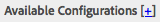
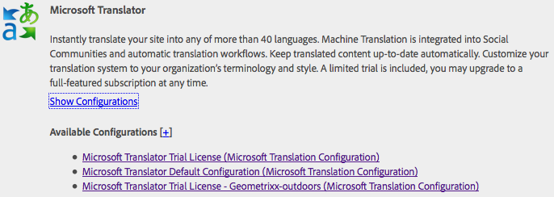
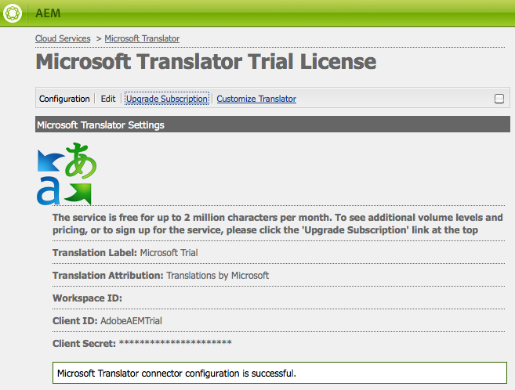

# Connecting to Microsoft&reg; Translator{#connecting-to-microsoft-translator}

Create a configuration for the Microsoft&reg; Translator cloud service to use your Microsoft&reg; Translation account for translating AEM page content, community content, or assets.

| Property |Description |
|---|---|
| Translation Label |The display name for the translation service. |
| Translation Attribution |(Optional) For user-generated content, the attribution that appears next to translated text, for example `Translations by Microsoft`. |
| Workspace ID |(Optional) The ID of your customized Microsoft&reg; Translator engine to use. |
| Subscription Key |Your Microsoft&reg; Subscription Key for Microsoft&reg; Translator. |

After you create the configuration, you must [activate it](/help/sites-administering/tc-msconf.md#activating-the-translator-service-configurations).

The following procedure uses the touch-optimized UI to create a Microsoft&reg; Translator configuration.

1. On the rail, click or tap Tools &gt; Cloud Services.
1. In the Microsoft&reg; Translator area, then select Show Configurations.
1. Click the + link next to Available Configurations.

   

1. Type a title for your configuration. The title identifies the configuration in the Cloud Services console and in page property drop-down lists. The default name is based on the title. Optionally, type a name to use for the repository node that stores the configuration. Use the default value for the Parent Configuration property which is the path of the repository node.
1. Click Create.
1. In the dialog box that appears, type values for the properties and then click OK.

## Sample Microsoft&reg; Translator Cloud Service Configurations {#sample-microsoft-translator-cloud-service-configurations}

The following Microsoft&reg; Translator cloud service configurations are installed with the Geometrixx samples. Some sample configurations use a trial Microsoft&reg; Translation account that allows for a maximum of 2 000 000 free translated characters per month.

### Microsoft&reg; Translator Trial License {#microsoft-translator-trial-license}

The Microsoft&reg; Translator Trial License configuration is a sample configuration that is installed with the Geometrixx Outdoors sample package. This configuration uses a Microsoft&reg; Translator account that has a free subscription that allows for 2 000 000 translated characters per month.

### Microsoft&reg; Translator Trial License - Geometrixx-outdoors {#microsoft-translator-trial-license-geometrixx-outdoors}

The Microsoft&reg; Translator Trial License - Geometrixx-outdoors configuration is a sample configuration that is installed with Geometrixx Outdoors. This configuration uses the same free Microsoft&reg; Translator account as the Microsoft&reg; Translator Trial License configuration. The account has a free subscription that allows for 2 000 000 translated characters per month.

This Microsoft&reg; Translator configuration is optimized for use with the type of content of the Geometrixx Outdoors sample site.

### Upgrading The Microsoft&reg; Translator Trial License Configuration {#upgrading-the-microsoft-translator-trial-license-configuration}

Microsoft&reg; Translation configuration pages provide a convenient link to the Microsoft&reg; web site for obtaining an account subscription that is adequate for production systems.

1. On the rail, click or tap Tools &gt; Operations &gt; Cloud &gt; Cloud Services.
1. In the Microsoft&reg; Translator area, click or tap Show Configurations, then click or tap Microsoft&reg; Translator Trial License (Microsoft&reg; Translation Configuration).

   

1. On the configuration page, click Upgrade Subscription. Use the Microsoft&reg; web page that opens to configure your account.

   

### Customizing Your Microsoft&reg; Translator Engine {#customizing-your-microsoft-translator-engine}

Microsoft&reg; Translation configuration pages provide a convenient link to the Microsoft&reg; web site for customizing your Microsoft&reg; Translator engine. ([https://www.microsoft.com/en-us/research/project/microsoft-translator-hub/](https://www.microsoft.com/en-us/research/project/microsoft-translator-hub/))

1. On the rail, click or tap Tools &gt; Operations &gt; Cloud &gt; Cloud Services.
1. In the Microsoft&reg; Translator area, click or tap Show Configurations, then click or tap the configuration that you want to customize.
1. On the configuration page, click Customize Translator. Use the Microsoft&reg; web page that opens to customize your service.

## Activating the Translator Service Configurations {#activating-the-translator-service-configurations}

To support translated content that is replicated to the publish instance, activate your cloud service configurations. To activate the repository nodes that store the Microsoft&reg; Translator or third-party cloud service configurations, use the method of [activating a complete section (tree)](/help/sites-authoring/publishing-pages.md#publishing-and-unpublishing-a-tree). The nodes are located below the following parent nodes:

* Microsoft&reg; Translation Service: /libs/settings/cloudconfigs/translation/msft-translation
* Third-party Translation: /etc/cloudservices/machine-translation
