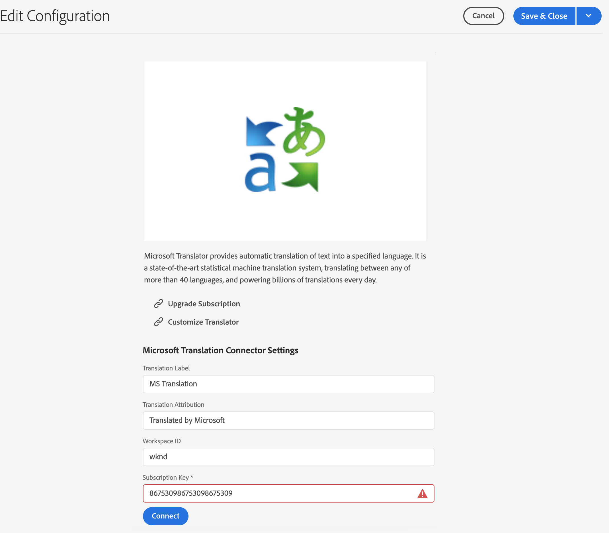

# Connecting to Microsoft Translator {#connecting-to-microsoft-translator}

Create a configuration for the [Microsoft Translator](https://www.microsoft.com/en-us/translator/business/) cloud service to use your Microsoft Translation account for translating AEM page content or assets.

>[!NOTE]
>
>AEM provides a trial Microsoft Translation account that allows for a maximum of 2 000 000 free translated characters per month. To obtain an account subscription that is adequate for production systems, see [Upgrading The Microsoft Translator Trial License Configuration](#upgrading-the-microsoft-translator-trial-license-configuration).

|Property|Description|
|---|---|
|Translation Label|The display name for the translation service|
|Translation Attribution|(Optional) For user-generated content, the attribution that appears next to translated text, for example, `Translations by Microsoft`|
|Workspace ID|(Optional) The ID of your customized Microsoft Translator engine to use|
|Subscription Key|Your Microsoft Subscription Key for Microsoft Translator|

After you create the configuration, you need to [activate it](#activating-the-translator-service-configurations).

The following procedure creates a Microsoft Translator configuration.

1. In the [navigation panel,](/help/sites-authoring/basic-handling.md#first-steps) click **Tools** > **Cloud Services** > **Translation Cloud Services**.
1. Navigate to where you wish to create the configuration. Normally this is in your site root or it can be a global, default configuration.
1. Click the **Create** button.
1. Define your configuration.
   1. Select **Microsoft Translator** in the drop-down.
   1. Type a title for your configuration. The title identifies the configuration in the Cloud Services console and in page property drop-down lists.
   1. Optionally, type a name to use for the repository node that stores the configuration.

   

1. Click **Create**.
1. In the **Edit Configuration** window, provide the values for the translation service described in the previous table.

   

1. Click **Connect** to verify the connection.
1. Click **Save &amp; Close**.

## Upgrading The Microsoft Translator Trial License Configuration {#upgrading-the-microsoft-translator-trial-license-configuration}

Microsoft Translation configuration pages provide a convenient link to the Microsoft web site for obtaining an account subscription that is adequate for production systems.

1. In the [navigation panel,](/help/sites-authoring/basic-handling.md#first-steps) click **Tools** > **Cloud Services** > **Translation Cloud Services**.
1. Click your existing Microsoft Translator configuration.
1. Click **Edit**.
1. In the **Edit Configuration** window, click **Upgrade Subscription**. A Microsoft web page with further details about the service opens.

## Customizing Your Microsoft Translator Engine {#customizing-your-microsoft-translator-engine}

Microsoft Translation configuration pages provide a convenient link to the Microsoft web site for customizing your Microsoft Translator engine.

1. In the [navigation panel,](/help/sites-authoring/basic-handling.md#first-steps) click **Tools** > **Cloud Services** > **Translation Cloud Services**.
1. Click your existing Microsoft Translator configuration.
1. Click **Edit**.
1. In the **Edit Configuration** window, click **Customize Translator**. Use the Microsoft web page that opens to customize your service.

## Activating the Translator Service Configurations {#activating-the-translator-service-configurations}

You need to activate your cloud service configurations to support translated content that is replicated to the publish instance. Use the method of [publishing a tree](/help/sites-authoring/publishing-pages.md#publishing-and-unpublishing-a-tree) to activate the repository nodes that store the Microsoft Translator configurations. The nodes are located below the following parent nodes:

* `/libs/settings/cloudconfigs/translation/msft-translation`
