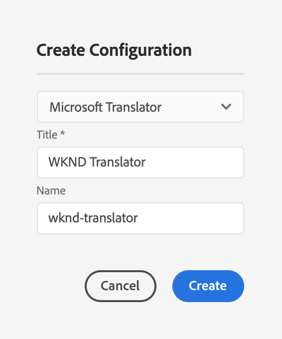
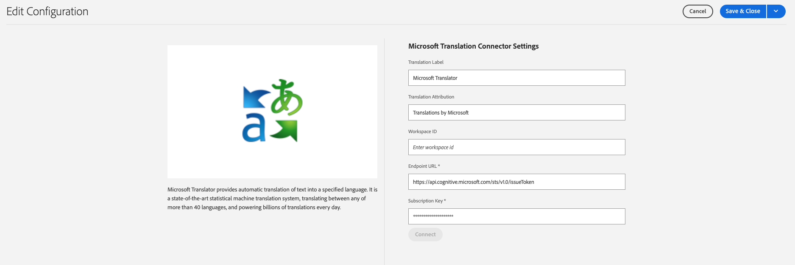

# Connecting to Microsoft Translator {#connecting-to-microsoft-translator}

AEM provides a built-in connector for [Microsoft Translator](https://www.microsoft.com/en-us/translator/business/) to translate page content or assets. After obtaining a license from Microsoft to use Microsoft Translator, please configure the connector following the instructions on this page. 

|Property|Description|
|---|---|
|Translation Label|The display name for the translation service|
|Translation Attribution|(Optional) For user-generated content, the attribution that appears next to translated text, for example, `Translations by Microsoft`|
|Workspace ID|(Optional) The ID of your customized Microsoft Translator engine to use|
|Subscription Key|Your Microsoft Subscription Key for Microsoft Translator|

The following procedure creates a Microsoft Translator configuration.

1. In the [navigation panel,](/help/sites-authoring/basic-handling.md#first-steps) click **Tools** > **Cloud Services** > **Translation Cloud Services**.
1. Navigate to where you wish to create the configuration. Normally this is in your site root or it can be a global, default configuration.
1. Click the **Create** button.
1. Define your configuration.
   1. Select **Microsoft Translator** in the drop-down.
   1. Type a title for your configuration. The title identifies the configuration in the Cloud Services console and in page property drop-down lists.
   1. Optionally, type a name to use for the repository node that stores the configuration.

   

1. Click **Create**.
1. In the **Edit Configuration** window, provide the values for the translation service described in the previous table.

   

1. Click **Connect** to verify the connection.
1. Click **Save &amp; Close**.

## Publishing the Translator Service Configurations {#publishing-the-translator-service-configurations}

As a final step, please publish your Microsoft Translator configurations to support published translated content, using the [publishing a tree](/help/sites-authoring/publishing-pages.md#publishing-and-unpublishing-a-tree) action.  

## AEM Microsoft Translator configuration to Microsoft API Mapping
The out-of-the-box Microsoft Translator binds to this Microsoft API: https://api.cognitive.microsofttranslator.com/translate?api-version=3.0 
(Microsoft Documentation on the API: https://learn.microsoft.com/en-us/azure/ai-services/translator/reference/v3-0-reference )
The integration receives the access token with the Subscription key (like "d2cc3c285c3c4d618587f4db0a2d4de0") from : https://api.cognitive.microsoft.com/sts/v1.0/issueToken

| AEM Connector Field     | AEM Role/Usage                                                                                       | Microsoft API Parameter/Usage                                                                                  |
| ----------------------- | ---------------------------------------------------------------------------------------------------- | -------------------------------------------------------------------------------------------------------------- |
| Workspace ID            | Used to specify a custom translation model. In AEM, combined with a content category.                | Mapped to the “category” parameter in API requests, often as a composite value (e.g., “workspaceId-category”). |
| Translation Label       | Display name for UI identification of the translation service.                                       | No direct equivalent. It’s used internally in AEM and does not affect API calls.                               |
| Translation Attribution | Optional field used to display attribution information (e.g., “Translations by Microsoft”).          | No direct counterpart; used solely for display and attribution in AEM.                                         |
| Subscription Key        | Secure key obtained from Azure’s Microsoft Translator subscription. Stored in cloud service configs. | Sent as an HTTP header (Ocp-Apim-Subscription-Key) to authenticate with Microsoft’s token service and APIs.    |

### 1. Translation Label
**In AEM**: The Translation Label is primarily a user-interface property. It serves as the display name for the translation service within the AEM authoring environment. This label allows users to easily identify which translation service is configured when managing multiple translation connectors.

**In the Microsoft API**: There is no direct counterpart for the Translation Label. The Microsoft Translator API does not require a “label” in its REST calls.

**Role in Mapping**: In AEM, the label is simply used for visual identification. It does not get passed to the Microsoft API. Instead, it helps content authors or administrators recognize the service configuration that is being used.
In implementation terms, while configuring the connector, the Translation Label is stored and later displayed on the Cloud Services page in AEM, but it is not used in constructing any API request URL or header.

### 2. Translation Attribution
**In AEM**: Translation Attribution is an optional field. This is used to provide attribution information for content that has been translated. For example, you might set this field with a value like “Translations by Microsoft” to give credit for the machine translation.

**In the Microsoft API**: Much like the Translation Label, the Microsoft API does not require an “attribution” value as part of its authentication or translation request process.

**Role in Mapping**: The attribution value is purely for display or informational purposes within an AEM-managed site. It allows you to communicate to your end users or content curators that the translation was powered by Microsoft Translator.
In AEM’s internal implementation, this value could be stored and then optionally rendered alongside translated content in the UI, but it is not sent over in any API calls to Microsoft. There is no parameter in the REST interface of Microsoft Translator that directly accepts an attribution or display label.

### 3. Workspace ID
**In AEM**: The Workspace ID in AEM is used when you want to leverage a customized Microsoft Translator engine. This customization is typically enabled through Microsoft’s Custom Translator functionality, which allows organizations to fine-tune translation models based on specific industry terminology or content idiosyncrasies.
When the Workspace ID is configured in AEM, the connector logic combines it with the content category (if provided) to form a composite value. In the code, you can see a method like updateContentCategoryBasedonWorkspaceId(), which prepends the Workspace ID to the content category, separated by a hyphen.

**In the Microsoft API**: For the Microsoft Translator API, when using a custom translation model the optional parameter “category” is used.

**Role in Mapping**: The Workspace ID, when set in AEM, essentially gets mapped to the “category” parameter of the Microsoft API request. If a content category is also provided, the code combines them (e.g., workspaceId + "-" + contentCategory) so that Microsoft recognises and applies the customized model for that translation job.
This way, the Workspace ID directly influences which translation model is used when processing the request. Without a Workspace ID, the API call defaults to the standard model.

### 4. Subscription Key
**In AEM**: The Subscription Key is the crucial authentication parameter you secure from your Microsoft Translator subscription within Azure. It is the key that authorizes requests to the Microsoft Cognitive Services token endpoint and (by extension) the Translator API.
In AEM, this key is stored in the cloud service configuration and is used in several parts of the connector code.

**In the Microsoft API**: Microsoft requires this Subscription Key to be passed as an HTTP header named "Ocp-Apim-Subscription-Key" when requesting an access token from the token issuance endpoint (https://api.cognitive.microsoft.com/sts/v1.0/issueToken).

**Role in Mapping**: In the provided Java code (specifically in AccessTokenImpl), the Subscription Key from AEM is directly set via setSubscriptionKey(), and then, during an access token request, it is added to the HTTP POST request header.
The token received is then used as a bearer token for subsequent translation request API calls. Essentially, the Subscription Key is the bridge that lets your AEM connector authenticate with and gain access to Microsoft’s Translator service.

## Known issues

1. In the  AEM configuration of the Microsoft Translator Integration configuration, the "Subscription Key check" in the dialog of the Microsoft Translator Configuration in the Author Backend is broken and cannot be sent off, or returns a negative result - even if the subscription key is valid.
The subscription key can be validated with this CURL command (if you get a valid token, the key us valid): 
```
curl -v -X POST "https://api.cognitive.microsoft.com/sts/v1.0/issueToken" \
     -H "Ocp-Apim-Subscription-Key: YOUR_SUBSCRIPTION_KEY_HERE"
```

2. The link to Microsoft Support out of  Microsoft Translator Integration configuration page in AEM leads to an invalid page (404 Error).
