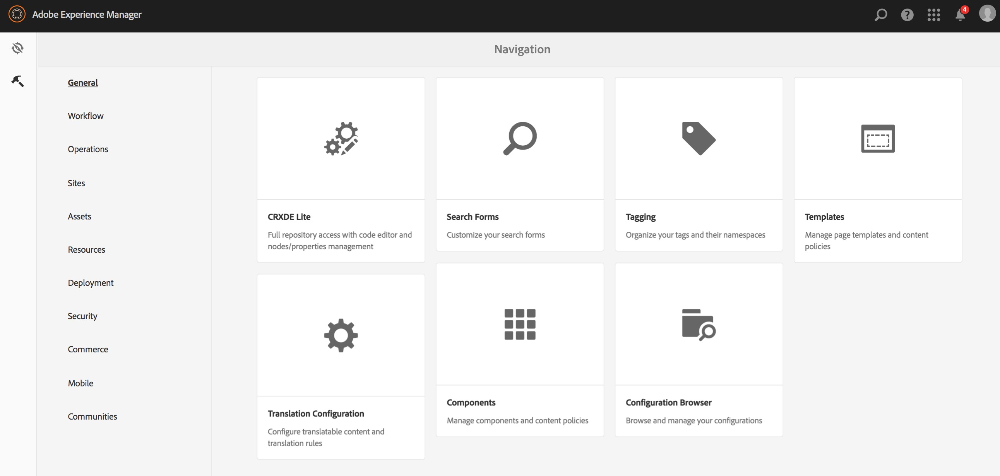
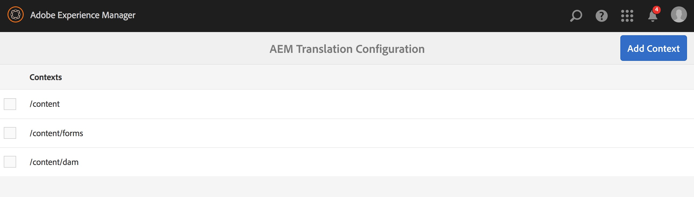
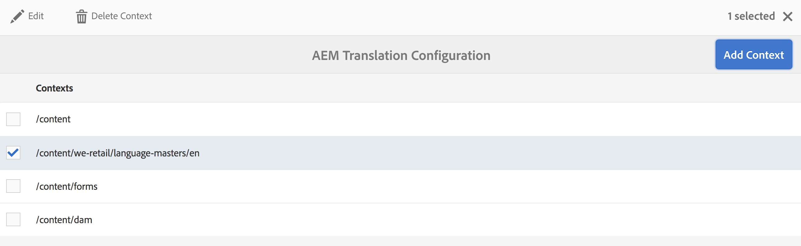
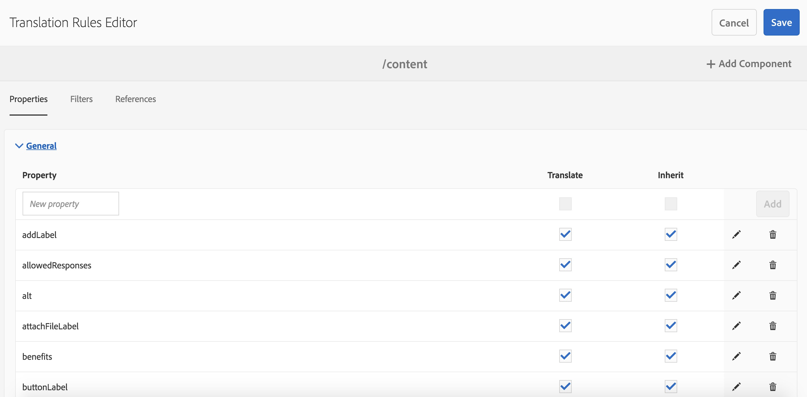
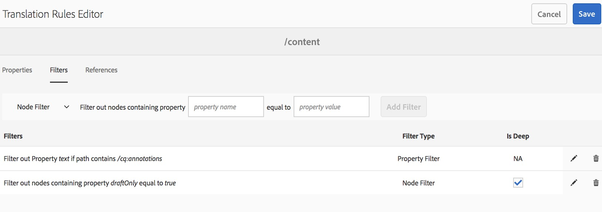
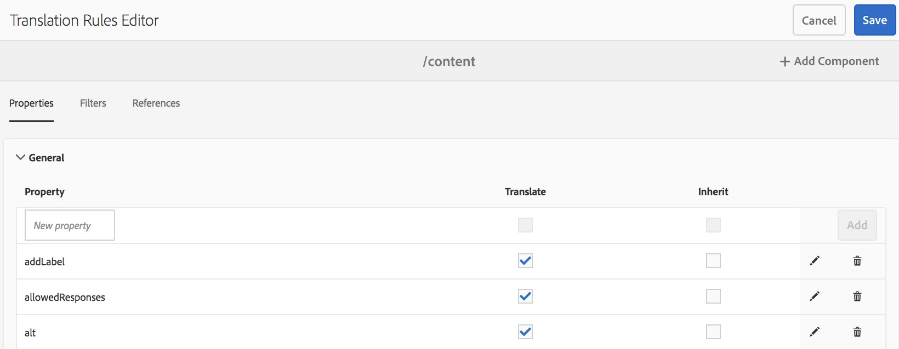
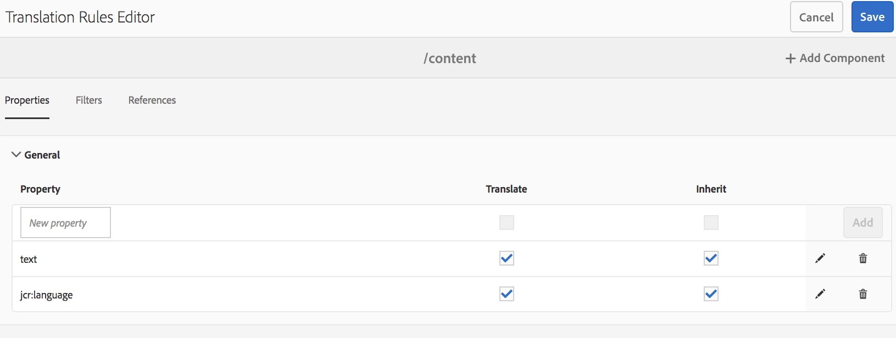

# Identifying Content to Translate{#identifying-content-to-translate}

Translation rules identify the content to translate for pages, components, and assets that are included in, or excluded from, translation projects. When a page or asset is being translated, AEM extracts this content so that it can be sent to the translation service.

Pages and assets are represented as nodes in the JCR repository. The content that is extracted is one or more property values of the nodes. The translation rules identify the properties that contain the content to extract.

Translation rules are expressed in XML format and stored in these possible locations:

* `/libs/settings/translation/rules/translation_rules.xml`
* `/apps/settings/translation/rules/translation_rules.xml`
* `/conf/global/settings/translation/rules/translation_rules.xml`

The file applies to all translation projects.

>[!NOTE]
>
>After an upgrade to 6.4, it is recommended to move the file from /etc. See [Common Repository Restructuring in AEM 6.5](/help/sites-deploying/all-repository-restructuring-in-aem-6-5.md#translation-rules) for more details.

Rules include the following information:

* The path of the node to which the rule applies. The rule also applies to the descendants of the node.
* The names of the node properties that contain the content to translate. The property can be specific to a specific resource type or to all resource types.

For example, you can create a rule that translates the content that authors add to all AEM foundation Text components on your pages. The rule can identify the `/content` node and the `text` property for the `foundation/components/text` component.

There is a [console](#translation-rules-ui) that has been added for configuring translation rules. The definitions in the UI will populate the file for you.

For an overview of the content translation features in AEM, see [Translating Content for Multilingual Sites](/help/sites-administering/translation.md).

>[!NOTE]
>
>AEM supports one-to-one mapping between resource types and reference attributes for translation of referenced content on a page.

## Rule Syntax for Pages, Components, and Assets {#rule-syntax-for-pages-components-and-assets}

A rule is a `node` element with one or more child `property` elements and zero or more child `node` elements:

```xml
<node path="content path">
          <property name="property name" [translate="false"]/>
          <node resourceType="component path" >
               <property name="property name" [translate="false"]/>
          </node>
</node>
```

Each of these `node` elements has the following characteristics:

* The `path` attribute contains the path to the root node of the branch to which the rules apply.
* Child `property` elements identify the node properties to translate for all resource types:

    * The `name` attribute contains the property name.
    * The optional `translate` attribute equals `false` if the property is not translated. By default the value is `true`. This attribute is useful when overriding previous rules.

* Child `node` elements identify the node properties to translate for specific resource types:

    * The `resourceType` attribute contains the path that resolves to the component that implements the resource type.
    * Child `property` elements identify the node property to translate. Use this node in the same way as the child `property` elements for node rules.

The following example rule causes the content of all `text` properties to be translated for all pages below the `/content` node. The rule is effective for any component that stores content in a `text` property, such as the foundation Text component and the foundation Image component.

```xml
<node path="/content">
          <property name="text"/>
</node>
```

The following example translates the content of all `text` properties, and also translates other properties of the foundation Image component. If other components have same-named properties, the rule does not apply to them.

```xml
<node path="/content">
      <property name="text"/>
      <node resourceType="foundation/components/textimage">
         <property name="image/alt"/>
         <property name="image/jcr:description"/>
         <property name="image/jcr:title"/>
      </node>
</node>
```

## Rule Syntax for Extracting Assets from Pages  {#rule-syntax-for-extracting-assets-from-pages}

Use the following rule syntax to include assets that are embedded in or referenced from components:

```xml
<assetNode resourceType="path to component" assetReferenceAttribute="property that stores asset"/>
```

Each `assetNode` element has the following characteristics:

* One `resourceType` attribute that equals the path that resolves to the component.
* One `assetReferenceAttribute` attribute that equals the name of the property that stores the asset binary (for embedded assets) or the path to the referenced asset.

The following example extracts images from the foundation Image component:

```xml
<assetNode resourceType="foundation/components/image" assetReferenceAttribute="fileReference"/>
```

## Overriding Rules {#overriding-rules}

The translation_rules.xml file consists of a `nodelist` element with several child `node` elements. AEM reads the node list from top to bottom. When multiple rules target the same node, the rule that is lower in the file is used. For example, the following rules cause all content in `text` properties to be translated except for the `/content/mysite/en` branch of pages:

```xml
<nodelist>
     <node path="/content">
           <property name="text" />
     </node>
     <node path="/content/mysite/en">
          <property name="text" translate="false" />
     </node>
<nodelist>
```

## Filtering Properties {#filtering-properties}

You can filter nodes that have a specific property by using a `filter` element.

For example, the following rules cause all content in `text` properties to be translated except for the nodes that have the property `draft` set to `true`.

```xml
<nodelist>
    <node path="/content">
     <filter>
   <node containsProperty="draft" propertyValue="true" />
     </filter>
        <property name="text" />
    </node>
<nodelist>
```

## Translation Rules UI {#translation-rules-ui}

A console is also available for configuring translation rules.

To access it:

1. Navigate to **Tools** and then **General**.

   

1. Select **Translation Configuration**.

   

From here, you can **Add Context**. This lets you add a path.



Then you need to select your context and then click **Edit**. This opens the Translation Rules Editor.



There are 4 attributes that you can change via the UI: `isDeep`, `inherit`, `translate` and `updateDestinationLanguage`.

**isDeep** This attrbute is applicable on node filters and is true by default. It checks if the node (or its ancestors) contains that property with the specified property value in the filter. If false, it only checks at the current node.

For example, child nodes are getting added into a translation job even when the parent node is having property `draftOnly` set to true to flag draft content. Here `isDeep` comes into play and checks if the parent nodes have property `draftOnly` as true and excludes those child nodes.

In the Editor, you can check/uncheck **Is Deep** in the **Filters** tab.



Here is an example of the resulting xml when **Is Deep** is unchecked in the UI:

```xml
 <filter>
    <node containsProperty="draftOnly" isDeep="false" propertyValue="true"/>
</filter>
```

**inherit** This is applicable on properties. By default every property is inherited, but if you want some property to not get inherited on the child, then you can mark that property to be false so that it gets applied only on that specific node.

In the UI, you can check/uncheck **Inherit** in the **Properties** tab.



**translate** The translate attribute is used simply to specify whether or not to translate a property.

In the UI, you can check/uncheck **Translate** in the **Properties** tab.

**updateDestinationLanguage** This attribute is used for properties that do not have text but language codes, for example, jcr:language. The user is not translating text but the language locale from source to destination. Such properties are not sent for translation.

In the UI, you can check/uncheck **Translate** in the **Properties** tab, but for the specific properties that have language codes as value.

To help clarify the difference between `updateDestinationLanguage` and `translate`, here is a simple example of a context with only two rules:



The result in the xml will look like this:

```xml
<property inherit="true" name="text" translate="true" updateDestinationLanguage="false"/>
<property inherit="true" name="jcr:language" translate="false" updateDestinationLanguage="true"/>
```

## Editing the Rules File Manually {#editing-the-rules-file-manually}

The translation_rules.xml file that is installed with AEM contains a default set of translation rules. You can edit the file to support the requirements of your translation projects. For example, you can add rules so that the content of your custom components are translated.

If you edit the translation_rules.xml file, keep a backup copy in a content package. Installing AEM service packs or reinstalling certain AEM packages can replace the current translation_rules.xml file with the original. To restore your rules in this situation, you can install the package that contains your backup copy.

>[!NOTE]
>
>After you create the content package, rebuild the package each time you edit the file.

## Example Translation Rules File {#example-translation-rules-file}

```xml
<nodelist>
    <!-- translation rules for Geometrixx Demo site (example) -->
    <node path="/content/geometrixx">
        <!-- list all node properties that should be translated -->
        <property name="jcr:title" /> <!-- translation workflows running on content saved in /content/geometrixx, will extract jcr:title values independent of the component. -->
        <property name="jcr:description" />
        <node resourceType ="foundation/components/image"> <!-- translation workflows running on content saved in /content/geometrixx, will extract alternateText values only for Image component. -->
            <property name="alternateText"/>
        </node>
        <node resourceType ="geometrixx/components/title">
            <property name="richText"/>
            <property name="jcr:title" translate="false"/> <!-- translation workflows running on content saved in /content/geometrixx, will not extract jcr:title for Title component, but instead use richText. -->
        </node>
        <node pathContains="/cq:annotations">
            <property name="text" translate="false"/> <!-- translation workflows running on content saved in /content/geometrixx, will not extract text if part of cq:annotations node. -->
        </node>
    </node>
    <!-- translation rules for Geometrixx Outdoors site (example) -->
    <node path="/content/geometrixx-outdoors">
        <node resourceType ="foundation/components/image">
            <property name="alternateText"/>
            <property name="jcr:title" />
        </node>
        <node resourceType ="geometrixx-outdoors/components/title">
            <property name="richText"/>
        </node>
    </node>
    <!-- translation rules for ASSETS (example) -->
    <node path="/content/dam">
        <!-- configure list of metadata properties here -->
        <property name="dc:title" />
        <property name="dc:description" />
    </node>
    <!-- translation rules for extracting ASSETS from SITES content, configure all components that embed or reference assets -->
    <assetNode resourceType="foundation/components/image" assetReferenceAttribute="fileReference"/>
    <assetNode resourceType="foundation/components/video" assetReferenceAttribute="asset"/>
    <assetNode resourceType="foundation/components/download" assetReferenceAttribute="fileReference"/>
    <assetNode resourceType="foundation/components/mobileimage" assetReferenceAttribute="fileReference"/>
    <assetNode resourceType="wcm/foundation/components/image" assetReferenceAttribute="fileReference"/>
</nodelist>
```
