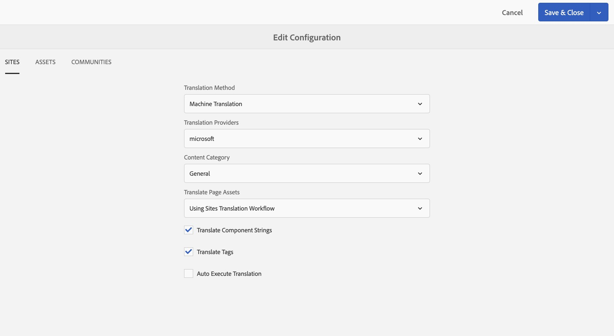

# Configuring the Translation Integration Framework{#configuring-the-translation-integration-framework}

The Translation Integration Framework integrates with third-party translation services to orchestrate the translation of AEM content.

* Connect to your translation service provider.
* Create a Translation Integration Framework configuration.
* Associate the cloud configurations with your pages.

For an overview of the content translation features in AEM, see [Translating Content for Multilingual Sites](/help/sites-administering/translation.md).

## Connecting to a Translation Service Provider {#connecting-to-a-translation-service-provider}

Create a cloud configuration that connects AEM to your translation service provider. AEM includes the capability to connect to Microsoft Translator by default.
The following translation vendors provide an implementation of the new API for the Translation Projects. Links to learn more about the integration:

* [Translations.com](https://exchange.adobe.com/experiencecloud.details.90104.globallink-connect-plus-for-aem.html) (Adobe Exchange Premier Partner)
* [Clay Tablet Technologies](https://exchange.adobe.com/experiencecloud.details.90064.clay-tablet-translation-for-experience-manager.html)
* [Lionbridge](https://exchange.adobe.com/experiencecloud.details.100064.lionbridge-connector-for-experience-manager-63.html)
* [Memsource](https://exchange.adobe.com/experiencecloud.details.103166.memsource-connector-for-adobe-experience-manager.html)
* [Cloudwords](https://exchange.adobe.com/experiencecloud.details.90019.html)
* [XTM Cloud](https://exchange.adobe.com/experiencecloud.details.105037.xtm-connect-for-adobe-experience-manager.html)
* [Lingotek](https://exchange.adobe.com/experiencecloud.details.90088.lingotek-collaborative-translation-platform.html)
* [RWS](https://partners.adobe.com/exchangeprogram/experiencecloud/exchange.details.108277.html)
* [Smartling](https://www.smartling.com/software/integrations/adobe-experience-manager/)
* [Systran](https://exchange.adobe.com/experiencecloud.details.90233.systran-for-adobe-experience-manager.html)
* [Altlang](https://exchange.adobe.com/experiencecloud.details.90222.altlang.html)
* Microsoft (Microsoft Translator is pre-installed in AEM)

>[!NOTE]
>
>To find the latest list of human and machine translation providers, have a look at these pages:
>
>
>* [AEM Human Translation](https://www.adobe.com/go/aem-human-translation-connectors)
>* [AEM Machine Translation](https://www.adobe.com/go/aem-machine-translation-connectors)
>

After you install a connector package, you can create a cloud configuration for the connector. Typically, you need to provide your credentials for authenticating with the translation service. For information about adding a cloud configuration for the Microsoft Translator connector, see [Integrating with Microsoft Translator](/help/sites-administering/tc-msconf.md).

You can create multiple cloud configurations for the same connector if required. For example, create one configuration for each of the accounts or projects that you have with the same vendor.

After you configure a connection, you can create the translation integration framework configuration that uses it.

## Creating a Translation Integration Configuration {#creating-a-translation-integration-configuration}

Create a translation integration framework configuration to specify how to translate your content. The configuration includes the following information:

* Which translation service provider to use.
* Whether human or machine translation is to be performed.
* Whether to translate other content that is associated with a page or asset, such as tags.

After you create a framework configuration, you associate the cloud configuration with the pages that you want to translate according to the configuration. When the translation process is started, the translation workflow proceeds according to the associated framework configuration.

When different sections of your website have different translation requirements, create multiple framework configurations accordingly. For example, a multilingual website includes English, Spanish, and Japanese language copies. The site owner uses two different translation service providers for Spanish and Japanese translations. Therefore, two configurations of the framework are configured. Each configuration uses a different translation service provider.

After you configure a translation integration framework, you can [associate it with the pages](/help/sites-administering/tc-prep.md) that use it.

**Note:** For an overview of the content translation features in AEM, see [Translating Content for Multilingual Sites](/help/sites-administering/translation.md).

A single configuration of the framework controls how to translate page content, community content, and assets.

### Sites Configuration Properties {#sites-configuration-properties}

The Sites properties control how the translation of page content is performed.

<table>
 <tbody>
  <tr>
   <th>Property</th>
   <th>Description</th>
  </tr>
  <tr>
   <td>Translation Workflow</td>
   <td>
Select the translation method that the framework performs for site content:

    <ul>
     <li>Machine Translation: The translation provider performs the translation using machine translation in real time.</li>
     <li>Human Translation: Content is sent to the translation provider to be translated by translators. </li>
     <li>Do Not Translate: Content is not sent for translation. This is to skip certain content branches which would not be translated but could be updated with latest content.</li>
    </ul> </td>
  </tr>
  <tr>
   <td>Translation Provider</td>
   <td>Select the translation provider to perform the translation. A provider appears in the list when their corresponding connector is installed.</td>
  </tr>
  <tr>
   <td>Content Category</td>
   <td>(Machine Translation Only) A category that describes the content that you are translating. The category can affect the choice of terminology and phrasing when translating content.</td>
  </tr>
  <tr>
   <td>Translate Component Strings</td>
   <td>Select to translate component strings of components that are associated with the page.</td>
  </tr>
  <tr>
   <td>Translate Tags</td>
   <td>Select to translate tags that are associated with the page.</td>
  </tr>
  <tr>
   <td>Translate Page Assets</td>
   <td>
Select how to translate assets that are added to components from the file system or referenced from Assets:

    <ul>
     <li>Do not translate: Page assets are not translated.</li>
     <li>Using Sites translation workflow: Assets are handled according to the configuration properties on the Sites tab.</li>
     <li>Using Assets translation workflow: Assets are handled according to the configuration of the properties on the Assets tab.</li>
    </ul> </td>
  </tr>
  <tr>
   <td>Auto-Execute Translation</td>
   <td>Select to execute translation jobs automatically after translation projects are created. You do not have an opportunity to review and scope the translation job when you select this option.</td>
  </tr>
 </tbody>
</table>

### Communities Configuration Properties {#communities-configuration-properties}

Communities properties control how the translation of user-generated content is performed. The translation of user-generated content always uses machine translation. For more information, see [Translating User Generated Content](/help/communities/translate-ugc.md).

| Property |Description |
|---|---|
| Translation Provider |Select the translation provider to perform the translation. The provider for which cloud configurations are created appear in the list. |
| Content Category |A category that describes the content that you are translating. The category can affect the choice of terminology and phrasing when translating content. |
| Choose A Locale To Use As The Global Share Store |(Optional) By selecting a locale for storing UGC, posts from all language copies will appear in one global conversation. By convention, choose the locale for the [base language](/help/communities/sites-console.md#translation) for the website. Choosing No Common Store will disable global translation. By default, global translation is disabled. |

### Assets Configuration Properties {#assets-configuration-properties}

Assets properties control how to configure assets. For more information about translating assets, see [Creating Language Copies for Assets](/help/assets/translation-projects.md).

<table>
 <tbody>
  <tr>
   <th>Property</th>
   <th>Description</th>
  </tr>
  <tr>
   <td>Translation Workflow</td>
   <td>
Select the type of translation that the framework performs for assets:

    <ul>
     <li>Machine Translation: The translation provider performs the translation immediately using machine translation.</li>
     <li>Human Translation: Content is automatically sent to the translation provider to be manually translated. </li>
     <li>Do Not Translate: Assets are not sent for translation.</li>
    </ul> </td>
  </tr>
  <tr>
   <td>Translation Provider</td>
   <td>Select the translation provider to perform the translation. A provider appears in the list when their corresponding connector is installed.</td>
  </tr>
  <tr>
   <td>Content Category</td>
   <td>(Machine Translation only) A category that describes the content that you are translating. The category can affect the choice of terminology and phrasing when translating content.</td>
  </tr>
  <tr>
   <td>Translate Assets</td>
   <td>Select to include assets in the translation project. </td>
  </tr>
  <tr>
   <td>Translate Metadata</td>
   <td>Select to translate asset metadata.</td>
  </tr>
  <tr>
   <td>Translate Tags</td>
   <td>Select to translate tags that are associated with the asset.</td>
  </tr>
  <tr>
   <td>Auto-Execute Translation</td>
   <td>Select to execute translation jobs automatically after translation projects are created. You do not have an opportunity to review or scope the translation job when you select this option.</td>
  </tr>
 </tbody>
</table>

1. In the side bar, click or tap Tools &gt; Operations &gt; Cloud &gt; Cloud Services.
1. In the Translation Integration area, whether any configurations have been created determines which link appears:

    * If no configurations have been created, click or tap Configure Now.
    * If configurations already exist, click or tap Show Configurations, and then click or tap the + link that appears next to Available Configurations.

1. Type a name for the configuration and then click or tap Create.
1. Configure the properties on the Sites, Communities, and Assets tab, and then click or tap OK.

## Configuring Pages for Translation {#configuring-pages-for-translation}

To configure the translation of your source pages into other languages, associate the pages with the following cloud configurations:

* The cloud configuration that connects AEM to your translation provider.
* The translation integration framework that configures the details of the translation.

Note that the translation integration framework cloud configuration identifies the cloud configuration to use for connecting to the service provider. When you associate a source page with a framework cloud configuration, the page must be associated with the service provider cloud configuration that the framework cloud configuration uses.

When you associate a page with a cloud configuration, the descendants of the page inherit the association. For example, if you associate the /content/geometrixx/en/products page with a Translation Integration Framework, the Products page and all pages below it are translated according to the framework.

When required, you can override the association on a descendent page. For example, the content of a web site is mostly about clothing. However, one branch of pages describes the company. The root page of the site is associated with a Translation Integration Framework that specifies machine translation using the Clothing category. The branch that describes the company uses a framework that performs machine translation using the General category.

Further, for any communities [SCF components](/help/communities/scf.md) on the pages, the user generated content (UGC) will include the ability for users to translate content. For more information, see [Translation of User Generated Content](/help/communities/translate-ugc.md).

### Associating a Page with a Translation Provider {#associating-a-page-with-a-translation-provider}

Associate a page with the translation provider that you are using to translate the page and descendent pages.

1. In the Sites console, select the page to configure and click or tap View Properties.
1. Click or tap Edit then click or tap the Cloud Services tab.
1. Click or tap Add Configuration &gt; Translation Integration.
1. Select the translation provider to use, and then click or tap Done.

### Associating Pages with a Translation Integration Framework {#associating-pages-with-a-translation-integration-framework}

Associate a page with the Translation Integration Framework that defines how you want to perform the translation of the page and descendent pages.

1. In the Sites console, select the page to configure and click or tap View Properties.
1. Click or tap Edit then click or tap the Cloud Services tab.
1. Click or tap Add Configuration &gt; Translation Integration.
1. Select the translation integration framework to use, and then click or tap Done.
