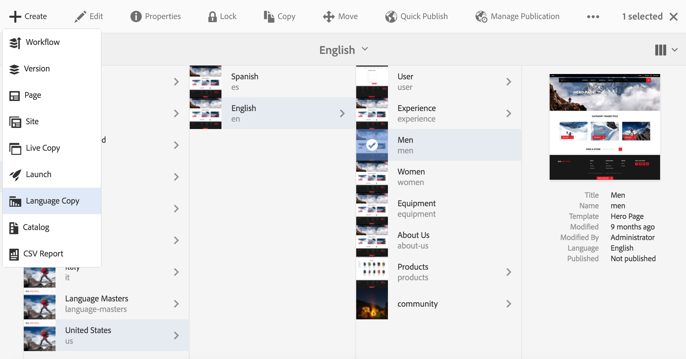
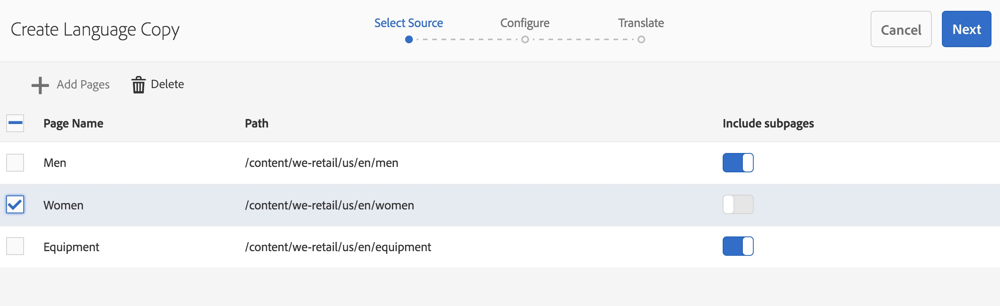

# Language Copy Wizard{#language-copy-wizard}

The Language Copy wizard is a guided experience for creating and instrumenting multilingual content structure. It is now much simpler and quicker to create a language copy.

>[!NOTE]
>
>The user needs to be a member of project-administrators group to create the Language Copy of a site.

To access this wizard:

1. In Sites, select a page and tap/click Create.

   

1. Select Language Copy and the wizard opens.

   

1. The **Select Source** step of the wizard allows you to add/remove pages. You also have the option of including or excluding the subpages.

   

1. The **Next** button brings you to the **Configure** step of the wizard. Here you can add/remove languages and select translation method.

   

   >[!NOTE]
   >
   >By default, there is only one translation setting. To be able to select other settings, you have to configure cloud configurations first. See [Configuring the Translation Integration Framework](/help/sites-administering/tc-tic.md).

1. The **Next** button brings you to the **Translate** step of the wizard. Here you can choose between creating the structure only, creating a new translation project or adding to an existing translation project.

   >[!NOTE]
   >
   >If you selected multiple languages in the previous step, multiple translation projects will be created.

   

1. The **Create** button ends the wizard.

   

