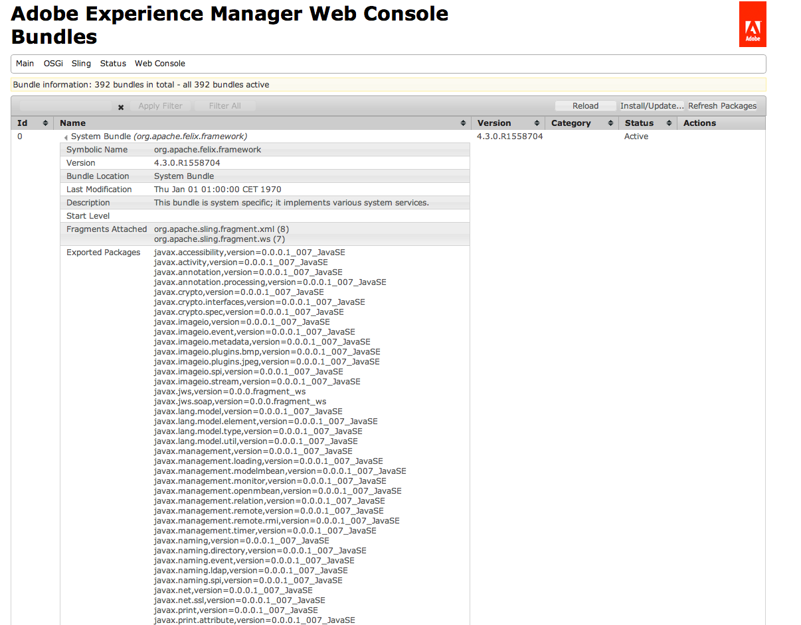

# Troubleshooting Adobe Experience Manager {#troubleshooting-aem}

The following section covers some issues that you may encounter when using AEM (Adobe Experience Manager), together with suggestions on how to troubleshoot them.

>[!NOTE]
>
>If you are troubleshooting authoring issues in AEM, see [Troubleshooting for Authors.](/help/sites-authoring/troubleshooting.md)

>[!NOTE]
>
>When experiencing problems, it is also worthwhile checking the list of [Known Issues](/help/release-notes/release-notes.md) for your instance (release and service packs).

## Troubleshooting scenarios for Administrators {#troubleshooting-scenarios-for-administrators}

The following table provides an overview of problems that administrators can troubleshoot:

<table>
 <tbody>
  <tr>
   <td><strong>Role</strong></td>
   <td><strong>Problem </strong></td>
  </tr>
  <tr>
   <td>System Administrator</td>
   <td>
Double-clicking the Quickstart jar does has no effect or opens the jar file with another program (for example, archive manager)
 </td>
  </tr>
  <tr>
   <td>
System Administrator
 </td>
   <td>
My application running on CRX throws out-of-memory errors
 </td>
  </tr>
  <tr>
   <td>
System Administrator
 </td>
   <td>
The AEM Welcome screen does not display in the browser after double-clicking AEM CM Quickstart
 </td>
  </tr>
  <tr>
   <td>
System Administrator
 
admin user
 </td>
   <td>
Making a Thread Dump
 </td>
  </tr>
  <tr>
   <td>
System Administrator
 
admin user
 </td>
   <td>
Checking for unclosed JCR sessions
 </td>
  </tr>
 </tbody>
</table>

## Installation Issues {#installation-issues}

See [Common Installation Issues](/help/sites-deploying/troubleshooting.md#common-installation-issues) for information about the following troubleshooting scenarios:

* Double-clicking the Quickstart jar has no effect or the JAR file with another program (such as archive manager).
* Applications running on CRX throw out-of-memory errors.
* The AEM Welcome screen does not display in the browser after double-clicking AEM Quickstart.

## Methods for Troubleshooting Analysis {#methods-for-troubleshooting-analysis}

### Making a Thread Dump {#making-a-thread-dump}

The thread dump is a list of all the Java&trade; threads that are currently active. If AEM does not respond properly, the thread dump can help you identify deadlocks or other problems.

### Using Sling Thread Dumper {#using-sling-thread-dumper}

1. Open the **AEM Web Console**; for example, at `https://localhost:4502/system/console/`.
1. Select the **Threads **under** Status** tab.

### Using jstack (command line) {#using-jstack-command-line}

1. Find the PID (process id) of the AEM Java&trade; instance.

   For example, you can use `ps -ef` or `jps`.

1. Run:

   `jstack <pid>`

1. Shows the thread dump.

>[!NOTE]
>
>You can append the thread dumps to a log file by using the `>>` output redirection:
>
>`jstack <pid> >> /path/to/logfile.log`

See the [How to take Thread Dumps from a JVM](https://experienceleague.adobe.com/docs/experience-cloud-kcs/kbarticles/KA-17452.html?lang=en) documentation for more information

### Checking for unclosed JCR sessions {#checking-for-unclosed-jcr-sessions}

When functionality is developed for AEM WCM, JCR Sessions may be opened (comparable to opening a database connection). If the opened sessions are never closed, your system may experience following symptoms:

* The system becomes slower.
* You can see much of CacheManager: resizeAll entries in the log file; the following number (size=&lt;x&gt;) shows the number of caches, each session opens several caches.
* From time to time the system runs out of memory (after a few hours, days, or weeks - depending on the severity).

To analyze unclosed sessions and find out which code is not closing a session, refer to the Knowledge Base article [Analyze Unclosed Sessions](https://helpx.adobe.com/experience-manager/kb/AnalyzeUnclosedSessions.html).

### Using the Adobe Experience Manager Web Console {#using-the-adobe-experience-manager-web-console}

The status of the OSGi bundles can also give an early indication of possible issues.

1. Open the **AEM Web Console**; for example, at `https://localhost:4502/system/console/`.
1. Select **Bundles** under **OSGI** tab.
1. Check:

    * the Status of the bundles. If any are Inactive or Unsatisfied, try to stop and restart the bundle. If the issue persists, investigate further using other methods.
    * whether any of the bundles have missing dependencies. Such details can be seen by clicking the individual bundle Name, which is a link (the following example does not have any issues):

