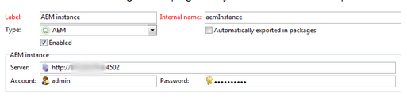

# Troubleshooting the Adobe Campaign Classic Integration{#troubleshooting-your-adobe-campaign-classic-integration}

Learn how to troubleshoot issues with the Adobe Campaign Classic (ACC) integration.

The following troubleshooting tips help solve the most common problems you may encounter when you integrate AEM with ACC.

## General Troubleshooting Tips {#general-troubleshooting-tips}

Check whether HTTP calls are sent and received by both solutions (AEM &gt; Adobe Campaign Classic, Adobe Campaign Classic &gt; AEM). This tip helps you avoid firewall/SSL issues.

* For AEM functionality, you can see that JSON calls are requested from the AEM author interface
  * These calls should not result in an HTTP-500 error.
  * If you see HTTP-500 errors, check the `error.log` for more information.
* Raising the debug level for campaign-classes in AEM can also help to troubleshoot issues.

## If the Connection Fails {#when-the-connection-fails}

Check that you have configured the **`aemserver`** operator in Adobe Campaign Classic.

## If Images do not Appear in the Adobe Campaign Classic Console {#if-images-do-not-appear-in-the-adobe-campaign-console}

Check the HTML source and validate that you can open the URL from the client machine. If the URL has `localhost:4503` in it, then change the configuration of Day CQ Link Externalizer on your AEM author instance. Have it point to a publish instance that can be reached from the Adobe Campaign Classic console machine.

See [Configuring the Externalizer.](/help/sites-administering/campaignstandard.md#configuring-the-externalizer)

## If You Cannot Connect from AEM to Adobe Campaign Classic  {#if-you-cannot-connect-from-aem-to-adobe-campaign}

Look for the following error message in Adobe Campaign Classic.

* `No datasource defined in the instance 'default'.`

* `Make sure the DNS alias used to access the server is correct (for example, avoid hard-coded IP addresses). (iRc=16384)`

To fix this issue, change the following in `$CAMPAIGN_HOME/conf/config-<instance-name>.xml`:

* `<dataStore hosts="*" lang="en_GB">`

## If no Data Displays in the Adobe Campaign Classic Dialog {#if-no-data-displays-in-the-adobe-campaign-dialog}

In Adobe Campaign Classic, ensure that you have no trailing slash (`/`) after the port number.



## If You Receive a Warning About setlocale {#if-you-get-a-warning-about-your-setlocale}

When starting the Apache HTTPD service for Adobe Campaign Classic, you may see the error `Warning: setlocale: LC_CTYPE cannot change locale` 

Make sure that you have `en_CA.ISO-8859-15 locale` installed on your Adobe Campaign Classic server.

* You can check whether it is installed by using `local -a`.
* If it is not installed, you can patch the `/usr/local/neolane/nl6/env.sh` script and change the locale to an installed one.

## If you get an error while compiling script 'get_nms_amcGetSeedMetaData_jssp' {#if-you-get-an-error-while-compiling-script-get-nms-amcgetseedmetadata-jssp}

If you see the following error message in the AEM log file:

`com.day.cq.mcm.campaign.impl.CampaignConnectorImpl Internal Adobe Campaign error: response body is Error while compiling script 'get_nms_amcGetSeedMetaData_jssp' line 45: String.prototype.toJSON called on incompatible XML.`

Use the following workaround on the Adobe Campaign Classic server.

1. Open file `$CAMPAIGN_HOME/datakit/nms/fra/js/amcIntegration.js`
1. Modify line 467 of method `amcGetSeedMetaData`
1. Change `label : [inclView.@label](mailto:inclView.@label)` to `label : String([inclView.@label](mailto:inclView.@label))`
1. Save.
1. Relaunch the server.

## If Adobe Campaign Classic Displays an Error When Clicking the Synchronize Button {#if-adobe-campaign-displays-an-error-when-clicking-the-synchronize-button}

When clicking the **Synchronize** button in Adobe Campaign Classic, you may see the following error.

* `Error while executing the method 'aemListContent' of service [nms:delivery](https://nmsdelivery/)`

To fix this issue, make sure that the AEM connection URL configured in the **External Accounts** in Adobe Campaign Classic is reachable from the machine.

A switch from `localhost` to an IP address for the URL can often solve this issue.

## If You Receive a 'Cannot parse XTK Date+Time 'undefined'' error {#if-you-get-a-cannot-parse-xtk-date-time-undefined-error}

After clicking **Synchronize** in AEM, you may receive an error that a script on the pages has occurred.

* `Cannot parse XTK Date+Time 'undefined': not a valid XTK value.`

This error happens if there is outdated Adobe Campaign Classic information on the AEM instance. You can solve this issue by doing the following:

1. Remove all Adobe Campaign Classic integration configurations that are on AEM.
1. Rebuild the integration.
1. Create a template.

## If a Connection to SSL Displays an Error When Setting up the Cloud Service {#if-a-connection-to-ssl-displays-an-error-when-setting-up-the-cloud-service}

Submit a ticket with the Adobe Campaign support team if you see the following in the `error.log` of AEM.

```text
javax.net.ssl.SSLProtocolException: handshake alert:  unrecognized_name
at sun.security.ssl.ClientHandshaker.handshakeAlert(Unknown Source)
at sun.security.ssl.SSLSocketImpl.recvAlert(Unknown Source)
at sun.security.ssl.SSLSocketImpl.readRecord(Unknown Source)
at sun.security.ssl.SSLSocketImpl.performInitialHandshake(Unknown Source)
at sun.security.ssl.SSLSocketImpl.writeRecord(Unknown Source)
at sun.security.ssl.AppOutputStream.write(Unknown Source)
```

## If You See HTTP Instead of the Expected HTTPS Links in the Synchronization Dialog {#if-you-see-http-instead-of-an-expected-https-links-in-the-synchronization-dialog}

When trying to synchronize content in Adobe Campaign Classic delivery, AEM returns a list of newsletters. However, the URLs to the newsletters in the list may be HTTP addresses instead of HTTPS. When selecting one of the items in the list an error occurs. This error can happen with the following setup.

* Hosted Adobe Campaign using https for communication with AEM Author
* Reverse proxy terminating SSL
* On-premise AEM Author instance

To solve this issue, do the following:

* The AEM Dispatcher or reverse proxy must be configured to pass the original protocol as a header.
* The **Apache Felix Http Service SSL Filter** in the OSGi configuration of AEM must be configured with the required header settings.
  * `https://<host>:<port>/system/console/configMgr`
  * See [https://github.com/apache/felix-dev/tree/master/http#using-the-ssl-filter](https://github.com/apache/felix-dev/tree/master/http#using-the-ssl-filter)

## A Custom Template Cannot be Selected in Page Properties {#if-the-custom-template-i-created-cannot-be-selected-in-page-properties}

When creating a mail template in AEM for Adobe Campaign Classic, you must include the property `acMapping` with the value `mapRecipient` in the `jcr:content` node of the template. If you do not, cannot select the Adobe Campaign Classic template in **Page Properties** of AEM. The field appears disabled.

## If You See the Error "com.day.cq.mcm.campaign.servlets.util.ParameterMapper" in the AEM Logs {#if-you-get-the-error-com-day-cq-mcm-campaign-servlets-util-parametermapper-in-your-logs}

You may see the error `com.day.cq.mcm.campaign.servlets.util.ParameterMapper` in the AEM logs when using a custom template.

This error occurs if the `acMapping` property is set to a value other than `recipient.firstName`, a blank value is created in the Adobe Campaign Manager.

If this error happens, install feature pack 6576 for AEM from [Package Share](/help/sites-administering/package-manager.md#package-share).
