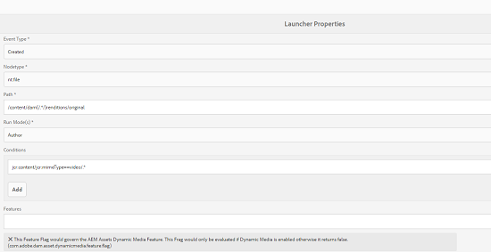
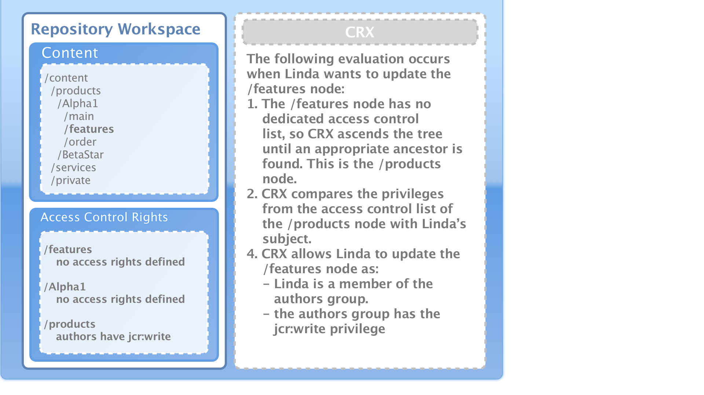
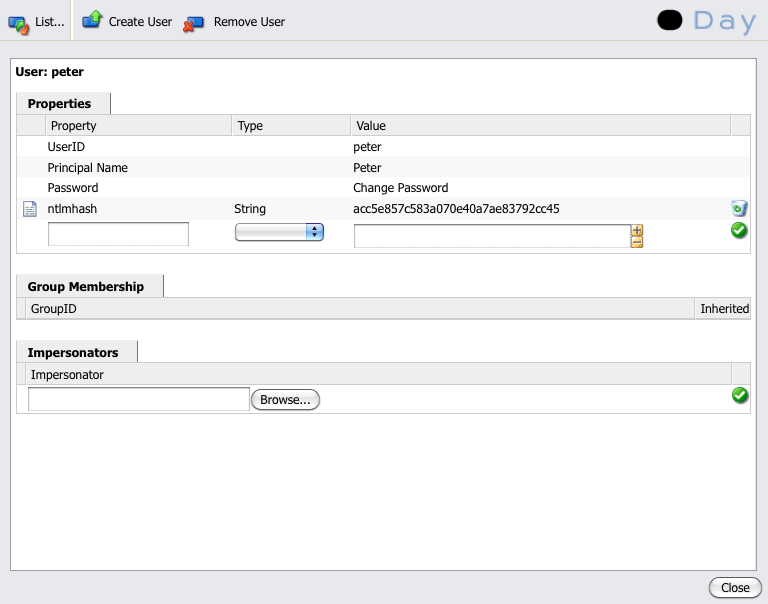
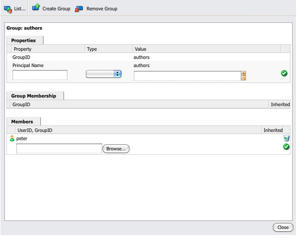
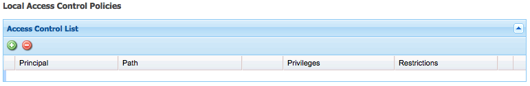
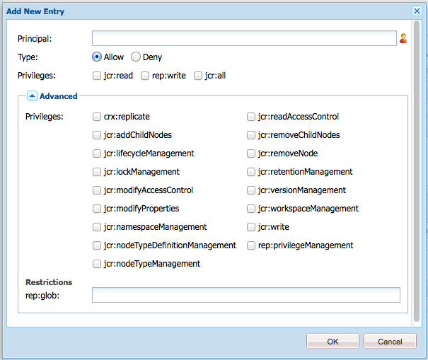
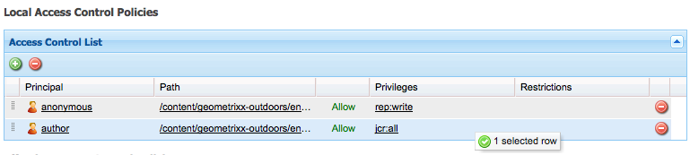
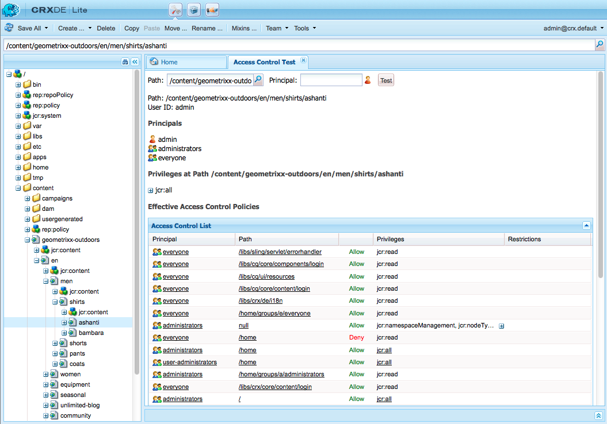

# User, Group and Access Rights Administration{#user-group-and-access-rights-administration}

Enabling access to a CRX repository involves several topics:

* [Access Rights](#how-access-rights-are-evaluated) - the concepts of how they are defined and evaluated
* [User Administration](#user-administration) - managing the individual accounts used for access
* [Group Administration](#group-administration) - simplify user management by forming groups
* [Access Right Management](#access-right-management) - defining policies that control how these users and groups can access resources

The basic elements are:

**User Accounts** CRX authenticates access by identifying, and verifying, a user (by that a person, or another application) according to details held in the user account.

In CRX every user account is a node in the workspace. A CRX user account has the following properties:

* It represents one user of CRX.
* It holds a user name and password.
* Is applicable for that workspace.
* It cannot have sub-users. For hierarchical access rights you should use groups.

* You can specify access rights for the user account.

  However, to simplify management we recommend that (in the majority of cases) you assign access rights to group accounts. Assigning access rights for each individual user quickly becomes very difficult to manage (the exceptions are certain system users when only one or two instances exist).

**Group Accounts** Group accounts are collections of users and/or other groups. These are used to simplify management as a change in the access rights assigned to a group is automatically applied to all users in that group. A user does not have to belong to any group, but often belongs to several.

In CRX a group has the following properties:

* It represents a group of users with common access rights. For example, authors or developers.
* Is applicable for that workspace.
* It can have members; these can be individual users or other groups.
* Hierarchical grouping can be achieved with member relationships. You cannot place a group directly below another group in the repository.
* You can define the access rights for all group members.

**Access Rights** CRX uses Access Rights to control access to specific areas of the repository.

This is done by assigning privileges to either allow or deny access to a resource (node or path) in the repository. As various privileges can be assigned, they must be evaluated to determine which combination is applicable for the current request.

CRX allows you to configure the access rights for both user and groups accounts. The same basic principles of evaluation are then applied to both.

## How Access Rights are Evaluated {#how-access-rights-are-evaluated}

>[!NOTE]
>
>CRX implements [access control as defined by JSR-283](https://www.adobe.io/experience-manager/reference-materials/spec/jcr/2.0/16_Access_Control_Management.html).
>
>A standard installation of a CRX repository is configured to use resource-based access control lists. This is one possible implementation of JSR-283 access control and one of the implementations present with Jackrabbit.

### Subjects and Principals {#subjects-and-principals}

CRX uses two key concepts when evaluating access rights:

* A **principal** is an entity that carries access rights. Principals include:

    * A user account
    * A group account

      If a user account belongs to one, or more, groups it is also associated with each of those group principals.

* A **subject** is used to represent the source of a request.

  It is used to consolidate the access rights applicable for that request. These are taken from:

    * The user principal

      The rights that you assign directly to the user account.

    * All groups principals associated with that user

      All rights assigned to any of the groups that the user belongs to.

  The result is then used to allow or deny access to the resource requested.

#### Compiling the list of Access Rights for a Subject {#compiling-the-list-of-access-rights-for-a-subject}

In CRX the subject is dependent on:

* the user principal
* all the group principals that are associated with that user

The list of access rights applicable for the subject is constructed from:

* the rights that you assign directly to the user account
* plus all rights assigned to any of the groups that the user belongs to



>[!NOTE]
>
>* CRX does not take any user hierarchy into account when it compiles the list.
>* CRX uses a group hierarchy only when you include a group as a member of another group. There is no automatic inheritance of group permissions.
>* The order in which you specify the groups does not affect the access rights.
>

### Resolving Request and Access Rights {#resolving-request-and-access-rights}

When CRX handles the request it compares the access request from the subject with the access control list on the repository node:

So if Linda requests to update the `/features` node in the following repository structure:



### Order of Precedence {#order-of-precedence}

Access rights in CRX are evaluated as follows:

* User principals always take precedence over group principals irrespective of:

    * their order in the access control list
    * their position in the node hierarchy

* For a given principal there exists (at most) 1 deny and 1 allow entry on a given node. The implementation always clears redundant entries and makes sure that the same privilege is not listed in both the allow and deny entries.

>[!NOTE]
>
>This evaluation process is appropriate for the resource based access control of a standard CRX installation.

Taking two examples where the user `aUser` is member of the group `aGroup`:

```xml
   + parentNode
     + acl
       + ace: aUser - deny - write
     + childNode
       + acl
         + ace: aGroup - allow - write
       + grandChildNode

```

In the above case:

* `aUser` is not granted write permission on `grandChildNode`.

```xml
   + parentNode
     + acl
       + ace: aUser - deny - write
     + childNode
       + acl
         + ace: aGroup - allow - write
         + ace: aUser - deny - write
       + grandChildNode
```

In this case:

* `aUser` is not granted write permission on `grandChildNode`.
* The second ACE for `aUser` is redundant.

Access rights from multiple group principals are evaluated based on their order, both within the hierarchy and within a single access control list.

### Best Practices {#best-practices}

The following table list some recommendations and best practices:

<table>
 <tbody>
  <tr>
   <td>Recommendation...</td>
   <td>Reason...</td>
  </tr>
  <tr>
   <td><i>Use Groups</i></td>
   <td><p>Avoid assigning access rights on a user-by-user basis. There are several reasons for this:</p>
    <ul>
     <li>You have many more users than groups, so groups simplify the structure.</li>
     <li>Groups help provide an overview over all accounts.</li>
     <li>Inheritance is simpler with groups.</li>
     <li>Users come and go. Groups are long-term.</li>
    </ul> </td>
  </tr>
  <tr>
   <td><i>Be Positive</i></td>
   <td><p>Always use Allow statements to specify the access rights of the group principal (wherever possible). Avoid using a Deny statement.</p> <p>Group principals are evaluated in order, both within the hierarchy and order within a single access control list.</p> </td>
  </tr>
  <tr>
   <td><i>Keep it Simple</i></td>
   <td><p>Investing some time and thought when configuring a new installation will be well repaid.</p> <p>Applying a clear structure will simplify the ongoing maintenance and administration, ensuring that both your current colleagues and/or future successors can easily understand what is being implemented.</p> </td>
  </tr>
  <tr>
   <td><i>Test</i></td>
   <td>Use a test installation to practice and ensure that you understand the relationships between the various users and groups.</td>
  </tr>
  <tr>
   <td><i>Default Users / Groups</i></td>
   <td>Always update the Default Users and Groups immediately after installation to help prevent any security issues.</td>
  </tr>
 </tbody>
</table>

## User Administration {#user-administration}

A standard dialog is used for **User Administration**.

You must be logged into the appropriate workspace, then you can access the dialog from both:

* the **User Administration** link on the Main Console of CRX
* the **Security** menu of the CRX Explorer



**Properties**

* **UserID**

  Short name for the account, used when accessing CRX.

* **Principal Name**

  A full text name for the account.

* **Password**

  Needed when accessing CRX with this account.

* **ntlmhash**

  Automatically assigned for each new account and updated when the password is changed.

* You can add new properties by defining a name, type and value. Click Save (green tick symbol) for each new property.

**Group Membership**

This displays all groups that the account belongs to. The Inherited column indicates membership that has been inherited as a result of membership of another group.

Clicking on a GroupID (when available) will open the [Group Administration](#group-administration) for that group.

**Impersonators**

With the Impersonate functionality a user can work on behalf of another user.

This means that a user account can specify other accounts (user or group) which can operate with their account. In other words, if user-B is allowed to impersonate user-A, then user-B can take actions using the full account details of user-A (including ID, name and access rights).

This allows the impersonator accounts to complete tasks as if they were using the account they are impersonating; for example, during an absence or to share an excessive load short-term.

If an account impersonates another it is very difficult to see. The log files hold no information about the fact that impersonation has occurred on the events. So if user-B is impersonating user-A all events will look as if they were performed by user-A personally.

### Creating a User Account {#creating-a-user-account}

1. Open the **User Administration** dialog.
1. Click **Create User**.
1. You can then enter the Properties:

    * **UserID** used as the account name.
    * **Password** needed when logging in.
    * **Principal Name** to provide a full textual name.
    * **Intermediate Path** which can be used to form a tree structure.

1. Click on the Save (green tick symbol).
1. The dialog will be expanded so that you can:

    1. Configure **Properties**.
    1. See **Group Membership**.
    1. Define **Impersonators**.

>[!NOTE]
>
>A loss of performance can sometimes be seen when registering new users in installations that have a high number of both:
>
>* users
>* groups with many members
>

### Updating a User Account {#updating-a-user-account}

1. With the **User Administration** dialog open the list view of all accounts.
1. Navigate through the tree structure.
1. Click on the required account to open for edit.
1. Make a change then click on Save (green tick symbol) for that entry.
1. Click **Close** to finish, or **List...** to return to the list of all user accounts.

### Removing a User Account {#removing-a-user-account}

1. With the **User Administration** dialog open the list view of all accounts.
1. Navigate through the tree structure.
1. Select the required account and click **Remove User**; the account will be deleted immediately.

>[!NOTE]
>
>This removes the node for this principal from the repository.
>
>Access right entries are not removed. This ensures the historical integrity.

### Defining Properties {#defining-properties}

You can define **Properties** for either new or existing accounts:

1. Open the **User Administration** dialog for the appropriate account.
1. Define a **Property** name.
1. Select the **Type** from the drop-down list.
1. Define the **Value**.
1. Click Save (green click symbol) for the new property.

Existing properties can be deleted with the trash symbol.

With the exception of the Password, properties cannot be edited, they must be deleted and recreated.

#### Changing the Password {#changing-the-password}

The **Password** is a special property that can be changed by clicking on the **Change Password** link.

You can also change the password to your own user account from the **Security** menu in the CRX Explorer.

### Defining an Impersonator {#defining-an-impersonator}

You can define Impersonators for either new or existing accounts:

1. Open the **User Administration** dialog for the appropriate account.
1. Specify the account to be allowed to impersonate that account.

   You can use Browse... to select an existing account.

1. Click Save (green tick symbol) for the new property.

## Group Administration {#group-administration}

A standard dialog is used for **Group Administration**.

You must be logged into the appropriate workspace, then you can access the dialog from both:

* the **Group Administration** link on the Main Console of CRX
* the **Security** menu of the CRX Explorer



**Properties**

* **GroupID**

  Short name for the group account.

* **Principal Name**

  A full text name for the group account.

* You can add new properties by defining a name, type and value. Click Save (green tick symbol) for each new property.

* **Members**

  You can add users, or other groups, as members of this group.

**Group Membership**

This displays all groups that the current group account belongs to. The Inherited column indicates membership that has been inherited as a result of membership of another group.

Clicking on a GroupID will open the dialog for that group.

**Members**

Lists all accounts (users and/or groups) that are members of the current group.

The **Inherited** column indicates membership that has been inherited as a result of membership of another group.

>[!NOTE]
>
>When the Owner, Editor, or Viewer role is assigned to a user on any Asset folder, a new group gets created. The group name is of the format `mac-default-<foldername>` for each folder on which the roles are defined.

### Creating a Group Account {#creating-a-group-account}

1. Open the **Group Administration** dialog.
1. Click **Create Group**.
1. You can then enter the Properties:

    * **Principal Name** to provide a full textual name.
    * **Intermediate Path** which can be used to form a tree structure.

1. Click on the Save (green tick symbol).
1. The dialog will be expanded so that you can:

    1. Configure **Properties**.
    1. See **Group Membership**.
    1. Manage **Members**.

### Updating a Group Account {#updating-a-group-account}

1. With the **Group Administration** dialog open the list view of all accounts.
1. Navigate through the tree structure.
1. Click on the required account to open for edit.
1. Make a change then click on Save (green tick symbol) for that entry.
1. Click **Close** to finish, or **List...** to return to the list of all group accounts.

### Removing a Group Account {#removing-a-group-account}

1. With the **Group Administration** dialog open the list view of all accounts.
1. Navigate through the tree structure.
1. Select the required account and click **Remove Group**; the account will be deleted immediately.

>[!NOTE]
>
>This removes the node for this principal from the repository.
>
>Access right entries are not removed. This ensures the historical integrity.

### Defining Properties {#defining-properties-1}

You can define Properties for either new or existing accounts:

1. Open the **Group Administration** dialog for the appropriate account.
1. Define a **Property** name.
1. Select the **Type** from the drop-down list.
1. Define the **Value**.
1. Click Save (green tick symbol) for the new property.

Existing properties can be deleted with the trash symbol.

### Members {#members}

You can add members to the current group:

1. Open the **Group Administration** dialog for the appropriate account.
1. Either:

    * Enter the name of the required member (user or group account).
    * Or use **Browse...** to search for, and select, the principal (user or group account) that you want to add.

1. Click Save (green tick symbol) for the new property.

Or delete an existing member with the trash symbol.

## Access Right Management {#access-right-management}

With the **Access Control** tab of CRXDE Lite you can define the access control policies and assign the related privileges.

For example, for **Current Path** select the required resource in the left pane, the Access Control tab in the bottom right pane:


The policies are categorized according to:

* **Applicable Access Control Policies**

  These policies can be applied.

  These are policies that are available for creating a local policy. Once you select and add an applicable policy it becomes a local policy.

* **Local Access Control Policies**

  These are access control policies that you have applied. You can then update, order, or remove them.

  A local policy will override any policies inherited from the parent.

* **Effective Access Control Policies**

  These are the access control policies that are now in effect for any access requests. They show the aggregated policies derived from both the local policies and any inherited from the parent.

### Policy Selection {#policy-selection}

The policies can be selected for:

* **Current Path**

  As in the example above, select a resource within the repository. The policies for this "current path" will be shown.

* **Repository**

  Selects repository level access control. For example, when setting the `jcr:namespaceManagement` privilege, which is only relevant for the repository, not a node.

* **Principal**

  A principal that is registered in the repository.

  You can either type in the **Principal** name or click the icon to the right of the field to open the **Select Principal** dialog.

  This allows you to **Search** for a **User** or **Group**. Select the required principal from the resulting list, then click **OK** to carry the value back to the previous dialog.


>[!NOTE]
>
>To simplify management we recommend that you assign access rights to group accounts, not individual user accounts.
>
>It is easier to manage a few groups, rather than many user accounts.

### Privileges {#privileges}

The following privileges are available for selection when adding an access control entry (see the [Security API](https://developer.adobe.com/experience-manager/reference-materials/spec/javax.jcr/javadocs/jcr-2.0/javax/jcr/security/Privilege.html) for full details):

<table>
 <tbody>
  <tr>
   <th><strong>Privilege Name</strong></th>
   <th><strong>Which controls the privilege to...</strong></th>
  </tr>
  <tr>
   <td><code>jcr:read</code></td>
   <td>Retrieve a node and read its properties and their values.</td>
  </tr>
  <tr>
   <td><code>rep:write</code></td>
   <td>This is a jackrabbit specific aggregate privilege of jcr:write and jcr:nodeTypeManagement.<br /> </td>
  </tr>
  <tr>
   <td><code>jcr:all</code></td>
   <td>This is an aggregate privilege that contains all other predefined privileges.</td>
  </tr>
  <tr>
   <td><strong>Advanced</strong></td>
   <td> </td>
  </tr>
  <tr>
   <td><code>crx:replicate</code></td>
   <td>Perform replication of a node.</td>
  </tr>
  <tr>
   <td><code>jcr:addChildNodes</code></td>
   <td>Create child nodes of a node.</td>
  </tr>
  <tr>
   <td><code>jcr:lifecycleManagement</code></td>
   <td>Perform lifecycle operations on a node.</td>
  </tr>
  <tr>
   <td><code>jcr:lockManagement</code></td>
   <td>Lock and unlock a node; refresh a lock.</td>
  </tr>
  <tr>
   <td><code>jcr:modifyAccessControl</code></td>
   <td>Modify the access control policies of a node.</td>
  </tr>
  <tr>
   <td><code>jcr:modifyProperties</code></td>
   <td>Create, modify and remove the properties of a node.</td>
  </tr>
  <tr>
   <td><code>jcr:namespaceManagement</code></td>
   <td>Register, unregister and modify namespace definitions.</td>
  </tr>
  <tr>
   <td><code>jcr:nodeTypeDefinitionManagement</code></td>
   <td>Import node type definitions to the repository.</td>
  </tr>
  <tr>
   <td><code>jcr:nodeTypeManagement</code></td>
   <td>Add and remove mixin node types and change the primary node type of a node. This also includes any calls to Node.addNode and XML importing methods where the mixin or primary type of new node is explicitly specified.</td>
  </tr>
  <tr>
   <td><code>jcr:readAccessControl</code></td>
   <td>Read the access control policy of a node.</td>
  </tr>
  <tr>
   <td><code>jcr:removeChildNodes</code></td>
   <td>Remove child nodes of a node.</td>
  </tr>
  <tr>
   <td><code>jcr:removeNode</code></td>
   <td>Remove a node.</td>
  </tr>
  <tr>
   <td><code>jcr:retentionManagement</code></td>
   <td>Perform retention management operations on a node.</td>
  </tr>
  <tr>
   <td><code>jcr:versionManagement</code></td>
   <td>Perform versioning operations on a node.</td>
  </tr>
  <tr>
   <td><code>jcr:workspaceManagement</code></td>
   <td>The creation and deletion of workspaces through the JCR API.</td>
  </tr>
  <tr>
   <td><code>jcr:write</code></td>
   <td>This is an aggregate privilege that contains:<br /> - jcr:modifyProperties<br /> - jcr:addChildNodes<br /> - jcr:removeNode<br /> - jcr:removeChildNodes</td>
  </tr>
  <tr>
   <td><code>rep:privilegeManagement</code></td>
   <td>Register new privilege.</td>
  </tr>
 </tbody>
</table>

### Registering New Privileges {#registering-new-privileges}

You can also register new privileges:

1. From the toolbar select **Tools**, then **Privileges** to display the privileges currently registered.

   

1. Use the **Register Privilege** icon (**+**) to open the dialog and define a new privilege:

   

1. Click **OK** to save. The privilege will now be available for selection.

### Adding an Access Control Entry {#adding-an-access-control-entry}

1. Select your resource and open the **Access Control** tab.

1. To add a new **Local Access Control Policies**, click the **+** icon at the right of the **Applicable Access Control Policy** list:

   

1. A new entry appears under **Local Access Control Policies:**

   

1. Click the **+** icon to add a new entry:

   

   >[!NOTE]
   >
   >Currently a workaround is needed to specify an empty string.
   >
   >For this you need to use "".

1. Define your access control policy and click **OK** to save. Your new policy will:

    * be listed under **Local Access Control Policy**
    * the changes will be reflected in the **Effective Access Control Policies**.

CRX will validate your selection; for a given principal there exists (at most) 1 deny and 1 allow entry on a given node. The implementation always clears redundant entries and makes sure that the same privilege is not listed in both the allow and deny entries.

### Ordering Local Access Control Policies {#ordering-local-access-control-policies}

The order in the list indicates the order in which the policies are applied.

1. In the table of **Local Access Control Policies** select the required entry and drag it to the new position in the table.

   

1. The changes will be shown in both the tables for the **Local** and the **Effective Access Control Policies**.

### Removing an Access Control Policy {#removing-an-access-control-policy}

1. In the table of **Local Access Control Policies** click the red icon (-) at the right of the entry.
1. The entry will be removed from both the tables for the **Local** and the **Effective Access Control Policies**.

### Testing an Access Control Policy {#testing-an-access-control-policy}

1. From the CRXDE Lite toolbar select **Tools**, then **Test Access Control...**.
1. A new dialog opens in the top right pane. Select the **Path** and/or **Principal** that you want to test.
1. Click **Test** to see the results for your selection:

   
