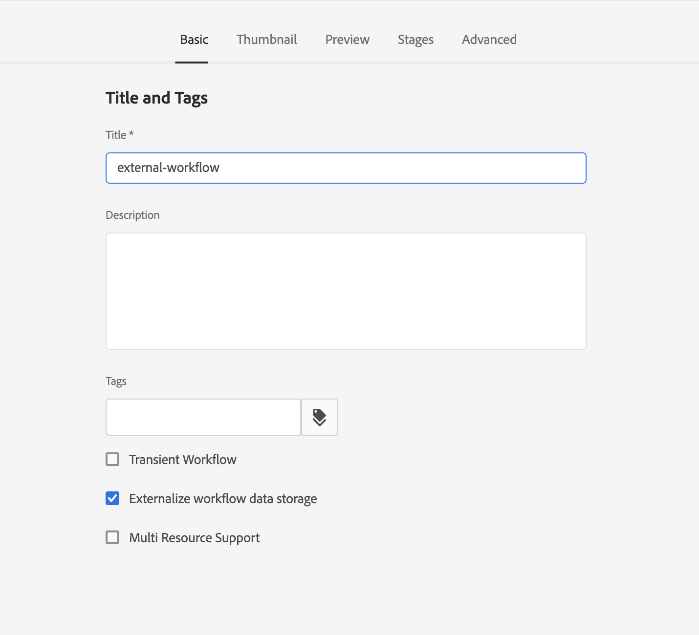

# Administering Workflow Instances{#administering-workflow-instances}

The workflow console provides several tools for administering workflow instances to ensure that they are executing as expected.

>[!NOTE]
>
>The [JMX console](/help/sites-administering/jmx-console.md#workflow-maintenance) provides additional workflow maintenance operations.

A range of consoles are available for administering your workflows. Use the [global navigation](/help/sites-authoring/basic-handling.md#global-navigation) to open the **Tools** pane, then select **Workflow**:

* **Models**: Manage workflow definitions
* **Instances**: View and manage running workflow instances
* **Launchers**: Manage how workflows are to be launched
* **Archive**: View history of workflows that completed successfully
* **Failures**: View history of workflows that completed with errors
* **Auto-Assign**: Configure Auto-Assigning workflows to templates

## Monitoring the Status of Workflow Instances {#monitoring-the-status-of-workflow-instances}

1. Using Navigation select **Tools**, then **Workflow**.
1. Select **Instances** to display the list of workflow instances currently in progress.

   

<!--
## Search Workflow Instances {#search-workflow-instances}

1. Using Navigation select **Tools**, then **Workflow**.
1. Select **Instances** to display the list of workflow instances currently in progress. On the top rail, in the left corner, select **Filters**. Alternatively, you can use the keystrokes alt+1. The following dialog is displayed:

   

1. In the Filter dialog, select the workflow search criteria. You can search based on these inputs:

   * Payload path: Select a specific path
   * Workflow model: Select a workflow model
   * Assignee: Select a workflow Assignee
   * Type: Task, Workflow item, or Workflow Failure
   * Task Status: Active, Complete, or Terminated
   * Where I Am: Owner AND Assignee, Owner only, Assignee only
   * Start Date: Start date before or after a specified date
   * End Date: End date before or after a specified date
   * Due Date: Due date before or after a specified date
   * Updated Date: Updated date before or after a specified date
-->

## Suspending, Resuming, and Terminating a Workflow Instance {#suspending-resuming-and-terminating-a-workflow-instance}

1. Using Navigation select **Tools**, then **Workflow**.
1. Select **Instances** to display the list of workflow instances currently in progress.

   

1. Select a specific item, then use **Terminate**, **Suspend**, or **Resume**, as appropriate; confirmation, and/or further details are required:

   

## Viewing Archived Workflows {#viewing-archived-workflows}

1. Using Navigation select **Tools**, then **Workflow**.
1. Select **Archive** to display the list of workflow instances that completed successfully.

   

   >[!NOTE]
   >
   >The abort status is considered as a successful termination as it occurs as a result of user action; for example:
   >
   >* use of the **Terminate** action
   >* when a page, that is subject to a workflow, is (force) deleted, then the workflow will be terminated

1. Select a specific item, then **Open History** to see more details:

   

## Fixing Workflow Instance Failures {#fixing-workflow-instance-failures}

When a workflow fails, AEM provides the **Failures** console to allow you to investigate and take appropriate action once the original cause has been handled:

* **Failure Details**
  Opens a window to show the **Failure Message**, **Step**, and **Failure Stack**.

* **Open History**
  Shows details of the workflow history.

* **Retry Step** Executes the Script Step component instance again. Use the Retry Step command after you have fixed the cause of the original error. For example, retry the step after you fix a bug in the script that the Process Step executes.
* **Terminate** Terminate the workflow if the error has caused an irreconcilable situation for the workflow. For example, the workflow can rely on environmental conditions such as information in the repository that are no longer valid for the workflow instance.
* **Terminate and Retry** Similar to **Terminate** except that a new workflow instance is started using the original payload, title, and description.

To investigate failures, then resume or terminate the workflow afterwards, use the following steps:

1. Using Navigation select **Tools**, then **Workflow**.
1. Select **Failures** to display the list of workflow instances that did not complete successfully.
1. Select a specific item, then the appropriate action:

   

## Regular Purging of Workflow Instances {#regular-purging-of-workflow-instances}

Minimizing the number of workflow instances increases the performance of the workflow engine, so you can regularly purge completed or running workflow instances from the repository.

Configure **Adobe Granite Workflow Purge Configuration** to purge workflow instances according to their age and status. You can also purge workflow instances of all models or of a specific model.

You can also create multiple configurations of the service to purge workflow instances that satisfy different criteria. For example, create a configuration that purges the instances of a particular workflow model when they are running for much longer than the expected time. Create another configuration that purges all completed workflows after a certain number of days to minimize the size of the repository.

To configure the service, you can use the [Web Console](/help/sites-deploying/configuring-osgi.md#osgi-configuration-with-the-web-console) or [add an OSGi configuration to the repository](/help/sites-deploying/configuring-osgi.md#osgi-configuration-in-the-repository). The following table desribes the properties that you need for either method.

>[!NOTE]
>
>For adding the configuration to the repository, the service PID is:
>
>`com.adobe.granite.workflow.purge.Scheduler`
>
>Because the service is a factory service, the name of the `sling:OsgiConfig` node requires an identifier suffix, for example:
>
>`com.adobe.granite.workflow.purge.Scheduler-myidentifier`

<table>
 <tbody>
  <tr>
   <th>Property Name (Web Console)</th>
   <th>OSGi Property Name</th>
   <th>Description</th>
  </tr>
  <tr>
   <td>Job Name</td>
   <td>scheduledpurge.name</td>
   <td>A descriptive name for the scheduled purge.</td>
  </tr>
  <tr>
   <td>Workflow Status</td>
   <td>scheduledpurge.workflowStatus</td>
   <td><p>The status of the workflow instances to purge. The following values are valid:</p>
    <ul>
     <li>COMPLETED: Completed workflow instances are purged.</li>
     <li>RUNNING: Running workflow instances are purged.</li>
    </ul> </td>
  </tr>
  <tr>
   <td>Models To Purge</td>
   <td>scheduledpurge.modelIds</td>
   <td><p>The ID of the workflow models to purge. The ID is the path to the model node, for example:<br /> /var/workflow/models/dam/update_asset<br /> </p> <p>To specify multiple models, click the + button in the Web Console. </p> <p>Do not specify any value to purge instances of all workflow models.</p> </td>
  </tr>
  <tr>
   <td>Workflow Age</td>
   <td>scheduledpurge.daysold</td>
   <td>The age of the workflow instances to purge, in days.</td>
  </tr>
 </tbody>
</table>

## Setting the Maximum Size of the Inbox {#setting-the-maximum-size-of-the-inbox}

You can set the maximum size of the inbox by configuring the **Adobe Granite Workflow Service**, using the [Web Console](/help/sites-deploying/configuring-osgi.md#osgi-configuration-with-the-web-console) or [add an OSGi configuration to the repository](/help/sites-deploying/configuring-osgi.md#osgi-configuration-in-the-repository). The following table describes the property that you configure for either method.

>[!NOTE]
>
>For adding the configuration to the repository, the service PID is:
>
>`com.adobe.granite.workflow.core.WorkflowSessionFactory`.

| Property Name (Web Console) |OSGi Property Name |
|---|---|
| Max Inbox Query Size |granite.workflow.inboxQuerySize |

## Using Workflow variables for customer owned datastores {#using-workflow-variables-customer-datastore}

Data processed by workflows is stored in the Adobe provided storage (JCR). This data can be sensitive in nature. You may want to save all the user defined metadata/data in your own managed storage instead of Adobe provided storage. These sections describe how to set up these variables for external storage.

### Set the model to use external storage of metadata {#set-model-for-external-storage}

At the level of workflow model, a flag is provided to indicate that the model (and its runtime instances) has external storage of metadata. Workflow variables will not be persisted in JCR for the workflow instances of the models marked for external storage. 

The property *userMetadataPersistenceEnabled* will be stored on the *jcr:content node* of the workflow model. This flag will be persisted in workflow metadata as *cq:userMetaDataCustomPersistenceEnabled*.

The illustration below shows how to set the flag on a workflow.

 

### APIs for metadata in external storage {#apis-for-metadata-external-storage}

In order to store the variables externally you must implement the APIs that the workflow exposes.

UserMetaDataPersistenceContext

The following samples show you how to use the API.

``` 

@ProviderType
public interface UserMetaDataPersistenceContext {
 
    /**
     * Gets the workflow for persistence
     * @return workflow
     */
    Workflow getWorkflow();
 
    /**
     * Gets the workflow id for persistence
     * @return workflowId
     */
    String getWorkflowId();
 
    /**
     * Gets the user metadata persistence id
     * @return userDataId
     */
    String getUserDataId();
}
``` 

UserMetaDataPersistenceProvider

``` 
/**
 * This provider can be implemented to store the user defined workflow-data metadata in a custom storage location
 */
@ConsumerType
public interface UserMetaDataPersistenceProvider {
 
   /**
    * Retrieves the metadata using a unique identifier
    * @param userMetaDataPersistenceContext
    * @param metaDataMap of user defined workflow data metaData
    * @throws WorkflowException
    */
   void get(UserMetaDataPersistenceContext userMetaDataPersistenceContext, MetaDataMap metaDataMap) throws WorkflowException;
 
   /**
    * Stores the given metadata to the custom storage location
    * @param userMetaDataPersistenceContext
    * @param metaDataMap metadata map
    * @return the unique identifier that can be used to retrieve metadata. If null is returned, then workflowId is used.
    * @throws WorkflowException
    */
   String put(UserMetaDataPersistenceContext userMetaDataPersistenceContext, MetaDataMap metaDataMap) throws WorkflowException;
} 
```
