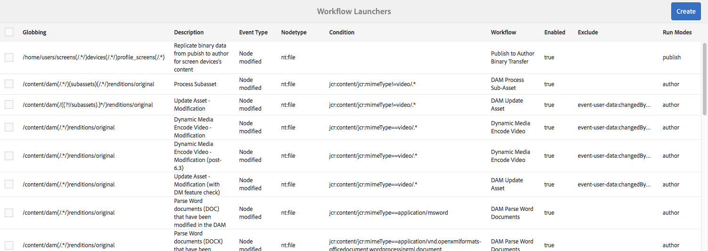
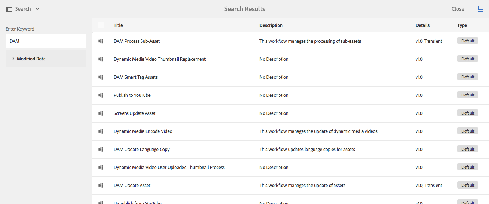
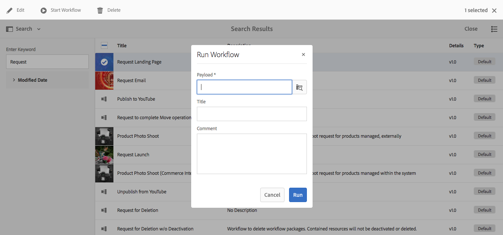
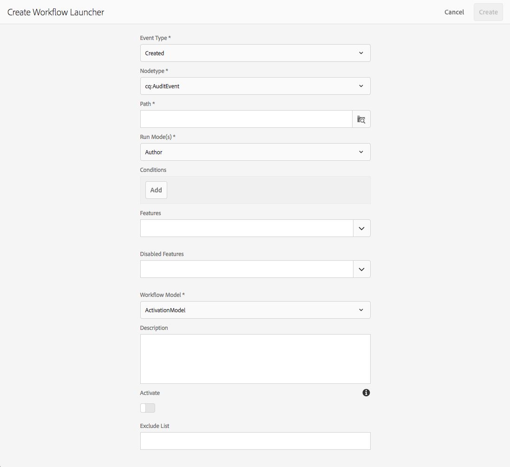

# Starting Workflows{#starting-workflows}

When administering workflows you can start them using various methods:

* Manually:

    * From a [Workflow Model](#workflow-models).
    * Using a workflow package for [batch processing](#workflow-packages-for-batch-processing).

* Automatically:

    * In response to node changes; [using a Launcher](#workflows-launchers).

>[!NOTE]
>
>Other methods are also available to authors; for full details see:
>
>* [Applying Workflows to Pages](/help/sites-authoring/workflows-applying.md)
>* [How to apply workflows to DAM assets](/help/assets/assets-workflow.md)
>* [AEM Forms](https://helpx.adobe.com/aem-forms/6-2/aem-workflows-submit-process-form.html)
>* [Translation Projects](/help/sites-administering/tc-manage.md)
>

## Workflow Models {#workflow-models}

You can start a workflow [based on one of the models](/help/sites-administering/workflows.md#workflow-models-and-instances) listed on the Workflow Models console. The only mandatory information is the payload, though a title and/or comment can be added as well.

## Workflows Launchers {#workflows-launchers}

The Workflow Launcher monitors changes in the content repository to launch workflows dependent on the location and resource type of the changed node.

Using the **Launcher** you can:

* See the workflows already launched for specific nodes.
* Select a workflow to be launched when a certain node/node-type has been created/modified/removed.
* Remove an existing workflow-to-node relationship.

A launcher can be created for any node. However, changes to certain nodes do not launch workflows. Changes to nodes below the following paths do not cause workflows to launch:

* `/var/workflow/instances`
* Any workflow-inbox node located anywhere in the `/home/users` branch
* `/tmp`
* `/var/audit`
* `/var/classes`
* `/var/eventing`
* `/var/linkchecker`
* `/var/mobile`
* `/var/statistics`

    * Exception: Changes to nodes below `/var/statistics/tracking` *do* cause workflows to launch.

Various definitions are included with the standard installation. These are used for digital asset management and social collaboration tasks:

## Workflow Packages for Batch Processing {#workflow-packages-for-batch-processing}

Workflow packages are packages that can be passed to a workflow as payload for processing, allowing multiple resources to be processed.

A workflow package:

* contains links to a set of resources (such as pages, assets).
* holds package information such as the creation date, the user that created the package and a short description.
* is defined using a specialized page template; such pages allow the user to specify the resources in the package.
* can be used multiple times.
* can be changed by the user (add or remove resources) while the workflow instance is actually running.

## Starting a Workflow from the Models Console {#starting-a-workflow-from-the-models-console}

1. Navigate to the **Models** console using **Tools**, **Workflow**, then **Models**.
1. Select the workflow (according to the console view); you can also use Search (top left) if necessary:

   

   >[!NOTE]
   >
   >The **[Transient](/help/sites-developing/workflows.md#transient-workflows)** indicator shows workflows for which the workflow history is not persisted.

1. Select **Start Workflow** from the toolbar.
1. The Run Workflow dialog box opens, letting you specify:

    * **Payload**

      This can be a page, node, asset, package, among other resources.

    * **Title**

      An optional title to help identify this instance.

    * **Comment**

      An optional comment to help indicate details of this instance.

   

## Creating a Launcher Configuration {#creating-a-launcher-configuration}

1. Navigate to the **Workflow Launchers** console using **Tools**, **Workflow**, then **Launchers**.
1. Select **Create**, then **Add Launcher** to open the dialog box:

   

    * **Event Type**

      The event type that launches the workflow:

        * Created
        * Modified
        * Removed

    * **Nodetype**

      The type of node that the workflow launcher applies to.

    * **Path**

      The path that the workflow launcher applies to.

    * **Run Mode(s)**

      The type of server that the workflow launcher applies to. Select **Author**, **Publish**, or **Author & Publish**.

    * **Conditions**

      A list of conditions for node values that, when evaluated, determine whether the workflow is launched. For example, the following condition causes the workflow to launch when the node has a property name with the value User:

      name==User

    * **Features**

      A list of features to be enabled. Select the required features using the drop-down selector.

    * **Disabled Features**

    A list of features to be disabled. Select the required features using the drop-down selector.

    * **Workflow Model**

      The workflow to launch when the Event Type occurs on the Nodetype and/or Path under the defined Condition.

    * **Description**

      Your own text to describe and identify the launcher configuration.

    * **Activate**

      Controls whether the workflow launcher is activated:

        * Select **Enable** to launch workflows when the configuration properties are satisfied.
        * Select **Disable** when the workflow should not execute (not even when the configuration properties are satisfied).

    * **Exclude List**

      This specifies any JCR events to exclude (that is, ignore) when determining whether a workflow should be triggered.

      This launcher property is a comma-separated list of items: ``

        * `property-name` ignore any `jcr` event which triggered on the specified property name. ``
        * `event-user-data:<*someValue*>` ignores any event that contains the `*<someValue*`> `user-data` set through the [ `ObservationManager` API](https://developer.adobe.com/experience-manager/reference-materials/spec/jsr170/javadocs/jcr-2.0/javax/jcr/observation/ObservationManager.html#setUserData(java.lang.String).

      For example:

      `jcr:lastModified,dc:modified,dc:format,jcr:lastModifiedBy,imageMap,event-user-data:changedByWorkflowProcess`

      This feature can be used to ignore any changes triggered by another workflow process by adding the exclude item:

      `event-user-data:changedByWorkflowProcess`

1. Select **Create**, to create the launcher and return to the console.

   When the appropriate event occurs, the launcher is triggered and the workflow started.

## Managing a Launcher Configuration {#managing-a-launcher-configuration}

After you have created your launcher configuration you can use the same console to select the instance, then **View Properties** (and edit them) or **Delete**.
