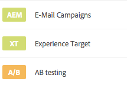
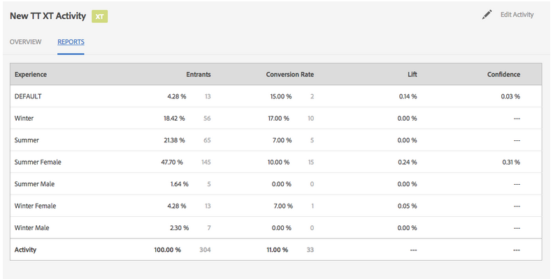
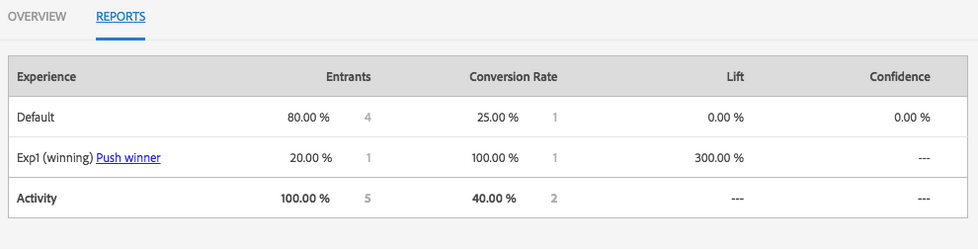

# Managing Activities{#managing-activities}

The Activities console enables you to create, organize, and manage the marketing [activities](/help/sites-authoring/personalization.md#activities) of your brands:

* Add brands.
* For each brand, add and configure activities.
* Administer activities.

>[!NOTE]
>
>If you are using Adobe Target as your targeting engine, you can also [view performance data of your activities](#viewing-performance-and-converting-winning-experiences-a-b-test). If you are using A/B testing, you can [convert winners](#viewing-performance-and-converting-winning-experiences-a-b-test).

On the Activities console, activities are organized by brand. You can use brands and folders to structure the organization of your activities. You navigate to the Activities console by tapping/clicking **Personalization** and tapping/clicking **Activities**.

Activities are available in Targeting mode for [authoring targeted content](/help/sites-authoring/content-targeting-touch.md), where you can also create activities. Activities that you create in Targeting mode appear in the Activities console.

Activities are displayed with a label describing what kind of activity is defined:

* XT - Adobe Target experience targeting
* A/B - Adobe Target A/B testing
* AEM - Adobe Experience Manager targeting (contexthub or clientcontext driven)

>[!NOTE]
>
>What types of activities are available is determined by the following:
>
>* If the **xt_only** option is enabled on the Adobe Target tenant (clientcode) used on the AEM side to connect to Adobe Target, then you can create **only** XT activities in AEM.
>
>* If the **xt_only** options is **not** enabled on the Adobe Target tenant (clientcode), then you can create **both** XT and A/B activities in AEM.
>
>**Additional note:** **xt_only** options is a setting applied on a certain Target tenant (clientcode) and can only be modified directly in Adobe Target. You cannot enable or disable this option in AEM.

>[!CAUTION]
>
>Secure the activity settings node **cq:ActivitySettings** on the publish instance so that it is inaccessible to normal users. The activity settings node should only be accessible to the service handling the activity synchronization to Adobe Target.
>
>See [Prerequisites for Integrating with Adobe Target](/help/sites-administering/target-requirements.md#securingtheactivitysettings) for detailed information.

## Creating a Brand Using the Activities Console {#creating-a-brand-using-the-activities-console}

Create a brand for which you want to manage marketing activities.

When you create a brand using the Activities console, it also appears in the [Offers console](/help/sites-authoring/offerlib.md) where you can create offers for the experiences of your activities.

1. In the Navigation console, click **Personalization**. Click **Activities**.

   

1. In the Activities console, click **Create **then** Create Brand**.
1. Select the brand template and click **Next**.
1. Type a title for the brand as you want it to appear in the Activities and Offers consoles. Optionally, type or select one or more tags to associate with the brand.
1. Click **Create**. Your brand appears in the Activities console.

## Adding/Editing an Activity Using the Activities Console {#adding-editing-an-activity-using-the-activities-console}

Add an activity or edit an existing activity to focus your marketing efforts on specific audiences. When you create/edit an activity, you specify the following information:

* **Name:** The name of the activity.
* **Targeting Engine:** Either [AEM](/help/sites-authoring/personalization.md#aem) or [Adobe Target](/help/sites-authoring/personalization.md#adobe-target) as the engine for targeted content.

* **Select a Target Configuration:** (Adobe Target only) The cloud configuration that this activity should use to connect to Adobe Target. This option appears only when Adobe Target is selected for Targeting Engine.
* **Activity Type: **The activity type - A/B Test or Experience targeting
* **Objective:** (Optional) A description of the activity.
* **Experiences:** Mappings between audience names and the marketing segments that you are targeting.
* **Traffic Percentages:** If A/B test is selected, you can change how much traffic (in percent) goes to each experience.
* **Duration:** The period of time when the activity is applied.
* **Priority:** The relative priority of the activity. When activities provide content for the same user segments, the activity of the higher priority takes precedence.
* **Goal Metric:** If Adobe Target is selected as the targeting engine, you can add success metrics to the activity. One success metric is required.

>[!NOTE]
>
>New Adobe Target activities need to be ***created*** in the targeted content editor, not in the **Activities** console, as synchronization to Adobe Target will fail.
>
>You can, however, edit existing Adobe Target activities in the console.

To add an activity:

1. Click the brand for which you are creating the activity, click **Create** and then **Create Activity**. If you are editing, select the activity and then click **Edit**.
1. Provide the following information and then click **Next**:

    * A name for the activity.
    * The targeting engine to use. ContextHub (AEM) is selected by default. If you need to use Adobe Target, create the activity in the targeted content editor.
    * If you selected Adobe Target as the targeting engine, select/edit the cloud configuration to use to connect to Adobe Target. (Be careful that you do not select a framework that you created for your cloud configuration.)
    * (Optional) The objective or a description of the activity.
    * Select the Activity Type.

1. Add one or more experiences to the activity. Click **Add Experience**.
1. If you are using AEM targeting or Adobe Target experience targeting:

    1. Click **Select Audience **and select the segment that your experience targets.
    1. Click **Add Experience**, type a name, and click **OK**.

    1. Click **Next**.

   If you are using Adobe Target A/B Testing:

    1. Click the pencil in the audiences box to select an audience.
    1. Click **Add Experience**, type a name, and click **OK**.

    1. Enter the percentage of traffic that displays each experience.
    1. Click **Next**.

1. To specify when the activity starts, use the **Start** drop-down menu to select one of the following values:

    * **When Activated:** The activity starts when the page that contains the targeted content is activated.
    * **Specified Date & Time:** A specific time. When you select this option, click the calendar icon, select a date, and specify the time to start the activity.

1. To specify when the activity ends, use the End drop-down menu to select one of the following values:

    * **When Deactivated**: The activity ends when the page that contains the targeted content is deactivated.
    * **Specified Date & Time**: A specific time. When you select this option, click the calendar icon, select a date, and specify the time to end the activity.

1. To specify a priority for the activity, use the slider to select either **Low**, **Normal**, or **High**.
1. If you are using Adobe Target as your targeting engine, select what you would like to measure with this activity. See [Configuring the Activity and Setting Goals](/help/sites-authoring/content-targeting-touch.md) for more information on the success metrics available. Select at least one goal.
1. Click **Save**.

   >[!NOTE]
   >
   >After creating an activity, you need to publish it so that it is available.

## Publishing and Unpublishing Activities {#publishing-and-unpublishing-activities}

You need to publish activities to make them available. Conversely, you may want to make activities unavailable by unpublishing them.

>[!NOTE]
>
>When unpublishing an activity, the status of the activity does not change unless you refresh the page.

To publish or unpublish activities:

1. Click the brand and then the area that contains the activity you want to publish or unpublish.
1. Click the icon next to the activity or activities you want to publish or unpublish.

   

1. To publish, click **Publish**. To unpublish, click **Unpublish**. Your activity or activities are published or unpublished and their status changes in the Activities console (may require a refresh).

## Activities on Author and Publish instances {#activities-on-author-and-publish-instances}

When an activity that uses the Adobe Target targeted engine is activated, a second activity is created on the publish instance:

* The activity on the author instance tracks activity on the author instance and is useful for simulating the visitor experience. The analytics recorded for this activity only reflects what occurs on the author instance.
* The activity on the publish instance reflects and responds to the activity on the publish server. This is the activity that runs on the public website. Only the publish activity is relevant to tracking and analyzing the usage of the actual public site.

## Viewing Performance and Converting Winning Experiences (A/B Test) {#viewing-performance-and-converting-winning-experiences-a-b-test}

You can see the performance of any Adobe Target activity (XT or A/B). If you are using A/B testing, you can also convert the winning experience, which then becomes the default experience.

To view activity performance and convert winning experiences:

1. In **Personalization**, click **Activities** to navigate to the **Activities** console.
1. Click the brand for which you want to see activities.
1. Select the activity and click **View Properties** and click the **Reports** tab and select the activity that you want to view performance for/convert winning experiences for. Performance data is displayed.

   

1. Click the **Push winner** link to push that experience as the default experience.

   Converting the winner does the following:

    * It disables the current activity
    * Modifies all pages and replaces the targeted content with the actual content of the winning experience. The content of the winning experience becomes part of the normal page **without** targeting.

   

   A winning experience is the experience that generates more Lift in the reports, which is based on the conversion rate.

1. Click **Yes** to confirm that you want to convert the winner, disabling the current experience and replacing it with the content of the winning experience.

## Synchronizing Activities with Adobe Target {#synchronizing-activities-with-adobe-target}

Activities that use the Adobe Target targeting engine are synchronized with Adobe Target campaigns. An activity is automatically synchronized to Adobe Target when the following conditions are met:

* The activity contains at least one experience.
* At least one experience contains a mapped segment and one offer.
* Each experience in the activity must have the same number of offers.

These conditions apply to activities on author and publish instances.

When an activity is synchronized, a corresponding campaign is created in Adobe Target:

* Activities on the publish instance have the same name as the corresponding Adobe Target campaign.
* Activities on the author instance correspond with Target campaigns of the same name with the `_author` suffix.

The _author activities are synchronized immediately when the activity is modified. Immediate synchronization enables the simulation of activities with Client Context or ContextHub.

Publish activities are synchronized when the activity is published to the AEM publish instance.

## Troubleshooting Activity Synchronization {#troubleshooting-activity-synchronization}

When AEM synchronizes an activity with Adobe Target, AEM includes a property of the activity named `thirdPartyId`. The value of this property is based on the path of the activity in the AEM repository. No two campaigns in Adobe Target can have the same value for the `thirdPartyId` property. Therefore an activity will fail to synchronize if an existing campaign (of a different type AB, XT) in Adobe Target uses the same value for `thirdPartyId`.

This situation can occur under the following circumstances:

1. An activity is created and synchronized with Adobe Target.
1. On another AEM instance an activity is created under the same brand and using the same name. Synchronization of this activity fails when attempted.

This situation can also occur under the following circumstances:

1. An activity is created and synchronized with Adobe Target. The activity is then deleted on AEM.
1. An activity is created under the same brand and using the same name as the deleted activity. Synchronization of this activity fails when attempted.

To avoid synchonization problems, always use unique names for activities. If an activity fails to synchronize, you can delete the campaign in Adobe Target that uses the same name if that campaign is not being used.

>[!NOTE]
>
>When you create a campaign in Adobe Target, it assigns a property called `thirdPartyId t`o each campaign. When you delete the campaign in Adobe Target, `thirdPartyId` is not deleted. You cannot re-use the `thirdPartyId` for campaigns of different types (AB, XT) and it cannot be manually removed. To avoid this issue, name each campaign with a unique name; campaign names cannot be re-used in different campaign types.
>
>If you use the same name in the same campaign type, you will overwrite the existing campaign.
>
>If while synchronizing, you encounter the error "Request Failed. `thirdPartyId` already exists," change the name of the campaign and synchronize again.
