# Adobe Campaign Components{#adobe-campaign-components}

When you integrate with Adobe Campaign, you have components available for when working with newsletters and with forms. Both are described in this document.

>[!CAUTION]
>
>The AEM email components have been deprecated. Due to the nature of email, which merges content and style, the email components provided out-of-the-box by AEM become of limited reuse for customers because of the need to implement custom styles into whatever components are required for projects.
>
>Email components can be implemented on project level, and the deprecated AEM email components illustrate how that can be achieved. However these deprecated components should not be used on projects.

## Adobe Campaign Newsletter Components {#adobe-campaign-newsletter-components}

All the Campaign components follow the best practices outlined in [Best Practices for Email Templates](/help/sites-administering/best-practices-for-email-templates.md) and are based on the Adobe markup language [HTL](https://helpx.adobe.com/experience-manager/htl/using/overview.html).

When you open a newsletter/email that is configured to integrate with Adobe Campaign, you should see the following components in the **Adobe Campaign Newsletter** section:

* Heading (Campaign)
* Image (Campaign)
* Link (Campaign)
* Scene7 Image Template (Campaign)
* Targeted reference (Campaign)
* Text & Image (Campaign)
* Text & Personalization (Campaign)

A description of these components is in the following section.

The components appear as follows:

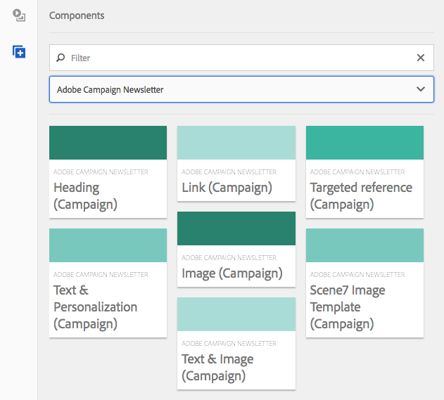

### Heading (Campaign) {#heading-campaign}

The heading component can either:

* Display the name of the current page by leaving the **Title** field blank.
* Display a text that you specify in the **Title** field.

You edit the **Heading (Campaign)** component directly. Leave empty to use the page title.

You can configure the following:

* **Title**
  If you want to use a name other than the page title, enter it here.

* **Heading level (1, 2, 3, 4)**
  The heading level based on the HTML heading sizes 1-4.

The following example shows a Heading (Campaign) component being displayed.

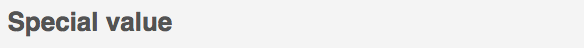

### Image (Campaign) {#image-campaign}

The image (campaign) component displays an image and accompanying text according to the specified parameters.

You can upload an image, then edit and manipulate it (for example, crop, rotate, add link/title/text).

You can either drag and drop an image from the [Asset Browser](/help/sites-authoring/author-environment-tools.md#assetsbrowsertouchoptimizedui) directly onto the component or its [Configure dialog](/help/sites-authoring/editing-content.md#editconfigurecopycutdeletepastetouchoptimizedui). You can also upload an image from the Configure dialog; this dialog also controls all definitions and manipulation of the image:

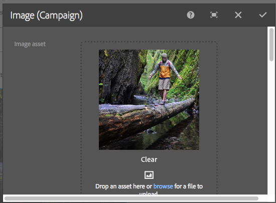

>[!NOTE]
>
>You must enter information in the **Alt Text** field, or the image cannot be saved.

After the image is uploaded (and not before) you can use [inplace editing](/help/sites-authoring/editing-content.md#editcontenttouchoptimizedui) to crop/rotate the image as required:

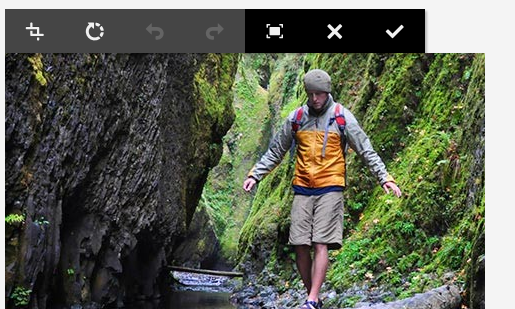

>[!NOTE]
>
>The in-place editor uses the original size and aspect ratio of the image when editing. You can also specify height and width properties. Any size and aspect ratio restrictions defined in the properties are applied when you save your edit changes.
>
>Depending on your instance, minimum and maximum restrictions may also be imposed by the [design of the page](/help/sites-developing/designer.md); these are developed during project implementation.

Several additional options are available in the full-screen editing mode; for example, map and zoom:

When an image is loaded, you can configure the following:

* **Map**
  To map an image, select Map. You can specify how you want to create the image map (rectangle, polygon, and so on) and where the area should point to.

* **Crop**
  Select Crop to crop an image. Use your mouse to crop the image.

* **Rotate**
  To rotate an image, select Rotate. Use repeatedly until the image is rotated the way you want it.

* **Clear**
  Remove the current image.

* Zoom bar (classic only)
  To zoom in and out of the image, use the slide bar beneath the image (above the OK and Cancel buttons)
* **Title**
  The title of the image.

* **Alt Text**
  An alternative text for use when creating accessible content.

* **Link To**
  Create a link to assets or other pages within your website.

* **Description**
  A description of the image.

* **Size**
  Sets the height and the width of the image.

>[!NOTE]
>
>You must enter information in the **Alt Text** field in the **Advanced** tab, or the image cannot save and you see the following error message:
>
>`Validation failed. Verify the values of the marked fields.`
>

The following example shows an Image (Campaign) component being displayed.

### Link (Campaign) {#link-campaign}

The Link (Campaign) component lets you add a link to your newsletter.

You can configure the following in the **Display**, **URL Info**, or **Advanced** tabs:

* **Link Caption**
  The caption for the link. This is the text that users see.

* **Link ToolTip**
  Adds additional information on how to use the link.

* **LinkType**
  In the drop-down list, select between a **Custom URL** and an **Adaptive Document**. This field is required. If you select Custom URL, you can provide the Link URL. If you select Adaptive Document, you can provide the document path.

* **Additional URL Parameter**
  Add any additional URL parameters. Click Add Item to add multiple items.

>[!NOTE]
>
>You must enter information in the **Link Type** field in the **URL Info** tab, or the component cannot save and you see the following error message:
>
>`Validation failed. Verify the values of the marked fields.`
>

The following example shows a Link (Campaign) component being displayed.

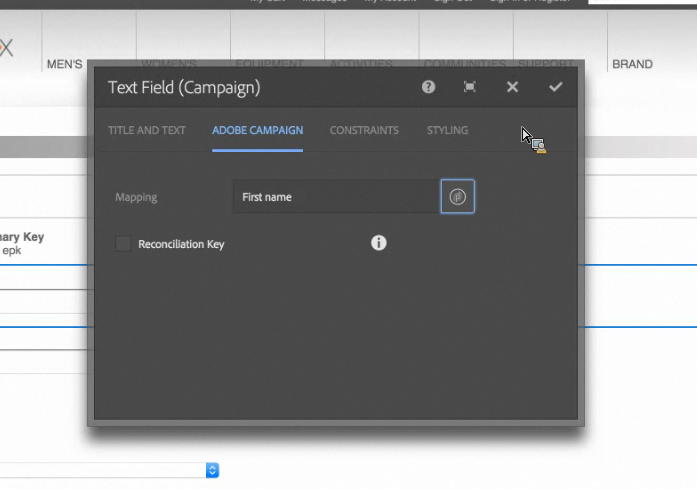

### Dynamic Media Classic (Scene7) Image Template (Campaign) {#scene-image-template-campaign}

Dynamic Media Classic (Scene7) Image Templates are layered are layered image files, where content and properties can be parameterized for variability. The **[!UICONTROL Image template]** component lets you use Scene7 templates within newsletters and change the values of template parameters. In addition, you can use Adobe Campaign metadata variables inside the parameters, so that each user experiences the image in a personalized way.

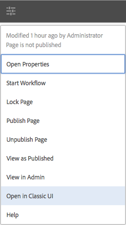

Click **Edit** to configure the component. You can configure the settings described in this section. This Scene7 Image template is described in detail in [Scene7 Image Template component](/help/assets/scene7.md#image-template).

In addition, the parameter panel lists all template parameters that have been defined for the template in Scene7. For each of these parameters, you can adapt the value, insert variables, or reset them to their default value.

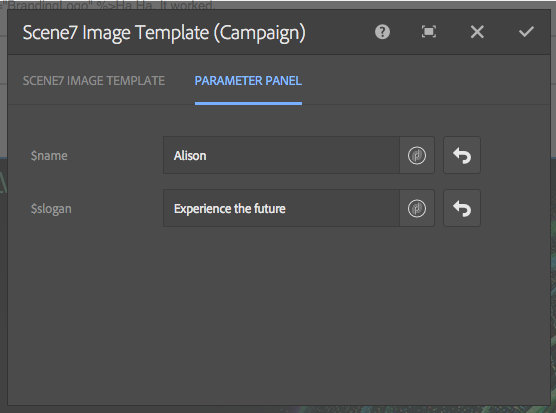

### Targeted reference (Campaign) {#targeted-reference-campaign}

The Targeted Reference (Campaign) component lets you create a reference to a targeted paragraph.

In this component, you navigate to the targeted paragraph to select it.

Click the folder icon to navigate to the paragraph that you want to reference. When finished, click the check mark.

### Text & Image (Campaign) {#text-image-campaign}

The Text & Image (Campaign) component adds a text block and an image.

When you click to configure the component, you select Text or Image.

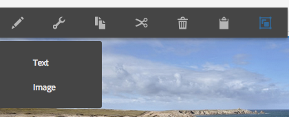

Selecting **Text** displays an in-line editor:

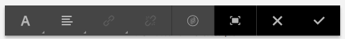

Selecting **Image** displays the in-place editor for images:

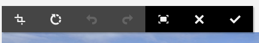

See [Image (Campaign) component](#image-campaign) for more information on working with images. See [Text & Personalization (Campaign) component](#text-personalization-campaign) for more information on working with text.

As with the Text & Personalization (Campaign) and Image (Campaign) components, you can configure:

* **Text**
  Enter text. Use the toolbar to modify formatting, create lists, and add links.

* **Image**
  Drag an image from the content finder, or click to browse to an image. Crop or rotate as required.

* **Image Properties** (**Advanced Image Properties**)
  Allows you to specify the following:

    * **Title**
      The title for the block; will be shown by mouseover.

    * **Alt Text**
      Alternative text to be shown if the image cannot be displayed.

    * **Link to**
      Create a link to assets or other pages within your website.

    * **Description**
      A description of the image.

    * **Size**
      Sets the height and width of the image.

>[!NOTE]
>
>The **Alt Text** field in the **Advanced** tab is required or the component cannot save and you see the following error message:
>
>`Validation failed. Verify the values of the marked fields.`
>

The following example shows a Text & Image (Campaign) component being displayed.

### Text & Personalization (Campaign) {#text-personalization-campaign}

The Text & Personalization (Campaign) component lets you enter a text block using a WYSIWYG editor, with functionality provided by the [Rich Text editor](/help/sites-authoring/rich-text-editor.md). In addition, this component lets you use context fields and personalization blocks available from Adobe Campaign; also see [Inserting Personalization](/help/sites-authoring/campaign.md#inserting-personalization).

The selection of icons allow you to format your text, including font characteristics, alignment, links, lists and indentation. The functionality is basically the same in [both UIs](/help/sites-authoring/editing-content.md), although the look-and-feel is different:

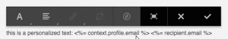

In the inplace editor you can add text, change the justification, add and remove links, add context fields or personalization blocks, and enter full-screen mode. When finished adding text/personalization, select the check mark to save your changes (or x to cancel). See [Inplace editing](/help/sites-authoring/editing-content.md#editcontenttouchoptimizedui) for more information.

>[!NOTE]
>
>* What personalization fields are available depends on what Adobe Campaign template your newsletter is linked to.
>* After you select a persona from ContextHub, the personalization fields are automatically replaced by data from the selected profile.
>
>See [Inserting Personalization](/help/sites-authoring/campaign.md#inserting-personalization).

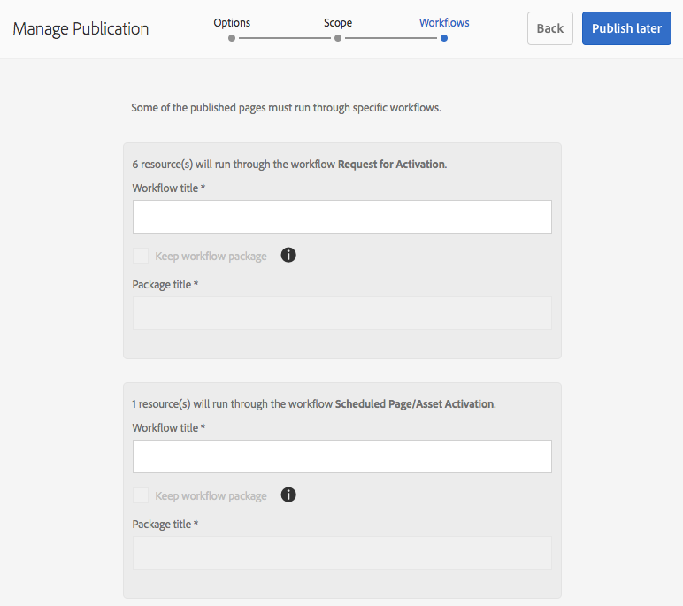

>[!NOTE]
>
>Only the fields defined in the **nms:seedMember** schema or one of its extensions are taken into account. The attributes of the tables linked to **nms:seedMember** are not available.

## Adobe Campaign Form Components {#adobe-campaign-form-components}

You use Adobe Campaign components to create a form that users fill out to either subscribe to a newsletter, unsubscribe from a newsletter, or update their user profiles. See [Creating Adobe Campaign Forms](/help/sites-authoring/adobe-campaign-forms.md) for more information.

Each component field can be linked to an Adobe Campaign database field. The available fields differ according to the type of data they contain as described in the section [Components and Data Type](#components-and-data-type). If you extend your recipient schema in Adobe Campaign, the new fields will be available in the components whose data types match.

When you open a form that is configured to integrate with Adobe Campaign, you see the following components in the **Adobe Campaign** section:

* Checkbox (Campaign)
* Date Field (Campaign) and Date Field/HTML5 (Campaign)
* Encrypted Primary Key (Campaign)
* Error Display (Campaign)
* Hidden Reconciliation Key (Campaign)
* Numeric Field (Campaign)
* Option Field (Campaign)
* Subscriptions Checklist (Campaign)
* Text Field (Campaign)

The components appear as follows:

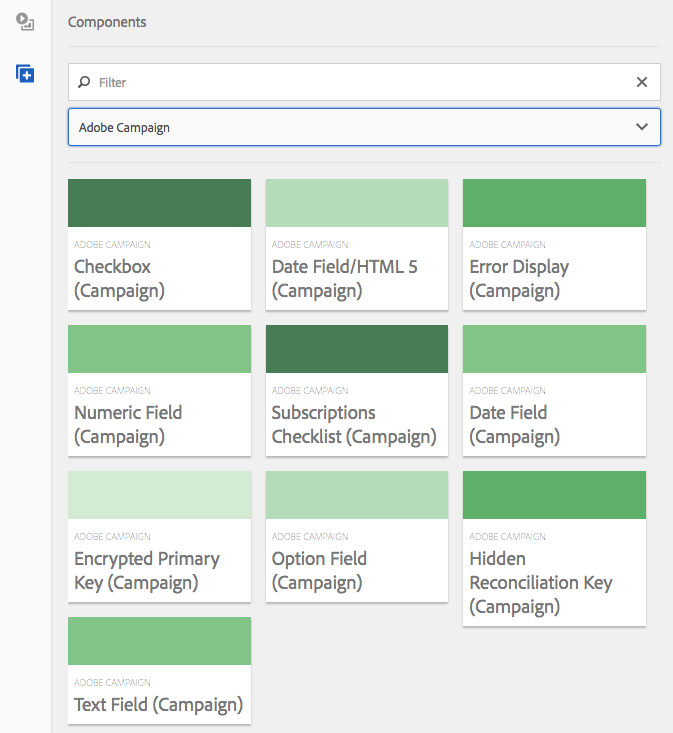

This section describes each component in detail.

### Components and Data Type {#components-and-data-type}

The following table describes the components that are available to display and modify Adobe Campaign profile data. Each component can be mapped to an Adobe Campaign profile field to display its value and update the field when the form is submitted. The different components can only be matched to fields of an appropriate data type.

<table>
 <tbody>
  <tr>
   <td>
<strong>Component</strong>
 </td>
   <td>
<strong>Data type of Adobe Campaign field</strong>
 </td>
   <td>
<strong>Example field</strong>
 </td>
  </tr>
  <tr>
   <td>
Checkbox (Campaign)
 </td>
   <td>
boolean
 </td>
   <td>
No longer contact (by any channel)
 </td>
  </tr>
  <tr>
   <td>
Date Field (Campaign)
 
Date Field/HTML 5 (Campaign)
 </td>
   <td>
date
 </td>
   <td>
Birth date
 </td>
  </tr>
  <tr>
   <td>
Numeric Field (Campaign)
 </td>
   <td>
numeric (byte, short, long, double)
 </td>
   <td>
Age
 </td>
  </tr>
  <tr>
   <td>
Option Field (Campaign)
 </td>
   <td>
byte with associated values
 </td>
   <td>
Gender
 </td>
  </tr>
  <tr>
   <td>
Text Field (Campaign)
 </td>
   <td>
string
 </td>
   <td>
Email
 </td>
  </tr>
 </tbody>
</table>

### Settings Common to Most Components {#settings-common-to-most-components}

The Adobe Campaign components have settings that are common in all of the components (except Encrypted Primary Key and Hidden Reconcilation Key components).

In most components, you can configure the following:

#### Title and Text {#title-and-text}

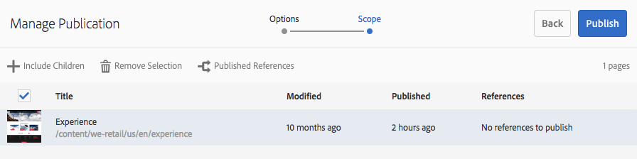

* **Title**
  If you want to use a name other than the element name, enter it here.

* **Hide Title**
  Select this check box if you do not want the title visble.

* **Description**
  Add a description to the field to provide more information for users.

* **Only show value**
  Only shows the value, if there is one

#### Adobe Campaign {#adobe-campaign}

You can configure the following:

* **Mapping**
  Select an Adobe Campaign personalization field, if appropriate.

* **Reconciliation Key**
  Select this check box if this field is part of the reconciliation key.

#### Constraints {#constraints}

* **Required** Select this check box to make this component required; that is, users must enter a value.
* **Required Message** Optionally, add a message stating that the field is required.

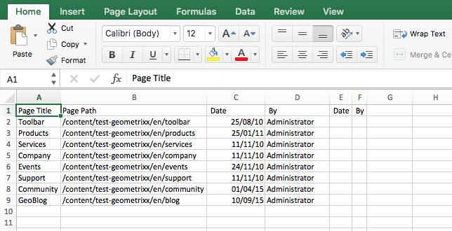

#### Styling {#styling}

* **CSS**
  Enter the CSS classes you want to use for this component.

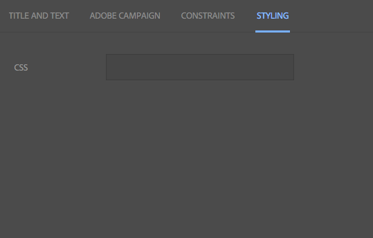

### Checkbox (Campaign) {#checkbox-campaign}

The Checkbox (Campaign) component lets the user modify Adobe Campaign profile fields that are of boolean data type. For example, you could have a Checkbox (Campaign) component that lets the recipient specify that he or she does not want to be contacted via any channel.

You can [configure settings common to most Adobe Campaign components](#settings-common-to-most-components) in the Checkbox (Campaign) component.

The following example shows a Checkbox (Campaign) component being displayed.

### Date Field (Campaign) and Date Field/HTML 5 (Campaign) {#date-field-campaign-and-date-field-html-campaign}

Use the date field to allow recipients to a date; for example you may want the recipients to specify their birth dates. The date format matches the format used in your Adobe Campaign instance.

In addition to [settings common to most Adobe Campaign components](#settings-common-to-most-components), you can configure the following:

* **Constraints - Constraint** drop-down
  You can select - **None** or **Date -** to add the constraint of a date or no constraint. If you select date, the answer users enter into the field must be in a date format.

* **Constraint Message** In addition, you can add a constraint message so users know how to properly format their answers.
* **Styling - Width** Adjust the width of the field by clicking or tapping the **+** and **-** icons or entering a number.

The following example shows a Date Field (Campaign) component with the width adjusted being displayed.

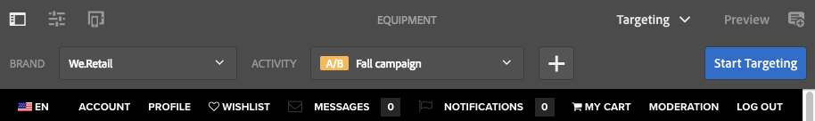

### Encrypted Primary Key (Campaign) {#encrypted-primary-key-campaign}

This component defines the name of the URL parameter that will contain the identifier of an Adobe Campaign profile (**Main Resource Identifier** or **Encrypted primary key** in Adobe Campaign Standard and 6.1, respectively).

Each form displaying and modifying Adobe Campaign profile data **must** include an Encrypted Primary Key component.

You can configure the following in the Encrypted Primary Key (Campaign) component:

* **Title and Text - Element Name** Defaults to encryptedPK. You only need to change the element name when it conflicts with the name of another element on the form. No two form fields can have the same element name.
* **Adobe Campaign - URL parameter** Add the URL parameter for the EPK. For example, you can use the value **epk**.

The following example shows an Encrypted Primary Key (Campaign) component being displayed.

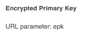

### Error Display (Campaign) {#error-display-campaign}

This component lets you display backend errors. The form's error handling needs to be set to Forward to make the component work properly.

The following example shows an Error Display (Campaign) component being displayed.

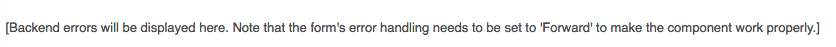

### Hidden Reconciliation Key (Campaign) {#hidden-reconciliation-key-campaign}

The Hidden Reconciliation Key (Campaign) component allows you to add hidden fields as part of the reconciliation key to a form.

You can configure the following in the Hidden Reconciliation Key (Campaign) component:

* **Title and Text - Element Name** Defaults to reconcilKey. You only need to change the element name when it conflicts with the name of another element on the form. No two form fields can have the same element name.
* **Adobe Campaign - Mapping** Map to an Adobe Campaign personalization field.

The following example shows an Hidden Reconciliation Key (Campaign) component being displayed.

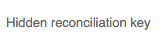

### Numeric Field (Campaign) {#numeric-field-campaign}

Use the numeric field to allow recipients to enter numbers, for example their age.

In addition to [settings common to most Adobe Campaign components](#settings-common-to-most-components), you can configure the following:

* **Constraints - Constraint** drop-down
  You can select - **None** or **Numeric -** to add the constraint of either a number or no constraint. If you select number, the answer users enter into the field must be numeric.

* **Constraint Message** In addition, you can add a constraint message so users know how to properly format their answers.
* **Styling - Width** Adjust the width of the field by clicking or tapping the **+** and **-** icons or entering a number.

The following example shows a Numeric Field (Campaign) component with the width configured being displayed.

### Option Field (Campaign) {#option-field-campaign}

This drop-down list lets you select an option; for example, the gender or status of a recipient.

You can [configure settings common to most Adobe Campaign components](#settings-common-to-most-components) in the Option Field (Campaign) component. To populate the drop-down list, select the appropriate field in the Adobe Campaign personalization fields by clicking or tapping the Adobe Campaign symbol and navigating to the field.

The following example shows an Option Field (Campaign) component being displayed.

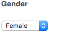

### Subscriptions Checklist (Campaign) {#subscriptions-checklist-campaign}

Use the **Subscriptions Checklist (Campaign)** component to modify the subscriptions associated with an Adobe Campaign profile.

When added to a form, this component displays all available subscriptions as check boxes and lets the user select the desired subscriptions. When users submit the form, this component subscribes the user to or unsubscribes the user from the selected services depending on the form action type (**Adobe Campaign: Subscribe to Services** or **Adobe Campaign: Unsubscribe from Services**).

>[!NOTE]
>
>The component does not check what services the user is already subscribed to/unsubscribed from.

You can [configure settings common to most Adobe Campaign components](#settings-common-to-most-components) in the Subscriptions Checklist (Campaign) component. (There are no Adobe Campaign configurations available for this component.)

The following example shows a Subscriptions Checklist (Campaign) component being displayed.

### Text Field (Campaign) {#text-field-campaign}

The Text Field (Campaign) component that lets you enter string type data, such as a first name, last name, address, email address, and so on.

In addition to [settings common to most Adobe Campaign components](#settings-common-to-most-components), you can configure the following:

* **Constraints - Constraint** drop-down
  You can select - **None,** **Email**, or **Name** (no umlauts) - to add the constraint of either an email address, name, or no constraint. If you select email, the answer users enter into the field must be an email address. If you select name, it must be a name (umlauts are not allowed).

* **Constraint Message** In addition, you can add a constraint message so users know how to properly format their answers.
* **Styling - Width** Adjust the width of the field by clicking or tapping the **+** and **-** icons or entering a number.

The following example shows a Text Field (Campaign) component being displayed.

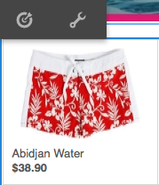
