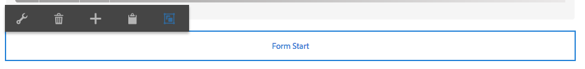

# Creating Adobe Campaign Forms in AEM {#creating-adobe-campaign-forms-in-aem}

AEM lets you create and use forms that interact with Adobe Campaign on your website. Specific fields can be inserted into your forms and mapped to the Adobe Campaign database.

You can manage new contact subscriptions, unsubscriptions, and user profile data, all while integrating their data into your Adobe Campaign database.

To use Adobe Campaign forms in AEM, you need to follow these steps, described in this document:

1. Make a template available.
1. Create a form.
1. Edit form content.

Three types of forms, specific to Adobe Campaign, are available by default:

* Save a profile
* Subscribe to a service
* Unsubscribe from a service

These forms define a URL parameter that accepts the encrypted primary key of an Adobe Campaign profile. Based on this URL parameter, the form updates the data of the associated Adobe Campaign profile.

Although you create these forms independently, in a typical use case, you generate a personalized link to a form page inside the newsletter content, so that recipients can open the link and make adjustments to their profile data (whether unsubscribing, subscribing, or updating their profile).

The form automatically updates based on the user. See [Editing Form Content](#editing-form-content) for more information.

## Making a Template Available {#making-a-template-available}

Before being able to create forms that are specific to Adobe Campaign, you must make the different templates available in your AEM application.

To do this, see the [Templates documentation](/help/sites-developing/templates.md#template-availability).

## Creating a Form {#creating-a-form}

First of all, check the connection between the author and publish instances and Adobe Campaign is working. See [Integrating with Adobe Campaign Standard](/help/sites-administering/campaignstandard.md) or [Integrating with Adobe Campaign Classic](/help/sites-administering/campaignonpremise.md).

>[!NOTE]
>
>Make sure the **acMapping** property on the page's **jcr:content** node is set to **mapRecipient** or **profile** when using Adobe Campaign Classic or Adobe Campaign Standard, respectively
>

1. In AEM, in Sites, navigate to where you want to create a new page.
1. Create a page and select **Adobe Campaign Classic Profile **or** Adobe Campaign Standard Profile** and click **Next**.

   

   >[!NOTE]
   >
   >If the desired template is not available, see [Template Availability](/help/sites-developing/templates.md#template-availability).

1. In the **Name** field, add the name of the page. It must be a valid JCR name.
1. In the **Title** field, enter a title and click **Create**.
1. Open the page and select **Open Properties** and in Cloud Services add the Adobe Campaign configuration and select the checkmark to save your changes.

   

1. On the page, in the **Form Start** component, select the type of form it is - **Subscribe, Unsubscribe, **or** Save Profile**. You can only have one type per form. You can now [edit the form's content](#editing-form-content).

## Editing Form Content {#editing-form-content}

Forms dedicated to Adobe Campaign have specific components. These components have an option to allow you to link each field of the form to a field in the Adobe Campaign database.

>[!NOTE]
>
>If the desired template is not available, see [Making a template available](/help/sites-authoring/adobe-campaign.md).

This section only details specific links to Adobe Campaign. For more information on a more general overview of how to use forms in Adobe Experience Manager, see [Editmode components](/help/sites-authoring/default-components-foundation.md).

1. Select **Open Properties** and in Cloud Services add the Adobe Campaign configuration and select the checkmark to save your changes.

   

1. On the page, in the **Form Start** component, click the Configuration icon.

   

1. Click the **Advanced** tab and select the type of form it is - **Subscribe, Unsubscribe,** or **Save Profile** and click **OK.** You can only have one type per form.

    * **Adobe Campaign: Save profile**: lets you create or update a recipient in Adobe Campaign (default value).
    * **Adobe Campaign: Subscribe to Services**: lets you manage the subscriptions of a recipient in Adobe Campaign.
    * **Adobe Campaign: Unsubscribe from Services**: lets you cancel the subscriptions of a recipient in Adobe Campaign.

1. You must have an **Encrypted Primary Key** component on each form. This component defines which URL parameter will be used to accept the encrypted primary key of an Adobe Campaign profile. In Components, select Adobe Campaign so only those componente are visible.
1. Drag the component **Encrypted Primary Key** to the form (anywhere) and click or tap the **Configuration** icon. In the **Adobe Campaign** tab, specify any name for the URL parameter. Click or tap the check mark to save your changes.

   Generated links to this form need to use this URL parameter and assign it the encrypted primary key of an Adobe Campaign profile. The encrypted primary key must be properly URL (percent) encoded.

   

1. Add components to the form as needed, such as a Text field, Date field, Checkbox field, Option field, and so on. See [Adobe Campaign Form Components](/help/sites-authoring/adobe-campaign-components.md) for more information on each component.
1. Click the Configuration icon to open the component. For example, in **Text Field (Campaign)** component, change the title and text.

   Click **Adobe Campaign** to map the form field to an Adobe Campaign metadata variable. When you submit the form, the mapped field is updated in Adobe Campaign. Only fields with matching types are available in the variable picker (for example, string variables for text fields).

   

   >[!NOTE]
   >
   >You can add/remove fields that are displayed in the recipient table by following the instructions here: [https://blogs.adobe.com/experiencedelivers/experience-management/aem-campaign-integration/](https://blogs.adobe.com/experiencedelivers/experience-management/aem-campaign-integration/)

1. Click **Publish Page**. The page is activated on your site. You can view it by going to your AEM publication instance. You can also [test a form](#testing-a-form).

   >[!CAUTION]
   >
   >You need to provide read permisssions to the anonymous user on the cloud service to use forms on publish. However, be aware of the potential security issues with providing read permissions to the anonymous user and be sure to mitigate it by, for example, configuring the dispatcher.

## Testing a Form {#testing-a-form}

After you create a form and edit form content, you may want to manually test that the form is working as expected.

>[!NOTE]
>
>You must have an **Encryted Primary Key** component on each form. In Components, select Adobe Campaign so only those componente are visible.
>
>Although in this procedure you enter the epk number manually, in practice, users would get a link to this page (whether to unsubscribe, subscribe, or update your profile) within a newsletter. Based on the user, the epk automatically updates.
>
>To create that link, you use the variable **Main resource identifier**(Adobe Campaign Standard) or **Encrypted identifier** (Adobe Campaign Classic) (for example, in a **Text & Personalization (Campaign)** component), which links to the epk in Adobe Campaign.

To do this, you need to manually get the EPK of an Adobe Campaign profile and then append it to the URL:

1. To get the encrypted primarly key (EPK) of an Adobe Campaign profile:

    * In Adobe Campaign Standard - Navigate to **Profiles and Audiences** &gt; **Profiles**, which lists the existing profiles. Make sure the table displays the **Main Resource Identifier** field in a column (This can be configured by clicking/tapping **Configure list**). Copy the main resource identifier of the desired profile.
    * In Adobe Campaign Classic, go to **Profiles and Targets** &gt;  **Recipients**, which lists the existing profiles. Make sure the table displays the **Encrypted identifier** field in a column (This can be configured by right-clicking on an entry and selecting **Configure list...**). Copy the encrypted identifier of the desired profile.

1. In AEM, open the form page on the publish instance and append the EPK from step 1 as a URL parameter: use the same name that you previously defined in the EPK component when authoring the form (for example: `?epk=...`)
1. The form can now be used to modify the data and subscriptions associated to the linked Adobe Campaign profile. After you modify some fields and submit the form, you can verify inside Adobe Campaign that the appropriate data has been updated.

The data in the Adobe Campaign database is updated once a form is validated.
