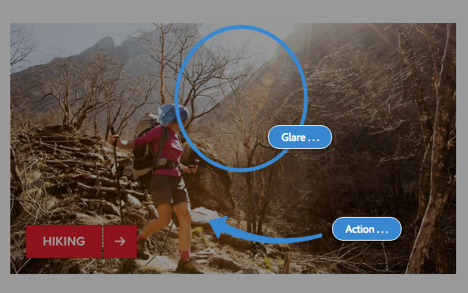

# Annotations when Editing a Page{#annotations-when-editing-a-page}

Adding content to the pages of your website is often subject to discussions prior to it actually being published. To aid this, many components directly related to content (as opposed, for example, to layout) allow you to add an annotation.

An annotation places a colored marker/sticky-note on the page. The annotation allows you (or other users) to leave comments and/or questions for other authors/reviewers.

>[!NOTE]
>
>The definition of an individual component type determines whether adding an annotation is possible (or not) on instances of that component.

>[!NOTE]
>
>Annotations created in the Classic UI will be shown in the touch-enabled UI. However sketches are UI-specific and they are only shown in the UI in which they were created.

>[!CAUTION]
>
>Deleting a resource (e.g. paragraph) deletes all the annotations and sketches attached to that resource irrespective of their position on the page as a whole.

>[!NOTE]
>
>Depending on your requirements you can also develop a workflow to send notifications when annotations are added, updated, or deleted.

## Annotations {#annotations}

A special [mode](/help/sites-authoring/author-environment-tools.md#page-modes) is used for creating and viewing annotations.

>[!NOTE]
>
>Don't forget that [comments](/help/sites-authoring/basic-handling.md#timeline) are also available for providing feedback on a page.

>[!NOTE]
>
>You can annotate a variety of resources:
>
>* [Annotating assets](/help/assets/manage-assets.md#annotating)
>* [Annotating video assets](/help/assets/managing-video-assets.md#annotate-video-assets)
>

### Annotating a Component {#annotating-a-component}

The Annotate mode allows you to create, edit, move or delete annotations on your content:

1. You can enter Annotate mode using the icon in the toolbar (top right) when editing a page:

   

   You can now view any existing annotations.

   >[!NOTE]
   >
   >To exit Annotation mode tap/click the Annotate icon (x symbol) at the right of the top toolbar.

1. Click/tap the Add Annotation icon (plus symbol at the left of the toolbar) to start adding annotations.

   >[!NOTE]
   >
   >To stop adding annotations (and return to viewing) tap/click the Cancel icon (x symbol in a white circle) at the left of the top toolbar.

1. Click/tap the required component (components that can be annotated will be highlighted with a blue border) to add the annotation and open the dialog:

   

   Here you can use the appropriate field and/or icon to:

    * Enter the annotation text.
    * Create a sketch (lines and shapes) to highlight an area of the component.

      The cursor will change to a crosswire when you are creating a sketch. You can draw multiple distinct lines. The sketch line reflects the annotation color and can be either an arrow, circle, or oval.

   

    * Choose/change the color:

   

    * Delete the annotation.

   

1. You can close the annotation dialog by clicking/tapping outside the dialog. A truncated view (the first word) of the annotation, together with any sketches, is shown:

   

1. After you have finished editing a specific annotation, you can:

    * Click/tap the text marker to open the annotation. Once open you can view the full text, make changes or delete the annotation.

        * Sketches cannot be deleted independently of the annotation.

    * Reposition the text marker.
    * Click/tap on a sketch line to select that sketch and drag it to the desired position.
    * Move, or copy, a component

        * Any related annotations and their sketches will also be moved or copied and their position in relation to the paragraph will remain the same.

1. To exit Annotation mode, and return to the mode previously used, tap/click the Annotate icon (x symbol) at the right of the top toolbar.

>[!NOTE]
>
>Annotations can not be added to a page that has been locked by another user.

### Annotation Indicator {#annotation-indicator}

Annotations do not appear in Edit mode, but the badge at the top right of the toolbar shows how many annotations exist for the current page. The badge replaces the default Annotations icon, but still functions as a quick link that toggles to/from the Annotate mode:

