# Authoring - the Environment and Tools{#authoring-the-environment-and-tools}

The authoring environment of AEM provides various mechanisms for organizing and editing your content. The tools provided are accessed from the various consoles and page editors.

## Managing your Site {#managing-your-site}

The **Sites** console allows you to navigate and manage your website, using the header bar, toolbar, action icons (applicable for the selected resource), breadcrumbs and when selected, secondary rails (for example, timeline and references).

For example, column view:

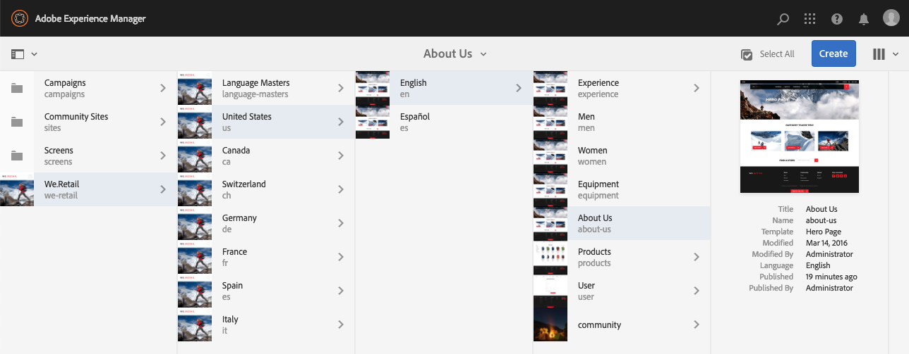

## Editing Page Content {#editing-page-content}

You can edit a page with the page editor. For example:

`https://localhost:4502/editor.html/content/we-retail/us/en/equipment.html`

>[!NOTE]
>
>The first time you open a page for editing, a series of slides will provide you with a tour of the features.
>
>You can skip the tour if wanted and repeat it at any time by selecting from the **Page Information** menu.

## Accessing Help {#accessing-help}

When editing a page, **Help** can be accessed from:

* the [**Page Information**](/help/sites-authoring/editing-page-properties.md#page-properties) selector; this will show the introductory slides (as shown the first time you access the editor).
* the [configuration](/help/sites-authoring/editing-content.md#edit-configure-copy-cut-delete-paste) dialog for specific components (using the ? icon in the dialog toolbar); this will show context sensitive help.

Further [help-related resources are available from consoles](/help/sites-authoring/basic-handling.md#accessing-help).

## Components Browser {#components-browser}

The components browser shows all components that are available for use on your current page. These can be dragged to the appropriate location, then edited to add your content.

The components browser is a tab within the side panel (together with the [assets browser](/help/sites-authoring/author-environment-tools.md#assets-browser) and [content tree](/help/sites-authoring/author-environment-tools.md#content-tree)). To open (or close) the side panel use the icon at the top left of the toolbar:

When you open the side panel it will slide open from the left side (select the **Components** tab if necessary). When open you can browse through all the components available for your page.

The actual appearance and handling is dependent on the device type you are using:

>[!NOTE]
>
>A mobile device is detected when the width is less than 1024px. This can also be the case for a small desktop window.

* **Mobile device (e.g. iPad)**

  The component browser completely covers the page being edited.

  To add a component to your page touch-and-hold the required component and move it towards the right - the component browser will close to show the page again - where you can position the component.

  

* **Desktop device**

  The component browser is opened at the left side of the window.

  To add a component to your page click on the required component and drag it to the required location.

  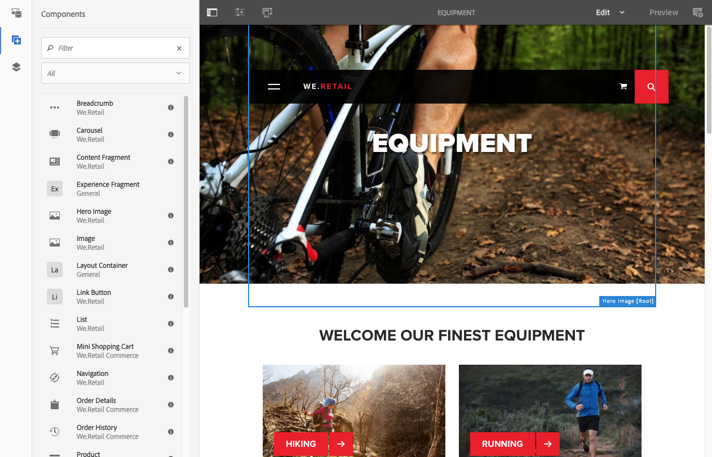

  Components are represented by

    * Component name
    * Component group (in grey)
    * Icon or abbreviation

        * Standard components' icons are monochrome.
        * Abbreviations are always the first two charaters of the component name.

  From the top toolbar in the **Components** browser you can:

    * Filter components by name.
    * Limit the display to a specific group using the drop down selection.

  For a more detailed description of the component, you can click or tap the information icon next to the component in the **Components** browser (if available). For example, for the **Layout Container**:

  

  For even more information about the components available to you see the [Component Console](/help/sites-authoring/default-components-console.md).

## Assets Browser {#assets-browser}

The assets browser shows all [assets](/help/assets/home.md) that are available for direct use on your current page.

The assets browser is a tab within the side panel along with the [components browse](/help/sites-authoring/author-environment-tools.md#components-browser)r and [content tree](/help/sites-authoring/author-environment-tools.md#content-tree). To open or close the side panel use the icon at the top left of the toolbar:

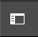

When you open the side panel it will slide open from the left side. Select the **Assets** tab if necessary.

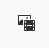

When the assets browser is open you can browse through all the assets available for your page. Infinite scrolling is used to expand the list when required.

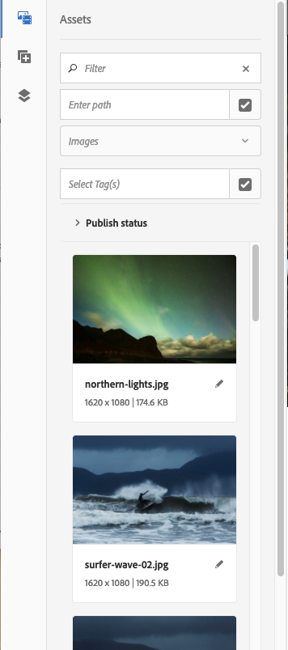

To add an asset to your page, select and drag to the required location. This can be:

* An existing component of the appropriate type.

    * For example, you can drag an asset of type image onto an Image component.

* A [placeholder](/help/sites-authoring/editing-content.md#component-placeholder) in the paragraph system to create a new component of the appropriate type.

    * For example, you can drag an asset of type image onto the paragraph system to create an Image component.

>[!NOTE]
>
>This is available for specific assets and component types. See [Inserting a Component using the Assets Browser](/help/sites-authoring/editing-content.md#inserting-a-component-using-the-assets-browser) for more details.

From the top toolbar of the assets browser you can filter the assets by:

* Name
* Path
* Asset type such as images, manuscripts, documents, videos, pages, paragraphs, and products
* Asset characteristics such as Orientation (Portrait, Landscape, Square) and Style (Color, Monochrome, Grayscale)

    * Available only for certain asset types

The actual appearance and handling is dependent on the device type you are using:

>[!NOTE]
>
>A mobile device is detected when the width is less than 1024px; i.e. also on a small desktop window.

* **Mobile device such as iPad**

  The assets browser completely covers the page being edited.

  To add an asset to your page touch-and-hold the required asset, then move it towards the right - the assets browser will close to show the page again, where you can add the asset to the required component.

  

* **Desktop device**

  The assets browser is opened at the left side of the window.

  To add an asset to your page click on the required asset and drag it to the required component or location.

  

If you need to quickly make a change to an asset, you can start the [asset editor](/help/assets/manage-assets.md) directly from the asset browser by clicking the edit icon shown next to the asset's name.

## Content Tree {#content-tree}

The **Content Tree** gives an overview of all of the components on the page in a hierarchy so you can see at a glance how the page is composed.

The Content Tree is a tab within the side panel (together with the components and assets browser). To open (or close) the side panel use the icon at the top left of the toolbar:

When you open the side panel it will slide open (from the left side). Select the **Content Tree** tab if necessary. When open you can see a tree view representation of your page or template, so that it's easier to understand how its content is structured hierarchically. Additionally on a complex page, it makes it easier to jump between components of the page.

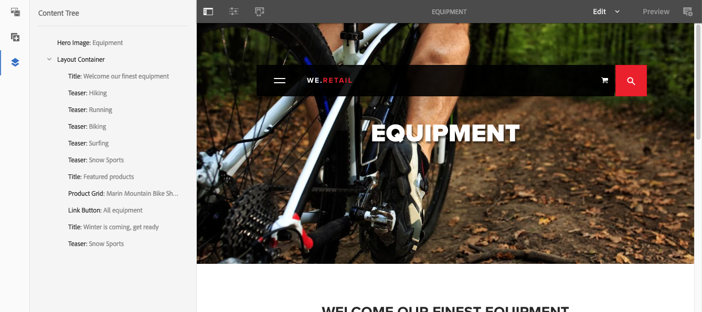

A page can easily be composed of many of the same type of components, so the content (component) tree displays descriptive text (in grey) after the name of the component type (in black). The descriptive text comes from common properties of the component such as title or text.

Component types will be shown in the user language, whereas the component description text comes from the page language.

Clicking the chevron next to a component will collapse or expand that level.

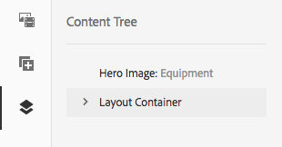

>[!NOTE]
>
>The Content Tree is not available if you are editing a page on a mobile device (if the browser width is less than 1024px).

Clicking on the component will highlight the component in the page editor. The actions available will depend on the page state:

* For example, a basic page:

  `https://localhost:4502/editor.html/content/we-retail/language-masters/en/equipment.html`

  

  If the component you click in the tree is editable a wrench icon will appear to the right of the name. Clicking on this icon will directly start the edit dialogue for the component.

  

* Or a page that is part of a [livecopy](/help/sites-administering/msm.md), where components are inherited from another page; for example:

  `https://localhost:4502/editor.html/content/we-retail/us/en/equipment.html`

  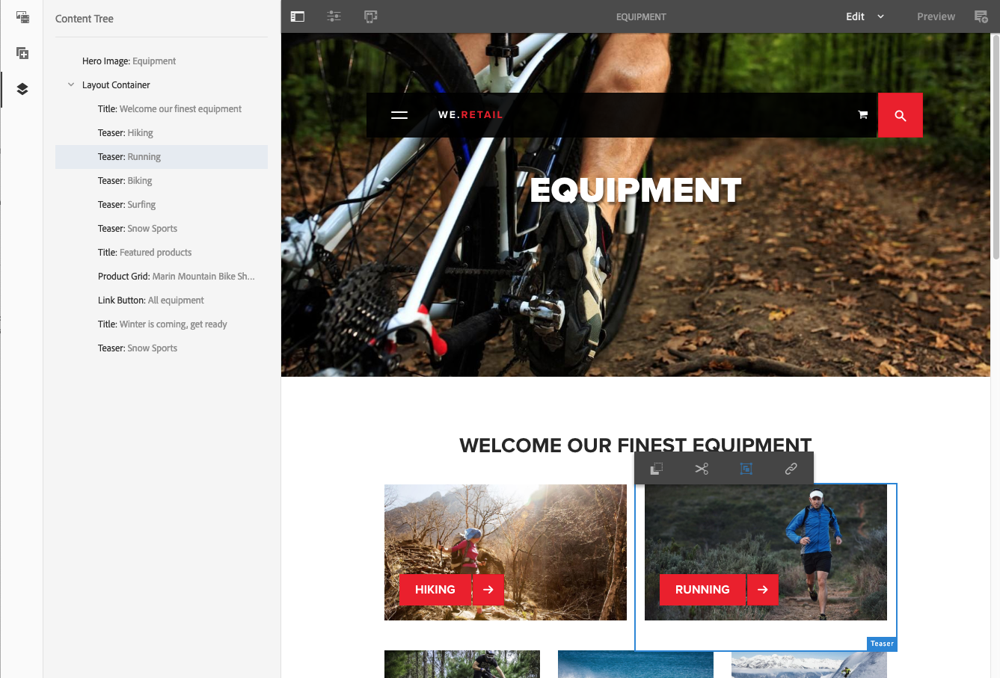

## Fragments - Associated Content Browser {#fragments-associated-content-browser}

If your page contains Content Fragments then you will also have access to the [browser for Associated Content](/help/sites-authoring/content-fragments.md#using-associated-content).

## References {#references}

**References** shows connections to the selected page:

* Blueprints
* Launches
* Live copies
* Language copies
* Incoming Links
* Use of the reference component: borrowed and lent content
* References to Product pages (from the Commerce - Products console)

Open the required console, then navigate to the required resource and open **References** using:

[Select your required resource](/help/sites-authoring/basic-handling.md#viewing-and-selecting-resources) to show a list of references types relevant to that resource:

Select the appropriate reference type for more information. In certain situations further actions are available when you select a specific reference, including:

* **Incoming Links**, provides a list of pages that reference the page, together with direct access to **Edit** one of those pages when you select a specific link

* Instances of borrowed and lent content using the **Reference** component, from here you can navigate to the referencing/referenced page

* [References to Product pages](/help/commerce/cif-classic/administering/generic.md#showing-product-references) (available from the Commerce-Products console)
* [Launches](/help/sites-authoring/launches.md), provides access to related launches
* [Live Copies](/help/sites-administering/msm.md) displays the paths of all live copies that are based on the selected resource.
* [Blueprint](/help/sites-administering/msm-best-practices.md), provides details and various actions
* [Languages Copies](/help/sites-administering/tc-manage.md#creating-translation-projects-using-the-references-panel), provides details and various actions

For example, you can fix a broken reference within a Reference component:

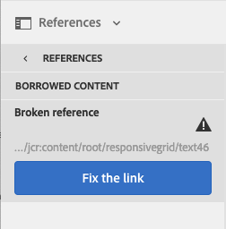

## Events - Timeline {#events-timeline}

For appropriate resources (e.g. pages from the **Sites** console, or assets from the **Assets** console) the [timeline can be used to show the recent activity on any selected items](/help/sites-authoring/basic-handling.md#timeline).

Open the required console, then navigate to the required resource and open **Timeline**, using:

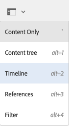

[Select your required resource](/help/sites-authoring/basic-handling.md#viewing-and-selecting-resources), then either **Show All** or **Activities** to list any recent actions on the selected resources:

## Page Information {#page-information}

The Page Information button (equalizer icon) opens a menu that also provides details about the last edit and the last publication. Depending on the characteristics of the page, its site, and your instance, more or fewer options might be available:

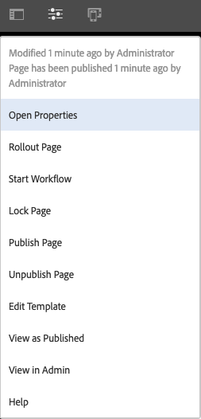

* [Open Properties](/help/sites-authoring/editing-page-properties.md)
* [Rollout Page](/help/sites-administering/msm.md#msm-from-the-ui)
* [Start Workflow](/help/sites-authoring/workflows-applying.md#starting-a-workflow-from-the-page-editor)
* [Lock Page](/help/sites-authoring/editing-content.md#locking-a-page)
* [Publish Page](/help/sites-authoring/publishing-pages.md#main-pars-title-10)
* [Unpublish Page](/help/sites-authoring/publishing-pages.md#main-pars-title-5)
* [Edit Template](/help/sites-authoring/templates.md); when the page is based on an [editable template](/help/sites-authoring/templates.md#editable-and-static-templates)

* [View as Published](/help/sites-authoring/editing-content.md#view-as-published)
* View in Admin; opens the page in the [sites console](/help/sites-authoring/basic-handling.md#viewing-and-selecting-resources)
* [Help](/help/sites-authoring/basic-handling.md#accessing-help)

For example, when appropriate, **Page Information** also has the options:

* [Promote Launch](/help/sites-authoring/launches-promoting.md) if the page is a launch.
* [Open in Classic UI](/help/sites-authoring/select-ui.md#switching-to-classic-ui-when-editing-a-page) if this options has been [enabled by an administrator](/help/sites-administering/enable-classic-ui-editor.md)

In addition, **Page Information** can provide access to analytics and recommendations, when appropriate.

## Page Modes {#page-modes}

There are various modes when editing a page allowing for different actions:

* [Edit](/help/sites-authoring/editing-content.md) - the mode to use when editing the page content.
* [Layout](/help/sites-authoring/responsive-layout.md) - allows you to create and edit your responsive layout dependent on device (if the page is based on a layout container)

* [Scaffolding](/help/sites-authoring/scaffolding.md) - help you to create a large set of pages that share the same structure but have differing content.
* [Developer](/help/sites-developing/developer-mode.md) - allows you to perform various actions (requires privileges). These include inspecting the technical details of a page and its components.

* [Design](/help/sites-authoring/default-components-designmode.md) - allows you to enable/disable components for use on a page and to configure the design of the component (if the page is based on a [static template](/help/sites-authoring/templates.md#editable-and-static-templates)).

* [Targeting](/help/sites-authoring/content-targeting-touch.md) - increase content relevance through targeting and measuring across all channels.
* [Activity Map](/help/sites-authoring/page-analytics-using.md#analyticsvisiblefromthepageeditor) - shows Analytics data for the page.

* [Timewarp](/help/sites-authoring/working-with-page-versions.md#timewarp) - allows you to view a pages state at a particular point in time.
* [Live Copy Status](/help/sites-authoring/editing-content.md#live-copy-status) - allows a quick overview of the live copy status and which components are/are not inherited.
* [Preview](/help/sites-authoring/editing-content.md#previewing-pages) - used to view the page as it will be shown on the publish environment; or to navigate using links in the content.

* [Annotate](/help/sites-authoring/annotations.md) - used to add or view annotations on the page.

You can access these using the icons in the top right corner. The actual icon will change to reflect the mode you are currently using:

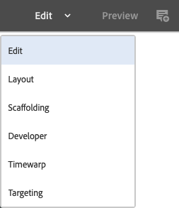

>[!NOTE]
>
>* Depending on the characteristics of the page, some modes my not be available.
>* Access to some modes require the appropriate permissions/privileges.
>* Developer mode is not available on mobile devices due to space restrictions.
>* There is a [keyboard shortcut](/help/sites-authoring/page-authoring-keyboard-shortcuts.md) ( `Ctrl-Shift-M`) to toggle between **Preview** and the currently selected mode (e.g. **Edit**, **Layout**, etc).
>

## Path Selection {#path-selection}

Often when authoring it is necessary to select another resource such as when defining a link to another page or resource or selecting an image. To easily select a path, [path fields](/help/sites-authoring/author-environment-tools.md#path-fields) offer auto-complete and the [path browser](/help/sites-authoring/author-environment-tools.md#path-browser) allows for more robust selection.

### Path Fields {#path-fields}

The example used here to illustrate is the image component. For more information about using and editing components see [Components for Page Authoring](/help/sites-authoring/default-components.md).

Path fields have auto-complete and look-ahead funtionality now to make locating a resource easier.

Clicking the **Open Selection Dialog** button in the path field opens the [path browser](/help/sites-authoring/author-environment-tools.md#path-browser) dialog to allow for more detailed selection options.

Alternatively you can start typing in the path field and AEM will offer matching paths as you type.

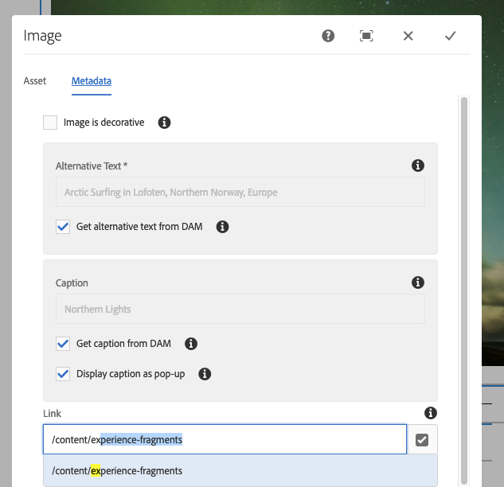

### Path Browser {#path-browser}

The path browser is organized like the [column view](/help/sites-authoring/basic-handling.md#column-view) of the sites console, allowing for more detailed selection of resources.

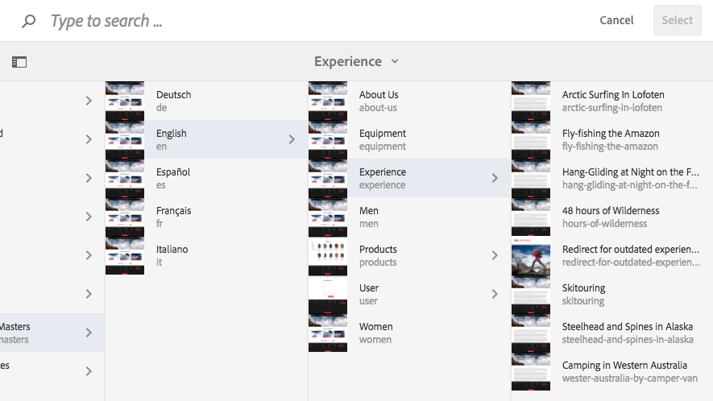

* Once a resource is selected, the **Select** button at the upper-right of the dialogue becomes active. Click or tap to confirm the selection or **Cancel** to abort.
* If the context allows for the selection of multiple resources, selecting a resource also activates the **Select** button, but also adds a count of the number of selected resources to the upper-right of the window. Click the **X** next to the number to deselect all.
* When you navigate through the tree, your location is reflected in the breadcrumbs at the top of the dialog. These breadcrumbs can also be used to quickly jump within the resource hierarchy.
* At any time you can use the search field at the top of the dialogue. Click the **X** in the search field to clear the search.
* To narrow your search, you can reveal the filter options and filter your results based on a certain path.

  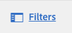

## Keyboard Shortcuts {#keyboard-shortcuts}

Various [keyboard shortcuts](/help/sites-authoring/page-authoring-keyboard-shortcuts.md) are available.
