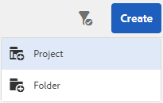

# Authoring{#authoring}

## Concept of Authoring (and Publishing) {#concept-of-authoring-and-publishing}

AEM provides you with two environments:

* Author
* Publish

These interact to enable you to make content available on your website - so that your visitors can read it.

The author environment provides the mechanisms for creating, updating, and reviewing this content before actually publishing it:

* An author creates and reviews the content (this can be of several types; for example, pages, assets, publications, and so on)
* which will, at some point, be published to your website.

On the author environment, the functionality of AEM is made available through two UIs. For the publish environment, you design the entire look-and-feel of the interface made available to your users.

### Author Environment {#author-environment}

The author works in what is known as the **author environment**. This provides an easy to use interface (graphical user interface (GUI or UI)) for creating the content. It is located behind a company's firewall that provides full protection and requires the author to log in, using an account that has been assigned the appropriate access rights.

>[!NOTE]
>
>Your account needs the appropriate access rights to create, edit, or publish content.

Depending on how your instance and your personal access rights are configured you can perform many tasks on your content, including (among others):

* generate new content, or edit existing content, on a page
* use predefined templates to create new content pages
* create, edit, and manage your assets and collections
* create, edit, and manage your publications
* develop your campaigns and the related resources
* develop and manage community sites
* move, copy, or delete content pages, assets, and so on
* publish (or unpublish) pages, assets, and so on

Also, there are administrative tasks that help you manage your content:

* workflows that control how changes are managed; for example, enforcing a review before publication
* projects that coordinate individual tasks

>[!NOTE]
>
>AEM is also [administered](/help/sites-administering/home.md) (for most tasks) from the author environment.

#### Publish Environment {#publish-environment}

When ready, the AEM site's content is published to the **publish environment**. Here the website's pages are made available to the intended audience in accordance with the look-and-feel of the designed interface.

Usually, the publish environment is located inside the demilitarized zone; in other words, available to the internet, but no longer under the full protection of the internal network.

When the AEM site is a [community site](/help/communities/overview.md), or includes [Communities components](/help/communities/author-communities.md), signed-in site visitors (members) may interact with Communities features. For example, they may post to a forum, post a comment, or follow other members. Members may be granted permission to perform activities normally limited to the author environment, such as create new pages (community groups), blog articles, and moderate other members' posts.

>[!NOTE]
>
>Unfortunately there is sometimes an overlap in the terminology used. This can happen with:
>
>* **Publish / Unpublish**
>  These are the primary terms for the actions that make your content publicly available on your publish environment (or not).
>
>* **Activate / Deactivate**
>  These terms are synonymous with publish/unpublish.
>
>* **Replicate / Replication**
>  These are the technical terms used to indicate the movement of data (for example, page content, files, code, user comments) from one environment to another; that is, when publishing, or reverse-replicating user comments.
>

#### Dispatcher {#dispatcher}

To optimize performance for visitors to your website, the **[Dispatcher](https://experienceleague.adobe.com/docs/experience-manager-dispatcher/using/dispatcher.html)** implements load balancing and caching.
