# Basic Handling{#basic-handling}

>[!NOTE]
>
>* This page is designed to give an overview of basic handling when using the AEM author environment. It uses the **Sites** console as a basis.
>
>* Some functionality is not available in all consoles and additional functionality may be available in some consoles. Specific information about the individual consoles and their related functionality will be covered in more detail on other pages.
>* Keyboard shortcuts are available throughout AEM. In particular when [using consoles](/help/sites-authoring/keyboard-shortcuts.md) and [editing pages](/help/sites-authoring/page-authoring-keyboard-shortcuts.md).
>

## Getting Started {#getting-started}

### A Touch-Enabled UI {#a-touch-enabled-ui}

AEM's user interface has been enabled for touch. A touch-enabled interface allows you to use touch to interact with the software through gestures such as tap, touch-and-hold, and swipe. This is in contrast to how a traditional desktop interface operates with mouse actions such as click, double-click, right-click, and mouseover.

As the AEM UI is touch-enabled, you can use the touch gestures on your touch devices (for example, mobile or tablet) and the mouse actions on a traditional desktop device.

### First Steps {#first-steps}

Immediately after logging in you arrive on the [Navigation panel](#navigation-panel). Selecting one of the options opens the respective console.

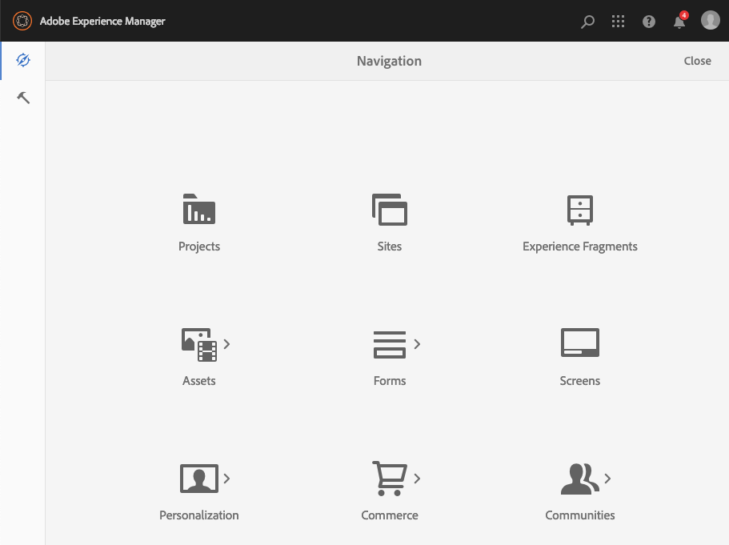

>[!NOTE]
>
>To get a good understanding of the basic use of AEM, this document is based on the **Sites** console.
>
>Click or tap on **Sites** to get started.

### Product Navigation {#product-navigation}

Whenever a user first accesses a console, a product navigation tutorial is started. Take a minute to click or tap through to get a good overview of the basic handling of AEM.

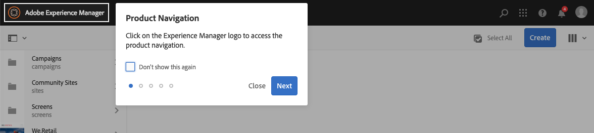

Click or tap **Next** to advance to the next page of the overview. Click or tap **Close** or click or tap outside of the overview dialog to close.

The overview will restart the next time you access a console unless you either view all slides, or check the option **Don't show this again**.

## Global Navigation {#global-navigation}

You can navigate between the consoles using the global navigation panel. This is triggered as a full-screen drop down when you click or tap the Adobe Experience Manager link at the top-left of the screen.

You can close the global navigation panel by clicking or tapping **Close** to return to your previous location.

>[!NOTE]
>
>When you first login you presented with the **Navigation** panel.

Global navigation has two panels, represented by icons at the left-margin of the screen:

* **[Navigation](/help/sites-authoring/basic-handling.md#navigation-panel)** - Represented by a compass
* **[Tools](/help/sites-authoring/basic-handling.md#tools-panel)** - Represented by a hammer

The options available on these panels are described below.

### Navigation Panel {#navigation-panel}

The Navigation panel provides access to the AEM consoles:

The title of the browser tab will update to reflect your location as you navigate through the consoles and content.

From Navigation the consoles available are:

<table>
 <tbody>
  <tr>
   <td><strong>Console</strong></td>
   <td><strong>Purpose</strong></td>
  </tr>
  <tr>
   <td>Assets  </td>
   <td>These consoles let you import and <a href="/help/assets/home.md">manage digital assets</a> such as images, videos, documents and audio files. These assets can then be used by any website running on the same AEM instance. </td>
  </tr>
  <tr>
   <td>Communities</td>
   <td>This console allows you to create and manage <a href="/help/communities/sites-console.md">community sites</a> for <a href="/help/communities/overview.md#engagement-community">engagement</a> and <a href="/help/communities/overview.md#enablement-community">enablement</a>.</td>
  </tr>
  <tr>
   <td>Commerce</td>
   <td>This allows you to manage products, product catalogs and orders related to your <a href="/help/commerce/cif-classic/administering/ecommerce.md">Commerce</a> sites.</td>
  </tr>
  <tr>
   <td>Experience Fragments</td>
   <td>An <a href="/help/sites-authoring/experience-fragments.md">experience fragment</a> is a stand-alone experience that can be re-used across channels and have variations, saving the trouble of repeatedly copying and pasting experiences or parts of experiences.</td>
  </tr>
  <tr>
   <td>Forms</td>
   <td>This console allows you to create, manage, and process your <a href="/help/forms/home.md">forms and documents</a>.</td>
  </tr>
  <tr>
   <td>Personalization</td>
   <td>This console provides a <a href="/help/sites-authoring/personalization.md">framework of tools for authoring targeted content and presenting personalized experiences</a>.</td>
  </tr>
  <tr>
   <td>Projects</td>
   <td>The <a href="/help/sites-authoring/touch-ui-managing-projects.md">Projects console gives you direct access to your projects</a>. Projects are virtual dashboards. They can be used to build a team, then give that team access to resources, workflows and tasks, allowing people to work on a common goal.   </td>
  </tr>
  <tr>
   <td>Screens</td>
   <td><a href="https://experienceleague.adobe.com/docs/experience-manager-screens/user-guide/authoring/setting-up-projects/creating-a-screens-project.html">Screens</a> will allow you to manage all your customer-facing screens, of any size and in any location.</td>
  </tr>
  <tr>
   <td>Sites</td>
   <td>The Sites consoles let you <a href="/help/sites-authoring/page-authoring.md">create, view and manage websites</a> running on your AEM instance. Through these consoles you can create, edit, copy, move and delete website pages, start workflows, and publish pages.  </td>
  </tr>
 </tbody>
</table>

### Tools Panel {#tools-panel}

In the Tools panel, each option in the side panel contains a range of sub-menus. The [Tools consoles](/help/sites-administering/tools-consoles.md) available here provide access to a number of specialized tools and consoles that help you administer your websites, digital assets and other aspects of your content repository.

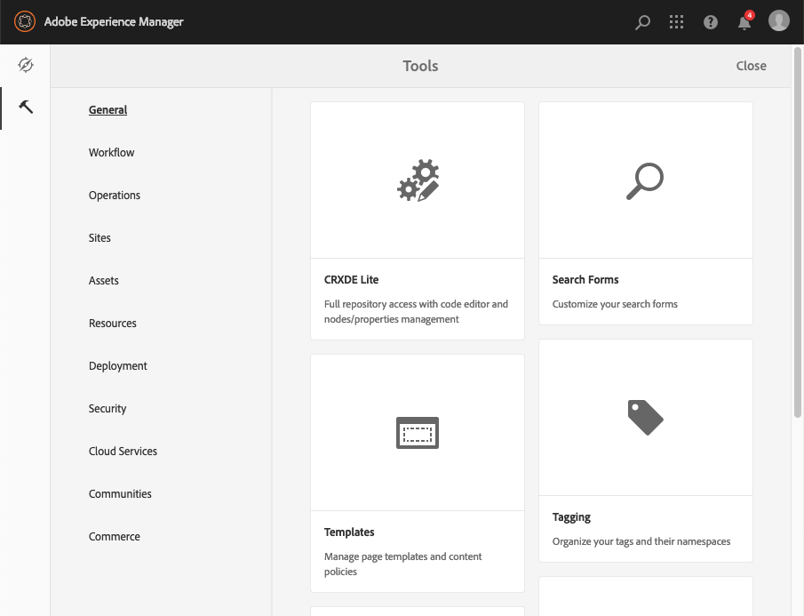

## The Header {#the-header}

The header is always present at the top of the screen. While most options in the header remain the same no matter where you are in the system, some are context-specific.

* [Global Navigation](#navigatingconsolesandtools)

  Select the **Adobe Experience Manager** link to navigate between consoles.

  

* [Search](/help/sites-authoring/search.md)

  

  You can also use the [shortcut key](/help/sites-authoring/keyboard-shortcuts.md) `/` (forward slash) to invoke search from any console.

* [Solutions](https://www.adobe.com/experience-cloud.html)

  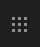

* [Help](#accessinghelptouchoptimizedui)

  

* [Notifications](/help/sites-authoring/inbox.md)

  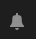

  This icon will be badged with the number of currently assigned incomplete notifications.

  >[!NOTE]
  >
  >Out-of-the-box AEM comes pre-loaded with administrative tasks assigned to the administrator user group. See [Your Inbox - Out-of-the-Box Administrative Tasks](/help/sites-authoring/inbox.md#out-of-the-box-administrative-tasks) for details.

* [User Properties](/help/sites-authoring/user-properties.md)

  

* [Rail selector](/help/sites-authoring/basic-handling.md#rail-selector)

  

  The options presented depend on your current console. For example, in **Sites** you can select content only (the default), the timeline, references or filter side panel.

  

* Breadcrumbs

  

  Situated in the middle of the rail, and always showing the description of the currently selected item, the breadcrumbs allow you to navigate within a specific console. In the Sites console, you can navigate through the levels of your website.

  Simply click on the breadcrumb text to display a drop-down listing the levels of the hierarchy of the currently selected item. Click on an entry to jump to that location.

  

* Analytics time period selection

  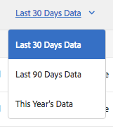

  This is available in list view only. See [list view](#list-view) for more information.

* **Create** button

  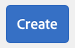

  Once clicked, the options displayed are appropriate to the console/context.

* [Views](/help/sites-authoring/basic-handling.md#viewingandselectingyourresourcescardlistcolumn)

  The view icon is at the far right of the AEM toolbar. As it also indicates the current view, it changes. For example, in the default view, **Column View** it shows:

  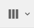

  You can switch between column view, card view, and list view; in the list view it also shows the view settings.

  

* Keyboard navigation

  You can navigate a website using only the keyboard. This uses the standard browser functionality of the **TAB** key (or **OPT+TAB**) to move you between elements on the page that are *focusable*. 

  In the **Sites** console there is the added option to  **Skip to main content**. This becomes visible as you *tab* through the header options, and speeds your navigation by allowing you to skip the standard elements in the (product) toolbar and taking you directly to the main content.

  

## Accessing Help {#accessing-help}

There are various help resources available:

* **Console Toolbar**

  Depending on your location the **Help** icon will open the appropriate resources:

  

* **Navigation**

  The first time you navigate the system, [a series of slides introduce AEM navigation](/help/sites-authoring/basic-handling.md#product-navigation).

* **Page Editor**

  The first time you edit a page a series of slides introduce the page editor.

  

  Navigate this overview as you would the [product navigation overview](/help/sites-authoring/basic-handling.md#product-navigation) when first accessing any console.

  From the [**Page Information** menu you can select **Help**](/help/sites-authoring/author-environment-tools.md#accessing-help) to show this again at any time.

* **Tools Console**

  From the **Tools** console you can also access the external **Resources**:

    * **Documentation**
      View the Web Experience Management documentation

    * **Developer Resources**
      Developer resources and downloads

  >[!NOTE]
  >
  >You can access an overview of shortcut keys available at any time using the hotkey `?` (question mark) when in a console.
  >
  >For an overview of all keyboard shortcuts see the following documentation:
  >
  >    * [Keyboard shortcuts for editing pages](/help/sites-authoring/page-authoring-keyboard-shortcuts.md)
  >    * [Keyboard shortcuts for consoles](/help/sites-authoring/keyboard-shortcuts.md)
  >

## Actions Toolbar {#actions-toolbar}

Whenever a resource is selected (e.g. a page or an asset), various actions are indicated by icons with explanatory text in the toolbar. These actions are dependent on:

* The current console.
* The current context.
* Whether you are in [selection mode](#navigatingandselectionmode).

The action available in the toolbar change to reflect the actions you can take on the specific items selected.

How you [select a resource](/help/sites-authoring/basic-handling.md#viewing-and-selecting-resources) depends on the view.

Due to the space restrictions in some windows, the toolbar can quickly become longer than the space available. When this happens additional options appears. Clicking or tapping on the ellipsis (the three dots or **...**) opens a drop down selector holding all remaining actions. For example, after selecting a page in the **Sites** console:

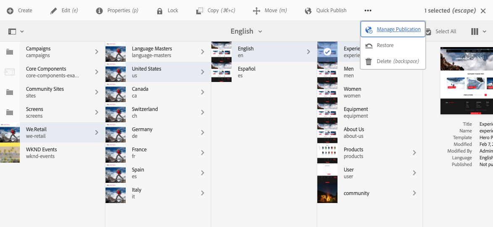

>[!NOTE]
>
>The individual icons available are documented in relation to the appropriate console/feature/scenario.

## Quick Actions {#quick-actions}

In [Card View](#cardviewquickactions) certain actions are available as quick action icons as well as being on the toolbar. Quick action icons are available for a single item at a time and eliminate the need for you to preselect.

The quick actions are visible when you mouseover (desktop device) a resource card. The quick actions available can depend on the console and context. For example, here are the quick actions for a page in the **Sites** console:

## Viewing and Selecting Resources {#viewing-and-selecting-resources}

Viewing, navigating, and selecting are each conceptually the same across all views, but have small variations in handling, dependent on the view you are using.

You can view, navigate through, and select (for further action) your resources with any of the available views, each of which can be selected by the icon at the top right:

* [Column View](#column-view)
* [Card View](#card-view)

* [List View](#list-view)

>[!NOTE]
>
>By default, AEM Assets does not display the original renditions of assets in the UI as thumbnails in any of the views. If you are an administrator, you can use overlays to configure AEM Assets to display original renditions as thumbnails.

### Selecting Resources {#selecting-resources}

Selecting a specific resource is dependent on a combination of the view and the device:

<table>
 <tbody>
  <tr>
   <td> </td>
   <td>Select</td>
   <td>Unselect</td>
  </tr>
  <tr>
   <td>Column View  </td>
   <td>
    <ul>
     <li>Desktop:  Click the thumbnail</li>
     <li>Mobile device:  Tap the thumbnail</li>
    </ul> </td>
   <td>
    <ul>
     <li>Desktop:  Click the thumbnail</li>
     <li>Mobile device:  Tap the thumbnail</li>
    </ul> </td>
  </tr>
  <tr>
   <td>Card View  </td>
   <td>
    <ul>
     <li>Desktop:  Mouseover, then use the checkmark quick action</li>
     <li>Mobile device:  Tap-and-hold the card</li>
    </ul> </td>
   <td>
    <ul>
     <li>Desktop:  Click the card</li>
     <li>Mobile device:  Tap the card</li>
    </ul> </td>
  </tr>
  <tr>
   <td>List View</td>
   <td>
    <ul>
     <li>Desktop:  Click the thumbnail</li>
     <li>Mobile device:  Tap the thumbnail</li>
    </ul> </td>
   <td>
    <ul>
     <li>Desktop:  Click the thumbnail</li>
     <li>Mobile device:  Tap the thumbnail</li>
    </ul> </td>
  </tr>
 </tbody>
</table>

#### Select All {#select-all}

You can select all items in any view by clicking the **Select All** option at the top-right corner of the console.

* In **Card View** all cards are selected.
* In **List View** all items in the list are seelcted.
* In **Column View** all items in the leftmost column are selected.

#### Deselecting All {#deselecting-all}

In all cases as you select items, the count of the items selected is displayed at the top-right of the toolbar.

You can deselect all items and exit selection mode by either:

* clicking or tapping the **X** next to the count,

* or using **escape**.

In all views, all items can be deslected by tapping escape on the keyboard if you are using a desktop device.

#### Selecting Example {#selecting-example}

1. For example in card view:

   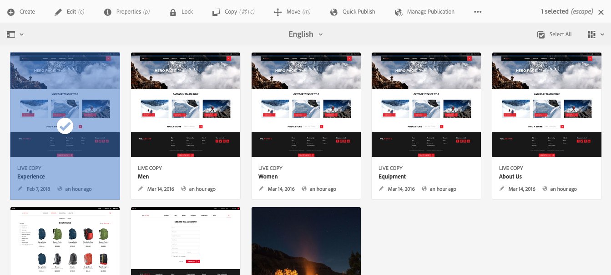

1. Once you have selected a resource the top header is covered by the [actions toolbar](#actionstoolbar) that provides access to actions currently applicable to the selected resource.

   To exit selection mode select the **X** to the top-right, or use **escape**.

### Column View {#column-view}

The column view allows for a visual navigation of a content tree through a series of cascading columns. This view allows you to visualize and traverse the tree structure of your website.

Selecting a resource in the leftmost column will display the child resources in a column to the right. Selecting a resource in the right column will then display the child resources in another column to the right and so on.

* You can navigate up and down in the tree by tapping or clicking on the resource name or the chevron to the right of the resource name.

    * The resource name and chevron will be highlighted when tapped or clicked.

  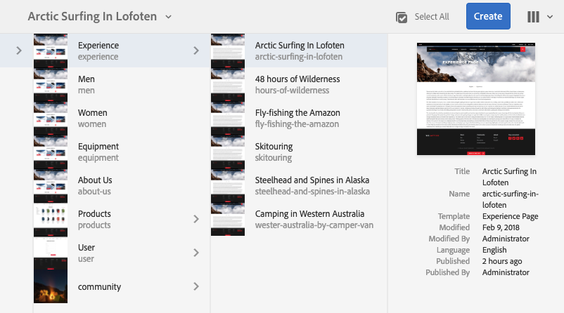

    * The children of the clicked/tapped resource are displayed in the column to the right of the clicked/tapped resource.
    * If you tap or click on a resource name that has no children, its details will be displayed in the final column.

* Tapping or clicking on the thumbnail selects the resource.

    * When selected, a checkmark will be overlaid on the thumbnail and the resource name will be highlighted as well.
    * The details of the selected resource will be shown in the final column.
    * The action toolbar will become available.

  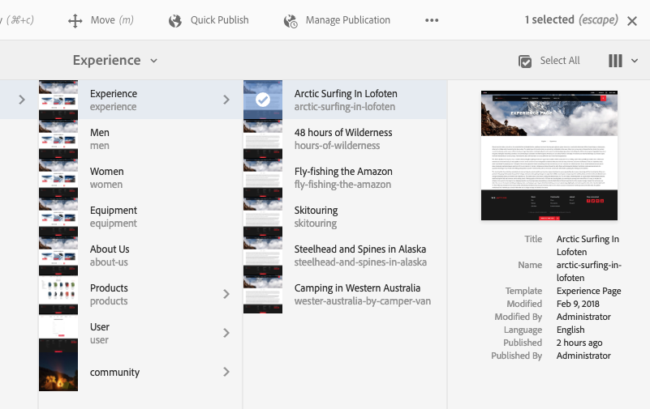

  When a page is selected in column view, the selected page is displayed in the final colum along with the following details:

    * Page title
    * Page name (part of the page's URL)
    * Template the page is based on
    * Modification details
    * Page language
    * Publication details

### Card View {#card-view}

* Card view displays information cards for each item at the current level. These provide information such as:

    * A visual representation of the page content.
    * The page title.
    * Important dates (such as last edited, last published).
    * If the page is locked, hidden or part of a livecopy.
    * If appropriate, when you are required to take action as part of a workflow.

        * Markers that indicate required actions may be related to entries in your [Inbox](/help/sites-authoring/inbox.md).

* [Quick actions](#quick-actions) are also available in this view such as selection and common actions such as edit.

  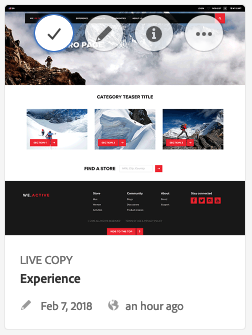

* You can navigate down the tree by tapping/clicking on cards (taking care to avoid the quick actions) or up again by using the [breadcrumbs in the header](/help/sites-authoring/basic-handling.md#the-header).

### List View {#list-view}

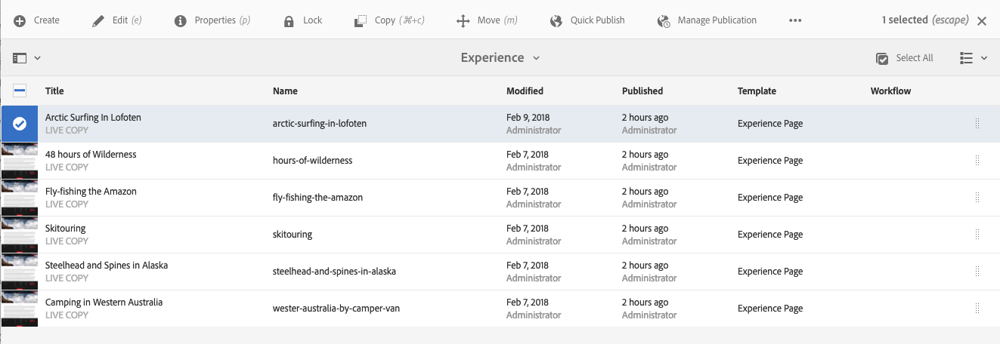

* The list view lists information for each resource at the current level.
* You can navigate down through the tree by tapping/clicking on the resource name and back up by using the [breadcrumbs in the header](/help/sites-authoring/basic-handling.md#the-header).

* To easily select all items in the list, use the checkbox at the top-left of the list.

  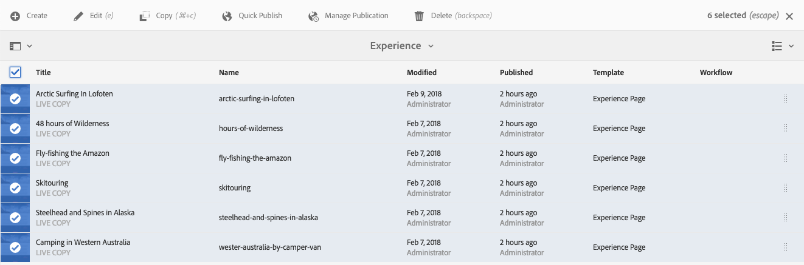

    * When all items in the list are selected, this checkbox appears checked.

        * Click or tap the checkbox to deselect all.

    * When only some items are selected, it appears with a minus sign.

        * Click or tap the checkbox to select all.
        * Click or tap the checkbox again to deselect all.

* Select the columns to be shown using **View Settings** option located under the Views button. The following columns are available for display:

    * **Name** - Page name, which can be useful in a multilingual authoring environment since it is part of the page's URL and does not change regardless of language
    * **Modified** - Last modified date and last modified by user
    * **Published** - Publication status
    * **Template** - Template on which the page is based
    * **Workflow** - Workflow currently applied to the page. More information is available when you mouseover, or open Timeline.

    * **Page analytics**
    * **Unique visitors**
    * **Time on page**

  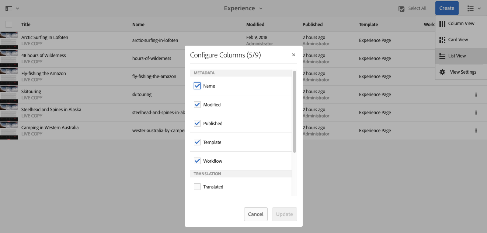

  By default the **Name** column is shown, which makes up part of the URL for the page. In some cases the author might need to access pages that are in a different language and seeing the name of the page (which usually is unchanging) can be of great help if the author does not know the language of the page.

* Change the order of items using the dotted vertical bar at the far right of each item in the list.

  >[!NOTE]
  >
  >Changing the order works only within an ordered folder that has `jcr:primaryType` value as `sling:OrderedFolder`.

  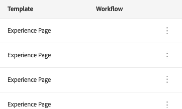

  Click or tap on the vertical selection bar and drag the item to a new position in the list.

  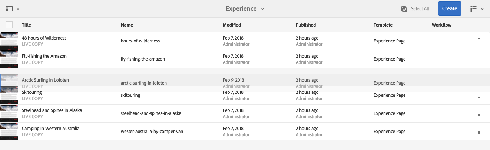

* You can display Analytics Data by showing the appropriate columns using the **View Settings** dialogue.

  You can filter Analytics Data for the past 30, 90, or 365 days using the filter options on the right side of the header.

  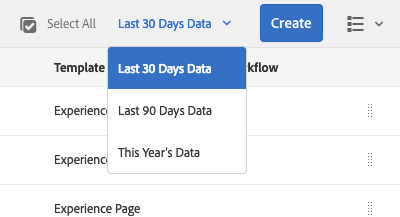

## Rail Selector {#rail-selector}

The **Rail Selector** is available at the top-left of the window and displays options depending on your current consoles.

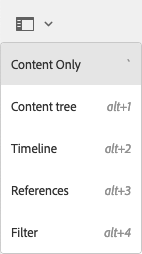

For example, in Sites you can select content only (the default), content tree, the timeline, references, or filter side panel.

If content only is selected, then only the rail icon appears. When any other option is selected, the option name appears next to the rail icon.

>[!NOTE]
>
>[Keyboard shortcuts](/help/sites-authoring/keyboard-shortcuts.md) are available to quickly switch between rail display options.

### Content tree {#content-tree}

The content tree can be used to quickly navigate the site hierarchy within the side panel and view much information about the pages in the current folder.

Using the content tree side panel in conjunction with a list view or cards view, users can easily see the hierarchical structure of the project and navigate easily across the content structure with the content tree side-panel, as well as view detailed page information in the list view.

>[!NOTE]
>
>Once an entry in the hierarchy view is selected, arrow keys can be used to quickly navigate the hierarchy.
>
>Refer to the [keyboard shortcuts](/help/sites-authoring/keyboard-shortcuts.md) for more information.

### Timeline {#timeline}

The timeline can be used to view and/or initiate events that have occured on the selected resource. To open the timeline column use the rail selector:

The timeline column allows you to:

* [View various events](#timelineviewevents) related to a selected item.

    * The event types can be selected from the drop-down list:

        * [Comments](#timelineaddingandviewingcomments)
        * Annotations
        * Activities
        * [Launches](/help/sites-authoring/launches.md)
        * [Versions](/help/sites-authoring/working-with-page-versions.md)
        * [Workflows](/help/sites-authoring/workflows-applying.md)

            * with the exception of [transient workflows](/help/sites-developing/workflows.md#transient-workflows) as no history information is saved for these

        * and Show All

* [Add/view comments](#timelineaddingandviewingcomments) about the selected item. The **Comment** box is shown at the bottom of the list of events. Typing a comment followed by Return will register the comment. It is shown when **Comments** or **Show All** is selected.

* Specific consoles have additional functionality. For example, in the Sites console you can:

    * [Save a version](/help/sites-authoring/working-with-page-versions.md#creatinganewversiontouchoptimizedui).
    * [Start a workflow](/help/sites-authoring/workflows-applying.md#startingaworkflowfromtherail).

These options accessible via the chevron next to the **Comment** field.

### References {#references}

**References** shows any connections to the selected resource. For example, in the **Sites** console [references](/help/sites-authoring/author-environment-tools.md#showingpagereferences) for pages shows:

* [Launches](/help/sites-authoring/launches.md#launches-in-references-sites-console)
* [Live copies](/help/sites-administering/msm-livecopy-overview.md#openingthelivecopyoverviewfromreferences)
* [Language copies](/help/sites-administering/tc-prep.md#seeing-the-status-of-language-roots)
* Content references:

    * links from other pages to the selected page
    * content borrowed from and/or lent to the selected page by the Reference component

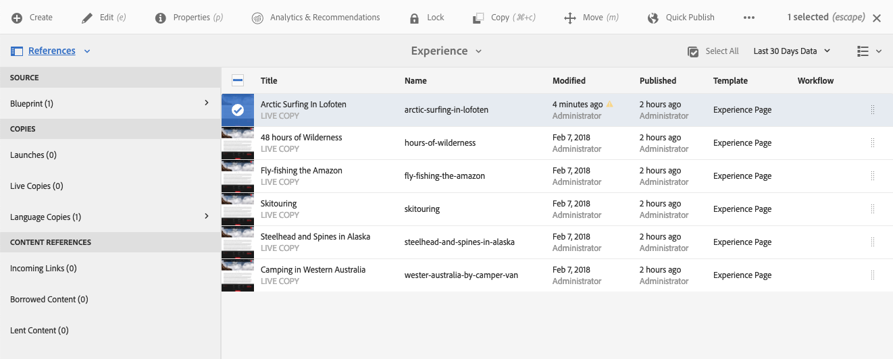

### Filter {#filter}

This will open a panel similar to [search](/help/sites-authoring/search.md) with the appropriate location filters already set, allowing you to further filter the content you wish to view.

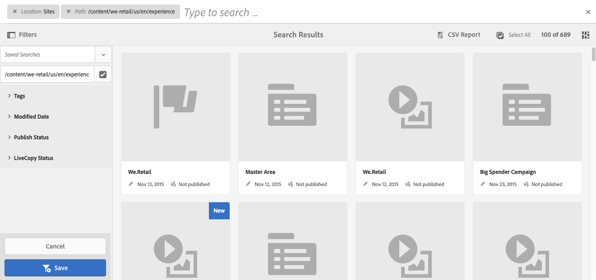
