# Working with Adobe Campaign Classic and Adobe Campaign Standard{#working-with-adobe-campaign-classic-and-adobe-campaign-standard}

You can create email content in AEM and process it in Adobe Campaign emails. To do that, you must:

1. Create a newsletter in AEM from an Adobe Campaign-specific template.
1. Select [an Adobe Campaign service](#selecting-the-adobe-campaign-cloud-service-and-template) before editing the content to access all the functionality.
1. Edit the content.
1. Validate the content.

Content can then be synched with a delivery in Adobe Campaign. Detailed instructions are described in this document.

See also [Creating Adobe Campaign Forms in AEM](/help/sites-authoring/adobe-campaign-forms.md).

>[!NOTE]
>
>Before you can use this functionality, you must configure AEM to integrate with either [Adobe Campaign](/help/sites-administering/campaignonpremise.md) or [Adobe Campaign Standard](/help/sites-administering/campaignstandard.md).

## Sending Email Content via Adobe Campaign {#sending-email-content-via-adobe-campaign}

After you configure AEM and Adobe Campaign, you can create email delivery content directly in AEM and then process it in Adobe Campaign.

When you create Adobe Campaign content in AEM, you must link to an Adobe Campaign service before editing the content to access all the functionality.

There are two possible cases:

* Content can be synched with a delivery from Adobe Campaign. This lets you use AEM content in a delivery.
* (Adobe Campaign Classic only) The content can be sent directly to Adobe Campaign, which automatically generates a new email delivery. This mode has limitations.

Detailed instructions are described in this document.

### Creating new email content {#creating-new-email-content}

>[!NOTE]
>
>When adding email templates, be sure to add them under **/content/campaigns** to make them available.

#### Creating new email content {#creating-new-email-content-1}

1. In AEM select **Sites** then **Campaigns**, then browse to where your email campaigns are managed. In the following example, the path is **Sites** &gt; **Campaigns** &gt; **Geometrixx Outdoors** &gt; **Email Campaigns**.

   >[!NOTE]
   >
   >[Email samples are only available in Geometrixx](/help/sites-developing/we-retail.md). Download sample Geometrixx content from Package Share.

   

1. Select **Create** then **Create Page**.
1. Select one of the available templates specific to which Adobe Campaign you are connecting to, then click **Next**. Three templates are available by default:

    * **Adobe Campaign Classic Email**: lets you add content to a predefined template (two columns) before sending it to Adobe Campaign Classic for delivery.
    * **Adobe Campaign Standard Email**: lets you add content to a predefined template (two columns) before sending it to Adobe Campaign Standard for delivery.

1. Fill in the **Title** and optionally the **Description** and click **Create**. The title is used as the subject of the newsletter/email unless you overwrite it while editing the email.

### Selecting the Adobe Campaign cloud service and template {#selecting-the-adobe-campaign-cloud-service-and-template}

To integrate with Adobe Campaign, you need to add an Adobe Campaign cloud service to the page. Doing so provides you with access to personalization and other Adobe Campaign information.

In addition you may also need to select the Adobe Campaign template and change the subject and add plain text content for those users who will not view the email in HTML.

You can select the cloud service either from the **Sites** tab or from within the email/newsletter after you have created it.

Selecting the cloud service from the **Sites** tab is the recommended approach. Selecting the cloud service from the email/newsletter requires a workaround.

From the **Sites** page:

1. In AEM select the email page and click **View Properties**.

   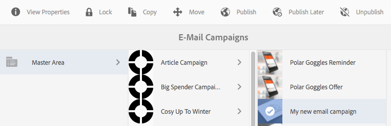

1. Select **Edit** and then the **Cloud services** tab and scroll down to the bottom and click the + sign to add a configuration and then select **Adobe Campaign**.

   

1. Select the configuration that matches your Adobe Campaign instance from the drop-down list, then confirm by clicking **Save**.
1. You can view the template that the email has applied to it by clicking the**Adobe Campaign** tab. If you would like to select another template, you can access that from within the email while editing.

   If you would like to apply a specific email delivery template (from Adobe Campaign), other than the default mail template, in **Properties**, select the **Adobe Campaign** tab. Enter the email delivery template's internal name in the related Adobe Campaign instance.

   Which template you select determines which personalization fields are available from Adobe Campaign.

   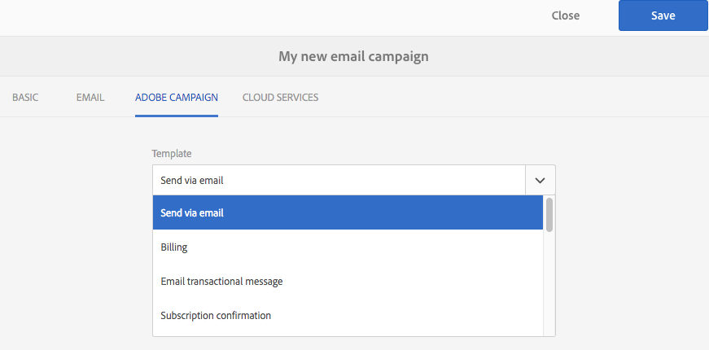

From within the newsletter/email in authoring, you might not be able to select the Adobe Campaign cloud service configuration in **Page Properties** due to a layout issue. You can use the workaround described here:

1. In AEM select the email page and click **Edit**. Click **Open Properties**.

   

1. Select **Cloud services** and click **+** to add a configuration. Select any visible configuration (does not matter which one). Click the **+** sign to add another configuration and then select **Adobe Campaign**.

   >[!NOTE]
   >
   >Alternatively, you can select the cloud services by selecting **View Properties** in the **Sites** tab.

1. Select the configuration that matches your Adobe Campaign instance from the drop-down list, delete the first configuration you created that was not for Adobe Campaign, then confirm by clicking the check mark.
1. Continue with step 4 in the previous procedure to select templates and add plain text.

### Editing email content {#editing-email-content}

To edit email content:

1. Open the email and by default you enter Edit mode.

   

1. If you would like to change the subject of the email or add plain text for those users who will not view the email in HTML, select **Email** and add a subject and text. Select the page icon to auto-generate a plain text version from HTML. Click the check mark when finished.

   You can personalize the newsletter by using Adobe Campaign personalization fields. To add a personalization field, open the personalization field picker by clicking on the button displaying the Adobe Campaign logo. You can then choose from all the fields that are available for this newsletter.

   >[!NOTE]
   >
   >If the personalization fields in properties from within the editor are greyed out, re-examine your configuration.

   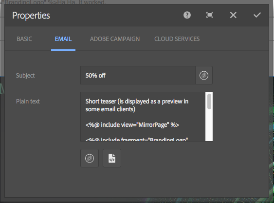

1. Open the components panel on left side of screen and select **Adobe Campaign Newsletter** from the drop-down menu to find those components.

   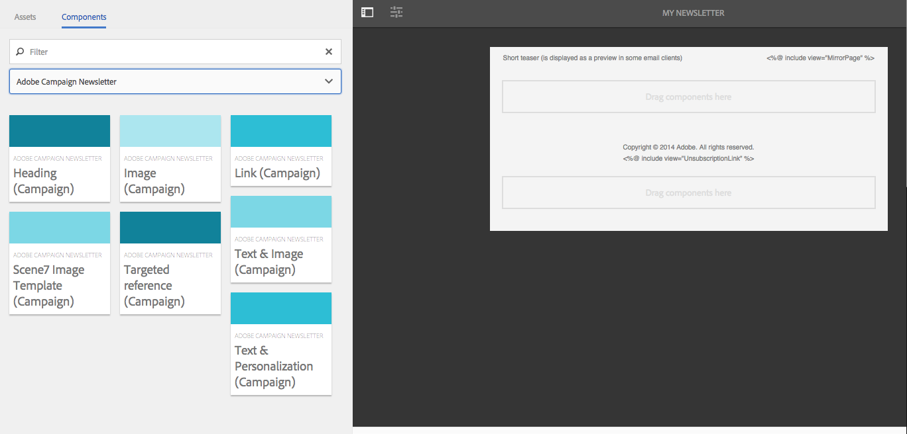

1. Drag components directly onto the page and edit them accordingly. For example, you can drag a **Text & Personalization (Campaign)** component and add personalized text.

   

   See [Adobe Campaign Components](/help/sites-authoring/adobe-campaign-components.md) for a detailed description of each component.

   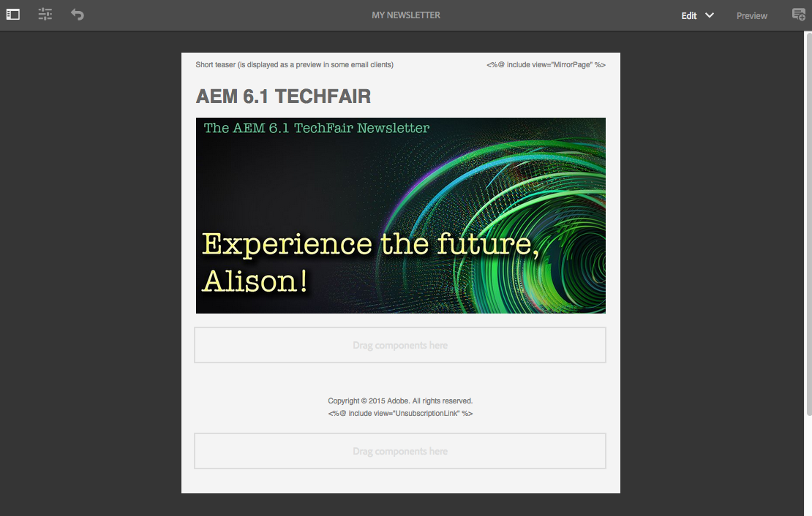

### Inserting personalization {#inserting-personalization}

When editing your content, you can insert:

* Adobe Campaign context fields. These are fields that you can insert within your text that adapt according to the recipient's data (for example, first name, last name, or any data of the target dimension).
* Adobe Campaign personalization blocks. These are blocks of predefined content that are not related to the recipient's data, such as a brand logo, or link to a mirror page.

See [Adobe Campaign Components](/help/sites-authoring/adobe-campaign-components.md) for a full description of the Campaign components.

>[!NOTE]
>
>* Only the fields of the Adobe Campaign **Profiles** targeting dimension are taken into account.
>* When viewing Properties from **Sites**, you do not have access to the Adobe Campaign context fields. You can access those directly from the email while editing.

To insert personalization:

1. Insert a new **Newsletter** &gt; **Text & Personalization (Campaign)** component by dragging it onto the page.

   

1. Open the component by clicking the Pencil icon. The inplace editor opens.

   

   >[!NOTE]
   >
   >**For Adobe Campaign Standard:**
   >
   >* Available context fields correspond to the **Profiles** targeting dimension in Adobe Campaign.
   >* See [Linking an AEM page to an Adobe Campaign email](#linking-an-aem-page-to-an-adobe-campaign-email-adobe-campaign-standard).
   >
   >**For Adobe Campaign Classic:**
   >
   >* Available context fields are dynamically recovered from the Adobe Campaign **nms:seedMember** schema. Target extension data is dynamically recovered from the workflow that contains the delivery synchronized with the content. (See the [Synchronizing content created in AEM with a delivery from Adobe Campaign](#synchronizing-content-created-in-aem-with-a-delivery-from-adobe-campaign-classic) section).
   >
   >* To add or hide personalization elements, see [Managing personalization fields and blocks](/help/sites-administering/campaignonpremise.md#managing-personalization-fields-and-blocks).
   >* **Important**: All seed table fields must also be in the recipient table (or corresponding contact table).

1. Insert text by typing. Insert context fields or personalization blocks by clicking the Adobe Campaign components and selecting them. When finished, select the checkmark.

   

   After inserting context fields or personalization blocks, you can preview your newsletter and test your fields. See [Previewing a Newsletter](#previewing-a-newsletter).

### Previewing a newsletter {#previewing-a-newsletter}

You can preview how the newsletter will look and preview the personalization.

1. With the newsletter open, click **Preview** in the upper right corner of AEM. AEM displays how the newsletter looks when users receive it.

   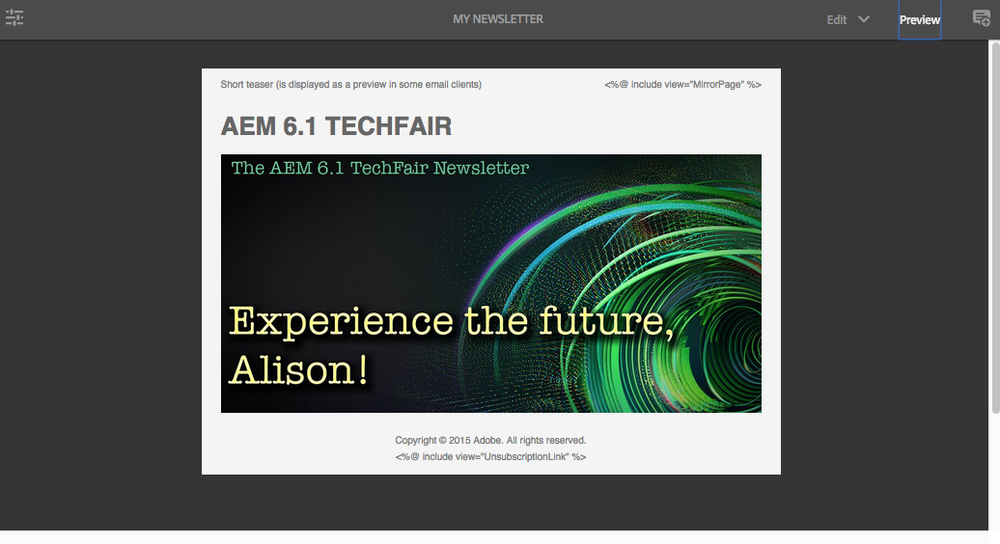

   >[!NOTE]
   >
   >If you are using Adobe Campaign Standard and using the sample template, two personalization blocks that display initial content - **"&lt;%@ include view="MirrorPage" %&gt;"** and **"&lt;%@ include view="UnsubscriptionLink" %&gt;"** - will throw errors when importing the content during delivery. You can adjust these by selecting the corresponding blocks using the personalization block picker.

1. To preview the personalization, open ContextHub by clicking/tapping the corresponding icon in the toolbar. The personalization field tags are now replaced by the seed data of the selected persona. See how the variables adapt when switching personas in ContextHub.

   

1. You can view the seed data coming from Adobe Campaign that is associated with the currently selected persona. To do this, click the Adobe Campaign module in the ContextHub bar. This opens a dialog box displaying all seed data of the current profile. Again, the data adapts when switching to a different persona.

   

### Approving content in AEM {#approving-content-in-aem}

After the content is finished, you can start the approval process. Go to the **Workflow** tab of the toolbox and select the **Approve for Adobe Campaign** workflow.

This out-of-the-box workflow has two steps: revision then approval, or revision then rejection. Nevertheless, this workflow can be extended and adapted to a more complex process.

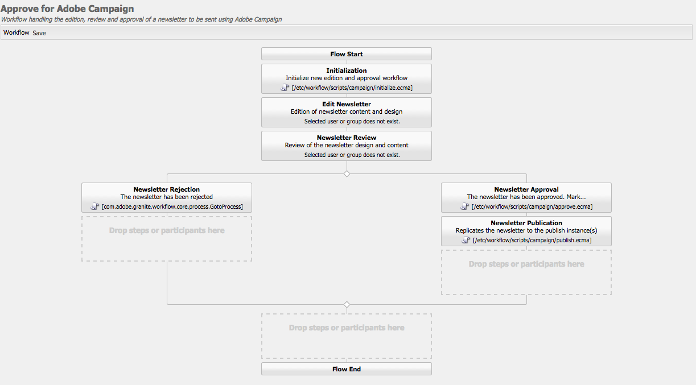

To approve content for Adobe Campaign, apply the workflow by selecting **Workflow** and selecting **Approve for Adobe Campaign** and click **Start Workflow**. Go through the steps and approve the content. You can also reject the contents by selecting **Reject** instead of **Approve** in the last workflow step.

After content is approved, it appears as approved in Adobe Campaign. The email can then be sent.

In Adobe Campaign Standard:

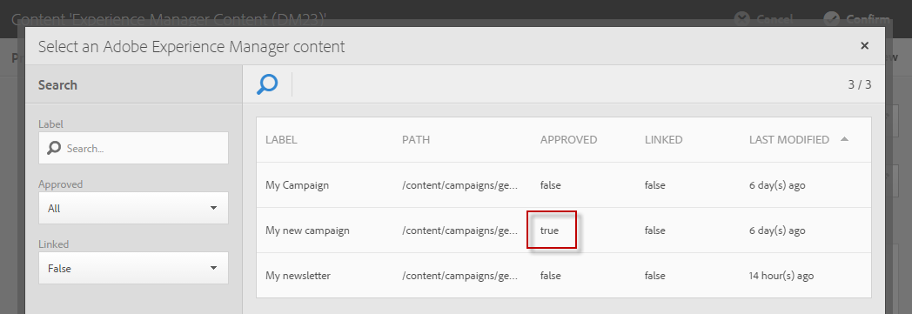

In Adobe Campaign Classic:

>[!NOTE]
>
>Unapproved content can be synched with a delivery in Adobe Campaign but the delivery cannot be executed. Only approved content can be sent via Campaign deliveries.

## Linking AEM with Adobe Campaign Standard and Adobe Campaign Classic {#linking-aem-with-adobe-campaign-standard-and-adobe-campaign-classic}

How you link or synchronize AEM with Adobe Campaign depends on whether you are using subscription-based Adobe Campaign Standard or on-premise-based Adobe Campaign Classic.

See the following sections for instructions based on your Adobe Campaign solution:

* [Linking an AEM page to an Adobe Campaign Email (Adobe Campaign Standard)](#linking-an-aem-page-to-an-adobe-campaign-email-adobe-campaign-standard)
* [Synchronizing Content Created in AEM with a Delivery from Adobe Campaign Classic](#synchronizing-content-created-in-aem-with-a-delivery-from-adobe-campaign-classic)

### Linking an AEM page to an Adobe Campaign email (Adobe Campaign Standard) {#linking-an-aem-page-to-an-adobe-campaign-email-adobe-campaign-standard}

Adobe Campaign Standard lets you recover and link content created in AEM with:

* An email.
* An email template.

Doing so lets you deliver the content. You see whether a newsletter is linked to a single delivery by the code that displays on the page.

>[!NOTE]
>
>If a newsletter is linked to several deliveries, the number of linked deliveries (but not every ID is displayed).

To link a page created in AEM with an email from Adobe Campaign:

1. Create an email based on an AEM-specific email template. Refer to [Creating emails in Adobe Campaign Standard](https://helpx.adobe.com/campaign/standard/channels/using/creating-an-email.html) for more information.

   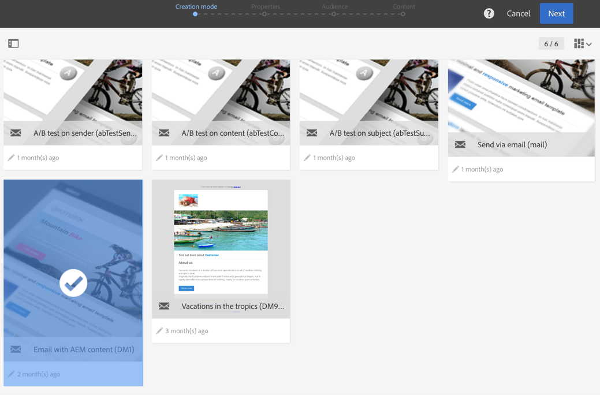

1. Open the **Content** block from the delivery dashboard.

   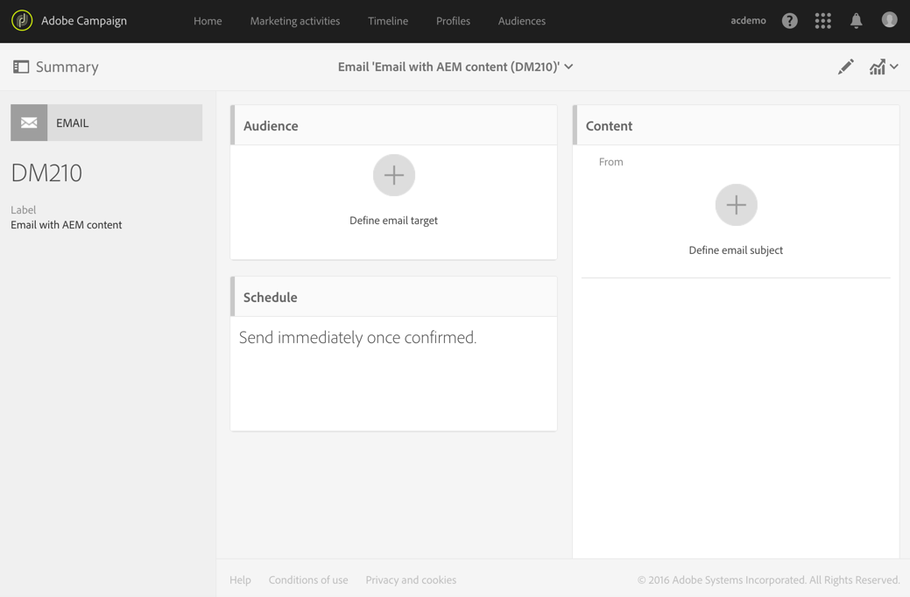

1. Select **Link with an Adobe Experience Manager content** in the toolbar to access the list of contents available in AEM.

   >[!NOTE]
   >
   >If the **Link with an Adobe Experience Manager** option does not appear in the action bar, check that the **Content editing mode** is correctly configured set to **Adobe Experience Manager** in the email properties.

   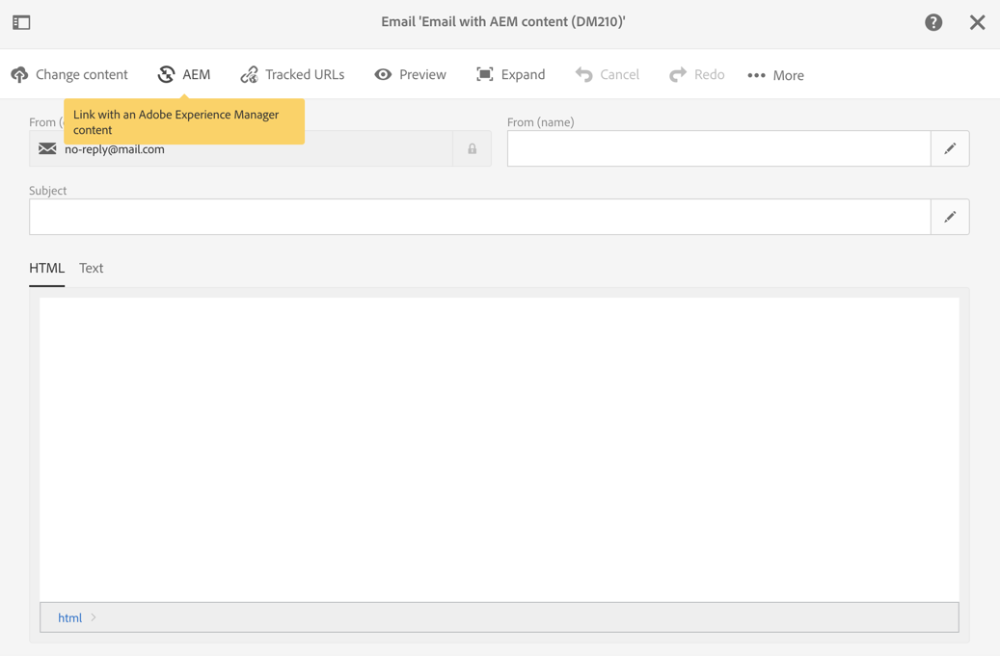

1. Select the content you would like to use in your email.

   This list specifies:

    * The label of the content in AEM.
    * The approval status of the content in AEM. If the content is not approved, you can synchronize the content but it will have to be approved before the delivery is sent. However, you can execute certain operations such as sending a proof or the preview test.
    * The date of the content last modification.
    * Any content already linked to a delivery.

   >[!NOTE]
   >
   >By default, the content that is already synchronized with a delivery is hidden. However, you can display it and use it. For example, if you want to use content as a template for several deliveries.

   When the email is linked to an AEM content, the content cannot be edited in Adobe Campaign.

1. Specify the other parameters of your email from its dashboard (audiences, execution schedule).
1. Execute the email delivery. During the delivery analysis, the most up-to-date version of the AEM content is retrieved.

   >[!NOTE]
   >
   >If the content is updated in AEM while it is linked to an email, it is automatically updated in Adobe Campaign during the analysis. The synchronization can also be executed manually using **Refresh Adobe Experience Manager content** from the content action bar.
   >
   >You can cancel the link between an email and AEM content using **Delete the link with the Adobe Experience Manager content** from the content action bar. This button is only available if a content is already linked with the delivery. To link a different content with a delivery, you must delete the current content link before being able to establish a new link.
   >
   >When the link is deleted, the local content is kept and becomes editable in Adobe Campaign. If you link again the content after having modified it, all changes will be lost.

### Synchronizing content created in AEM with a delivery from Adobe Campaign Classic {#synchronizing-content-created-in-aem-with-a-delivery-from-adobe-campaign-classic}

Adobe Campaign lets you recover and synchronize content created in AEM with:

* A campaign delivery
* A delivery activity in a campaign workflow
* A recurring delivery
* A continuous delivery
* A Message Center delivery
* A delivery template

In AEM, if a newsletter is linked to a single delivery, the delivery code displays on the page.

>[!NOTE]
>
>If the newsletter is linked to several deliveries, the number of linked deliveries (but not every ID is displayed).
>
>[!NOTE]
>
>The Workflow step **Publish to Adobe Campaign** is deprecated in AEM 6.1. This step was a part of the AEM 6.0 integration with Adobe Campaign and is no longer necessary.

To synchronize content created in AEM with a delivery from Adobe Campaign:

1. Create a delivery or add a delivery activity to a campaign workflow by selecting the **Email delivery with AEM content (mailAEMContent)** delivery template.

   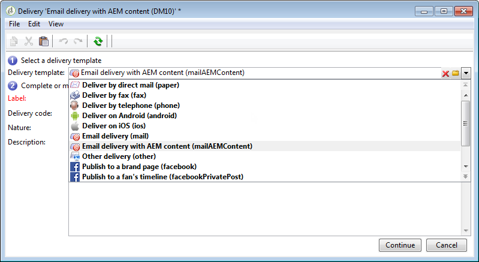

1. Select **Synchronize** in the toolbar to access the list of contents available in AEM.

   >[!NOTE]
   >
   >If the **Synchronize** option does not appear in the delivery's toolbar, check that the **Content editing mode** field is correctly configured in **AEM** by selecting **Properties** &gt; **Advanced**.

   

1. Select the content you would like to synchronize with your delivery.

   This list specifies:

    * The label of the content in AEM.
    * The approval status of the content in AEM. If the content is not approved, you can synchronize the content but it will have to be approved before the delivery is sent. However, you can execute certain operations such as sending a BAT or the preview test.
    * The date of the last modification to the content.
    * Any content already linked to a delivery.

   >[!NOTE]
   >
   >By default, the content that is already synchronized with a delivery is hidden. However, you can display it and use it. For example, if you want to use content as a template for several deliveries.

   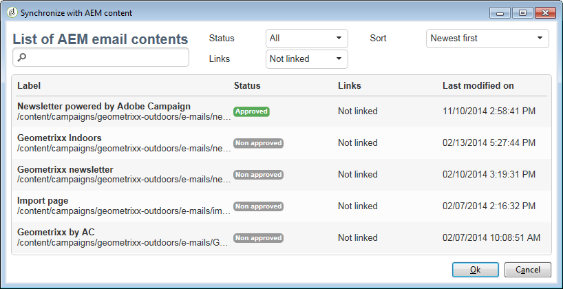

1. Specify the other parameters of your delivery (target, and so on)
1. If necessary, start the delivery approval process in Adobe Campaign. Content approval in AEM is necessary in addition to approvals configured in Adobe Campaign (budget, target, and so on). Content approval in Adobe Campaign is only possible if the content is already approved in AEM.
1. Execute the delivery. During the delivery analysis, the most up-to-date version of the AEM content is recovered.

   >[!NOTE]
   >
   >* After the delivery and content are synchronized, the delivery content in Adobe Campaign becomes read only. The email subject and its content can no longer be modified.
   >* If the content is updated in AEM while it is linked to a delivery in Adobe Campaign, it is automatically updated in the delivery during the delivery analysis. The synchronization can also be executed manually using the **Refresh content now** button.
   >* You can cancel synchronization between a delivery and AEM content using the **Desynchronize** button. This is only available if a content is already synchronized with the delivery. To synchronize a different content with a delivery, you must cancel the current content synchronization before being able to establish a new link.
   >* If desynchronized the local content is kept and becomes editable in Adobe Campaign. If you resynchronize the content after having modified it, you will lose all your changes.
   >* For recurring and continuous deliveries, synchronization with AEM content is stopped every time the delivery is executed.
