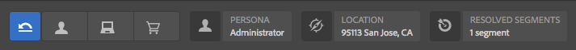
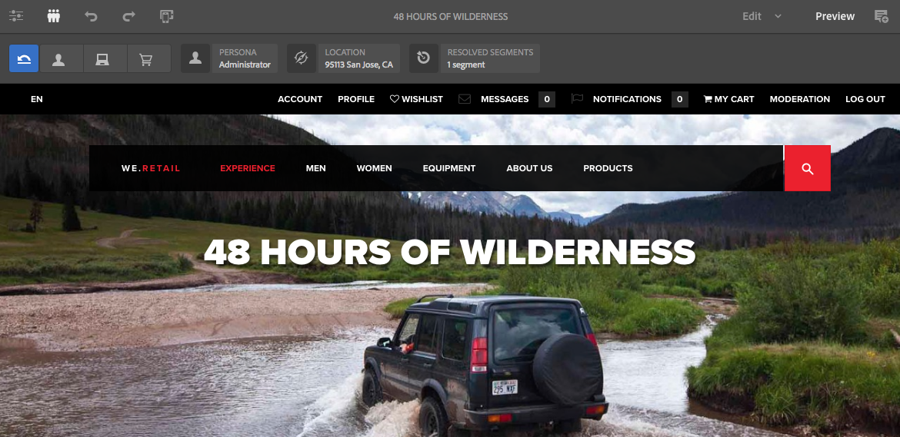
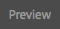
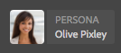
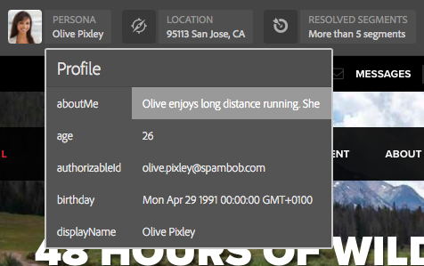

# Previewing Pages Using ContextHub Data{#previewing-pages-using-contexthub-data}

The [ContextHub](/help/sites-developing/contexthub.md) toolbar displays data from ContextHub stores and enables you to change store data. The ContextHub toolbar is useful for previewing content that is determined by data in a ContextHub store.

The toolbar consists of a series of UI modes that contain one or more UI modules.

* UI modes are icons that appear on the left hand side of the toolbar. When you click an icon, the toolbar reveals the UI modules that it contains.
* UI modules display data from one or more ContextHub stores. Some UI modules also enable you to manipulate store data.

ContextHub installs several UI modes and UI modules. Your administrator may have [configured ContextHub](/help/sites-developing/ch-configuring.md) to display different ones.

## Revealing the ContextHub Toolbar {#revealing-the-contexthub-toolbar}

The ContextHub toolbar is available in Preview mode. The toolbar is available only on author instances and only when your administrator has enabled it.

1. With your page open for editing, on the toolbar click Preview.

   

1. To reveal the toolbar, click the ContextHub icon.

   

## UI Module Features {#ui-module-features}

Each UI module provides is different set of features, but the following types of features are common. Because UI modules are extendable, your developer can implement other features as required.

### Toolbar Content {#toolbar-content}

UI modules can display data from one or more ContextHub stores in the toolbar. UI modules use an icon and a title to identify themselves.

### Popup Content {#popup-content}

Some UI modules display a popup overaly when clicked or tapped. Typically, the popup contains additional information than what appears on the toolbar.

### Popup Forms {#popup-forms}

The popup overlay of a module can include form elements that enable you to change the data in the ContextHub store. If page content is determined by the store data, you can use the form and observe changes to page content.

### Fullscreen Mode {#fullscreen-mode}

Popup overlays can include an icon that you click to expand the popup content to cover the entire browser window or screen.

