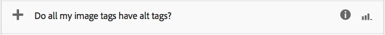
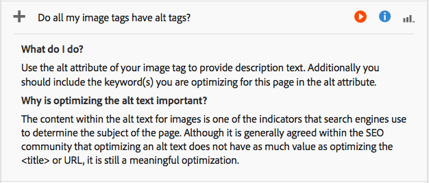

# Analyzing Page Performance{#analyzing-page-performance}

Open the [Content Insight](/help/sites-authoring/content-insights.md) page to analyze the performance of the page that you are authoring. Configure the reporting period to focus your analysis.

## Opening Analytics and Recommendations for a Page {#opening-analytics-and-recommendations-for-a-page}

Use the following procedure to see the Analytics and Recommendations for a page:

1. Navigate to the page that you want to analyze.
1. In the toolbar, click **Analytics and Recommendations**.

   >[!NOTE]
   >
   >Analytics and Recommendations for a page only appear if you have configured AEM to [integrate with Adobe Analytics](/help/sites-administering/adobeanalytics-connect.md).

   

### Changing the Reporting Period {#changing-the-reporting-period}

Change the following time-related aspects of the analytics reports:

* The period of time on which to report.
* The granularity of the data.

The tools for changing the time-related aspects of the reports appear at the top of the Content Insight page. 

#### Changing the Reporting Period {#changing-the-reporting-period-1}

Change the reporting period of the Content Insight page to focus your analysis of page activity to a specific period of time. When you change the reporting period, the reports automatically refresh. The shaded area on the timeframe represents the reporting period. The dates on the timeframe increase from left to right.

To change the reporting period of a Content Insight page:

1. If the timeframe does not appear at the top of the page, click the Toggle Timeframe icon.

   

1. To change the start date of the reporting period, drag the circle that appears at the left side of the shaded area to the desired start date.

   If you cannot see the left side of the shaded area, use the scroll bar to bring it into view.

1. To change the end date of the reporting period, drag the circle that appears at the right side of the shaded area to the desired end date.

#### Changing the Granularity of the Reporting Period {#changing-the-granularity-of-the-reporting-period}

Change the amount of time that each data point spans in a report. For example, when the Week granularity is selected, each data point on the Views report represents the number of views for one week.

The granularity affects the reports that plot data against time, such as the Views and the Page Average Engaged Minutes reports. Granularity also affects the scale of the timeframe.

1. If the granularity control does not appear, click the Toggle Granularity icon.

   

1. Click the desired granularity. Once selected, the report automatically updates to reflect the granularity.

### Assigning Tasks for SEO Recommendations {#assigning-tasks-for-seo-recommendations}

Use the SEO Recommendations report to create tasks for improving page visibility to search engines. For each recommendation in the report that does not have a checkmark, you can create a task that you assign to a user to perform the required work.

The status of the SEO recommendation indicates when the task is created but not yet completed.

When created, the task appears in the user's Tasks list. For information about tasks, see [Working with Tasks](/help/sites-authoring/task-content.md).

Use the following procedure to create a task for an SEO recommendation.

1. Click the information icon for the SEO recommendation.

   

1. Click the encircled triangle icon that appears next to the information icon.

   

1. Fill the form fields that appear and then select Create:

    * Project: Select the project in which to create the task.
    * Name: The name that identifies the task. The default name is the title of the SEO recommendation.
    * Assign To: Select the user to be assigned the task. Begin typing the user's name to filter the list.
    * Description: A description of the activity that is required to complete the task. The default description is the information that accompanies the SEO recommendation.
    * Task Priority: The priority of the task.
    * Due Date: The date by which the task should be completed.

   **Note:** The task that is created also includes the path to the page to which the SEO recommendation applies.

1. Click Done to close the Task Created message.
