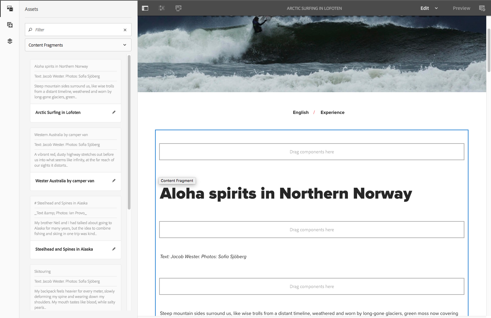

# Page Authoring with Content Fragments{#page-authoring-with-content-fragments}

Adobe Experience Manager (AEM) content fragments are [created and managed as page-independent assets](/help/assets/content-fragments/content-fragments.md).

They allow you to create channel-neutral content, together with (possibly channel-specific) variations. You can then use these fragments, and their variations, when authoring your content pages.

Together with the updated JSON exporter, structured content fragments can also be used to deliver AEM content via Content Services to channels other than AEM pages.

>[!NOTE]
>
>**Content Fragments** and **[Experience Fragments](/help/sites-authoring/experience-fragments.md)** are different features within AEM:
>
>* **Content Fragments** are editorial content, primarily text and related images. They are pure content, without design and layout.
>* **Experience Fragments** are fully laid out content; a fragment of a web page.
>
>Experience Fragments can contain content in the form of Content Fragments, but not the other way around.

>[!CAUTION]
>
>This page must be read in conjunction with [Working with Content Fragments](/help/assets/content-fragments/content-fragments.md) (and related pages) as it introduces basic terminology and concepts, together with creating and managing fragments.

The content fragments enable:

* **Marketing and Campaign Strategy**

    * Review content via centrally managed content fragments.

* **Creative Pro**

    * Tracking of creative assets via collections associated with content fragments.

* **Copy Writers**

    * Write in the AEM content fragment editor.
    * Can create content variations.
    * Can associate relevant content with the content fragment.
    * Can use versioning/workflow.
    * Can share content fragment.
    * Can manage translations centrally.

* **Producers and Journey Managers**

    * Select from predefined fragments and variations with authoring in AEM.
    * Can rely on fragment and associated content always being up-to-date as copy writers and creatives make their updates in centrally managed fragments and assets.
    * Can rely on associated media content being curated for relevancy.
    * Can create ad-hoc content variations on the fly while still ensuring those variations remain centrally managed in the fragment.

## Adding a Content Fragment to Your Page {#adding-a-content-fragment-to-your-page}

1. Open your page for editing.

1. Add the **Content Fragment** component; from either the **Components** browser or **Insert New Component**.

1. You can either:

    * Open the **Assets** browser and filter for **Content Fragments** (the default is Images). Then drag the required fragment onto the component instance.

    * Select the content fragment component, then **Configure** from the toolbar. In the dialog you can open the selection dialog to browse and select the required **Content Fragment**.

   >[!NOTE]
   >
   >An alternative method is to drag a specific content fragment directly onto the page. This will automatically create the associated component (Content Fragment).

1. Initially the content from the **Main** Element and **Master** (variation) will be shown. You can [select other elements and/or variations](#selecting-the-element-or-variation) as required.

   

   >[!NOTE]
   >
   >For more information about further editing functionality see also:
   >
   >
   >
   >    * [Responsive Layout](/help/sites-authoring/responsive-layout.md)
   >    * [Editing Page Content](/help/sites-authoring/editing-content.md)
   >
   >

### Selecting the Element or Variation {#selecting-the-element-or-variation}

Open the fragment's **Configuration** dialog to configure the fragment for use on the current page. The dialog can depend on the component used.

In the appropriate configuration dialog you can select the available parameters, including:

* **Content Fragment**

  Specify the fragment to be used.

* **Display Mode**:

    * **Single Text Element**

    * **Multiple Element**

* **Element**

    * The default **Main** will always be available.
    * A selection will be available if the fragment was created with an appropriate template.

  >[!NOTE]
  >
  >The elements available depend on the template used.

* **Variation**

    * The default **Master** will always be available.
    * A selection will be available if variations were created for the fragment.

* **Paragraphs**: specify the range of paragraph(s) to include:

    * **All**
    * **Range**: for example, `1`, `3-5`, `9-*`

        * **Handle headings as their own paragraphs**

* **Handle headings as their own paragraphs**

### Quick Connection to Fragment Editor {#quick-connection-to-fragment-editor}

You can open the fragment source for editing (the asset) using the **Edit** icon on the component toolbar. This will allow you to [edit and manage the content fragment](/help/assets/content-fragments/content-fragments.md).

>[!CAUTION]
>
>As always, editing the fragment source will impact all pages that reference that content fragment.

### Adding In-Between Content {#adding-in-between-content}

When a specific content fragment is added to the page, there is a **Drag components here** placeholder between each HTML paragraph (and at the top/bottom) of the fragment.

This allows you to add extra content [in-between (i.e. in-between content)](/help/assets/content-fragments/content-fragments.md#in-between-content-when-page-authoring-with-content-fragments) the fragment content (at any of the available points), without having to change the root fragment.

For in-between content you can:

* Add components from the [Components browser](/help/sites-authoring/author-environment-tools.md#components-browser).
* Add assets from the [Assets browser](/help/sites-authoring/author-environment-tools.md#assets-browser).
* Use [Associated Content](#using-associated-content) as a source for in-between content.

>[!CAUTION]
>
>The in-between content is page content. It is not stored in the content fragment.

>[!NOTE]
>
>You can also [insert visual assets (images) to the fragment itself](/help/assets/content-fragments/content-fragments-variations.md#inserting-assets-into-your-fragment).
>
>Visual assets inserted into the fragment itself are attached to the preceding paragraph in the fragment. This means that you cannot position in-between content between a visual asset and the preceding paragraph.

>[!CAUTION]
>
>After you have added in-between content to a content fragment on your page, then changing the structure of the underlying content fragment (i.e. in the content fragment editor) could lead to erroneous/unexpected results.
>
>When this occurs the in-between content is kept as is:
>
>* In-between components have an absolute position within the sequence of components in the fragment flow. This position does not change, even when the content of paragraphs in the fragment changes.
>
>  This can make it appear as if the relative positioning has changed, as in-between paragraphs have no contextual relationship to the (fragment) paragraphs they are positioned next to.
>* Unless the two paragraph structures conflict; in such a case, the in-between content is not displayed (although it is still present internally).
>

### Using Associated Content {#using-associated-content}

If you have [associated content](/help/assets/content-fragments/content-fragments-assoc-content.md) with the [content fragment](/help/assets/content-fragments/content-fragments.md) these assets will be available from the side panel (after you place your fragment on the content page). Associated content is effectively a special source of content for of [in-between content](#adding-in-between-content).

>[!NOTE]
>
>There are various methods of adding [visual assets (e.g. images)](/help/assets/content-fragments/content-fragments.md#fragments-with-visual-assets) to the fragment and/or page.

>[!NOTE]
>
>If you have multiple content fragments on the one page, the **Associated Content** tab will show assets appropriate to all fragments.

Once you have added a fragment with associated content to your page a new tab (**Associated Content**) is opened in the side panel.

From here you can drag the assets to the required location (either to an existing component or to the required position where the appropriate component will be created):

### Assets Inserted into the Fragment {#assets-inserted-into-the-fragment}

If assets (e.g. images) have been inserted into the fragment itself, then the options for editing these assets in the page editor is limited. <!-- Removed link as it was a 404 on helpx -->

For example, for an image you can

* Crop, rotate or flip the image.
* Add a title or alternative text.
* Specify a size.
* You can also configure the layout.

Other changes, such as move, copy, delete must be made in the fragment editor.

### Publishing {#publishing}

Fragments need to be published so they can used used on your published web pages:

* A fragment can be published after [creating the fragment in the Assets console](/help/assets/content-fragments/content-fragments.md#publishingandreferencingafragment).
* If an *unpublished fragment* is used on a page that is being published, the fragment can also be published at this time.
