# Authoring Targeted Content Using Targeting Mode{#authoring-targeted-content-using-targeting-mode}

Author targeted content using Targeting mode of AEM. Targeting mode and the Target component provide tools for creating content for experiences:

* Easily recognize the targeted content that is on the page. A dotted line forms a border around all targeted content.
* Select a brand and an activity to see the experiences.
* Add experiences to an activity or remove experiences.
* Perform A/B testing and convert winners (Adobe Target only).
* Add offers to an experience by creating offers or using offers from a library.
* Configure goals and monitor performance.
* Simulate the user experience.
* For more customization, configure the Target component.

You can use either AEM or Adobe Target as the targeting engine (you must have a valid Adobe Target account to use Adobe Target). If you are using Adobe Target, you must configure the integration first. See [instructions for integrating with Adobe Target](/help/sites-administering/target.md).

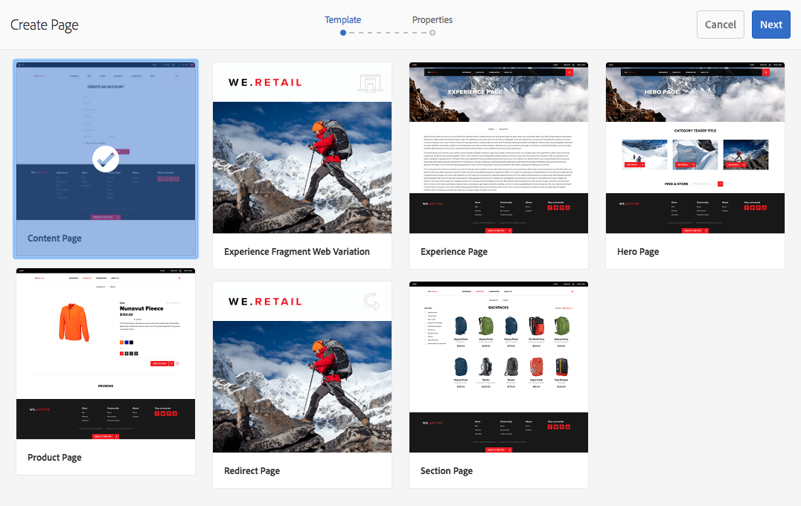

The activities and experiences that you see in Target mode reflect the [Activites console](/help/sites-authoring/activitylib.md):

* Changes that you make to activities and experiences using Targeting mode are reflected in the Activities console.
* Changes that are made in the Activities console are reflected in Targeting mode.

>[!NOTE]
>
>When you create a campaign in Adobe Target, it assigns a property called `thirdPartyId`to each campaign. When you delete the campaign in Adobe Target, thirdPartyId is not deleted. You cannot re-use the `thirdPartyId` for campaigns of different types (AB, XT) and it cannot be manually removed. To avoid this issue, name each campaign a unique name; campaign names cannot be re-used in different campaign types.
>
>If you use the same name in the same campaign type, you overwrite the existing campaign.
>
>If while synchronizing, you encounter the error "Request Failed. `thirdPartyId` already exists," change the name of the campaign and synchronize again.

>[!NOTE]
>
>When targeting, the branding and activity combination is persisted at the user level not at the channel level.

## Switching to Targeting Mode {#switching-to-targeting-mode}

Switch to Target mode to access the tools for authoring targeted content.

To switch to Target mode:

1. Open the page for which you want to author targeted content.
1. On the toolbar at the top of the page, click the mode drop-down menu to reveal the available mode types.

   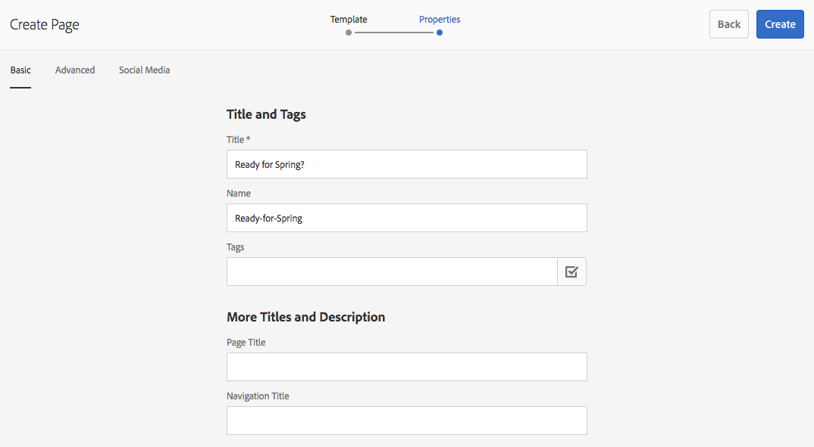

1. Click **Targeting**. Targeting options display at the top of the page.

   

## Adding an Activity Using Targeting Mode {#adding-an-activity-using-targeting-mode}

Use Targeting mode to add an activity to a brand. When you add an activity, it contains the Default experience. After you add the activity, you start the content targeting process for the activity.

You can also create and manage Adobe Target activities from AEM with the option of selecting the target engine - either AEM or Adobe Target - and selecting the activity type - Experience Targeting or A/B Test.

In addition, you can manage goals and metrics for all Adobe Target activities and manage your Adobe Target audiences. Adobe Target activity reporting, including converting of winners for A/B testing is also included.

When you add an activity, it also appears in the [Activities console](/help/sites-authoring/activitylib.md).

To add an activity:

1. Use the **Brand** drop-down menu to select the brand for which you want to create the activity.

   >[!NOTE]
   >
   >Adobe recommends that you [create brands through the activities console](/help/sites-authoring/activitylib.md#creating-a-brand-using-the-activities-console).
   >
   >
   >If you create a brand in any other way, make certain that the node `/campaigns/<brand>/master` exists or an error will result when you attempt to create an activity.

1. Click + next to the **Activity** drop-down menu.
1. Type a name for the activity.

   >[!NOTE]
   >
   >When you create an activity and have an Adobe Target cloud configuration attached to the page or one of its parent, AEM automatically assumes Adobe Target as the engine.

1. In the **Targeting** engine drop-down menu, select your targeting engine.

    * If you select **ContextHub AEM**, the remaining fields are dimmed and not available. Click **Create**.

    * If you select **Adobe Target**, you can select a configuration (by default, it is the configuration you provided when you [configured the account](/help/sites-administering/opt-in.md)) and Activity Type.

    * If you are using the AEM/Adobe Campaign integration and are sending targeted content (newsletters), select **Adobe Campaign**. See [Integrating with Adobe Campaign](/help/sites-administering/campaign.md) for more information.

1. In the Activity menu, select either **Experience Targeting** or **A/B Test**.

    * Experience targeting - manage Adobe Target activities from AEM.
    * A/B Test - create/manage A/B test activities in Adobe Target from AEM.

## The Targeting Process: Create, Target, and Goals & Settings {#the-targeting-process-create-target-and-goals-settings}

Targeting mode enables you to configure several aspects of an activity. Use the following three-step process for creating targeted content for a brand activity:

1. [Create](#create-authoring-the-experiences): Add or remove experiences, and add offers for each experience.
1. [Target](#diagramtargetconfiguringtheaudiences): Specify the audience that each experience targets. You can target a specific audience and if using A/B testing decide what percentage of traffic goes to which experience.
1. [Goals & Settings](#settingsgoalssettingsconfiguringtheactivityandsettinggoals): Schedule the activity and set the priority. You can also set success metric goals.

Use the following procedure to start the content targeting process for an activity.

>[!NOTE]
>
>To use the targeting process, you must be a member of the Target Activity Authors user group.

To add an activity:

1. In the **Brand** drop-down menu, select the brand that contains the activity that you are working on.
1. In the **Activity** drop-down menu, select the activity for which you are authoring targeted content.
1. To reveal the controls that guide you through the targeting process, click **Start Targeting**.

   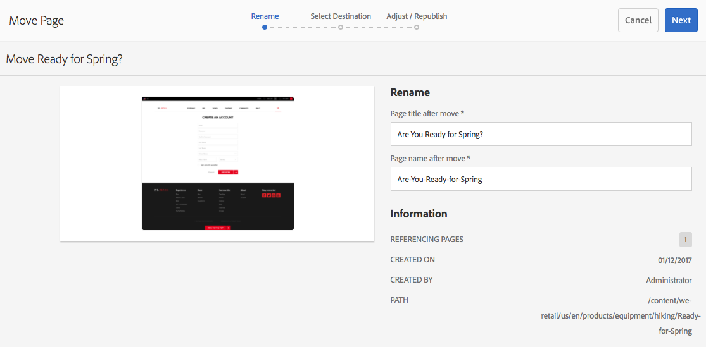

   >[!NOTE]
   >
   >To change the activity with which you are working, click **Back**.

## Create: Authoring the Experiences {#create-authoring-the-experiences}

The Create step of content targeting involves creating experiences. During this step you can create or delete the experiences of the activity, and add offers to each experience.

### Seeing Experience Offers in Targeting Mode {#seeing-experience-offers-in-targeting-mode}

After you [start the targeting process](/help/sites-authoring/content-targeting-touch.md#the-targeting-process-create-target-and-goals-settings), select an experience to see the offers that are provided for that experience. When you select an experience, the targeted components on the page change to show the offer for that experience.

>[!CAUTION]
>
>Be careful when you disable targeting for a component that is already targeted in the author instance. The respective activity is automatically deleted from the publish instance as well.

>[!NOTE]
>
>An offer is the content of a targeted component.

Experiences are displayed in the Audiences pane. In the following example, experiences include **Default**, **Female**, **Female over 30**, and **Female under 30**. This example shows the Default offer of a targeted **Image** component.

When a different experience is selected, the Image component shows the offer for that experience.

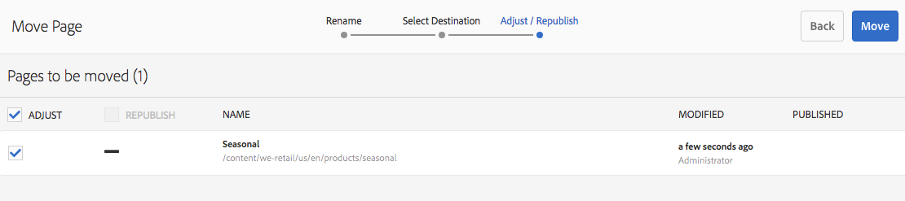

When an experience is selected and the targeted component does not include an offer for that experience, the component displays **Add Offer** superimposed upon the semi-transparent default offer. When no offer has been created for an experience, the **Default** offer is displayed for the segment that is mapped to the experience.

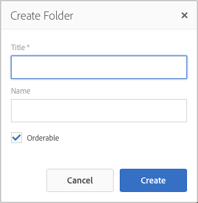

The Default experience is also displayed when the visitor properties do not match any segments that are mapped to the experiences. See [Adding Experiences using Targeting Mode](#adding-and-removing-experiences-using-targeting-mode).

### Custom offers and Library Offers {#custom-offers-and-library-offers}

Offers that are [authored on the page](/help/sites-authoring/content-targeting-touch.md#adding-a-custom-offer) and used for a single experience are called custom offers. The following image is superimposed on the content of a custom offer:

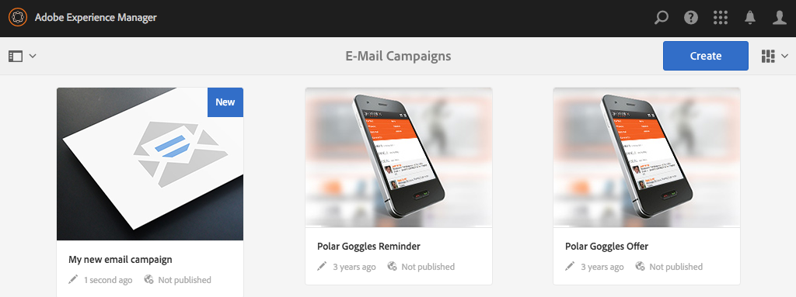

Offers that are [added from an offer library](/help/sites-authoring/content-targeting-touch.md#adding-an-offer-from-an-offer-library) are superimposed with the following image:

You can save custom offers to an offer library if you decide that you want to reuse it. You can also convert a library offer to a custom offer if you want to modify the content for an experience. After editing, you can once again save the offer back to the library.

### Adding and Removing Experiences Using Targeting Mode {#adding-and-removing-experiences-using-targeting-mode}

Using the Create step of [the targeting process](/help/sites-authoring/content-targeting-touch.md#the-targeting-process-create-target-and-goals-settings), you can add and remove experiences. In addition, you can duplicate an experience and also rename it.

#### Adding Experiences Using Targeting Mode {#adding-experiences-using-targeting-mode}

To add an experience:

1. To add an experience, click **+** **Add Experience Targeting** that appears below existing experiences in the **Audiences** pane.
1. Select and audience. By default, that name is the name of the experience. You can type another name, if desired. Click **OK**.

#### Removing Experiences Using Targeting Mode {#removing-experiences-using-targeting-mode}

To delete an experience:

1. Click the arrow next to the experience name.

   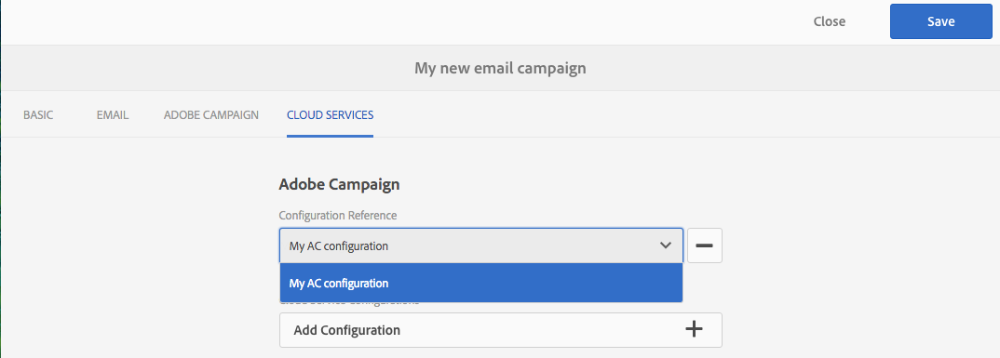

1. Click **Delete**.

#### Renaming Experiences Using Targeting Mode {#renaming-experiences-using-targeting-mode}

To rename experiences using Targeting Mode:

1. Click the arrow next to the experience name.
1. Click **Rename Experience** and type in the new name.
1. Click somewhere else on the screen to save the changes.

#### Editing Audiences Using Targeting Mode {#editing-audiences-using-targeting-mode}

To edit the audiences using Targeting Mode:

1. Click the arrow next to the experience name.
1. Click **Edit Audience** and select a new audience.
1. Click **OK**.

#### Duplicating Experiences Using Targeting Mode {#duplicating-experiences-using-targeting-mode}

To copy experiences using Targeting Mode:

1. Click the arrow next to the experience name.
1. Click **Duplicate** and choose the audience.
1. Rename the experience, if desired, and click **OK**.

### Creating Offers Using Targeting Mode {#creating-offers-using-targeting-mode}

Target a component to create offers for experiences. Targeted components provide the content that is used as offers for experiences.

* [Target an existing component](/help/sites-authoring/content-targeting-touch.md#creating-a-default-offer-by-targeting-an-existing-component). The content becomes the offer of the Default Experience.
* [Add a Target component](/help/sites-authoring/content-targeting-touch.md#creating-an-offer-by-adding-a-target-component), then add content to the component.

After a component is targeted, you can add offers for each experience:

* [Add custom offers](/help/sites-authoring/content-targeting-touch.md#adding-a-custom-offer).
* [Add offers from a library](/help/sites-authoring/content-targeting-touch.md#adding-an-offer-from-an-offer-library).

The following tools are available for working with offers:

* [Add a custom offer to an offer library](/help/sites-authoring/content-targeting-touch.md#adding-a-custom-offer-to-a-library).
* [Convert a library offer to a custom offer](/help/sites-authoring/content-targeting-touch.md#converting-a-library-offer-to-a-custom-library).
* [Open a library offer and edit the content](/help/sites-authoring/content-targeting-touch.md#editing-a-library-offer).

#### Creating a Default Offer By Targeting an Existing Component {#creating-a-default-offer-by-targeting-an-existing-component}

Target a component on the page to use it as the offer for the Default experience of the activity. When you target a component, it is enveloped in a Target component and its content becomes the offer for the Default experience.

When you target a component, only that component can be used in the offer. You cannot remove the component from the offer or add other components to the offer.

Perform the following procedure after [starting the targeting process](/help/sites-authoring/content-targeting-touch.md#the-targeting-process-create-target-and-goals-settings).

1. Click the component to target. The toolbar for the component appears, similar to the following example.

   

1. Click the Target icon.

   

   The component content is the offer for the Default experience. When a component is targeted, its default node is replicated for each experience. This is needed for editing the correct content node during experience specific authoring. For these non-default experiences, either [add a custom offer](/help/sites-authoring/content-targeting-touch.md#adding-a-custom-offer) or [add a library offer](/help/sites-authoring/content-targeting-touch.md#adding-an-offer-from-an-offer-library).

#### Creating an Offer By Adding a Target Component {#creating-an-offer-by-adding-a-target-component}

Add a Target component to create the offer for the Default experience. The Target component is a container for other components, and components that are placed within it become targeted. When you use the Target component, you can add several components to create an offer. Also, you can use different components in each experience to create different offers.

See [Configuring Target component options](/help/sites-authoring/content-targeting-touch.md#configuring-target-component-options) for information on customizing this component.

>[!NOTE]
>
>Offers that you create using the [Offers console](/help/sites-authoring/offerlib.md) can also contain several components. These offers belong to an offer library and can be used for multiple experiences.

Because the Target component is a container, it appears as a drop area for other components.

In Target mode, the Target component has a blue border, and the drop-target message indicates the targeted nature.

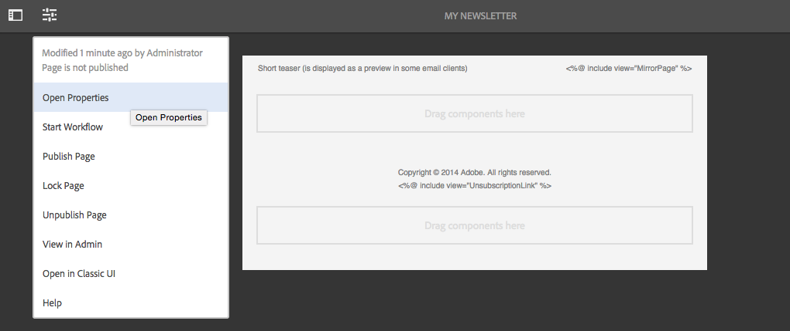

In Edit mode, the Target component has a bullseye icon.

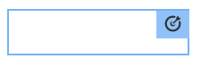

When you drag components into the Target component, they are targeted components.

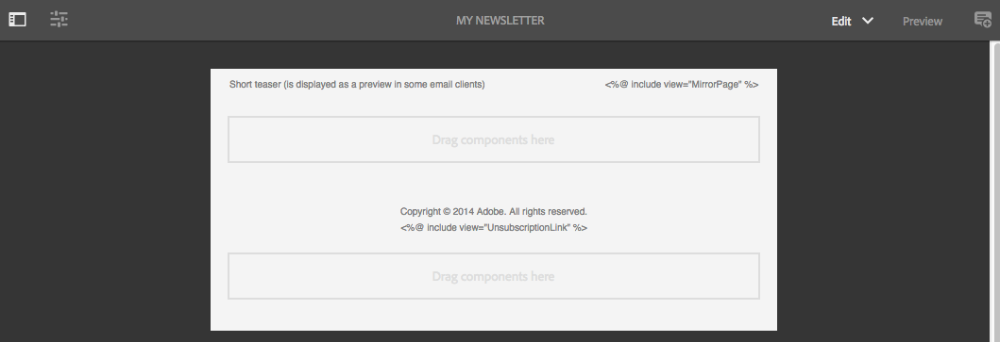

When you add a component to the Target component, it provides content for a specific experience. To specify the experience, you select the experience before you add the components.

You can add a Target component to the page in Edit mode or in Target mode. You can add components to the Target component only in Target mode. The Target component belongs to the Personalization component group.

If editing targeted content, you must click **Start Targeting** before you can do so.

1. Drag the Target component to the page where you want the offer to appear.
1. By default, no location ID is set. Click the configure cog wheel to set the location.

   >[!NOTE]
   >
   >If set by your administrator, you may need to set the location explicitly.
   >
   >
   >Administrators can decide whether setting this configuration is required at **https://&lt;host&gt;:&lt;port&gt;/system/console/configMgr/com.day.cq.personalization.impl.servlets.TargetingConfigurationServlet**
   >
   >
   >To require users to input a location, select the **Force location **check box.

1. Select the experience for which you want to create the offer.
1. Create the offer:

    * For the Default experience, drag components to the targeted drop area, and edit the component properties as usual to create the content for the offer.
    * For non-default experiences, either [add a custom offer](#adding-a-custom-offer) or [add a library offer](/help/sites-authoring/content-targeting-touch.md#adding-an-offer-from-an-offer-library).

#### Adding a Custom Offer {#adding-a-custom-offer}

Create an offer by authoring the content of a targeted component in Targeting mode. When you create a custom offer, it is used as the offer for a single experience.

If you decide that the offer can be used for other experiences, you can create a custom offer and [add it to the library](/help/sites-authoring/content-targeting-touch.md#adding-a-custom-offer-to-a-library). For information about using the Offers console to create a reusable offer, see [Add an Offer to an Offer Library](/help/sites-authoring/offerlib.md#add-an-offer-to-an-offer-library).

1. Select the experience to which you are adding the offer.
1. To reveal the component menu, click the targeted component to which you are adding the offer.

   

1. Click the + icon.

   The content of the Default offer is used as the offer for the current experience.

1. Click the offer to reveal the offer menu, then click the edit icon.

   

1. Edit the content of the component.

#### Adding an Offer From an Offer Library {#adding-an-offer-from-an-offer-library}

Add an offer from the [offer library](/help/sites-authoring/offerlib.md) to an experience. You can add any offer from the library of the brand that you are currently targeting.

You cannot add library offers to the Default experience.

1. Select the experience to which you are adding the offer.
1. To reveal the component menu, click the targeted component to which you are adding the offer.

   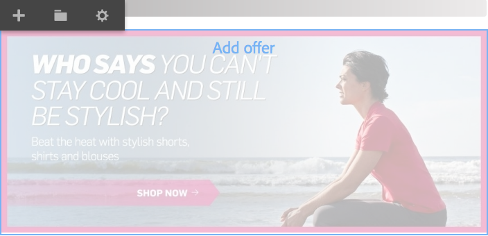

1. Click the folder icon.

   

1. Select the offer from the library and then click the checkmark icon.

   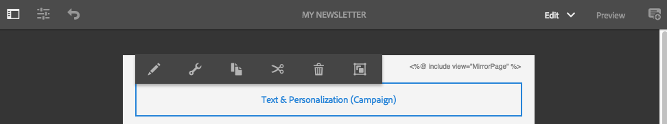

   The offer picker lets you browse or filter for offers. When browsing or filtering, you may also want to sort the offers and change how you view them. The number in the upper-right indicates how many offers are available in the current library.

    * Click **Browse** to navigate to another folder. The navigation pane opens and you click the arrow to drill down into folders. Click **Browse** again to close the navigation pane.

   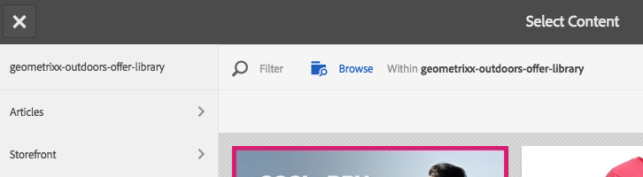

    * Click **Filter** to filter the offers against keywords or tags. You enter keywords and you select tags from the drop-down menu. Click **Filter** again to close the filtering pane.

   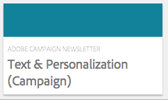

    * Change how you sort the offers by clicking or tapping the arrow next to **Newest to Oldest**. Offers can be sorted newest to oldest or oldest to newest.

   

   Click the icon next to **View as** to view offers as tiles or as a list.

   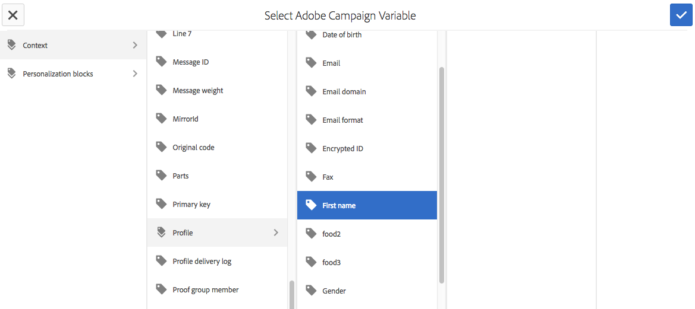

#### Adding a Custom Offer to a Library {#adding-a-custom-offer-to-a-library}

Add a custom offer to the [offer library](/help/sites-authoring/offerlib.md) when you want to reuse it as the offer for multiple experiences. You can add offers to the library of the current brand that you are targeting.

For information about using the Offers console to create a reusable offer, see [Add an Offer to an Offer Library](/help/sites-authoring/offerlib.md#add-an-offer-to-an-offer-library).

1. Select the experience to reveal the custom offer.
1. Click the custom offer to reveal the offer menu, then click the **Save Offer To Offer Library** icon.

   

1. Type a name for the offer, and select the library to which you are adding the offer, then click the checkmark icon.

#### Converting a Library Offer to a Custom Library {#converting-a-library-offer-to-a-custom-library}

Convert a library offer to a custom offer to change the offer for current experience and without changing the offer in other experiences.

1. Select the experience to reveal the library offer.
1. Click the library offer to reveal the offer menu, then click the Convert to Inline Offer icon.

   

#### Editing a Library Offer {#editing-a-library-offer}

Open a library offer from an experience in Targeted mode to edit the offer. The changes that you make appear in all experiences that uses the offer.

1. Select the experience to reveal the library offer.
1. Convert the library offer to a local/custom offer. See [Converting a Library Offer to a Custom Library](#converting-a-library-offer-to-a-custom-library).
1. Edit the content of the offer.

1. Save it back to the library. See [Adding a Custom Offer to a Library](#adding-a-custom-offer-to-a-library).

## Target: Configuring the Audiences {#target-configuring-the-audiences}

The Target step of [the targeting process](/help/sites-authoring/content-targeting-touch.md#the-targeting-process-create-target-and-goals-settings) involves mapping audiences with the experiences that you worked with in the Create step. The Target page shows the audiences that each experience is targeting. You can specify or change the audience for each experience. If you are using Adobe Target, you can also create A/B tests that let you target percentage of traffic for an audience to a particular experience.

### If you are using AEM targeting or Adobe Target (experience targeting) ... {#if-you-are-using-aem-targeting-or-adobe-target-experience-targeting}

Audiences appear on the left side of the mapping diagram, and experiences appear on the right side.

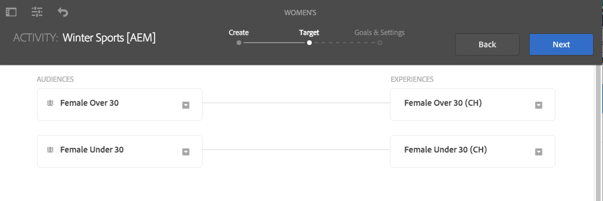

Define an audience using a segment. The cloud configuration for the page determines the segments that are available to you. When the page is not associated with an Adobe Target cloud configuration, AEM segments are available for defining audiences. When the page is associated with an Adobe Target cloud configuration, you use Target segments.

For information targeting engines, see [Targeting Engine](/help/sites-authoring/personalization.md#targeting-engine).

Do not use an audience more than one experience. A warning symbol appears next to an experience when it is mapped to an audience that is mapped to another experience.

### Associating experiences with audiences (AEM or Adobe Target) {#associating-experiences-with-audiences-aem-or-adobe-target}

Use the following procedure to associate an experience with an audience when using AEM targeting (or Adobe Target experience targeting):

1. Click the drop-down arrow next in the audience box that is mapped to the experience.
1. (Optional) Click **Edit** and then type a keyword to search for the desired segment.
1. In the list of audiences, select the audience and click **OK**.

### If you are using A/B Testing (Adobe Target) ... {#if-you-are-using-a-b-testing-adobe-target}

If you have an A/B test activity, audiences are on your left, the percentage that each experience is viewed is in the middle, and the experiences are on the right.

You can change the percentages as long as they add up to 100 percent. An audience can be used by multiple experiences in A/B testing.

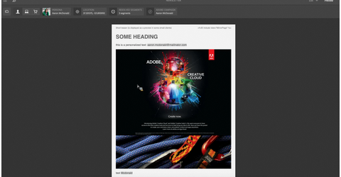

### Associating Audiences and Traffic Percentages with A/B Testing {#associating-audiences-and-traffic-percentages-with-a-b-testing}

1. Click the drop-down box next to the audience that is mapped to the experience.
1. (Optional) Click **Edit**, then type a keyword to search for the desired segment.
1. Click **OK.**
1. Enter in percentages to configure how audience traffic is routed to each experiences. The total number must equal 100.
1. (Optional) Edit the experience name by clicking the drop-down menu next to the experience name.

## Goals & Settings: Configuring the Activity and Setting Goals {#goals-settings-configuring-the-activity-and-setting-goals}

The Goals & Settings step of [the targeting process](/help/sites-authoring/content-targeting-touch.md#the-targeting-process-create-target-and-goals-settings) involves configuring the behavior of the brand activity. Specify when the activity starts and ends, and the activity priority. In addition, you also track goals. Specifically you can decide what you want to measure with your activities.

Goal Metrics are only available if you use Adobe Target for your targeting engine. Define at least one goal metric. If you have Adobe Analytics configured and have an A4T Analytics cloud configuration, you can select whether you want the reporting source to be Adobe Target or Adobe Analytics.

The goal metrics are only measured for the published campaign.

If using AEM as the targeting engine:

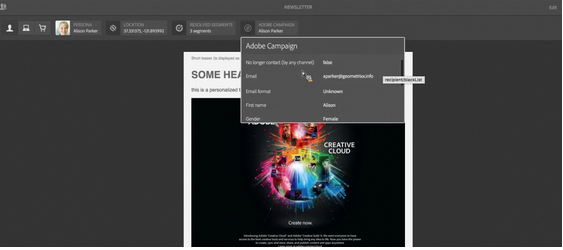

If using Adobe Target as the targeting engine:

If using Adobe Target as the targeting engine and you have A4T Analytics configured for the account, you have an additional **Reporting Source** drop-down menu:

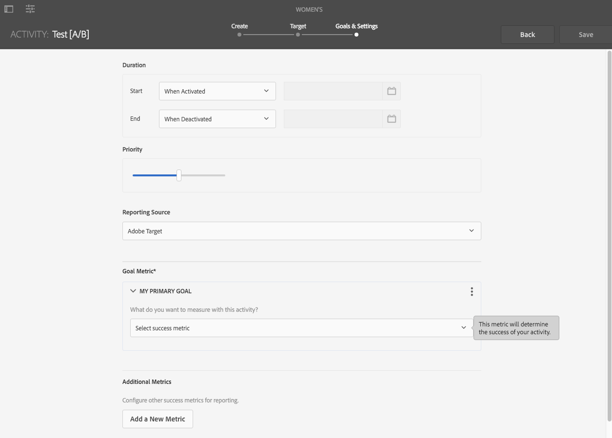

The following success metrics are available (used for publish only):

<table>
 <tbody>
  <tr>
   <td><strong>Conversion</strong></td>
   <td>
The percentage of visitors who clicked on any part of the experience being tested. A conversion can either be counted once per visitor or each time any visitor completes a conversion. The conversion metric is set to one of the following:

    <ul>
     <li><strong>Viewed a page</strong> - You can define what page the audience viewed by selecting either <strong>URL is</strong> and then defining the URL or multiple URLs, or by selecting <strong>URL contains</strong> and then adding a path or keyword.</li>
     <li><strong>Viewed an mbox</strong> - You can define what mbox your audience viewed by entering the name of the mbox. You can enter multiple mboxes by clicking <strong>Add an Mbox</strong>.</li>
    </ul> </td>
  </tr>
  <tr>
   <td><strong>Revenue</strong></td>
   <td>
Revenue generated by the visit. You can choose from the following revenue metrics:

    <ul>
     <li>Revenue per Visitor (RPV)</li>
     <li>Average Order Value (AOV)</li>
     <li>Total Sales </li>
     <li>Orders</li>
    </ul> 
For any of these options, whether an mbox was viewed indicates that the goal has been reached. You can define the mbox or multiple mboxes.
 </td>
  </tr>
  <tr>
   <td><strong>Engagement</strong></td>
   <td>
You can measure three types of engagement:

    <ul>
     <li>Page Views</li>
     <li>Custom Scoring</li>
     <li>Time on Site</li>
    </ul> </td>
  </tr>
 </tbody>
</table>

In addition, there are advanced settings that let you determine how to count success metrics. Options include counting the metric per impression or once per visitor and choosing whether to keep the user in the activity or removing them.

Use the advanced settings to determine what happens **after** a user encounters the goal metric. The following table shows the available options.

<table>
 <tbody>
  <tr>
   <td><strong>After a user encounters this goal metric...</strong></td>
   <td><strong>You select the following to happen...</strong></td>
  </tr>
  <tr>
   <td><strong>Increment Count &amp; Keep User in Activity</strong></td>
   <td>Specify how the count is incremented:
    <ul>
     <li>Once per entrant</li>
     <li>On every impression, excluding page refreshes</li>
     <li>On every impression</li>
    </ul> </td>
  </tr>
  <tr>
   <td><strong>Increment Count, Release User &amp; Allow Re-entry</strong></td>
   <td>Select the experience the visitor sees if they reenter the activity:
    <ul>
     <li>Same experience</li>
     <li>Random experience</li>
     <li>Unseen experience</li>
    </ul> </td>
  </tr>
  <tr>
   <td><strong>Increment Count, Release User &amp; Bar Re-entry</strong></td>
   <td>Determine what the user sees instead of the activity content:
    <ul>
     <li>Same experience, without tracking</li>
     <li>Default content or other activity content</li>
    </ul> </td>
  </tr>
 </tbody>
</table>

See [Adobe Target documentation](https://experienceleague.adobe.com/docs/target/using/activities/success-metrics/success-metrics.html) for more information on success metrics.

### Configuring Settings (AEM Targeting) {#configuring-settings-aem-targeting}

To configure settings if using AEM targeting:

1. To specify when the activity starts, use the **Start** drop-down menu to select one of the following values:

    * **When Activated**: The activity starts when the page that contains the targeted content is activated.
    * **Specified Date & Time**: A specific time. When you select this option, click the calendar icon, select a date, and specify the time to start the activity.

1. To specify when the activity ends, use the **End** drop-down menu to select one of the following values:

    * **When Deactivated**: The activity ends when the page that contains the targeted content is deactivated.
    * **Specified Date & Time**: A specific time. When you select this option, click the calendar icon, select a date, and specify the time to end the activity.

1. To specify a priority for the activity, use the slider to select either **Low**, **Normal**, or **High**.

### Configuring Goals & Settings (Adobe Target) {#configuring-goals-settings-adobe-target}

To configure goals and settings if using Adobe Target:

1. To specify when the activity starts, use the **Start** drop-down menu to select one of the following values:

    * **When Activated**: The activity starts when the page that contains the targeted content is activated.
    * **Specified Date & Time**: A specific time. When you select this option, click the calendar icon, select a date, and specify the time to start the activity.

1. To specify when the activity ends, use the **End** drop-down menu to select one of the following values:

    * **When Deactivated**: The activity ends when the page that contains the targeted content is deactivated.
    * **Specified Date & Time**: A specific time. When you select this option, click the calendar icon, select a date, and specify the time to end the activity.

1. To specify a priority for the activity, use the slider to select either **Low**, **Normal**, or **High**.
1. If you have configured Adobe Anaytics with your Adobe Target Account, then you see the **Reporting Source** drop-down menu. Select **Adobe Target** or **Adobe Analytics** as the source.

   If you select **Adobe Analytics**, select the company and report suite. If you select **Adobe Target**, no action is required.

   

1. In the **Goal Metric** area, under **My Primary Goal** select the success metric you want to track - Conversion, Revenue, Engagement - and enter how that metric gets measured (or what action the audience takes to indicate a goal has been reached). See definition of the goal metrics in the previous table and see [Adobe Target documentation](https://experienceleague.adobe.com/docs/target/using/activities/success-metrics/success-metrics.html) on success metrics.

   You can rename the goal by clicking the three dots in the upper right corner and selecting **Rename**.

   If you need to clear all the fields, click the three dots in the upper right corner and select **Clear all Fields**.

   All metrics also have advanced settings you can define. Select **Advanced Settings** to access those. See definition of how success metrics are counted in previous table and see [Adobe Target documentation](https://experienceleague.adobe.com/docs/target/using/activities/success-metrics/success-metrics.html).

   >[!NOTE]
   >
   >You must have at least one goal defined.

   

   >[!NOTE]
   >
   >If there is information missing in your metric, a red line surrounds the metric.

1. Click **Add a New Metric** to configure additional success metrics.

   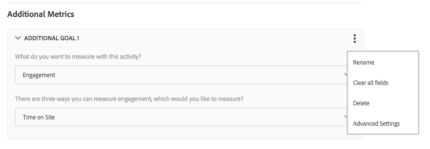

   >[!NOTE]
   >
   >You can remove additional goals by clicking or tapping the three dots and clicking or tapping **Delete**. AEM requires that you have at least one goal defined.

1. If you want more control over how success metrics are counted, click **Advanced Settings** to access those.
1. Click **Save**.

After configuring, you can [view the performance of your activities](/help/sites-authoring/activitylib.md#viewing-performance-and-converting-winning-experiences-a-b-test) that use Adobe Target (either experience or A/B test targeting). In addition, with A/B test targeting, you can [convert the winners.](/help/sites-authoring/activitylib.md#viewing-performance-and-converting-winning-experiences-a-b-test)

## Simulating an Experience {#simulating-an-experience}

Simulate a visitor's experience to verify that the page content appears as expected according to the design of your targeted content. When simulating, load different user profiles and see the targeted content for that user.

The following criteria determine the content that appears when simulating a visitor's experience:

* The data in the user's session store (via Context Hub).
* The [Activities that are On](/help/sites-authoring/activitylib.md).
* The [rules that define the segments](/help/sites-administering/campaign-segmentation.md).
* The content of the experiences in the Target components.
* The [configuration of the Targeting engine](/help/sites-authoring/activitylib.md).

If unexpected content appears on the page when you load a profile, check the configuration of each item in this list.

>[!NOTE]
>
>If you are using A/B testing, when simulating experiences are shown based on traffic percentage. This is controlled by Adobe Target, which may lead to unexpected results for authors. (The _author activity is synchronized with specific settings that allow re-evaluation during simulation.) Authors may need to refresh to see the other experiences based on their traffic settings.

To simulate the visitor's experience, use the following tools:

* The simulation Activity in Targeting mode: The page displays the offers for the user that is currently selected in Context Hub. You can edit the offers that target the user.
* Preview mode: Use Context Hub to select the users and locations that satisfy the criteria of the segments that your experiences are based on. When your Context Hub selections change, the targeted content changes accordingly.

1. To switch to Preview mode, on the toolbar click **Preview**.
1. On the tool bar, click the Context Hub icon.

   

1. Use Context Hub to change context properties. For example, click the Persona property to select a different user.

   

   The page changes to show the content that is targeted for the current context.

1. To change the offers that are displayed, switch to Targeting mode. With the simulation activity selected, edit the offers for the context that you configured in Preview mode.

## Configuring Target Component Options {#configuring-target-component-options}

You can customize the Target component by accessing the component's options in one of two ways:

1. After you have targeted the component, in the Target component, click the component and then the settings icon (cog).

   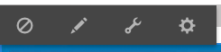

   AEM displays the Target component options window.

   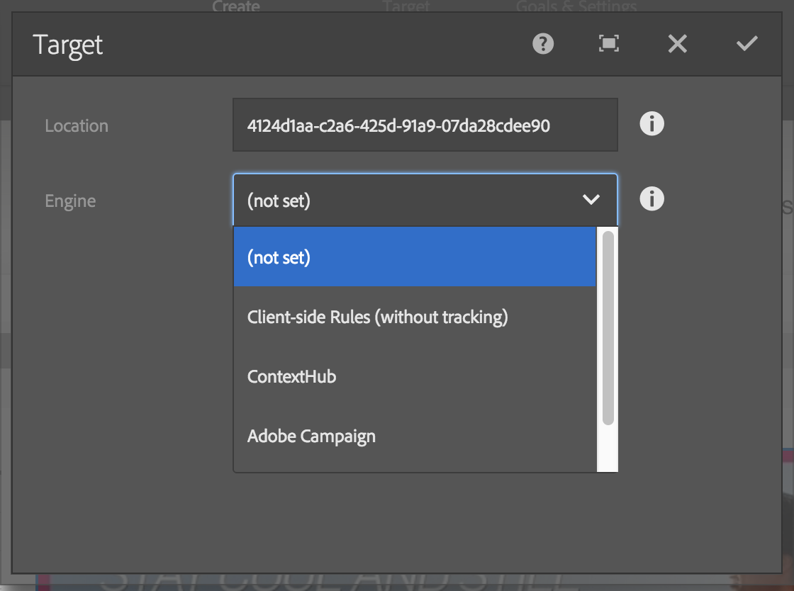

1. Alternatively to access these settings in full screen mode, in the Target component options window, click the full screen icon.

   

   AEM displays the full-screen Target component options window.

   

1. Configure the Target component settings as described in the following tables.

<table>
 <tbody>
  <tr>
   <td><strong>Option</strong></td>
   <td><strong>Description</strong></td>
  </tr>
  <tr>
   <td><strong>Location</strong></td>
   <td>
The location is a string that gives the targeted content location a name and connects offers with places (or locations or components) on the page where those offers should be placed.
 
This field is a generic value.
 
If you put an offer into a component, the offer remembers the location ID. When the page is executed, the engine evaluates the user's segments and based on this, it resolves the experiences from the active campaigns that should be displayed. Then, it checks the location IDs on the page and tries to match offers with those location IDs to them.
 </td>
  </tr>
  <tr>
   <td><strong>Engine</strong></td>
   <td>Select between <strong>Client side Rules (without tracking), Adobe Target, ContextHub, </strong>and<strong> Adobe Campaign </strong>depending on which engine you would like to use.</td>
  </tr>
 </tbody>
</table>

   If you select Adobe Target as the engine:

   

<table>
 <tbody>
  <tr>
   <td><strong>Option</strong></td>
   <td><strong>Description</strong></td>
  </tr>
  <tr>
   <td><strong>Accurate targeting</strong></td>
   <td>
Enabling accurate targeting tells the component to wait for client context or context hub data to be available before sending the request to Adobe Target. It may increase load time. For authoring, accurate targeting is always enabled.
 
If you select the <strong>Accurate targeting</strong> check box, the mbox performs an <code>mboxDefine</code> first and an <code>mboxUpdate</code> later resulting in an Ajax request once the data is available.
 
If you do not select the <strong>Accurate targeting</strong> check box, the mbox performs an <code>mboxCreate</code> resulting in a synchronous request right away (in this case, not all context data may be available yet).
 
<strong>Note:</strong> Enabling or disabling accurate targeting on a specific component does not affect the settings you have set globally. You can always override global settings by selecting Accurate Targeting in the component.
 </td>
  </tr>
  <tr>
   <td><strong>Include resolved segments</strong></td>
   <td>
Selecting this check box includes all resolved segments in the mbox call and any parameters configured in the page and in the framework.
 
This only works in situations with XML API where you are synchronizing AEM segments. If you have segments in AEM that are not handled by Adobe Target (like script segments), then this option lets you resolve the segment in AEM and send information to Adobe Target that the segment is active.
 </td>
  </tr>
  <tr>
   <td><strong>Inherited context parameters</strong></td>
   <td>Lists context parameters inherited from the Adobe Target framework, if any, associated with the selected page.</td>
  </tr>
  <tr>
   <td><strong>Context Params</strong></td>
   <td>Click <strong>Add field</strong> to configure additional context parameters (same as what is available in Target framework). Context parameters added to the component apply <i>only</i> to the component and not to other component as would be the case if you added context parameters directly to the framework.</td>
  </tr>
  <tr>
   <td><strong>Static Params</strong></td>
   <td>Click <strong>Add field</strong> to configure additional static parameters (same as what is available in Target framework). Static parameters added to the component apply <i>only</i> to the component and not to other component as would be the case if you added static parameters directly to the framework. Static parameters do not come from context (client context of content hub).</td>
  </tr>
 </tbody>
</table>

   >[!NOTE]
   >
   >When you select a component and make it target-able, AEM also replaces the component and injects an Adobe Target component. (The Adobe Target component is not only used when you add it manually to the page, but also when you target an existing component.)

   If you select Client Context (client side) as the engine:

   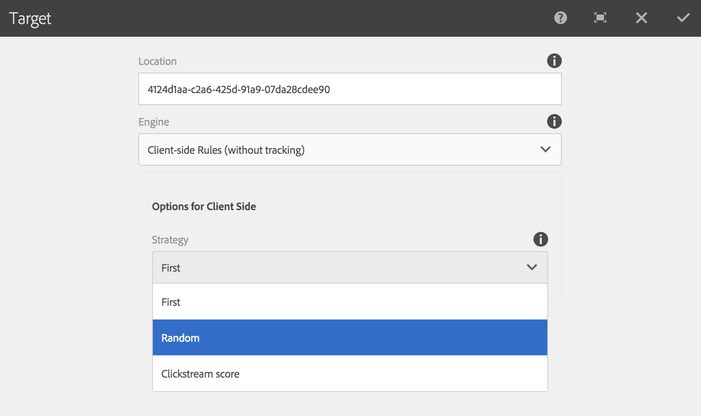

<table>
 <tbody>
  <tr>
   <td><strong>Option</strong></td>
   <td><strong>Description</strong></td>
  </tr>
  <tr>
   <td><strong>Options for client side - Strategy</strong></td>
   <td>
Select from one of the following:

    <ul>
     <li><strong>First</strong>: The topmost experience in the list as ordered in the campaign.</li>
     <li><strong>Random</strong>: Any experience is used.</li>
     <li><strong>Clickstream Score</strong>: The tags and related tag hits that are tracked in the client context are used. The hit rates for tags defined on the teaser page are compared.</li>
    </ul> </td>
  </tr>
 </tbody>
</table>

   You select **Adobe Campaign** as the engine if you are integrating AEM with Adobe Campaign. See [Integrating AEM with Adobe Campaign](/help/sites-administering/campaign.md) for more information.

   Select **ContextHub** as the engine if you are using ContextHub for targeting. See [Configuring ContextHub.](/help/sites-developing/ch-configuring.md)
