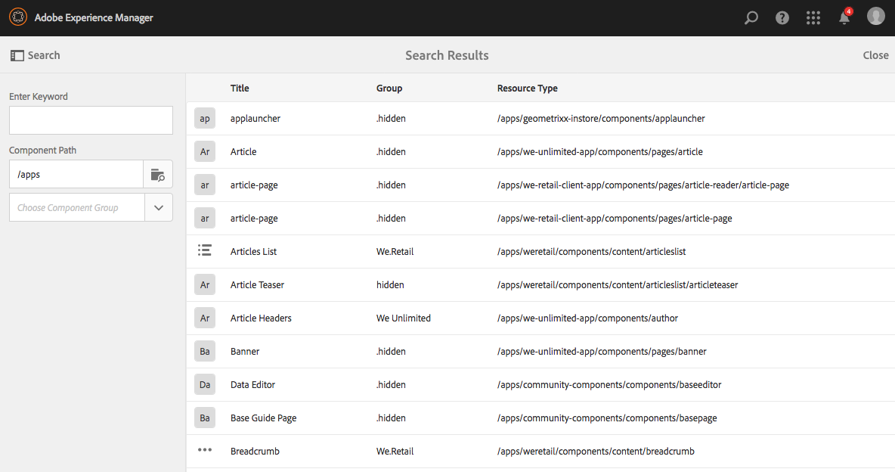

# Components Console{#components-console}

The Components console allows you to browse through all components defined for your instance and view key information for each component.

It can be accessed from **Tools** -&gt; **General** -&gt; **Components**. In the console, card and list view are available. Because there is no tree structure for components, column view is not available.

>[!NOTE]
>
>The Component Console shows all components in the system. The [Component Browser](/help/sites-authoring/author-environment-tools.md#components-browser) shows components that are available to authors and hides any component groups that begin with a period ( `.`).

## Search {#search-features}

With the **Content Only** icon (top left) you can open the **Search** panel to search and/or filter the components:

 

## Component Details {#component-details}

To view details about a specific component tap/click on the required resource. Three tabs provide:

* **Properties**

  

  On the Properties tab you can:

    * View the general properties of the component.
    * View how the [icon or abbreviation has been defined](/help/sites-developing/components-basics.md#component-icon-in-touch-ui) for the component.

        * Clicking the source of the icon will take you to that component.

    * View the **Resource Type** and **Resource Super Type** (if defined) for the component.

        * Clicking the Resource Super Type will take you to that component.

  >[!NOTE]
  >
  >Because `/apps` is not editable at runtime, the Components Console is read-only.

* **Policies**

  

* **Live Usage**

  

  >[!CAUTION]
  >
  >Due to the nature of the information being collected for this view, it can take a while to be collated/displayed.

* **Documentation**

  If the developer has provided [documentation for the component](/help/sites-developing/developing-components.md#documenting-your-component), it will appear on the **Documentation** tab. If there is no documentation available, the **Documentation** tab will not be shown.

  

