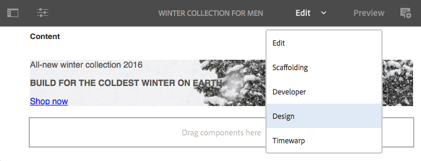
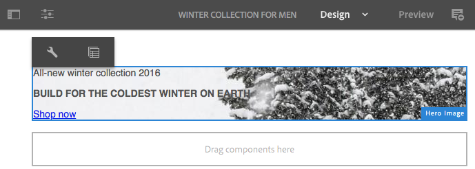
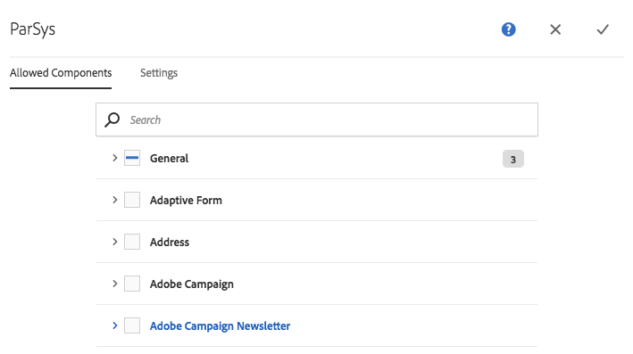
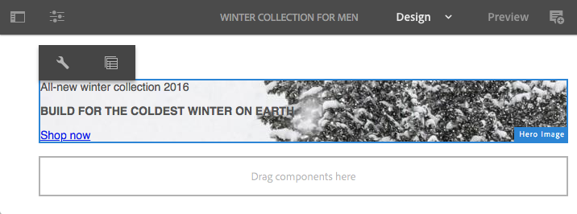
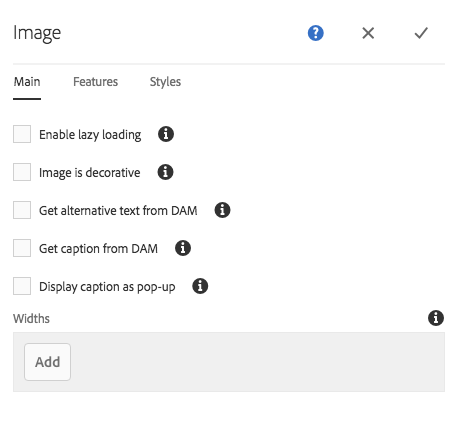
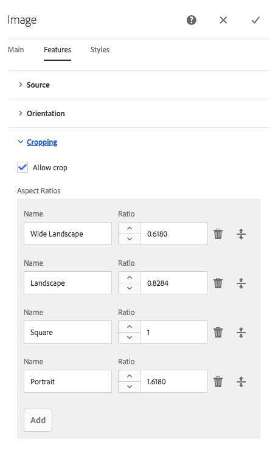

# Configuring default components in Design Mode{#configuring-components-in-design-mode}

When AEM instance is installed out-of-the-box, a selection of components are immediately available in the components browser.

In addition to these, various other components are also available. You can use Design mode to [enable/disable such components](#enable-disable-components). When enabled and located on your page you can then use Design mode to [configure aspects of the component design](#configuring-the-design-of-a-component) by editing the attribute parameters.

>[!NOTE]
>
>Care must be taken when editing these components. The design settings are often an integral part of the design of the entire website, so they should only be changed by someone with the appropriate privileges and experience, often an administrator or a developer. See [Developing Components](/help/sites-developing/components.md) for more information.

>[!NOTE]
>
>Design mode is only available for static templates. Templates that are created with editable templates should be edited using the [template editor](/help/sites-authoring/templates.md).

>[!NOTE]
>
>Design mode is only available for design configurations stored as content under ( `/etc`).
>
>Starting in AEM 6.4, it is recommended to store designs as configuration data under `/apps` to support continuous deployment scenarios. Designs stored under `/apps` are not editable at runtime and the Design mode will not be available to non-admin users for such templates.

This involves adding or removing the components allowed in the paragraph system for the page. The paragraph system ( `parsys`) is a compound component that contains all other paragraph components. The paragraph system allows authors to add components of different types to a page as it contains all other paragraph components. Each paragraph type is represented as a component.

For example, the content of a product page may contain a paragraph system holding the following:

* An image of the product (in the form of an image or textimage paragraph)
* The product description (as a text paragraph)
* A table with technical data (as a table paragraph)
* A form users fill out (as a forms begin, forms element, and forms end paragraph)

>[!NOTE]
>
>See [Developing Components](/help/sites-developing/components.md) and [Guidelines for Using Templates and Components](/help/sites-developing/dev-guidelines-bestpractices.md#guidelines-for-using-templates-and-components) for more information about `parsys`.

>[!CAUTION]
>
>Editing the design using Design Mode as described in this article is the recommended way to define designs of static templates
>
>Modifying designs in CRX DE for example is not best practice and the application of such designs can vary from expected behavior. See the developer document [Page Templates - Static](/help/sites-developing/page-templates-static.md#how-template-designs-are-applied) for more information.

## Enable/Disable Components {#enable-disable-components}

To either enable or disable a component:

1. Select the **Design** mode.

   

1. Tap or click on a component. The component will have a blue border when selected.

   

1. Click or tap the **Parent** icon.

   

   This will select the paragraph system containing the current component.

1. The **Configure** icon for the paragraph system will be shown in the parent's action bar.

   

   Select this to show the dialog.

1. Use the dialog to define the components available in the components browser when editing the current page.

   

   The dialogue has two tabs:

    * Allowed Components
    * Settings

   **Allowed Components**

   On the **Allowed Components** tab, you define which components are available for the parsys.

    * The components are grouped by their component groups, which can be expanded and collapsed.
    * An entire group can be selected, by checking the group name and all can be deselected by unchecking.
    * A minus represents at least one but not all items in a group are selected.
    * A search is available to filter for a component by name.
    * The counts listed to the right of the component group name represent the total number of selected components in those groups regardless of the filter.

   You define the configuration per page component. If child pages use the same template and/or page component (usually aligned), then the same configuration will be applied to the corresponding paragraph system.

   >[!NOTE]
   >
   >Adaptive form components are designed to work inside Adaptive Form Container to leverage the Forms ecosystem. Therefore, these components must be used only in adaptive form editor and they will not function in the Sites page editor.

   **Settings**

   On the **Settings** tab you can define additional options such as to draw an anchor for each component and to define the cell padding of each container.

1. Select **Done** to save your configuration.

## Configuring the Design of a Component {#configuring-the-design-of-a-component}

1. Select the **Design** mode.

   

1. Tap or click on a component with a blue border. In this example a hero image component is selected.

   

1. Use the **Configure** icon to open the dialogue.

   

   In the design dialogue, you can configure the component according to the design parameters available.

   

   The dialogue has three tabs:

    * Main
    * Features
    * Styles

   **Properties**

   The **Properties** tab allows you to configure the important design parameters of the component. For example for an image component you can define the maximum and minimum size of the image allowed.

   **Features**

   The **Features** tab allows you to enable or disable additional features of the component. For example, for an image component you can define the orientation of the image, the cropping options available, and if an image can be uploaded.

   **Styles**

   The **Styles** tab allows you to define the CSS classes and styles to be used with the compoent.

   

   Use the **Add** button to add additional entries to a multiple-entry dialogue list.

   

   Use the** Delete **icon to remove an entry from a multiple-entry dialogue list.

   

   Use the **Move** icon to rearrange the order of entries in a multiple-entry dialogue list.

   

1. Click or tap the **Done** icon to save and close the dialogue.
