# Foundation Components {#foundation-components}

>[!CAUTION]
>
>Most Foundation Components are now deprecated with AEM 6.5. See the [release notes](/help/release-notes/deprecated-removed-features.md) for further information.
>
>Adobe recommends using the more modern and extensible [Core Components](https://experienceleague.adobe.com/docs/experience-manager-core-components/using/introduction.html) in AEM projects. These components are part of the [We.Retail sample content](/help/sites-developing/we-retail.md) and can also be [installed separately and used for development](https://experienceleague.adobe.com/docs/experience-manager-core-components/using/get-started/using.html) by your administrator.
>
>You can use the [AEM Modernize Tools Suite](https://opensource.adobe.com/aem-modernize-tools/) to refactor your Foundation Components-based site to use Core Components.

The foundation components were designed for use when authoring content for a standard web page. They form a subset of the components available out-of-the-box for a standard installation of AEM.

Some are immediately available through component browser. Various others are also available by using [design mode](/help/sites-authoring/default-components-designmode.md) (if the page is based on a static template) or by [editing the template](/help/sites-authoring/templates.md) (if the page is based on an editable template).

The use of foundation components is supported, but they have been mostly deprecated and superseded by Core Components which offer more extensibility and flexibility.

>[!NOTE]
>
>This section only discusses components that are available out-of-the-box in a standard AEM installation.
>
>Depending on your instance, you may have customized components developed explicitly for your requirements. These custom components may even have the same name as some of the components discussed here.

The components are available on the **Components** tab of the side panel of the page editor when [editing a page](/help/sites-authoring/editing-content.md).

You can select a component and drag it to the required location on your page. You can then edit it using:

* [Configure Properties](/help/sites-authoring/editing-page-properties.md)
* [Edit Content](/help/sites-authoring/editing-content.md)

* [Edit Content - Full Screen Mode](/help/sites-authoring/editing-content.md#edit-content-full-screen-mode)

Components are sorted according to various categories called component groups including:

* [General](#general): Includes basic components, including text, images, tables, and charts.
* [Columns](#columns): Includes components necessary for organizing the layout of the content.
* [Form](#formgroup): Includes all the components necessary create a form.

## General {#general}

The General components are the basic components that you use to create content.

### Account Item {#account-item}

>[!CAUTION]
>
>This Foundation Component is deprecated. Adobe recommends using the [Core Components](https://experienceleague.adobe.com/docs/experience-manager-core-components/using/introduction.html) instead.

You can define a link with title and description.


### Adaptive Image {#adaptive-image}

>[!CAUTION]
>
>This Foundation Component is deprecated. Adobe recommends using the [Image Core Component](https://experienceleague.adobe.com/docs/experience-manager-core-components/using/wcm-components/image.html) instead.

The Adaptive Image foundation component generates images that are sized to fit the window in which the web page is opened. To use the component, you provide an image resource either from the file system or DAM. When the web page is opened, the web browser downloads a copy of the image that has been resized so that it is suitable for the current window.

The following characteristics can determine the size of the window:

* Device screen: Mobile devices typically display web pages so that they extend across the entire screen.
* Web browser window size: Users of laptop and desktop computers can resize web browser windows.

For example, the component generates a small image when the web page is opened on a cell phone, and a medium-sized image when opened on a tablet. On a laptop, the component creates and delivers a large image when the page is opened in a maximized web browser. When the web browser is resized to fit a portion of the screen, the component adapts by delivering a smaller image and refreshes the view.

#### Supported Image Formats {#supported-image-formats}

You can use image files of the following file name extensions with the Adaptive Image component:

* .jpg
* .jpeg
* .png
* .gif &#42;&#42;

>[!CAUTION]
>
>Animated GIF files are not supported in AEM for adaptive renditions.

#### Images Sizes and Quality {#images-sizes-and-quality}

The following table lists the width of the image that is generated for the given viewport width. The height of the generated image is calculated to maintain a constant aspect ratio and no whitespace occurs inside the image edge. Cropping can be used to avoid whitespace.

When the image is a JPEG image, the viewport size can also influence the JPEG quality. The following JPEG qualities are possible:

* Low (0.42)
* Medium (0.82)
* High (1.00)

| **Viewport Width Range (pixels)** |**Image Width (pixels)** |**JPEG Quality** |**Targeted Device Type** |
|---|---|---|---|
| width <= 319 |320 |low |  |
| width = 320 |320 |medium |Mobile phone (portrait) |
| 320 < width < 481 |480 |medium |Mobile phone (landscape) |
| 480 < width < 769 |476 |high |Tablet (portrait) |
| 768 < width < 1025 |620 |high |Tablet (landscape) |
| width <= 1025 |full (original size) |high |Desktop |

#### Properties {#properties}

The dialog allows you to edit properties for your instance of the Adaptive Image component, many of which are common with the Image component on which it is based. The properties are available in two tabs:

* **Image**

    * **Image**
      Drag an image from the content finder or click to open a browse window where you can load an image. After the image is loaded, you can crop the image, rotate it, or delete it. To zoom in and out of the image, use the slide bar beneath the image (above the OK and Cancel buttons)

    * **Crop**
      Clip part of an image. Drag the border to crop the image.

    * **Rotate**
      Click Rotate repeatedly until the image is rotated as desired.

    * **Clear**
      Remove the current image.

* **Advanced**

    * **Title**
      The Adaptive Image component does not use this property.

    * **Alt Text**
      The alternate text to use for the image.

    * **Link To**
      The Adaptive Image component does not use this property.

    * **Description**
      The Adaptive Image component does not use this property.

#### Extending the Adaptive Image Component {#extending-the-adaptive-image-component}

For information about customizing the Adaptive Image component, see [Understanding the Adaptive Image Component](/help/sites-developing/responsive.md#using-adaptive-images).

### Carousel {#carousel}

>[!CAUTION]
>
>This Foundation Component is deprecated. Adobe recommends using the [Carousel Core Component](https://experienceleague.adobe.com/docs/experience-manager-core-components/using/wcm-components/carousel.html) instead.

The Carousel Component allows you to display images associated with individual pages:

* one at a time
* for a short time
* in an order you specify
* with a time delay that you specify

Clickable controls also let the user cycle through the displayed pages in real time, on demand. Selecting the currently visible page image takes you to that page. In other words, the Carousel acts as a navigation control.

#### Properties {#properties-1}

These properties are available in two tabs:

* **Carousel**
  Here you specify how the carousel operates:

    * Play Speed
      The time in milliseconds before the next slide is shown.
    * Transition Time
      The time in milliseconds for the transition between two slides.
    * Controls Style
      Various options are available from a pulldown menu; for example, Prev / Next Buttons, Top-Right Switches.

* **List**

  Here you specify how pages are included in your Carousel:

    * **Build list using**
      There are several ways to build a page list - Child Pages, Fixed List, Search, or Advanced Search (all described below).
      No matter which method you choose, the pages you include in your list should each already have an image associated with the page. It is this image that is displayed in the Carousel. If there is no image for a given page under that page's Page Properties, you should associate an image with the page before beginning. If you don't, the Carousel displays a mostly blank page. See [Editing Page Properties](/help/sites-authoring/editing-page-properties.md).
      Depending on the item you choose, a new panel appears:

        * **Options for Child Pages**

            * **Parent Page**
              Specify a path either manually or using the selector. Leave empty to use the current page as parent.

        * **Options for Fixed List**

            * **Pages**
              Select a list of pages. Use `+` to add more entries and the up/down buttons to adjust the order.

        * **Options for Search**

            * **Start in**
              Enter a starting path, either manually or using the selector.

            * **Search query**
              You can enter a plain text search query.

        * **Options for Advanced Search**

            * **Querybuilder predicate notation**
              You can enter a search query using Querybuilder predicate notation. For example, you can enter "fulltext=Marketing" to have all pages with "Marketing" in their content show up in the Carousel.
              See [QueryBuilder API](/help/sites-developing/querybuilder-api.md) for full discussion of query expressions and further examples.

    * **Order by**
      Select `jcr:title`, `jcr:created`, `cq:lastModified`, or `cq:template` from the dropdown menu.

    * **Limit**
      Optional. The maximum number of items that you want to use in the Carousel.

>[!NOTE]
>
>You can create a custom carousel component for Adobe Experience Manager that displays digital assets in the AEM DAM. See [Creating Custom Carousel components for Adobe Experience Manager](https://experienceleague.adobe.com/docs/experience-manager-learn/getting-started-wknd-tutorial-develop/overview.html?lang=en).

### Chart {#chart}

>[!CAUTION]
>
>This Foundation Component is deprecated. Adobe recommends using the [Core Components](https://experienceleague.adobe.com/docs/experience-manager-core-components/using/introduction.html) instead.

The Chart component lets you add a bar, line, or pie chart. AEM creates a chart from the data that you provide. You provide data by typing directly into the Data tab or by copying and pasting a spreadsheet.

* **Data**

    * **Chart Data**
      Enter your chart data using the CSV format; the Comma Separated Values format uses commas (",") as the field separator.

* **Advanced**

    * **Chart Type**
      Select from Pie Chart, Line Chart, and Bar Chart.

    * **Alternative text**
      Displays alternate text instead of the chart.

    * **Width**
      The width of the chart in pixels.

    * **Height**
      The height of the chart in pixels.

The following show an example of chart data followed by the resulting Bar chart:

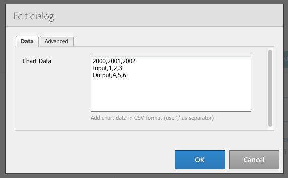 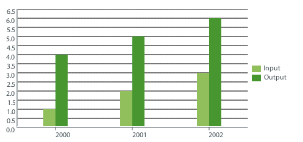

>[!NOTE]
>
>You can create a custom AEM chart control that displays data in the AEM JCR. For information, see [Displaying Adobe Experience Manager Data in a Chart](https://experienceleague.adobe.com/docs/experience-manager-learn/getting-started-wknd-tutorial-develop/overview.html?lang=en).

### Content Fragment {#content-fragment}

>[!CAUTION]
>
>This Foundation Component is deprecated. Adobe recommends using the [Content Fragment Core Component](https://experienceleague.adobe.com/docs/experience-manager-core-components/using/wcm-components/content-fragment-component.html) instead.

[Content fragments](/help/sites-authoring/content-fragments.md) are created and managed as page-independent assets. You can then use these fragments, and their variations, when authoring your content pages.

### Design Importer {#design-importer}

>[!CAUTION]
>
>This Foundation Component is deprecated. Adobe recommends using the [Core Components](https://experienceleague.adobe.com/docs/experience-manager-core-components/using/introduction.html) instead.

This component lets you upload a zip file holding a design package.

### Download {#download}

>[!CAUTION]
>
>This Foundation Component is deprecated. Adobe recommends using the [Core Components](https://experienceleague.adobe.com/docs/experience-manager-core-components/using/introduction.html) instead.

The Download component creates a link on the selected web-page to download a specific file. You can either drag an asset from the Content Finder or upload a file.

* **Download**

    * **Description**
      A short description displayed with the download link.

    * **File**
      The file available for download on the resulting web-page. Drag an asset from the content finder or select the area so you can upload the file that you want available for download.

The following example shows the Download component in Geometrixx:


### External {#external}

>[!CAUTION]
>
>This Foundation Component is deprecated. Adobe recommends using the [Core Components](https://experienceleague.adobe.com/docs/experience-manager-core-components/using/introduction.html) instead.

The external application integration component (**External**) enables you to embed external applications into your AEM page using an iframe.

* **External**

    * **Target application**
      Specify the URL of the web application to be integrated; for example:

      ```
      https://en.wikipedia.org/wiki/Main_Page

      ```

    * **Pass parameters**
      Check the box for parameters to be passed to the application when required.

    * **Width and Height
      **Define the size of the iframe

The external application is integrated into the paragraph system of the AEM page; for example, when using a Target application of `https://en.wikipedia.org/wiki/Main_Page`:

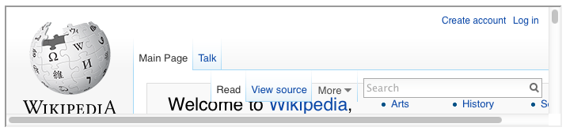

>[!NOTE]
>
>Depending on your use case, other options are available for integration of external applications, for example, the [Integration of Portlets](/help/sites-administering/aem-as-portal.md).

### Flash {#flash}

>[!CAUTION]
>
>This Foundation Component is deprecated. Adobe recommends using the [Core Components](https://experienceleague.adobe.com/docs/experience-manager-core-components/using/introduction.html) instead.

>[!CAUTION]
>
>This component is no longer expected to function out-of-the-box without extensive project-level customization.

The Flash component lets you load a Flash movie. You can drag a flash asset from the content finder onto the component, or you can use the dialog:

* **Flash**

    * **Flash movie**

      The flash movie file. Either drag an asset from the content finder, or click to open a browse window.

    * **Size**

      Dimensions in pixels of the display area holding the movie.

* **Alternative Image**

  An alternative image to be shown

* **Advanced**

    * **Context menu**

      Indicates whether the context menu should be shown or hidden.

    * **Window Mode**

      How the window appears, for example opaque, transparent, or as a distinct (solid) window.

    * **Background color**

      A background color selected from the color chart provided.

    * **Minimum version**

      The minimum version of Adobe Flash Player required to run the movie. The default is 9.0.0.

    * **Attributes**

      Any further attributes required.

### Image {#image}

>[!CAUTION]
>
>This Foundation Component is deprecated. Adobe recommends using the [Image Core Component](https://experienceleague.adobe.com/docs/experience-manager-core-components/using/wcm-components/image.html) instead.

The image component displays an image and accompanying text according to the specified parameters.

You can upload an image, then edit and manipulate it (for example, crop, rotate, add link/title/text).

You can either drag and drop an image from the [Assets Browser](/help/sites-authoring/author-environment-tools.md#assets-browser) directly onto the component or its [Configure dialog](/help/sites-authoring/editing-content.md#component-edit-dialog). You can also upload an image from the Configure dialog; this dialog also controls all definitions and manipulation of the image:

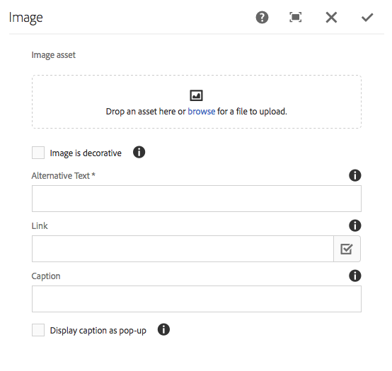

After the image is uploaded (and not before), you can use [inplace editing](/help/sites-authoring/editing-content.md#edit-content) to crop/rotate the image as required:

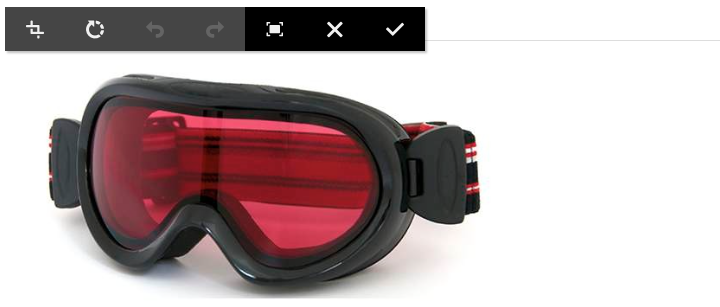

>[!NOTE]
>
>The in-place editor uses the original size and aspect ratio of the image when editing. You can also specify height and width properties. Any size and aspect ratio restrictions defined in the properties are applied when you save your edit changes.
>
>Depending on your instance, minimum and maximum restrictions may also be imposed by the [design of the page](/help/sites-developing/designer.md). These restrictions are developed during project implementation.

Several additional options are available in the full-screen editing mode; for example, map and zoom:


>[!NOTE]
>
>The progress of the upload cannot be monitored with Internet Explorer.
>
>Internet Explorer users must upload the image and click **Ok**, then reopen the image to see the uploaded file in the preview and to be able to perform modifications (that is, crop).
>
>See the [Certified Platforms](/help/release-notes/release-notes.md#certifiedplatforms) section for more information about HTML5 features used by AEM.

When an image is loaded, you can configure the following:

* **Map**

  To map an image, select Map. You can specify how you want to create the image map (rectangle, polygon, and so on) and where the area should point to.

* **Crop**

  To clip out part of an image, select Crop. Use your mouse to crop the image.

* **Rotate**

  To rotate an image, select Rotate. Use repeatedly until the image is rotated the way you want it.

* **Clear**

  Remove the current image.

* **Title**

  The title of the image.

* **Alt Text**

  An alternative text for use when creating accessible content.

* **Link To**

  Create a link to assets or other pages within your website.

* **Description**

  A description of the image.

* **Size**

  Sets the height and the width of the image.

>[!NOTE]
>
>Some options are only available in the full-screen editor.

The final image (with **Title** and **Description**) may be shown as:

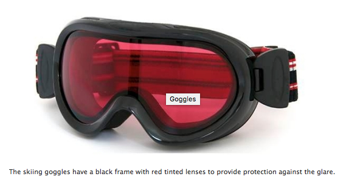

### Layout Container {#layout-container}

This component provides a grid-paragraph system to let you add and position components within a [responsive grid](/help/sites-authoring/responsive-layout.md). You can define differing content layouts based on the width of target devices, including a range of phones, tablets, and the desktop.


>[!NOTE]
>
>This component has been implemented with [HTML Template Language (HTL)](https://experienceleague.adobe.com/docs/experience-manager-htl/content/overview.html).

### List {#list}

>[!CAUTION]
>
>This Foundation Component is deprecated. Adobe recommends using the [List Core Component](https://experienceleague.adobe.com/docs/experience-manager-core-components/using/wcm-components/list.html) instead.

The List component allows you to configure search criteria for displaying a list:

* **List**

    * **Build list using**

      Here you specify where the list retrieves its content. There are several methods:

    * Depending on the item you choose, a new panel appears:

        * **Options for Child Pages**

            * **Children of** (Parent Page)

              Specify a path either manually or using the selector. Leave empty to use the current page as parent.

        * **Options for Fixed List**

            * **Pages**

              Select a list of pages. Use + to add more entries and the up/down buttons to adjust the order.

        * **Options for Search**

            * Start in

              Enter a starting path, either manually or using the selector.

            * Search query

              You can enter a plain text search query.

        * **Options for Advanced Search**

            * **Querybuilder predicate notation**

              You can enter a search query using Querybuilder predicate notation. For example, you can enter "fulltext=Marketing" to have all pages with "Marketing" in their content show up in the Carousel.

              See [QueryBuilder API](/help/sites-developing/querybuilder-api.md) for full discussion of query expressions and further examples.

        * **Tags**

          Specify the **Parent page**, **Tags/Keywords**, and your required match criteria.

    * **Display as**

      How you want the items to be listed; includes Links, Teasers and News.

    * **Order by**

      Whether the list is to be ordered, and if so, the criteria to use for sorting. You can enter a criteria or select one from the drop-down list provided.

    * **Limit**

      Specify the maximum number of items that you want displayed in the list.

    * **Enable Feed**

      Indicates whether an RSS feed should be activated for the list.

    * **Paginate after**

      Here you can specify the number of list items to display at once. A list with more items than specified uses pagination to display the list in several portions.

The following example shows a **List** component the way that it may display a list of child pages (the design is controlled by a site design's custom CSS definitions).


### Login {#login}

>[!CAUTION]
>
>This Foundation Component is deprecated. Adobe recommends using the [Core Components](https://experienceleague.adobe.com/docs/experience-manager-core-components/using/introduction.html) instead.

>[!CAUTION]
>
>This component is no longer expected to function out-of-the-box without extensive project-level customization.

Provides the Username and Password fields.

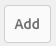

You can configure:

* Log In

    * Section Label

      Lead-in text for the input fields.

    * Username Label

      Text to label the username field.

    * Password Label

      Text to label the password field.

    * Log In Button Label

      Text for the login button.

    * Redirect to

      You can specify the page on your website that should be opened once the user has logged in.

* Already Logged In

    * Continue Button Label

      Text to indicate that the user is already logged on.

### Order Status {#order-status}

>[!CAUTION]
>
>This component is no longer expected to function out-of-the-box without extensive project-level customization.

* **Title**

    * **Title**

      Specify the title text that you want displayed.

    * **Link**

      Specify the page (product) for which the order status should be displayed.

    * **Type/Size**

      Select from the selection provided.

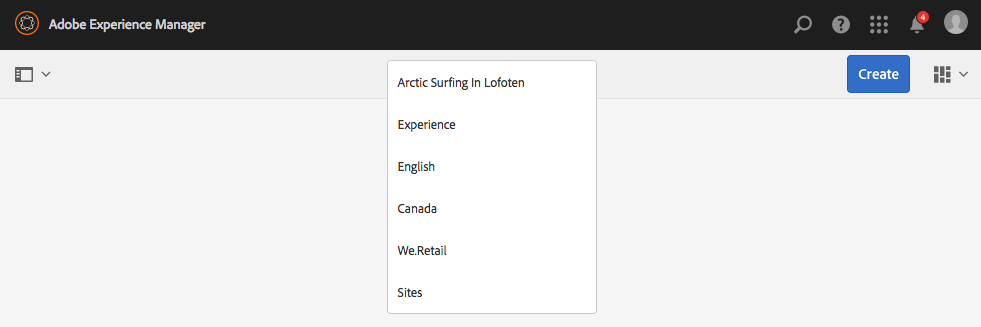

### Reference {#reference}

>[!CAUTION]
>
>This Foundation Component is deprecated. Adobe recommends using the [Content Fragment Core Component](https://experienceleague.adobe.com/docs/experience-manager-core-components/using/wcm-components/content-fragment-component.html) instead.

The **Reference** component lets you reference text from another page of your AEM website (within the current instance). The content of the referenced paragraph then appears as if it was on the current page. The content is updated when the source paragraph changes (might need a page refresh).

* **Paragraph Reference**

    * **Reference**

      Specify the path to the page and paragraph that you want to reference (include content).

To specify the path to a paragraph, you must suffix the path (to the page) with:

`.../jcr:content/par/<paragraph-ID>`

For example:

`/content/geometrixx-outdoors/en/equipment/biking/cajamara/jcr:content/par/similar-products`

Besides referencing a specific paragraph, the path can also be modified to specify an entire par-system. You can do this referencing by suffixing the path with the following:

`/jcr:content/par`

For example:

`/content/geometrixx-outdoors/en/equipment/biking/cajamara/jcr:content/par`

After configuration, the content appears exactly as on the source page. The fact that it is a reference is only seen when you open the component for editing:

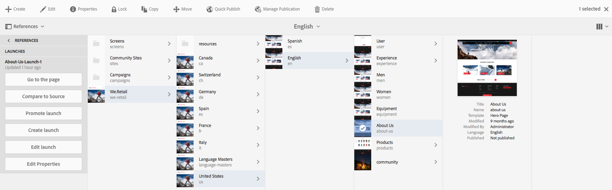

### Search {#searching}

>[!CAUTION]
>
>This Foundation Component is deprecated. Adobe recommends using the [Quick Search Core Component](https://experienceleague.adobe.com/docs/experience-manager-core-components/using/wcm-components/quick-search.html) instead.

The Search component adds search capability to your page.

You can configure:

* Search

    * **Node Types**

      If the search is to be restricted to specific node type list them here; for example, `cq:Page`.

    * **Path to search in**

      Specify the root page of the branch that you want to search.

    * **Search Button Text**

      The name displayed on the actual search button.

    * **Statistics Text**

      The text displayed above the search results.

    * **No Results Text**

      If there are no results, the text entered here is displayed.

    * **Spellcheck Text**

      If someone enters a similar term, this text is displayed before the term.
      For example, if you type `Geometrixxe`, the system displays "Did you mean? Geometrixx".

    * **Similar Pages Text**

      The text that is displayed next to a result for similar pages. To see pages that have similar content, click this link.

    * **Related Searches Text**

      The text that appears next to searches for related terms and topics.

    * **Search Trends Text**

      The title above the search terms that a user enters.

    * **Result Pages Label**

      The text that appears at the bottom of this list with links to other results pages.

    * **Previous Label**

      The name that appears on the link to previous search pages.

    * **Next Label**

      The name that appears on the link to subsequent search pages.

The following example shows the Search component after a search for the word *`geometrixx`* from the root directory of a standard installation. It also illustrates the pagination of results:


The following example shows a search term that is misspelled and not available:


### Sitemap {#sitemap}

>[!CAUTION]
>
>This Foundation Component is deprecated. Adobe recommends using the [Navigation](https://experienceleague.adobe.com/docs/experience-manager-core-components/using/wcm-components/navigation.html), [Language Navigation](https://experienceleague.adobe.com/docs/experience-manager-core-components/using/wcm-components/language-navigation.html), and [Breadcrumb Core Components](https://experienceleague.adobe.com/docs/experience-manager-core-components/using/wcm-components/breadcrumb.html) instead.

An automatic sitemap listing, which (with the default settings) lists all pages (as active links) in the current website. For example, an extract shows:


If necessary, you can configure the following:

* **Sitemap**

    * **Root Path**

      Path from where the listing is to start.

### Slideshow {#slideshow}

>[!CAUTION]
>
>This Foundation Component is deprecated. Adobe recommends using the [Carousel Core Component](https://experienceleague.adobe.com/docs/experience-manager-core-components/using/wcm-components/carousel.html) instead.

>[!CAUTION]
>
>This component is no longer expected to function out-of-the-box without extensive project-level customization.

This component allows you to load a series of images to be displayed as a slideshow on your page. You can add or remove images and assign each a title. Under Advanced, you can also specify the size of the display area.

You can configure:

* **Slides**

    * **New Slide**

      You can specify a selection of slides using the **Add** (and **Remove**) buttons.

    * **Title**

      Specify a title if necessary. The title is overlaid on the appropriate slide.

* **Advanced**

    * **Size**

      Specify the width and height in pixels.

The slideshow component then repeatedly displays each in sequence, for a short time, before fading through to the next slide:


### Table {#table}

>[!CAUTION]
>
>This Foundation Component is deprecated. Adobe recommends using the [Text Core Component](https://experienceleague.adobe.com/docs/experience-manager-core-components/using/wcm-components/text.html) instead.

>[!NOTE]
>
>The **Table** Foundation Component is based on the [Rich Text editor](/help/sites-authoring/rich-text-editor.md), as is the **[Text](#text)** Foundation Component.

The **Table** component is preconfigured to let you construct, fill, and format a table. Using the dialog you can configure your table and create the contents by either:

* from scratch
* copying and pasting a spreadsheet or a table from an external editor (such as Excel, OpenOffice, and Notepad).

You can make basic changes to the content using the in-line editor:


In full screen mode you can configure the table layout:

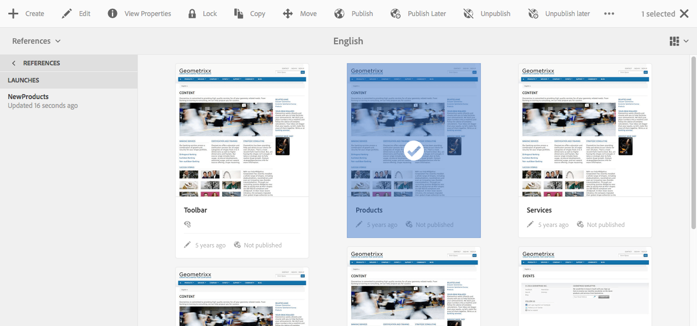

The following screenshot shows an example of the table component; the design is determined by the site-specific CSS:


### Tag Cloud {#tag-cloud}

A tag cloud shows a graphically presented selection of the tags applied to content within your website:


When configuring the Tag Cloud component, you can specify:

* **Tags to Display**

  Where the tags to be displayed are collected from. Select from a page, a page with all children or all tags.

* **Page**

  Select the page to be referenced.

* **No links on tags**

  Whether the tags displayed should act as links.

For more information about applying tags, visit [Using Tags](/help/sites-authoring/tags.md).

### Text {#text}

>[!CAUTION]
>
>This Foundation Component is deprecated. Adobe recommends using the [Text Core Component](https://experienceleague.adobe.com/docs/experience-manager-core-components/using/wcm-components/text.html) instead.

>[!NOTE]
>
>The **Text** Foundation Component is based on the [Rich Text editor](/help/sites-authoring/rich-text-editor.md), as is the **Table** Foundation Component.

The Text component lets you enter a text block using a WYSIWYG editor, with functionality provided by the [Rich Text editor](/help/sites-authoring/rich-text-editor.md). A selection of icons allow you to format your text, including font characteristics, alignment, links, lists, and indentation.

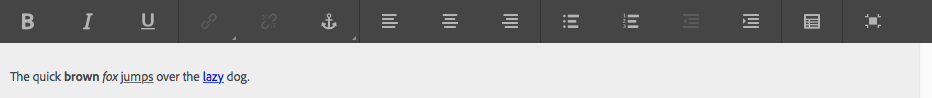

When you open the **Configure** dialog, you can also set:

* **Spacer**
* **Text Style**

The formatted text is shown on the page. The actual design depends on the site CSS:


For more detailed information about the Text component and the functionality provided by the Rich Text editor, see the [Rich Text Editor](/help/sites-authoring/rich-text-editor.md) page.

#### Inplace Editing {#inplace-editing}

In addition to the dialog-based Rich Text editing mode, AEM also provides [Inplace Editing](/help/sites-authoring/editing-content.md), which allows direct editing of the text as it is displayed in the layout of the page.

### Text & Image {#text-image}

>[!CAUTION]
>
>This Foundation Component is deprecated. Adobe recommends using the [Image](https://experienceleague.adobe.com/docs/experience-manager-core-components/using/wcm-components/image.html) and [Text Core Component](https://experienceleague.adobe.com/docs/experience-manager-core-components/using/wcm-components/text.html) instead.

The Text & Image component adds a text block and an image. You can also add and edit text and images separately. See the [Text](#text) and [Image](#image) components for details.

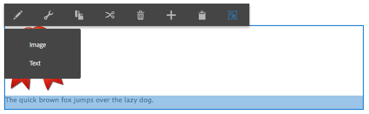

You can configure:

* **Component Styles** (**Styles**)

  Here you can either left or right align the image. The default is **Left** aligned, with the image at the left.

* **Image Properties** (**Advanced Image Properties**)

  Allows you to specify the following:

    * **Image asset**

      Upload the required image.

    * **Title**

      The title for the block, shown by mouseover.

    * **Alt Text**

      Alternative text to be shown if the image cannot be displayed. If left empty, the title is used.

    * **Link to**

      Specify a target path.

    * **Description**

      A description of the image.

    * **Size**

      Sets the height and width of the image.

The following example shows a Text Image Component that displays the image left-aligned:

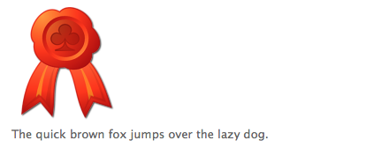

### Title {#title}

>[!CAUTION]
>
>This Foundation Component is deprecated. Adobe recommends using the [Title Core Component](https://experienceleague.adobe.com/docs/experience-manager-core-components/using/wcm-components/list.html?lang=en) instead.

The title component can either:

* Display the name of the current page by leaving the Title field blank.
* Display a text that you specify in the Title field.

You can configure:

* **Title**

  If you want to use a name other than the page title, enter it here.

* **Link**

  The URI if the title is to operate as a link.

* **Type/Size**

  Select Small or Large from the dropdown list. Small is generated as an image. Large is generated as text.

The following example shows a **Title** component being displayed; the design is determined by the site-specific CSS.


### Video {#video}

>[!CAUTION]
>
>This Foundation Component is deprecated. Adobe recommends using the [Core Components Embed Component](https://experienceleague.adobe.com/docs/experience-manager-core-components/using/wcm-components/embed.html) instead.

>[!CAUTION]
>
>This component is no longer expected to function out-of-the-box without extensive project-level customization.

The **Video** component lets you place a predefined, out-of-the-box video element on a page.

See also [Configure your Video Profiles](/help/sites-administering/config-video.md#configuringvideoprofiles) for use with HTML5 elements.

After placing an instance of the component on your page, you can configure the following:

* Video

    * **Video asset**

      Upload or drop your video asset.

    * **Size**

      The video's native size (width x height in pixels) appear in the boxes next to Size (see above). Manually enter width and height dimensions here if you wish to override the video's native dimensions. Selecting **OK** dismisses the dialog.

>[!NOTE]
>
>Formats supported include:
>
>* `.mp4`
>* `Ogg`
>* `FLV` (Flash video)

## Columns {#columns}

Columns are a mechanism to control the layout of content in AEM. In a standard installation, components for creating two or three columns are provided.

The following example shows the two Columns component in use. You can use the placeholders for new components:

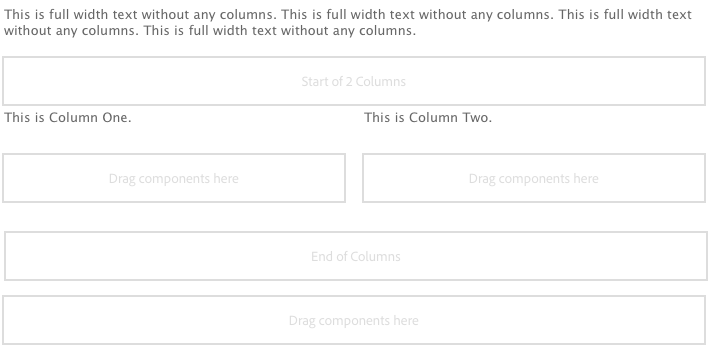

### 2 Columns {#columns-1}

A Column Control component that defaults to two equal columns.

### 3 Columns {#columns-2}

A Column Control component that defaults to three equal columns.

### Column Control {#column-control}

The Column Control component lets users select how they want to split the content in the main panel of the web-page into multiple columns. Users can select the number of columns required (from a predefined list) and then create, delete, or move content within each of the columns.

* **Column Control**

    * **Column Layout**

      Select the number of columns that you want rendered. Once created, each column has its own link for dragging components or assets when adding content.

## Form {#form}

>[!CAUTION]
>
>The Foundation Component is deprecated. Adobe recommends using the [Core Components](https://experienceleague.adobe.com/docs/experience-manager-core-components/using/introduction.html) instead.

Form components are used to create forms for visitors to submit input. Forms and form components can be used to collect information including user feedback (for example, a customer satisfaction questionnaire) and user information (for example, user registration).

>[!NOTE]
>
>See [AEM Forms Help](/help/forms/home.md) for information about AEM Forms.

Forms are built up from several different components:

* **Form**

  The form component defines the beginning and end of a new form on a page. Other components can then be placed in between these elements, such as tables, and downloads.

* **Form fields and elements**

  Form fields and elements can include text boxes, radio buttons, and images. The user often completes an action in a form field, such as typing text. See individual form elements for more information.

* **Profile Components**

  Profile components relate to visitor profiles used for social collaboration and other areas where visitor personalization is required.

The following shows an example form. It is composed of the **Form** component (start and end), with two **Form** **Text** fields used for input, a **General** **Text** field used for the lead-in text and a **Submit** button.


>[!NOTE]
>
>Information about developing and customizing your forms is available on the [Developing Forms page](/help/sites-developing/developing-forms.md). This ability includes adding actions, constraints, preloading fields and using scripts to call a service to action, among others.

### Settings Common to (Many) Form Components {#settings-common-to-many-form-components}

Although each of the form components has a different purpose, many are composed of similar options and parameters.

When configuring any of the form components, the following tabs are available in the dialog:

* **Title and Text**

  Here you must specify the basic information, such as the title of the form and any accompanying text. Where appropriate it also allows you to define other key information such as whether the field is multi-selectable and items available for selection.

* **Initial Values**

  Allows you to specify a default value.

* **Constraints**

  Here you can specify whether a field is required and place constraints on that field (for example, must be numeric).

* **Styling**

  Indicates the size and styling of the fields.

>[!NOTE]
>
>The fields you see vary significantly depending on the individual component.

These tabs provide you with the necessary parameters. The tabs can depend on the individual component type, but can include the following:

* **Title and Text**

    * **Element Name**

      Name of the form element. It indicates where in the repository that the data is stored.
      This field is required and should only contain the following characters:

        * alphanumeric characters
        * `_ . / : -`

    * **Title**

      The title displayed with the field. If left blank, the default title is shown.

    * **Description**

      Lets you provide additional information for the user, if necessary. On the form, it is shown below the field, in a smaller font than the title.

    * **Show/Hide**

      Determines when the field is visible.

* **Initial Values**

    * **Default Value**

      The value displayed in the field when the form is opened. That is, before the user has made any input.

* **Constraints**

    * **Required**

      Constraints depend on the form component type, but provides one or more click boxes to indicate that this field is required, or certain parts of this field, are required.

    * **Required Message**

      A message to inform users that this field is required. A required field is also flagged with an asterisk.

    * **Constraint**

      The constraints available for selection depend on the form component type.

    * **Constraint Message**

      A message to inform users what is required.

* **Styling**

    * **Size**

      In rows and columns.

    * **Width**

      In pixels.

    * **CSS**

### Form (component) {#form-component}

>[!CAUTION]
>
>This Foundation Component is deprecated. Adobe recommends using the [Form Container Core Component](https://experienceleague.adobe.com/docs/experience-manager-core-components/using/wcm-components/forms/form-container.html) instead.

The Form component defines both the start and end of a form using the **Form Start** and **Form End** elements. The start and end are always paired to ensure that the form is correctly defined.

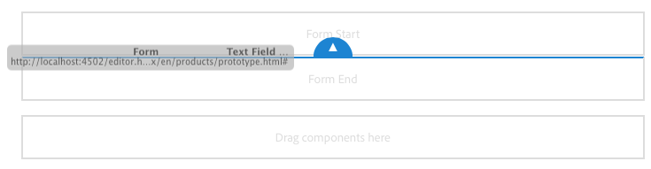

In between the start and end of a form, you can add form components that define the actual input fields for users.

>[!NOTE]
>
>The foundation components form component only supports the use of other foundation components form components (button, text, hidden, and so on). Using [core components](https://experienceleague.adobe.com/docs/experience-manager-core-components/using/introduction.html) form components within a foundation component form (and conversely) is not supported.

#### Start of Form {#start-of-form}

This component defines the start of a new form on a page. You can configure:

* **Form**

    * **Thank You Page**

      The page to be referenced to thank visitors for providing their input. If left blank, the form redisplays after submission.

    * **Start Workflow**

      Determines which workflow is triggered once a form is submitted.

* **Advanced**

    * **Action Type**

      A form needs an action. The action defines the operation that is triggered for execution with the data submitted by the user (similar to action= in HTML). Some need a corresponding **Action Configuration**.
      A selection of action types are included in a standard AEM installation:

        * **Account Request**
        * **Create Content**
        * **Create Lead**
        * **Create and Update Account**
        * **E-Mail Service: Create Subscriber and add to list**
        * **E-Mail Service: Send auto-responder email**
        * **E-Mail Service: Unsubscribe user from list**
        * **Edit Community**
        * **Edit Resources**
        * **Edit Workflow Controlled Resources**
        * **Mail**
        * **Placed Order Details**
        * **Profile Update**
        * **Reset Password**
        * **Set Password**
        * **Store Content**

          The default action type.

        * **Store Content with Uploads**
        * **Submit Order**
        * **Unsubscribe Subscriber**
        * **Update Order**

    * **Form Identifier**

      The form identifier uniquely identifies the form. Use the form identifier if you have several forms on a single page; make sure they have different identifiers.

    * **Load Path**

      The path to node properties used to load predefined values into the form fields.

      An optional field that specifies the path to a node in the repository. When this node has properties that match the field names, then the appropriate fields on the form are preloaded with the value of those properties. If no match exists, then the field contains the default value.

      Using **Load Path** you can preload the form with values in the required fields. See [Preloading Form Values](/help/sites-developing/developing-forms.md#preloading-form-values).

    * **Client Validation**

      Indicates whether client validation is required for this form (server validation *always* occurs). Client validation can be achieved with the **Forms Captcha** component.

    * **Validation Resource Type**

      Defines the form validation resource type if you want to validate the entire form (instead of individual fields). If you are validating the complete form, also include one of the following:

        * A script for client validation:

          `/apps/<*myApp*>/form/<*myValidation*>/formclientvalidation.jsp`

        * A script for validation on the server side:

          `/apps/<*myApp*>/form/<*myValidation*>/formservervalidation.jsp`

    * **Action Configuration**

      The options available in **Action Configuration** depend on the selected **Action Type**:

        * **Account Request**

            * **Create Account Page**

              The page used when creating an account.

        * **Create Content**

            * Content Path

              The content path for any content that the form dumps. Enter a path that ends with a slash `/`. The slash means that for each form port, a new node is created at the given location; for example:

              `/forms/feedback/`

            * **Type**

              Select the required type.

            * **Form**

              Specify the form.

            * **Render with**

              Select the required option from the list.

            * **Resource Type**

              If set, it is added to each comment as `sling:resourceType`

            * **View Selector**

        * **Create Lead**

            * **Lead is added to this list**

              Specify the required lead list.

        * **Create and Update Account**

            * **Initial Group**

              Group to assign new user to.

            * **Home**

              Page to display after successful login.

            * **Path**

              The path (relative) to where the new account is created and stored.

            * **View Data...**

              Selecting this button accesses the information about form results in the Bulk Editor. From here, you can export the information to a `.tsv` (tab-separated) file (for use, for example, in an Excel spreadsheet).

        * **Mail**

            * **From**

              Enter the email address that the email should come from.

            * **Mailto**

              Enter one or more email addresses that the form is sent to.

            * **CC**

              Enter one or more CC email addresses.

            * **BCC**

              Enter one or more BCC email addresses.

            * **Subject**

              Enter a subject for the email.

        * **Reset Password**

            * **Change Password Page**

              The page used when changing the password.

        * **Store Content**

            * **Content Path**

              The content path for any content that the form dumps. Enter a path that ends with a slash `/`. The slash means that for each form port, a new node is created at the given location; for example:
              `/forms/feedback/`

            * **View Data...**

              Click this button so you can access the information about form results in the Bulk Editor. From here, you can export the information to a .tsv (tab-separated) file (for use in an Excel spreadsheet, for example).

        * **Store Content With Uploads**

          Has the same options as **Store Content**.

        * **Unsubscribe Subscriber**

            * **Lead is deleted from this list**

              Specify the required lead list.

#### End of Form {#end-of-form}

Marks the end of the form. You can configure the following:

* **Form End**

    * **Show Submit Button**

      Indicates whether a Submit button should be shown or not.

    * **Submit Name**

      An identifier if you are using multiple submit buttons in a form.

    * **Submit Title**

      The name that appears on the button, such as Submit or Send.

    * **Show Reset Button**

      Selecting the check box makes the Reset button visible.

    * **Reset Title**

      The name that appears on the Reset button.

    * **Description**

      Information that appears below the button.

### Account Name {#account-name}

>[!CAUTION]
>
>This Foundation Component is deprecated. Adobe recommends using the [Form Text Core Component](https://experienceleague.adobe.com/docs/experience-manager-core-components/using/wcm-components/forms/form-text.html) instead.

Lets the user input an account name:


### Address {#address}

>[!CAUTION]
>
>This Foundation Component is deprecated. Adobe recommends using the [Form Text Core Component](https://experienceleague.adobe.com/docs/experience-manager-core-components/using/wcm-components/forms/form-text.html) instead.

Lets you add an international address field with the following format:


The component is configured for immediate use, but you can change the configuration, if necessary. For example, constraints can be added for the individual elements of the address. Leaving fields empty means that default settings are used.

### Captcha {#captcha}

>[!CAUTION]
>
>This Foundation Component is deprecated. Adobe recommends using the [Core Components](https://experienceleague.adobe.com/docs/experience-manager-core-components/using/introduction.html) instead.

>[!CAUTION]
>
>This component is no longer expected to function out-of-the-box without extensive project-level customization.

The Captcha component requires the user to type in an alphanumeric string as displayed on screen. The string changes with each refresh.


You can configure various parameters for this component, including a message to be shown when the captcha string is invalid.

### Checkbox Group {#checkbox-group}

>[!CAUTION]
>
>This Foundation Component is deprecated. Adobe recommends using the [Form Options Core Component](https://experienceleague.adobe.com/docs/experience-manager-core-components/using/wcm-components/forms/form-options.html) instead.

A checkbox allows you to build a list of one of more checkboxes, several of which may be selected at the same time.


You can specify various parameters including a title, description, and element name. Using the + and - buttons you can add or remove items, then position them with the up and down arrows.

>[!NOTE]
>
>Using **Items Load Path** you can preload the check box group list with values.
>
>See [Preloading Form Fields with Multiple Values](/help/sites-developing/developing-forms.md#preloading-form-fields-with-multiple-values).

### Credit Card Details {#credit-card-details}

>[!CAUTION]
>
>This Foundation Component is deprecated. Adobe recommends using the [Core Components](https://experienceleague.adobe.com/docs/experience-manager-core-components/using/introduction.html) instead.

Lets you provide the fields needed for entering credit card details. You can configure it to specify the types of card accepted and the information required (for example, security code).


### Dropdown List {#dropdown-list}

>[!CAUTION]
>
>This Foundation Component is deprecated. Adobe recommends using the [Form Options Core Component](https://experienceleague.adobe.com/docs/experience-manager-core-components/using/wcm-components/forms/form-options.html) instead.

A drop-down list can be configured to provide your use with a range of values for selection:


You can specify a title and items to appear in the list. Using the + and - buttons you can add or remove the list items, then position them with the Up and Down buttons. You can specify whether the users are allowed to select several items from the list and any items that should be automatically selected the first time they open the list (initial values).

>[!NOTE]
>
>Using **Items Load Path** you can preload the drop-down list with values.
>
>See [Preloading Form Fields with Multiple Values](/help/sites-developing/developing-forms.md#preloading-form-fields-with-multiple-values).

### File Upload {#file-upload}

>[!CAUTION]
>
>This Foundation Component is deprecated. Adobe recommends using the [Core Components](https://experienceleague.adobe.com/docs/experience-manager-core-components/using/introduction.html) instead.

The file upload component provides the user with a mechanism for selecting and uploading a file.


>[!NOTE]
>
>You can create a custom upload component to upload files to a Sling Servlet. For information, see [Uploading files to Adobe Experience Manager](https://experienceleaguecommunities.adobe.com/t5/adobe-experience-manager/aem-cloud-service-create-asset-servlet-for-uploading-small-files/td-p/404276).

### Hidden Field {#hidden-field}

>[!CAUTION]
>
>This Foundation Component is deprecated. Adobe recommends using the [Form Hidden Core Component](https://experienceleague.adobe.com/docs/experience-manager-core-components/using/wcm-components/forms/form-hidden.html) instead.

Lets you create a hidden field. These hidden fields can be used for various purposes. For example, when you must perform an action after submitting the form, or when hidden data is required in post processing.


>[!NOTE]
>
>You can also customize your form to show or hide specific form components according to the value of other fields in the form. Changing the visibility of a form field is useful when the field is needed only under specific conditions.
>
>See [Showing and Hiding Form Components](/help/sites-developing/developing-forms.md#showing-and-hiding-form-components).

### Image Button {#image-button}

>[!CAUTION]
>
>This Foundation Component is deprecated. Adobe recommends using the [Form Button Core Component](https://experienceleague.adobe.com/docs/experience-manager-core-components/using/wcm-components/forms/form-button.html) instead.

An image button allows you to create a button with your own image and text:


### Image Upload {#image-upload}

>[!CAUTION]
>
>This Foundation Component is deprecated. Adobe recommends using the [Core Components](https://experienceleague.adobe.com/docs/experience-manager-core-components/using/introduction.html) instead.

The image upload component provides the user with a mechanism for selecting and uploading an image file.


### Link Field {#link-field}

>[!CAUTION]
>
>This Foundation Component is deprecated. Adobe recommends using the [Core Components](https://experienceleague.adobe.com/docs/experience-manager-core-components/using/introduction.html) instead.

The link field allows the user to specify a URL:


Most commonly used for the calendar event form, where it is used for the URL/link field of an event.

### Password Field {#password-field}

>[!CAUTION]
>
>This Foundation Component is deprecated. Adobe recommends using the [Core Components](https://experienceleague.adobe.com/docs/experience-manager-core-components/using/introduction.html) instead.

Allows the user to input their password:


### Password Reset {#password-reset}

>[!CAUTION]
>
>This Foundation Component is deprecated. Adobe recommends using the [Core Components](https://experienceleague.adobe.com/docs/experience-manager-core-components/using/introduction.html) instead.

This component provides your user with two fields for:

* the input of a password
* repeated input of the password to check to confirm that input is correct.

With default settings, the component appears as the following:


### Radio Group {#radio-group}

>[!CAUTION]
>
>This Foundation Component is deprecated. Adobe recommends using the [Form Options Core Component](https://experienceleague.adobe.com/docs/experience-manager-core-components/using/wcm-components/forms/form-options.html) instead.

A radio group provides you with a list of one of more radio checkboxes, only one of which may be selected at any particular time.

You can specify the element name together with a title and description. Using the + and - buttons you can add or remove items, position them with the up and down arrows, and specify a default value, if necessary:


>[!NOTE]
>
>Using **Items Load Path** you can preload the radio group with values.
>
>See [Preloading Form Fields with Multiple Values](/help/sites-developing/developing-forms.md#preloading-form-fields-with-multiple-values).

### Submit Button {#submit-button}

>[!CAUTION]
>
>This Foundation Component is deprecated. Adobe recommends using the [Form Button Core Component](https://experienceleague.adobe.com/docs/experience-manager-core-components/using/wcm-components/forms/form-button.html) instead.

This component allows you to create a submit button, with either the default text:


Or with your own text:


### Tags Field {#tags-field}

>[!CAUTION]
>
>This Foundation Component is deprecated. Adobe recommends using the [Core Components](https://experienceleague.adobe.com/docs/experience-manager-core-components/using/introduction.html) instead.

This field allows you to select tags:


You can specify various parameters, including the namespaces can be used, using the specialized tab:

* **Tag Field**

  * **Allowed Namespaces**

    * **Geometrixx Outdoors**
    * **Workflow**
    * **Forum**
    * **Stock Photography**
    * **Geometrixx Media**
    * **Standard Tags**
    * **Marketing**
    * **Asset Properties**
    * **Width in pixels**
    * **Popup Size**

### Text Field {#text-field}

>[!CAUTION]
>
>This Foundation Component is deprecated. Adobe recommends using the [Form Text Core Component](https://experienceleague.adobe.com/docs/experience-manager-core-components/using/wcm-components/forms/form-text.html) instead.

The standard text field can be configured to your required size and with your own lead in message:


### Workflow Submit Button(s) {#workflow-submit-button-s}

>[!CAUTION]
>
>This Foundation Component is deprecated. Adobe recommends using the [Form Button Core Component](https://experienceleague.adobe.com/docs/experience-manager-core-components/using/wcm-components/forms/form-button.html) instead.

Lets you create a Submit button for use in a workflow.

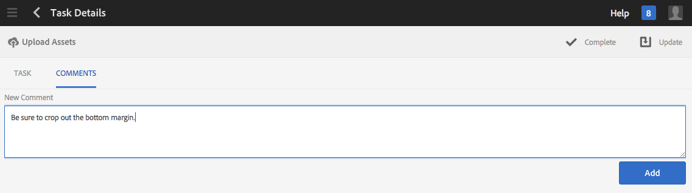
