# Editing Page Content{#editing-page-content}

After your page is created (either new or as part of a launch or live copy), you can edit the content to make the updates you require.

Content is added using [components](/help/sites-authoring/default-components-console.md) (appropriate to the content type) that can be dragged onto the page. These can then be edited in place, moved, or deleted.

>[!NOTE]
>
>Your account needs the [appropriate access rights](/help/sites-administering/security.md) and [permissions](/help/sites-administering/security.md#permissions) to edit pages.
>
>If you encounter any problems, Adobe suggests that you contact your system administrator.

>[!NOTE]
>
>If your page, or template, or both are set up appropriately, you can use a [responsive layout](/help/sites-authoring/responsive-layout.md) when editing.

>[!NOTE]
>
>When in **Edit** mode, links in your content are visible, but **not accessible**. Use [Preview mode](#previewingpagestouchoptimizedui) if you want to navigate using the links in your content.

## Page Toolbar {#page-toolbar}

The page toolbar offers access to the appropriate functionality, dependent on the page configuration.

The toolbar offers access to numerous options. Depending on your current context and configuration, some options may not be available.

* **Toggle Side Panel**

  This opens/closes the side panel, which holds the [Asset Browser](/help/sites-authoring/author-environment-tools.md#assets-browser), [Component Browser](/help/sites-authoring/author-environment-tools.md#components-browser), and [Content Tree](/help/sites-authoring/author-environment-tools.md#content-tree).

  

* **Page Information**

  It provides access to the [Page Information](/help/sites-authoring/author-environment-tools.md#page-information) menu including page details and actions that can be taken on the page including viewing and editing page information, viewing page properties, and publishing/unpublishing the page.

  

* **Emulator**

  Toggles the [emulator toolbar](/help/sites-authoring/responsive-layout.md#selecting-a-device-to-emulate), which is used to emulate the look-and-feel of the page on another device. This is automatically toggled in layout mode.

  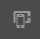

* **ContextHub**

  Opens the [context hub](/help/sites-authoring/ch-previewing.md). Only available in Preview mode.

  

* **Page Title**

  This is purely informational.

  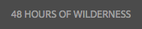

* **Mode Selector**

  It displays the current [mode](/help/sites-authoring/author-environment-tools.md#page-modes) and lets you select another mode such as edit, layout, timewarp, or targeting.

  

* **Preview**

  Enables [preview mode](/help/sites-authoring/editing-content.md#preview-mode). This displays the page as it appears when published.

  

* **Annotate**

  It lets you add [annotations](/help/sites-authoring/annotations.md) to the page when reviewing a page. After the first annotation, the icon switches to a number indicating the number of annotations on the page.

  

### Status Notification {#status-notification}

If a page is part of a [workflow](/help/sites-authoring/workflows.md) or multiple workflows, this information is shown in a notification bar at the top of the screen when editing the page.

>[!NOTE]
>
>The status bar is only visible to user accounts with appropriate privileges.

The notification lists the workflow that is running against the page. If the user is involved in the current workflow step, options to [affect the workflow status](/help/sites-authoring/workflows-participating.md) and get more information about the workflow are also available such as:

* **Complete** - Opens the **Complete Workitem** dialog box

* **Delegate** - Opens the **Complete Workitem** dialog box

* **View details** - Opens the **Details** window of the workflow

Completing and delegating workflow steps by way of the notification bar works as it does when [participating in workflows](/help/sites-authoring/workflows-participating.md) from the Notification inbox.

If the page is subject to multiple workflows, the number of workflows is displayed at the right end of the notification along with arrow buttons to let you scroll through the workflows.

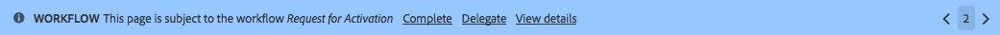

## Component Placeholder {#component-placeholder}

The component placeholder is an indicator to show where a component is positioned when you drop it - above the component you are currently hovering over.

* When adding a component to the page (dragging from the component browser):

  

* When moving an existing component:

  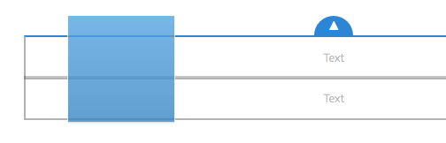

## Inserting a Component {#inserting-a-component}

### Inserting a Component from the Components Browser {#inserting-a-component-from-the-components-browser}

You can add a component by using the [component browser](/help/sites-authoring/author-environment-tools.md#components-browser). The [component placeholder](#component-placeholder) shows you where the component is positioned:

1. Make sure that your page is in [**Edit** mode](/help/sites-authoring/author-environment-tools.md#page-modes).
1. Open the [component browser](/help/sites-authoring/author-environment-tools.md#components-browser).
1. Drag the required component to the [required position](#component-placeholder).

1. [Edit](#editmovecopypastedelete) the component.

>[!NOTE]
>
>On a mobile device, the component browser fills the entire screen. Once you start dragging a component, the browser closes to show the page again so you can place the component.

### Inserting a Component from the Paragraph System {#inserting-a-component-from-the-paragraph-system}

You can add a component by using the **Drag components here** box of the paragraph system:

1. Make sure that your page is in [**Edit** mode](/help/sites-authoring/author-environment-tools.md#page-modes).
1. There are two ways to select and add a component from the paragraph system:

    * Select the **Insert Component** option (+) from either the toolbar of an existing component or the **Drag components here** box.

   

    * If you are on a desktop device, you can double-click the **Drag components here** box.

   The **Insert New Component** dialog box opens to let you select your required component:

   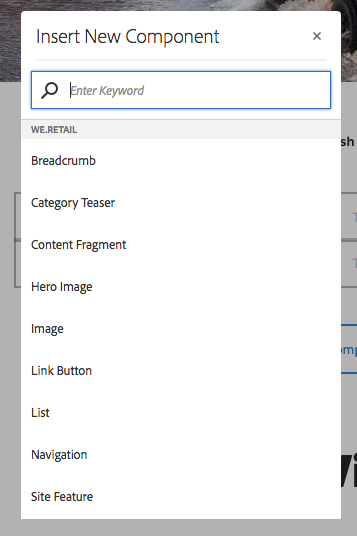

1. The selected component is added to the bottom of the page. [Edit](#editmovecopypastedelete) the component as required.

### Inserting a Component using the Assets Browser {#inserting-a-component-using-the-assets-browser}

You can also add a component to the page by dragging an asset from the [assets browser](/help/sites-authoring/author-environment-tools.md#assets-browser). This automatically creates a component of the appropriate type (and containing the asset).

This is valid for the following asset types (some depend on the page/paragraph system):

<table>
 <tbody>
  <tr>
   <th><strong>Asset Type</strong></th>
   <th><strong>Resultant Component Type</strong></th>
  </tr>
  <tr>
   <td>Image</td>
   <td>Image</td>
  </tr>
  <tr>
   <td>Document</td>
   <td>Download</td>
  </tr>
  <tr>
   <td>Product</td>
   <td>Product</td>
  </tr>
  <tr>
   <td>Video</td>
   <td>Flash</td>
  </tr>
  <tr>
   <td>Content Fragment</td>
   <td>Content Fragment  </td>
  </tr>
 </tbody>
</table>

>[!NOTE]
>
>This behavior can be configured for your installation. See [Configuring a Paragraph System so that Dragging an Asset Creates a Component Instance](/help/sites-developing/developing-components.md#configuring-a-paragraph-system-so-that-dragging-an-asset-creates-a-component-instance) for further details.

To create a component by dragging one of the above asset types:

1. Make sure that your page is in [**Edit** mode](/help/sites-authoring/author-environment-tools.md#page-modes).
1. Open the [asset browser](/help/sites-authoring/author-environment-tools.md#assets-browser).
1. Drag the required asset to the required position. The [component placeholder](#component-placeholder) shows you where the component is  positioned.

   A component, appropriate for the asset type, is created at the required location - it contains the selected asset.

1. [Edit](#editmovecopypastedelete) the component, if necessary.

>[!NOTE]
>
>On a mobile device, the asset browser fills the entire screen. When you start dragging an asset, the browser closes to show the page again so you can place the asset.

When browsing the assets, if you find that you must make a quick change to an asset, click the edit icon next to the asset's name to start the [Asset Editor](/help/assets/manage-assets.md).

## Edit/Configure/Copy/Cut/Delete/Paste {#edit-configure-copy-cut-delete-paste}

Selecting a component opens the toolbar. This provides access to various actions that can be performed on the component.

The actual actions available to the user are shown as appropriate and not all actions may be described here.

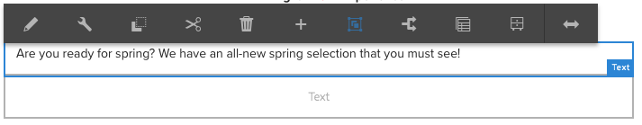

* **Edit**

  [Dependent on the component type](/help/sites-authoring/default-components.md), this lets you [edit the content of the component](#edit-content). Often a toolbar is provided.

  

* **Configure**

  [Dependent on the component type](/help/sites-authoring/default-components.md) this lets you edit and configure the properties of the component. Often a dialog box is opened.

  

* **Copy**

  This copies the component to the clipboard. The original component remains after a paste.

  

* **Cut**

  This copies the component to the clipboard. After the paste action, the original component is removed.

  

* **Delete**

  This deletes the component from the page with your confirmation.

  

* **Insert component**

  This opens the dialog box to [add a component](/help/sites-authoring/editing-content.md#inserting-a-component-from-the-paragraph-system).

  

* **Paste**

  This pastes the component from the clipboard to the page. Whether the original remains depends on whether you used copy or cut.

    * You can paste to the same page or to a different page.
    * The pasted item is pasted above the item where you select the paste action.
    * The Paste action is only shown if there is content on the clipboard.

  

  >[!NOTE]
  >
  >If you paste to a different page that was already open before the cut/copy operation, you must refresh the page to see the pasted content.

* **Group**

  This lets you select multiple components at once. The same can be achieved on a desktop device by a **Control+Click** or **Command+Click**.

  

* **Parent**

  This lets you select the parent component of the selected component.

  

* **Layout**

  This lets you modify the [layout](/help/sites-authoring/editing-content.md#edit-component-layout) of the selected component. This only applies to the selected component and does not activate the [Layout mode](/help/sites-authoring/author-environment-tools.md#page-modes) for the entire page.

  

* **Convert to an Experience Fragment variation**

  This lets you create an [Experience Fragment](/help/sites-authoring/experience-fragments.md) from the selected component or add it to an existing Experience Fragment.

  

## Edit (Content) {#edit-content}

There are two methods of adding or editing content in components:

* Open the [component dialog for editing](#component-edit-dialog).
* [Drag and drop an asset](#draganddropintocomponent) from the assets browser to directly add content.

### Component Edit Dialog {#component-edit-dialog}

You can open a component to edit the content using the [Edit (pencil) icon of the component toolbar](#edit-configure-copy-cut-delete-paste).

The exact edit options depend on the component. For some components, [all actions are only available in full screen mode](#edit-content-full-screen-mode). For example:

* [Text component](/help/sites-authoring/rich-text-editor.md#main-pars-title-24)

  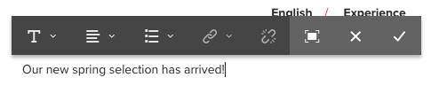

* Image component

  

  >[!NOTE]
  >
  >Editing does not work on an empty image component.
  >
  >
  >[Drag or upload an image (using Configure)](/help/sites-authoring/default-components-foundation.md#image) before you can start to edit it.

* Image component - full screen

  [Entering full screen mode](/help/sites-authoring/editing-content.md#edit-content-full-screen-mode) for the image component allows for more space to edit the image and showing extra editing options such as **Launch Map** and **Reset Zoom**. In addition, full screen allows for crop presets to be selected.

  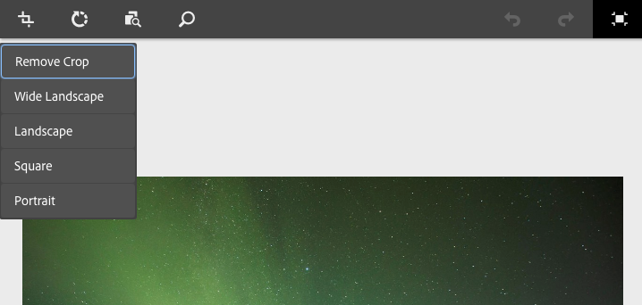

* Components constructed from more than one basic component, such as the [Text & Image foundation component](/help/sites-authoring/default-components-foundation.md#text-image), first ask you to confirm which set of edit options you want:

  

### Drag and Drop Assets into Component {#drag-and-drop-assets-into-component}

For specific component types you can drag and drop assets from the asset browser directly into the component to update the content:

| **Asset Type** |**Component Type** |
|---|---|
| Image |Image |
| Document |Download |
| Product |Product |
| Video |Flash |
| Content Fragment |Content Fragment |

## Edit (Content) Full Screen Mode {#edit-content-full-screen-mode}

For all components the full screen mode can be accessed with (and exited from):

For example, the **Text** component:

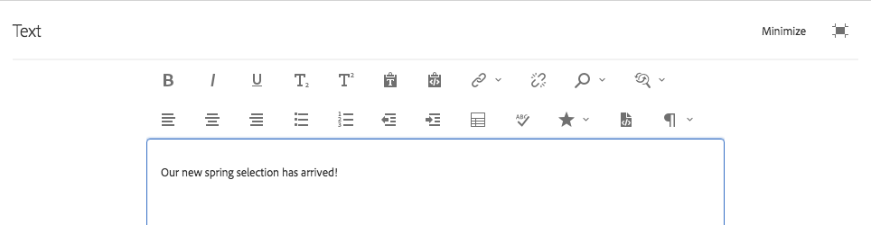

>[!NOTE]
>
>For some components, the full screen mode has more options available than the basic in-place editor.

## Moving a Component {#moving-a-component}

To move a paragraph component:

1. Select the paragraph to be moved with either select-and-hold or click-and-hold.
1. Drag the paragraph to the new location. AEM indicates where the paragraph can be deposited. Drop it in your desired location.

   

1. Your paragraph is moved.

>[!NOTE]
>
>You can also use [Cut and Paste](/help/sites-authoring/editing-content.md#edit-configure-copy-cut-delete-paste) to move a component.

## Edit Component Layout {#edit-component-layout}

Instead of repeatedly switching from edit to [layout mode](/help/sites-authoring/responsive-layout.md) to adjust a component, you can select the **Layout** action for a component to change that component's layout. This saves time by not having to leave the edit mode.

1. When in the **Edit** mode of the sites console, selecting a component reveals the component's toolbar.

   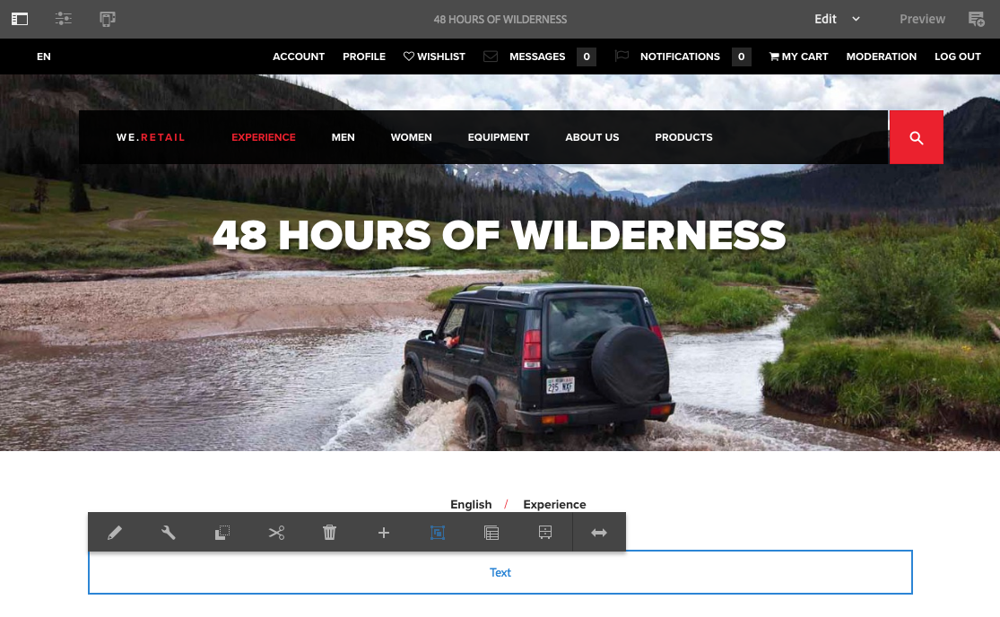

   Click the **Layout** action so you can adjust the layout of the component.

   

1. Once the Layout action is selected:

    * The resizing handles for the component display.
    * The emulator toolbar is shown at the top of the screen.
    * Layout actions instead of the standard edit actions show on the component toolbar.

   

   You can now modify the layout of the component as you would in [layout mode](/help/sites-authoring/responsive-layout.md#defining-layouts-layout-mode).

1. After making the necessary layout changes, click **Close** in the component action menu to stop modifying the layout of the component. The component's toolbar returns to its normal edit state.

   

>[!NOTE]
>
>The Layout action is limited in scope to the selected component. For example, if you are editing the layout of one component and then select another component, the standard edit toolbar (not the layout toolbar) displays for the newly selected component. The resizing handles and the emulator toolbar disappear.
>
>If you must edit the overall layout of the page, affecting multiple components, switch to the [layout mode](/help/sites-authoring/responsive-layout.md).

## Inherited Components {#inherited-components}

Inherited components can be the product of various scenarios, including:

* [Multi-site management](/help/sites-administering/msm.md)
* [Launches](/help/sites-authoring/launches.md) (when based on live copy).
* Specific components such as the Inherited Paragraph System within Geometrixx.

You can cancel (then re-enable) the inheritance. Depending on the component, this can be available from:

* **Live Copy**

  The component toolbar, if the component is on a page that is part of a live copy or launch (based on a live copy). For example:

  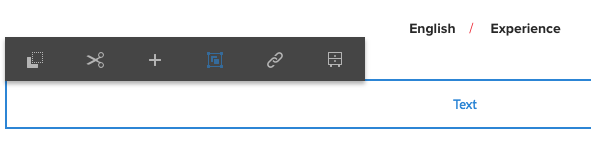

  The Cancel Inheritance option is available:

  

  Or, re-enable inheritance if canceled already:

  

  The Rollout action is also available in the blueprint or Live Copy source:

  

* **An Inherited Paragraph System**

  The configuration dialog box. For example, as with the Inherited Paragraph System:

  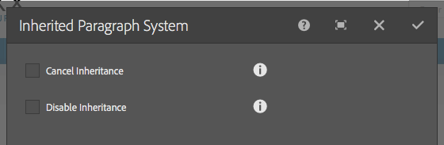

## Editing the Page Template {#editing-the-page-template}

If the page is based on an [editable template](/help/sites-authoring/templates.md#editable-and-static-templates), you can easily switch to the [template editor](/help/sites-authoring/templates.md#editing-templates-template-authors) by selecting **Edit Template** in the [Page Information menu](/help/sites-authoring/author-environment-tools.md#page-information).

If the page is based on a [static template](/help/sites-authoring/templates.md#editable-and-static-templates), you can switch to [Design mode](/help/sites-authoring/default-components-designmode.md) using the [page mode selector](/help/sites-authoring/author-environment-tools.md#page-modes) on the toolbar to enable/disable components for use on the page.

You can easily see which template the page is based on when selecting the page in either [Column view](/help/sites-authoring/basic-handling.md#column-view) or [List view](/help/sites-authoring/basic-handling.md#list-view).

## Live Copy Status {#live-copy-status}

The [Live Copy Status page mode](/help/sites-authoring/author-environment-tools.md#page-modes) allows you a quick overview of the live copy status and which components are/are not inherited:

* Green border: Inherited
* Pink border: Inheritance is canceled

For example:

## Adding Annotations {#adding-annotations}

[Annotations](/help/sites-authoring/annotations.md) allow reviewers and other authors to provide feedback on your content. They are often used for review and validation purposes.

## Previewing Pages {#previewing-pages}

There are two options for previewing a page:

* [Preview Mode](#preview-mode) - a quick, in-place preview

* [View as Published](#view-as-published) - a full preview that opens the page in a new tab

>[!NOTE]
>
>* Links in the content are visible, but not accessible in Edit mode.
>* Use either of the preview options if you want to navigate using your links.
>* Use the [keyboard shortcut](/help/sites-authoring/keyboard-shortcuts.md) `Ctrl-Shift-M` to switch between preview and the last selected mode.
>

>[!NOTE]
>
>The WCM Mode cookie is set for both options.

### Preview Mode {#preview-mode}

When editing content, you can preview the page using the preview [mode](/help/sites-authoring/author-environment-tools.md#page-modes). This mode lets you do the following:

* Hide various edit mechanisms so you can have a Quickview of how the page appears when it is published.
* Use links to navigate.
* It does **not** refresh the page content.

When authoring, the preview mode is available using the icon at the top right of the page editor:

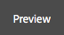

### View as Published {#view-as-published}

The **View as Published** option is available from the [Page Information](/help/sites-authoring/author-environment-tools.md#page-information) menu. This opens the page in a new tab, refreshes the content, and shows the page exactly as it appears when it is published.

## Locking a Page {#locking-a-page}

AEM lets you lock a page, so that no one else can modify the contents. This is useful when you are making numerous edits to one specific page or when you must freeze a page for a short while.

A page can be locked from either:

* **Sites** console

    1. Select the page with [selection mode](/help/sites-authoring/basic-handling.md#viewing-and-selecting-resources).
    1. Select the lock icon.

  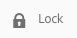

* **Page Editor**

    1. To open the menu, select the **Page Information** icon.
    1. Select the **Lock Page** option.

Once locked the console view information is updated and when editing a lock symbol is shown in the toolbar.

>[!CAUTION]
>
>Locking a page can be performed when [impersonating a user](/help/sites-administering/security.md#impersonating-another-user). However a page locked in this way can only then be unlocked by the user who was impersonated or by the admin user.
>
>Pages cannot be unlocked by impersonating the user who locked the page.

## Unlocking a Page {#unlocking-a-page}

Unlocking a page is similar to [locking the page](#locking-a-page). When the page is locked, the lock options are replaced by unlock actions.

The Page Information menu lists **Unlock** as an option and the Lock icon in the sites console is replaced by an **Unlock** icon.

>[!CAUTION]
>
>Locking a page can be performed when [impersonating a user](/help/sites-administering/security.md#impersonating-another-user). However a page locked in this way can only then be unlocked by the user who was impersonated or by the admin user.
>
>Pages cannot be unlocked by impersonating the user who locked the page.

## Undoing and Redoing Page Edits {#undoing-and-redoing-page-edits}

The following icons let you undo or redo an action. These are shown in the toolbar when appropriate:

>[!NOTE]
>
>The [keyboard shortcut](/help/sites-authoring/page-authoring-keyboard-shortcuts.md) `Ctrl-Z` is also available to undo page edit actions.
>
>The keyboard shortcut `Ctrl-Y` is also available to redo page edit actions.

>[!NOTE]
>
>See [Undoing and Redoing Page Edits - The Theory](#undoing-and-redoing-page-edits-the-theory) for the full details of what is possible when undoing and redoing page edits.

## Undoing and Redoing Page Edits - The Theory {#undoing-and-redoing-page-edits-the-theory}

>[!NOTE]
>
>Your system administrator can [configure various aspects of the Undo/Redo features](/help/sites-administering/config-undo.md) according to the requirements for your instance.

AEM stores a history of actions that you perform and the sequence in which you performed them. This functionality means that you can undo multiple actions in the order that you performed them and redo them to re-apply one or more of the actions, if necessary.

If an element on the content page is selected (such as a text component), then the undo and redo command applies to the selected item.

The behavior of the undo and redo commands is similar to that in other software programs. Use the commands to restore the recent state of your web page as you decide about content. For example, if you move a text paragraph to a different location on the page, you can use the undo command to move the paragraph back. If you then decide that the previous position was better, use the redo command to "undo the undo".

>[!NOTE]
>
>You can:
>
>* Redo actions as long as you have not made a page edit since you used undo.
>* Undo a maximum of 20 edit actions (default setting).
>* Also use [Keyboard shortcuts](/help/sites-authoring/page-authoring-keyboard-shortcuts.md) for undo and redo.
>

You can use Undo and Redo for the following types of page changes:

* Adding, editing, removing, and moving paragraphs
* In-place editing of paragraph content
* Copying, cutting, and pasting items within a page

Form fields that form components render are not meant to have values specified while authoring pages. Therefore, the undo and redo commands do not affect changes that you make to the values of those types of components. For example, you cannot undo the selecting of a value in a drop-down list.

>[!NOTE]
>
>Special permissions are required to undo and redo changes to files and images.

>[!NOTE]
>
>The history of changes to files and images lasts for a minimum of ten hours. Beyond this time however, the reversal of changes is not guaranteed. Your administrator can change the default time of ten hours.
