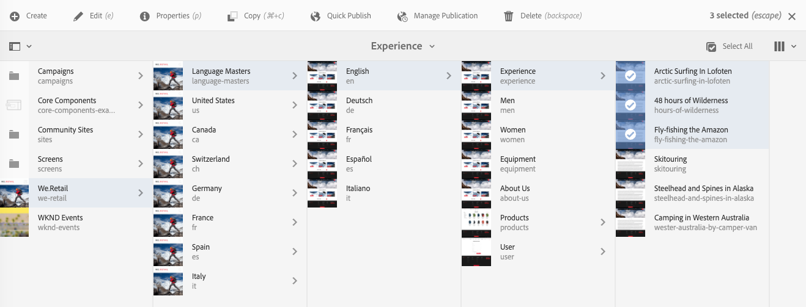

# Editing Page Properties{#editing-page-properties}

You can define the required properties for a page. These can vary depending on the nature of the page. For example some pages might be connected to a live copy while others are not and the live copy information will be available as appropriate.

## Page Properties {#page-properties}

The properties are distributed across several tabs.

### Basic {#basic}

* **Title**

  The title of the page is shown in various locations. For example, the **Websites** tab list and the **Sites** card/list views.

  This is a mandatory field.

* **Tags**

  Here you can add, or remove tags from the page by updating the list in the selection box:

  * After selecting a tag is it listed below the selection box. You can remove a tag from this list using the x.
  * A completely new tag can be entered by typing the name in an empty selection box.

    * The new tag will be created when you hit enter.
    * The new tag will then be shown with a small star on the right indicating that it is a new tag.

  * With the drop-down functionality you can select from existing tags.
  * An x appears when you mouse-over a tag entry in the selection box, which can be used to remove that tag for this page.

  For more information about tags, see [Using Tags](/help/sites-authoring/tags.md).

* **Hide in Navigation**

  Indicates whether the page is shown or hidden in the page navigation of the resulting site.

* **Branding**

  Apply a consistent brand identity across pages by appending a brand slug to each page title. This functionality requires use of the Page Component from release 2.14.0 or later of the [Core Components.](https://experienceleague.adobe.com/docs/experience-manager-core-components/using/introduction.html)

  * **Override** - Check to define the brand slug on this page.
    * The value will be inherited by any child pages unless they also have their **Override** values set.
  * **Override value** - The text of the brand slug to be appended to the page title.
    * The value is appended to the page title after a pipe character such as "Cycling Tuscany | Always ready for the WKND"
* **Page Title**

  A title to be used on the page. Typically used by title components. If empty the **Title** will be used.

* **Navigation Title**

  You can specify a separate title for use in the navigation (for example, if you want something more concise). If empty, the **Title** will be used.

* **Subtitle**

  A subtitle for use on the page.

* **Description**

  Your description of the page, its purpose, or any other details you want to add.

* **On Time**

  The date and time at which the published page will be activated. When published this page will be kept dormant until the specified time.

  Leave these fields empty for pages you want to publish immediately (the normal scenario).

* **Off Time**

  The time at which the published page will be deactivated.

  Again leave these fields empty for immediate action.

* **Vanity URL**

  Allows you to enter a vanity URL for this page, which can allow you to have a shorter and/or more expressive URL.

  For example, if the Vanity URL is set to `welcome`to the page identified by the path `/v1.0/startpage`for the website `http://example.com,` then `http://example.com/welcome`would be the vanity URL of `http://example.com/content/v1.0/startpage`

  >[!CAUTION]
  >
  >Vanity URLs:
  >
  >* Must be unique so you should take care that the value is not already used by another page.
  >* Do not support regex patterns.
  >* Should not be set to an existing page.
  >

  You also need to configure Dispatcher to enable access to vanity URLs. See [Enabling Access to Vanity URLs](https://experienceleague.adobe.com/docs/experience-manager-dispatcher/using/configuring/dispatcher-configuration.html#enabling-access-to-vanity-urls-vanity-urls) for more details.

* **Redirect Vanity URL**

  Indicates whether you want the page to use the vanity URL.

### Advanced {#advanced}

* **Language**

  The page language.

* **Language Root**

  Must be checked if the page is the root of a language copy.

* **Redirect**

  Indicate the page to which this page should automatically redirect.

* **Design**

  Indicate the [design](/help/sites-developing/designer.md) to be used for this page.

* **Alias**

  Specify an alias to be used with this page.

  * For example, if you define an alias of `private` for the page `/content/wknd/us/en/magazine/members-only`, then this page can also be accessed via `/content/wknd/us/en/magazine/private`
  * Creating an alias sets the `sling:alias` property on the page node, which only impacts the resource, not the repository path.
  * Pages accessed by aliases in the editor can not be published. [Publish options](/help/sites-authoring/publishing-pages.md) in the editor are only available for pages accessed via their actual paths.
  * For further details see [Localized page names under SEO and URL Management Best Practices](/help/managing/seo-and-url-management.md#localized-page-names).

* **Inherited from &lt;*path*&gt;**

  Indicates whether the page is inherited. and where from.

* **Cloud Configuration**

  The path to the configuration.

* **Allowed Templates**

  [Define the list of templates that will be available](/help/sites-authoring/templates.md#allowingatemplate) within this sub-branch.

* **Enable** (Authentication Requirement)

  Enable (or disable) use of authentication to access the page.

  >[!NOTE]
  >
  >Closed user groups for the page are defined on the **[Permissions](/help/sites-authoring/editing-page-properties.md#permissions)** tab.

  >[!CAUTION]
  >
  >The **[Permissions](/help/sites-authoring/editing-page-properties.md#main-pars-procedure-949394300)** tab allows editing of CUG configurations based on the presence of the `granite:AuthenticationRequired` mixin. If page permissions are configured using deprecated CUG configurations, based on the presence of `cq:cugEnabled` property, a warning message will be shown under **Authentication Requirement** and the option will not be editable, nor will the [Permissions](/help/sites-authoring/editing-page-properties.md#permissions) be editable.
  >
  >
  >In such a case the CUG permissions must be edited in the [classic UI](/help/sites-classic-ui-authoring/classic-page-author-edit-page-properties.md).

* **Login Page**

  The page to be used for login.

* **Export Configuration**

  Specify an export configuration.

### Thumbnail {#thumbnail}

Shows the page thumbnail image. You can:

* **Generate Preview**

  Generate a preview of the page to use as thumbnail.

* **Upload Image**

  Upload an image to use as thumbnail.

* **Select Image**

  Select an existing Asset to use as the thumbnail.

* **Revert**

  This option becomes available after you have made a change to the thumbnail. If you do not want to keep your change, you can revert that change before saving.

### Social Media {#social-media}

* **Social Media sharing**

  Defines the sharing options available on the page. Exposes the options available to the [Sharing core component](https://helpx.adobe.com/experience-manager/core-components/using/sharing.html).

    * **Enable user sharing for Facebook**
    * **Enable user sharing for Pinterest**
    * **Preferred XF variation**
      Define experience fragment variation used for generating metadata for page

### Cloud Services {#cloud-services}

* **Cloud Services**

  Define properties for [cloud services](/help/sites-developing/extending-cloud-config.md).

### Personalization {#personalization}

* **ContextHub Configurations**

  Select the [ContextHub Configuration](/help/sites-developing/ch-configuring.md) and [Segments Path](/help/sites-administering/segmentation.md).

* **Targeting Configuration**

  Select a [Brand to specify a scope for Targeting](/help/sites-authoring/target-adobe-campaign.md).

  >[!NOTE]
  >This option requires the user account to be in the `Target Adminstrators`group.

### Permissions {#permissions}

* **Permissions**

  In this tab you can:

  * [Add Permissions](/help/sites-administering/user-group-ac-admin.md)
  * [Edit Closed User Group](/help/sites-administering/cug.md#applying-your-closed-user-group-to-content-pages)

  * View the [Effective Permissions](/help/sites-administering/user-group-ac-admin.md)

  >[!CAUTION]
  >
  >The **Permissions** tab allows editing of CUG configurations based on the presence of the `granite:AuthenticationRequired` mixin. If page permissions are configured using deprecated CUG configurations, based on the presence of `cq:cugEnabled` property, a warning message will be shown and the CUG permissions will not be editable, nor will the Authentication Requirement on the [Advanced](/help/sites-authoring/editing-page-properties.md#advanced) tab be editable.
  >
  >
  >In such a case the CUG permissions must be edited in the [classic UI](/help/sites-classic-ui-authoring/classic-page-author-edit-page-properties.md).

  >[!NOTE]
  >
  >The Permissions tab does not allow the creation of empty CUG groups, which can be useful as a simple way to deny access to every user. To do this CRX Explorer must be used. See the document [User, Group and Access Rights Administration](/help/sites-administering/user-group-ac-admin.md) for more information.

### Blueprint {#blueprint}

* **Blueprint**

  Define properties for a Blueprint page within [multi-site management](/help/sites-administering/msm.md). Controls the circumstances under which modifications will be propagated to the Live Copy.

### Live Copy {#live-copy}

* **Livecopy**

  Define properties for a Live Copy page within [multi-site management](/help/sites-administering/msm.md). Controls the circumstances under which modifications will be propagated from the Blueprint.

### Site Structure {#site-structure}

* Provide links to pages that provide site-wide functionality, such as **Signup Page**, **Offline Page**, amongst others.

## Editing Page Properties {#editing-page-properties-1}

You can define page properties:

* From the **Sites** console:

  * [Creating a new page](/help/sites-authoring/managing-pages.md#creating-a-new-page) (a subset of the properties)

  * Clicking or tapping **Properties**

    * For a single page
    * For multiple pages (only a subset of the properties are available for editing en masse)

* From the page editor:

  * Using **Page Information** (then **Open Properties**)

### From the Sites Console - Single Page {#from-the-sites-console-single-page}

Clicking or tapping **Properties** to define the page properties:

1. Using the **Sites** console, navigate to the location of the page for which you want to view and edit properties.

1. Select the **Properties** option for the required page using either:

   * [Quick actions](/help/sites-authoring/basic-handling.md#quick-actions)
   * [Selection mode](/help/sites-authoring/basic-handling.md#selectionmode)

   The page properties will be shown using the appropriate tabs.

1. Either view or edit the properties as required.

1. Then use **Save** to save your updates followed by **Close** to return to the console.

### When Editing a Page {#when-editing-a-page}

When editing a page you can use **Page Information** to define the page properties:

1. Open the page for which you want to edit properties.

1. Select the **Page Information** icon to open the selection menu:

   

1. Select **Open Properties** and a dailog will open allowing you to edit the properties, sorted by the appropriate tab. The following buttons are also available at the right of the toolbar:

    * **Cancel**
    * **Save & Close**

1. Use the **Save & Close** button to save the changes.

### From the Sites Console - Multiple Pages {#from-the-sites-console-multiple-pages}

From the **Sites** console you can select several pages then use **View Properties** to view and/or edit the page properties. This is referred to as bulk editing of page properties.

>[!NOTE]
>
>Bulk editing of properties is also available for Assets. It is very similar, but differs in a few points. See [Editing Properties of Multiple Assets](/help/assets/metadata.md) for details.
>
>There is also the [Bulk Editor](/help/sites-administering/bulk-editor.md), which allows you to search for content from multiple pages using GQL (Google Query Language) and then edit the content directly in the bulk editor before saving your changes to the originating pages.

You can select multiple pages for bulk editing by various methods, including:

* When browsing the **Sites** console
* After using **Search** to locate a set of pages

After selecting the pages and then clicking or tapping the **Properties option**, the bulk properties will be shown:

You can only bulk edit pages that:

* Share the same resource type
* Are not part of a livecopy

  * If any of the pages are in a live copy then a message will be shown when the properties are opened.

Once you have entered Bulk Editing you can:

* **View**

  When viewing Page Properties for multiple pages you can see:

  * A list of the pages impacted

    * You can select/deselect if required

  * Tabs

    * As when viewing properties for a single page, the properties are ordered under tabs.

  * A subset of properties

    * Properties that are available on all selected pages and have been explicitly defined as available to bulk editing are visible.
    * If you reduce the page selection to one page, then all properties are visible.

  * Common properties with a common value

    * Only properties with a common value are shown in View mode.
    * When the field is multi-value (for example Tags), values will only be shown when *all* are common. If only some are common, they will only be shown when editing.

  When no properties with a common value exist, a message is displayed.

* **Edit**

  When editing Page Properties for multiple pages:

  * You can update the values in the fields available.

    * The new values will be applied to all selected pages when you select **Done**.
    * When the field is multi-value (for example Tags), you can either append a new value or remove a common value.

  * Fields that are common, but have different values across the various pages will be indicated with a special value such as the text `<Mixed Entries>`. 

>[!NOTE]
>
>The page component can be configured to specify the fields available for bulk editing. See [Configuring your page for bulk editing of page properties](/help/sites-developing/bulk-editing.md).
