# Experience Fragments{#experience-fragments}

An Experience Fragment is a group of one or more components including content and layout that can be referenced within pages. They can contain any component.

An Experience Fragment:

* Is a part of an experience (page).
* Can be used across multiple pages.
* Is based on a template (editable only) to define structure and components.
* Is made up of one or more components, with layout, in a paragraph system.
* Can contain other experience fragments.
* Can be combined with other components (including other Experience Fragments) to form a complete page (experience).
* Can have different variations, which may share content and/or components.
* Can be broken down into building blocks that can be used across multiple variations of the fragment.

You can use Experience Fragments:

* If an author wants to re-use parts (a fragment of an experience) of a page, they need to copy and paste that fragment. Creating and maintaining these copy/paste experiences is time-consuming and prone to user errors. Experience Fragments eliminate the need for copy/paste.
* To support the headless CMS use-case. Authors want to use AEM only for authoring but not for delivering to the customer. A third party system/touchpoint would consume that experience and then deliver to the end user.

>[!NOTE]
>
>Write access for experience fragments requires the user account to be registered in the group:
>
>`experience-fragments-editors`
>
>Please contact your system administrator if you are experiencing any issues.

## When Should You Use Experience Fragments? {#when-should-you-use-experience-fragments}

Experience Fragments should be used:

* Whenever you want to reuse experiences.

    * Experiences that will be reused with same or similar content

* When you use AEM as a content delivery platform for third parties.

    * Any solution that wants to use AEM as the content delivery platform
    * Embedding content in third party touchpoints

* If you have an Experience with different variations or renditions.

    * Channel or context-specific variations
    * Experiences that make sense to group (for example a campaign with different experiences across channels)

* When you use Omnichannel Commerce.

    * Sharing commerce-related content on [social media](/help/sites-developing/experience-fragments.md#social-variations) channels at scale
    * Making touchpoints transactional

## Creating an Experience Fragment {#creating-an-experience-fragment}

To create an Experience Fragment:

1. Select Experience Fragments from the Global Navigation.

   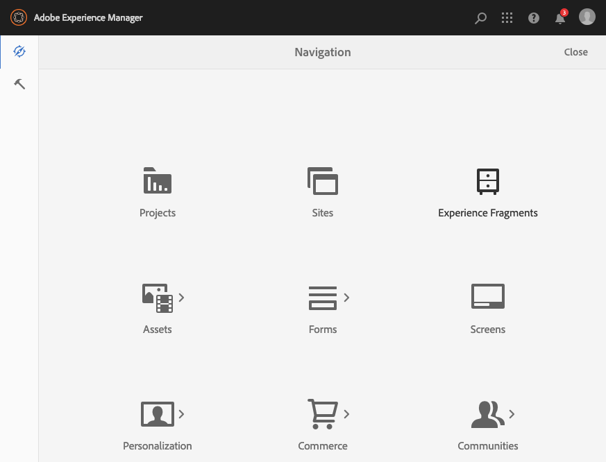

1. Select **Create**. You can create **Folders** and/or **Experience Fragments**.

   Creating folders allows you to create a meaningful structure for your Experience Fragments.

   

1. From the required folder, select **Create** then **Experience Fragment** to open the **Create Experience Fragment** wizard.

   Select the required **Template**, then **Next**:

   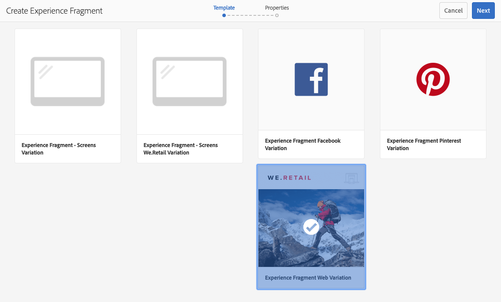

   >[!NOTE]
   >
   >See [Templates for Experience Fragments](/help/sites-developing/experience-fragments.md#templates-for-experience-fragments) for further details.

1. Enter the **Properties** for your **Experience Fragment**.

   A **Title** is mandatory. If the **Name** is left blank it will be derived from the **Title**.

   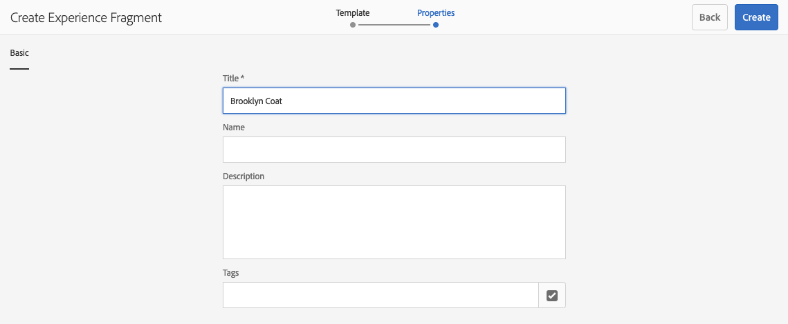

1. Click **Create**.

   A message will be displayed. Select:

    * **Done** to return to the console

    * **Open** to open the fragment editor

## Editing your Experience Fragment {#editing-your-experience-fragment}

The Experience Fragment Editor offers you similar capabilities to the normal page editor.

>[!NOTE]
>
>See [Editing Page Content](/help/sites-authoring/editing-content.md) for more information on how to use the page editor.

The following example procedure illustrates how to create a teaser for a product:

1. Drag and drop a **Teaser** from the [Components Browser](/help/sites-authoring/author-environment-tools.md#components-browser).

   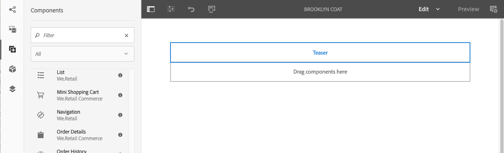

1. Select ** [Configure](/help/sites-authoring/editing-content.md#edit-configure-copy-cut-delete-paste)** from the component toolbar.
1. Add the **Asset** and define the **Properties** as required.
1. Confirm the definitions with **Done** (tick icon).
1. Add more components as required.

## Creating An Experience Fragment Variation {#creating-an-experience-fragment-variation}

You can create variations of your Experience Fragment, depending on your needs:

1. Open your fragment for [editing](/help/sites-authoring/experience-fragments.md#editing-your-experience-fragment).
1. Open the **Variations** tab.

   

1. **Create** allows you to create:

    * **Variation**
    * **Variation as live-copy**.

1. Define the required properties:

    * **Template**
    * **Title**
    * **Name**; if left blank it will be derived from the Title
    * **Description**
    * **Variation tags**

   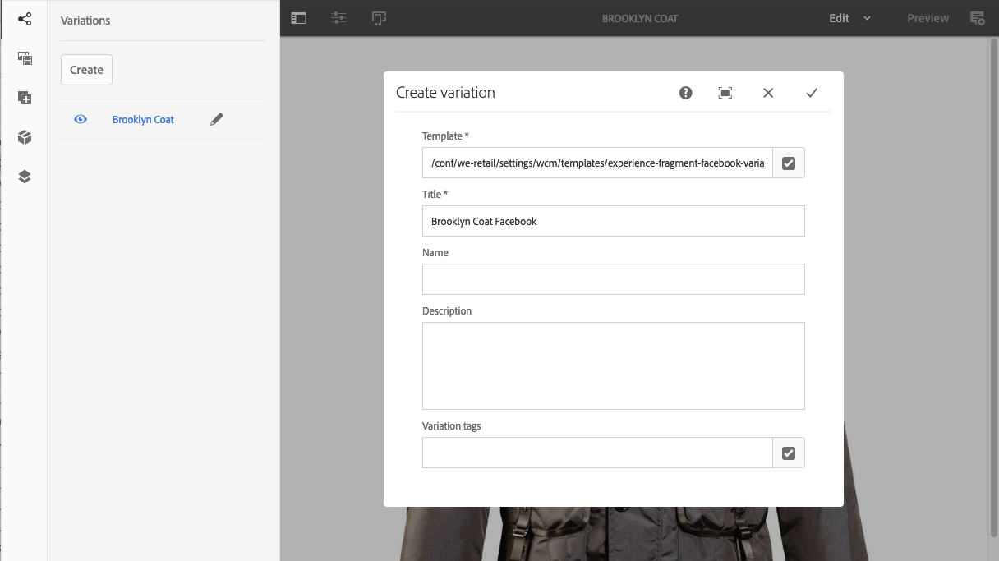

1. Confirm with **Done** (tick icon), the new variation will be shown in the panel:

   

## Using your Experience Fragment {#using-your-experience-fragment}

You can now use your Experience Fragment when authoring your pages:

1. Open any page for editing.

   For example: [https://localhost:4502/editor.html/content/we-retail/language-masters/en/products/men.html](https://localhost:4502/editor.html/content/we-retail/language-masters/en/products/men.html)

1. Create an instance of the Experience Fragment component, by dragging the component from the Components browser to the page paragraph system:

   

1. Add the actual Experience Fragment to the component instance; either:

    * Drag the required fragment from the Assets Browser and drop onto the component
    * Select **Configure** from the component toolbar and specify the fragment to use, confirm with **Done** (tick)

   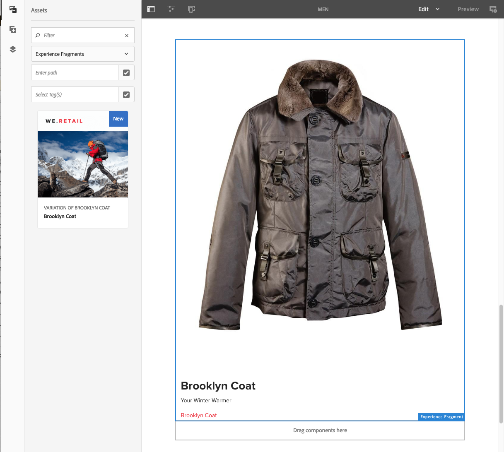

   >[!NOTE]
   >
   >Edit, in the component toolbar, operates as a shortcut to open the fragment in the fragment editor.

## Building Blocks {#building-blocks}

You can select one or more components to create a building block for recycling within your fragment:

### Creating a Building Block {#creating-a-building-block}

To create a new Building Block:

1. In the Experience Fragment editor, select the components you want to re-use:

   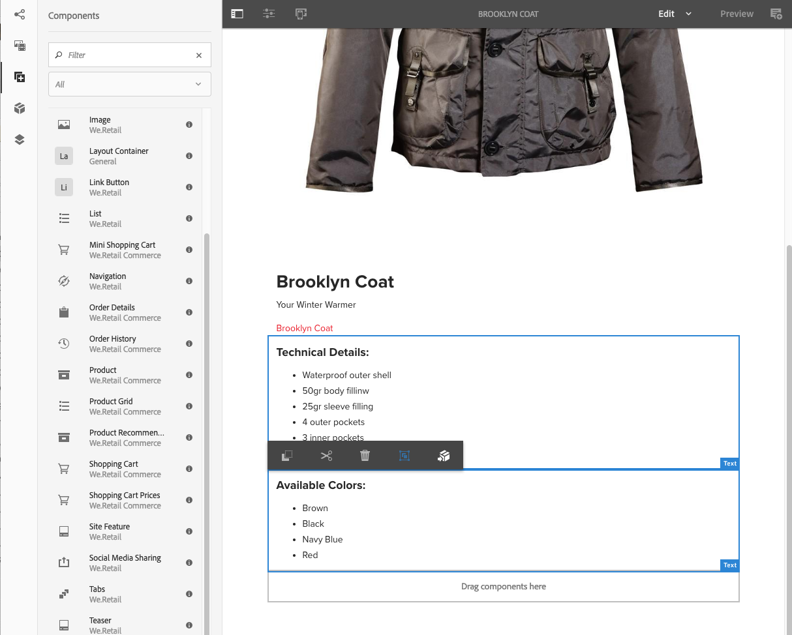

1. From the components toolbar, select **Convert to building block**:

   

1. Enter the name of the **Building Block**, and confirm with **Convert**:

   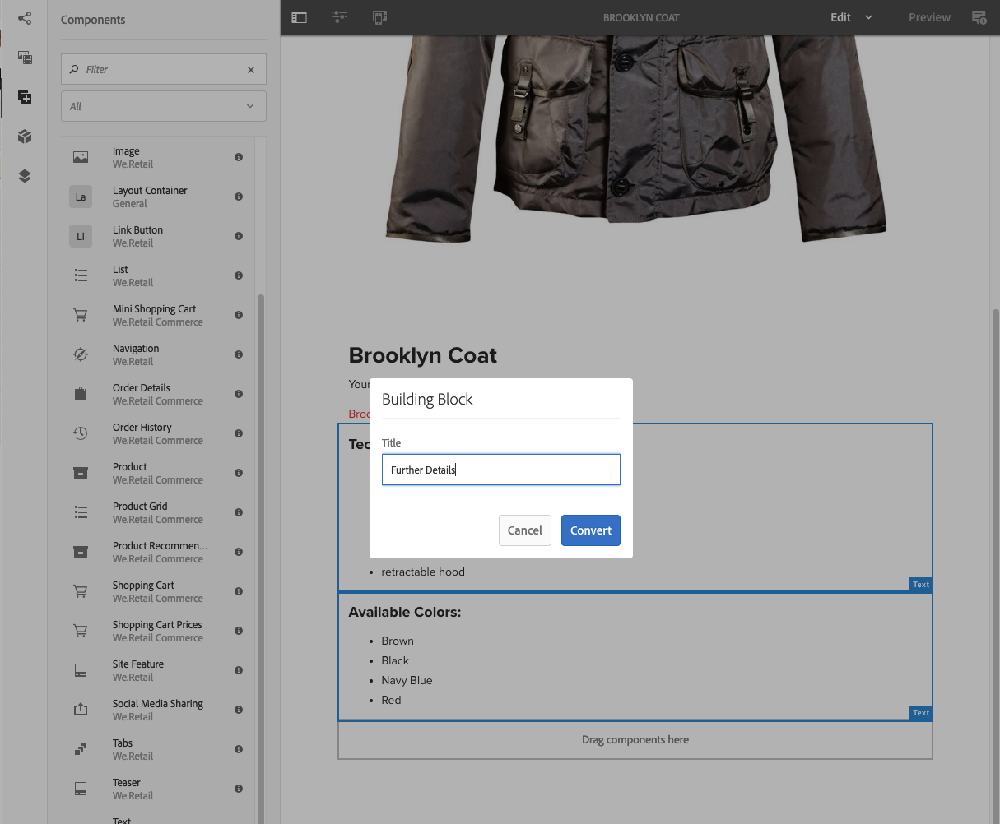

1. The **Building Block** will be shown in the tab, and can be selected in the paragraph system:

   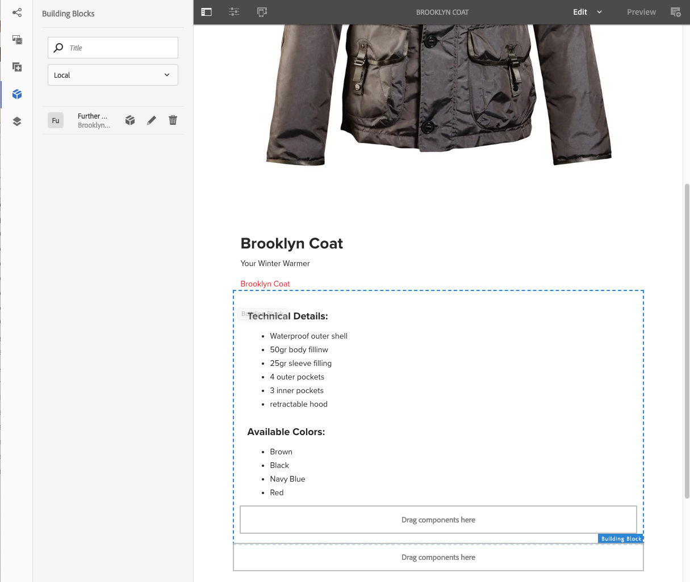

#### Managing a Building Block {#managing-a-building-block}

Your building block is visible in the **Building Blocks** tab. For each block, the following actions are available:

* Go to master: open the master variation in a new tab
* Rename
* Delete

#### Using a Building Block {#using-a-building-block}

You can drag your building block to the paragraph system of any fragment, as with any component.

## Details of your Experience Fragment {#details-of-your-experience-fragment}

Details of your fragment can be seen:

1. Details are shown in all views of the **Experience Fragments** console, with the **List View** including details of an [export to Target](/help/sites-administering/experience-fragments-target.md):

   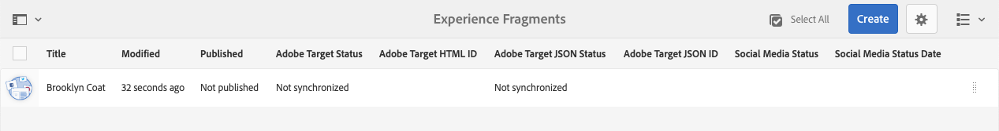

1. When you open the **Properties** of the Experience Fragment:

   

   The properties are available in various tabs:

   >[!CAUTION]
   >
   >These tabs are shown when you open **Properties** from the Experience Fragments console.
   >
   >
   >If you **Open Properties** when editing an Experience Fragment, the appropriate [Page Properties](/help/sites-authoring/editing-page-properties.md) are shown.

   

    * **Basic**

        * **Title** - mandatory

        * **Description**
        * **Tags**
        * **Total number of variants** - information only

        * **Number of web variants** - information only
        * **Number of non-web variants** - inf**ormation only**

        * **Number of pages using this fragment** - information only

    * **Cloud Services**

        * **Cloud Configuration**
        * **Cloud Service Configurations**
        * **Facebook page ID**
        * **Pinterest board**

    * **References**

        * A list of references.

    * **Social Media Status**

        * Details of social media variations.

## The Plain HTML Rendition {#the-plain-html-rendition}

Using the `.plain.` selector in the URL, you can access the plain HTML rendition from the browser.

>[!NOTE]
>
>Although this is directly available from the browser, [the primary purpose is to allow other applications (for example, third party web apps, custom mobile implementations) to access the content of the Experience Fragment directly, using only the URL](/help/sites-developing/experience-fragments.md#the-plain-html-rendition).

## Exporting Experience Fragments {#exporting-experience-fragments}

By default, Experience Fragments are delivered in the HTML format. This can be used by both AEM and third party channels alike.

For export to Adobe Target, JSON can also be used. See [Target Integration with Experience Fragments](/help/sites-administering/experience-fragments-target.md) for full information.

## Configuring Allowed Templates {#configuring-allowed-templates}

1. Navigate to the required **Experience Fragments** folder.

1. Select **Configuration options**:

   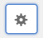

1. Specify the required templates in the **Configure Experience Fragments** dialog:

   

   >[!NOTE]
   >
   >See [Templates for Experience Fragments](/help/sites-developing/experience-fragments.md#templates-for-experience-fragments) for further details.

1. Select **Save**.

