# Your Inbox{#your-inbox}

You can receive notifications from various areas of AEM, including workflows and projects; for example, about:

* Tasks:

    * these can also be created at various points within the AEM UI, for example, under **Projects**,
    * these can be the product of a workflow **Create Task** or **Create Project Task** step.

* Workflows:

    * work items that represent actions that you need to perform on page content;

        * these are the product of workflow **Participant** steps

    * failure items, to allow administrators to retry the failed step.

You receive these notifications in your own Inbox where you can view them and take action.

>[!NOTE]
>
>Out-of-the-box AEM comes pre-loaded with administrative tasks assigned to the administrator user group. See [Out-of-the-Box Administrative Tasks](#out-of-the-box-administrative-tasks) for details.

>[!NOTE]
>
>For further information about the item types see also:
>
>* [Projects](/help/sites-authoring/touch-ui-managing-projects.md)
>* [Projects - working with Tasks](/help/sites-authoring/task-content.md)
>* [Workflows](/help/sites-authoring/workflows.md)
>* [Forms](/help/forms/home.md)
>

## Inbox in the Header {#inbox-in-the-header}

From any of the consoles the current number of items in your inbox is shown in the header. The indicator can also be opened to provide either quick access to the page(s) requiring action(s) or access to the inbox:

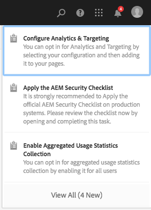

>[!NOTE]
>
>Certain actions will also be shown in the [card view of the appropriate resource](/help/sites-authoring/basic-handling.md#card-view).

## Out-of-the-Box Administrative Tasks  {#out-of-the-box-administrative-tasks}

Out-of-the-box AEM comes pre-loaded with four tasks assigned to the administrator user group.

* [Configure Analytics & Targeting](/help/sites-administering/opt-in.md)
* [Apply the AEM Security Checklist](/help/sites-administering/security-checklist.md)
* Enable Aggregated Usage Statistics Collection
* [Configure HTTPS](/help/sites-administering/ssl-by-default.md)

## Opening the Inbox {#opening-the-inbox}

To open the AEM notification inbox:

1. Click/tap on the indicator in the toolbar.

1. Select **View all**. The **AEM Inbox** will open. The inbox shows items from workflows, projects and tasks.
1. The default view is [List View](#inbox-list-view), but you can also switch to [Calendar View](#inbox-calendar-view). This is done with the view selector (toolbar, top right).

   For both views you can also define [View Settings](#inbox-view-settings); the options available are dependent on the current view.

   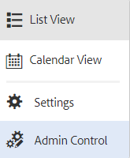

>[!NOTE]
>
>The Inbox operates as a console, so use [Global Navigation](/help/sites-authoring/basic-handling.md#global-navigation) or [Search](/help/sites-authoring/search.md) to navigate to another location when you are finished.

### Inbox - List View {#inbox-list-view}

This view lists all items, together with key relevant information:

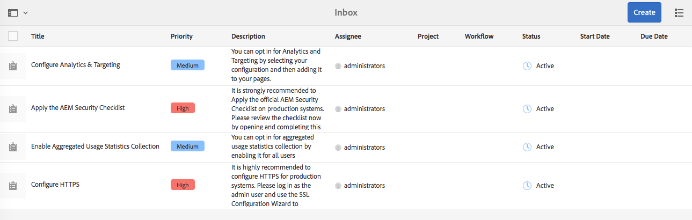

### Inbox - Calendar View {#inbox-calendar-view}

This view presents items according to their position in the calendar and the precise view you have selected:

You can:

* select a specific view; **Timeline**, **Column**, **List**

* specify the tasks to display according to **Schedule**; **All**, **Planned**, **In Progress**, **Due Soon**, **Past Due**

* drill down for more detailed information on an item
* select a date range to focus the view:

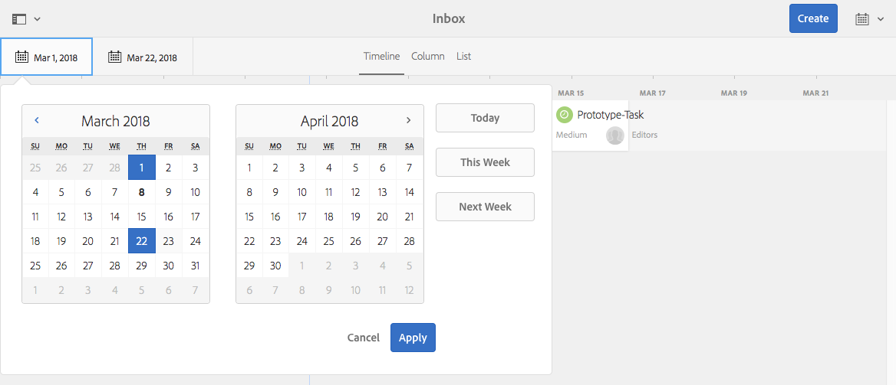

### Inbox - Settings {#inbox-view-settings}

For both views (List and Calendar) you can define settings:

* **Calendar View**

  For **Calendar View** you can configure:

    * **Group by**
    * **Schedule** or **None**
    * **Card size**

  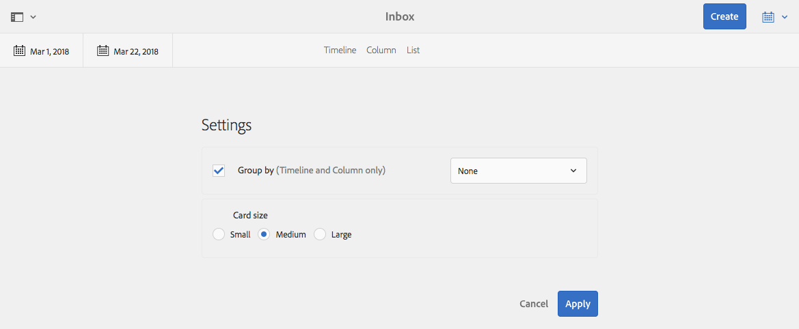

* **List View**

  For **List View** you can configure the sort mechanism:

    * **Sort Field**
    * **Sort Order**

  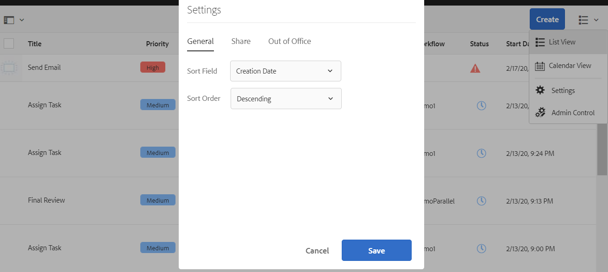

### Inbox - Admin Control {#inbox-admin-control}

The Admin Control option enables the administrators to:

* Customize the AEM Inbox columns

* Customize header text and logo

* Control the display of navigation links available in header

The Admin Control option is visible only to the members of the `administrators` or `workflow-administrators` group.

* **Column Customization**: Customize an AEM Inbox to change the default title of a column, reorder the position of a column, and display additional columns based on the data of a workflow.
  * **Add Column**: Select a column to add in AEM Inbox.
  * **Edit Column**: Hover the mouse over the column title and tap  icon to enter a column display name.
  * **Delete Column**: Tap the  icon to delete the column from AEM Inbox.
  * **Move Column**: Drag the  icon to move a column to a new position in AEM Inbox.

  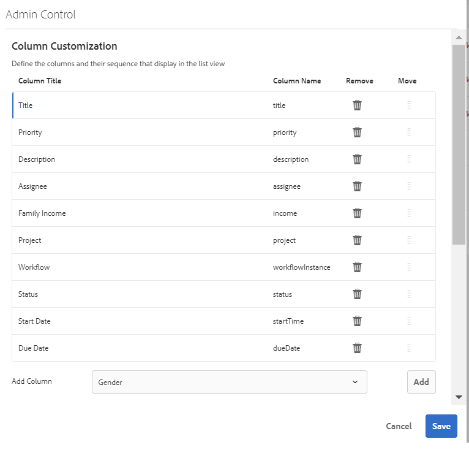

* **Branding Customization**

  * **Customize header text:** Specify the text to display in the header to replace the default **Adobe Experience Manager** text.

  * **Customize Logo:** Specify the image to display in the header as logo. Upload an image in  Digital Asset Management (DAM) and refer to that image in the field.

* **User Navigation**
  * **Hide navigation options:** Select this option to hide navigation options available in the header. The navigation options include links to other solutions, Help link, and the authoring options available on tapping Adobe Experience Manager logo or text. 
* **Save:** Tap/click this option to save the settings.

## Taking Action on an Item {#taking-action-on-an-item}

>[!NOTE]
>
>Although it is possible to select more than one item, actions can only be taken on one item at a time.

1. To take an action on an item, select the thumbnail for the appropriate item. Icons for the actions that are applicable to that item will be shown in the toolbar:

   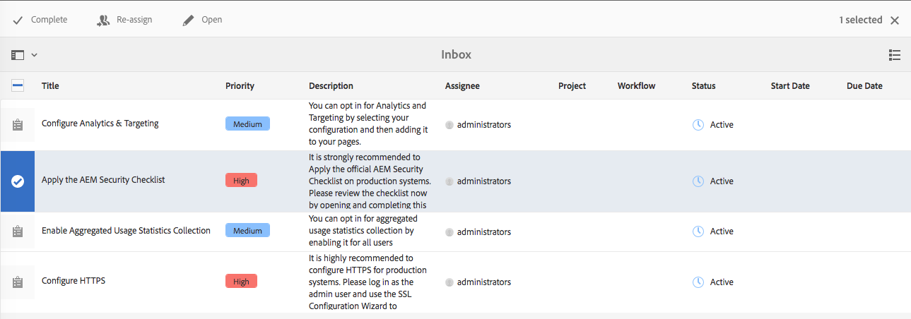

   The actions are appropriate to the item and include:

    * **Complete** action; for example, a task or workflow item.
    * **Re-assign**/**Delegate** an item.
    * **Open** an item; depending on the item type this action can:

        * show the item properties
        * open an appropriate dashboard or wizard for further action
        * open related documentation

    * **Step back** to a previous step.
    * View the payload for a workflow.
    * Create a project from the item.

   >[!NOTE]
   >
   >For further information see:
   >
   >* Workflow items - [Participating in Workflows](/help/sites-authoring/workflows-participating.md)

1. Depending on the item selected an action will be started; for example:

    * a dialog appropriate to the action will be opened.
    * an action wizard will be started.
    * a documentation page will be opened.

   For example, **Re-assign** will open a dialog:

   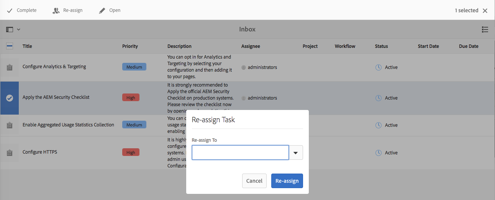

   Depending on whether a dialog, wizard, documentation page has been opened you can:

    * Confirm the appropriate action; e.g Re-assign.
    * Cancel the action.
    * Back arrow; for example, if an action wizard or documentation page has been opened, you can return to the Inbox.

## Creating a Task {#creating-a-task}

From the inbox you can create tasks:

1. Select **Create**, then **Task**.
1. Complete the necessary fields in the **Basic** and **Advanced** tabs; only the **Title** is mandatory, all others are optional:

    * **Basic**:

        * **Title**
        * **Project**
        * **Assignee**
        * **Content**; similar to Payload, this is a reference from the task to a location in the repository
        * **Description**
        * **Task Priority**
        * **Start Date**
        * **Due Date**

   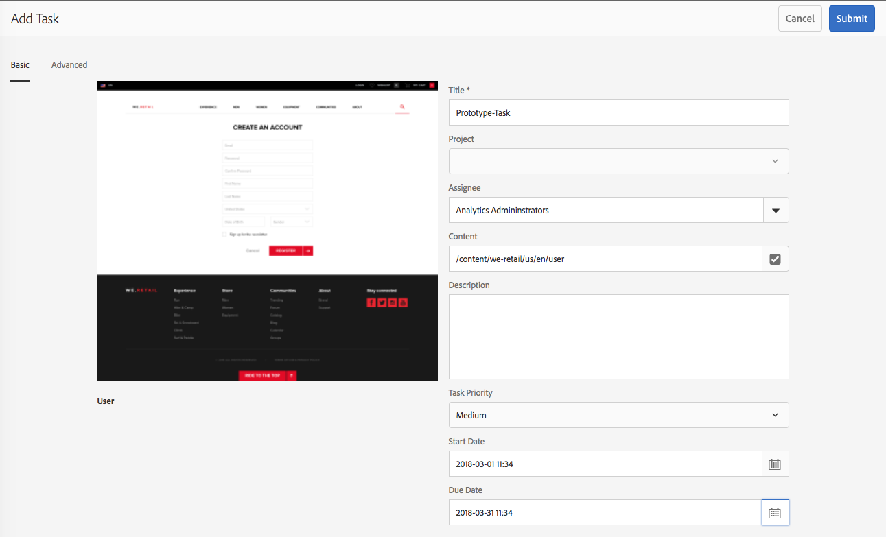

    * **Advanced**

        * **Name**: this will be used to form the URL; if blank it will be based on the **Title**.

   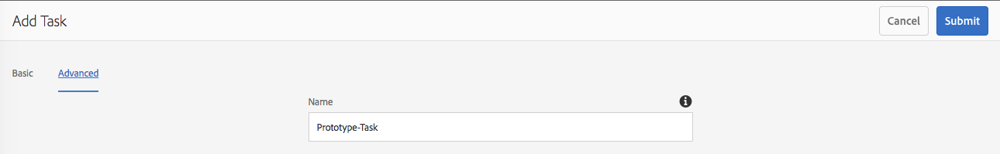

1. Select **Submit**.

## Creating a Project {#creating-a-project}

For certain tasks you can create a [Project](/help/sites-authoring/projects.md) based on that task:

1. Select the appropriate task, by tapping/clicking on the thumbnail.

   >[!NOTE]
   >
   >Only tasks created using the **Create** option of the **Inbox** can be used to create a project.
   >
   >Workitems (from a workflow) cannot be used to create a project.

1. Select **Create Project** from the toolbar to open the wizard.
1. Select the appropriate template, then **Next**.
1. Specify the required properties:

    * **Basic**

        * **Title**
        * **Description**
        * **Start Date**
        * **Due Date**
        * **User** and role

    * **Advanced**

        * **Name**

   >[!NOTE]
   >
   >See [Creating a Project](/help/sites-authoring/touch-ui-managing-projects.md#creating-a-project) for full information.

1. Select **Create** to confirm the action.

## Filtering Items in the AEM Inbox {#filtering-items-in-the-aem-inbox}

You can filter the items listed:

1. Open the **AEM Inbox**.

1. Open the filter selector:

   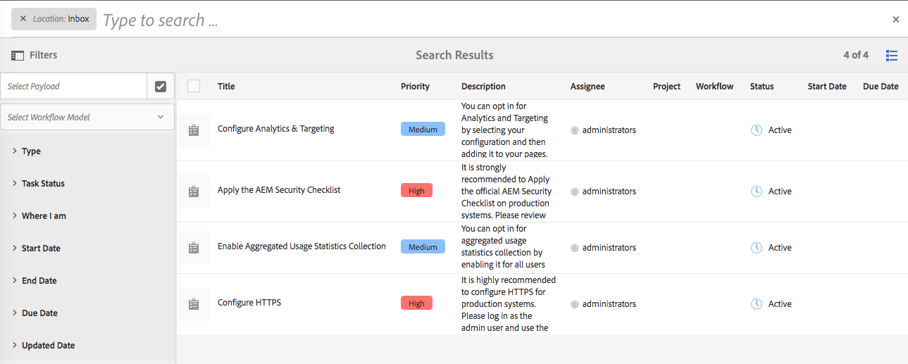

1. You can filter the items listed according to a range of criteria, many of which can be refined; for example:

   

   >[!NOTE]
   >
   >With [View Settings](#inbox-view-settings) you can also configure the sort order when using the [List View](#inbox-list-view).
