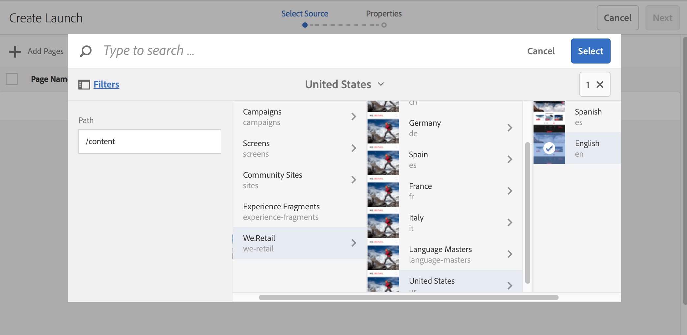
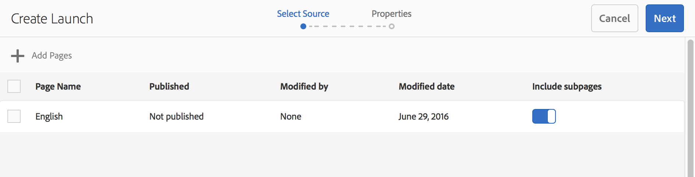
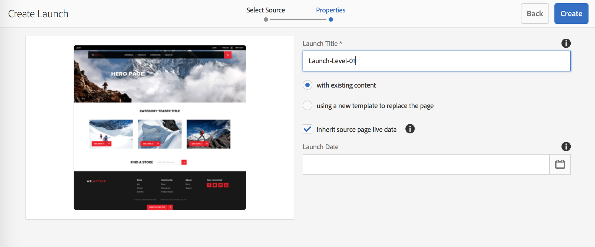
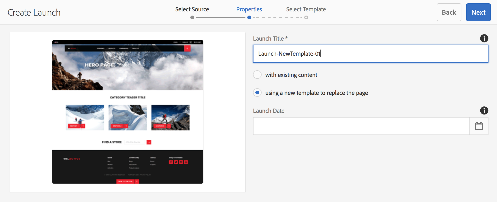
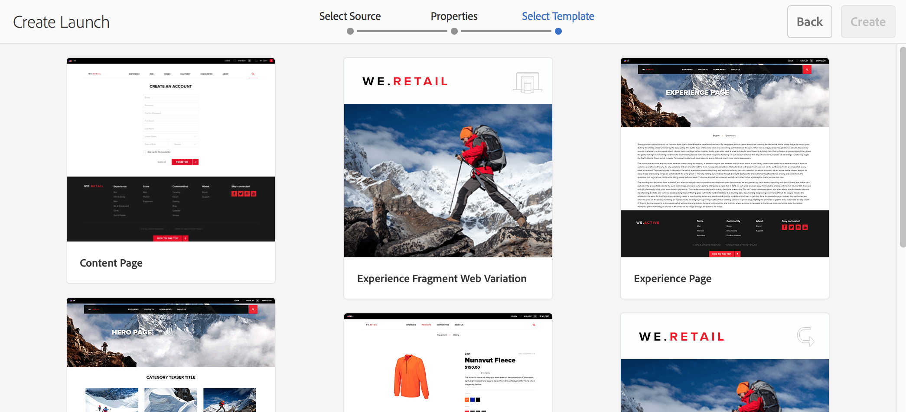
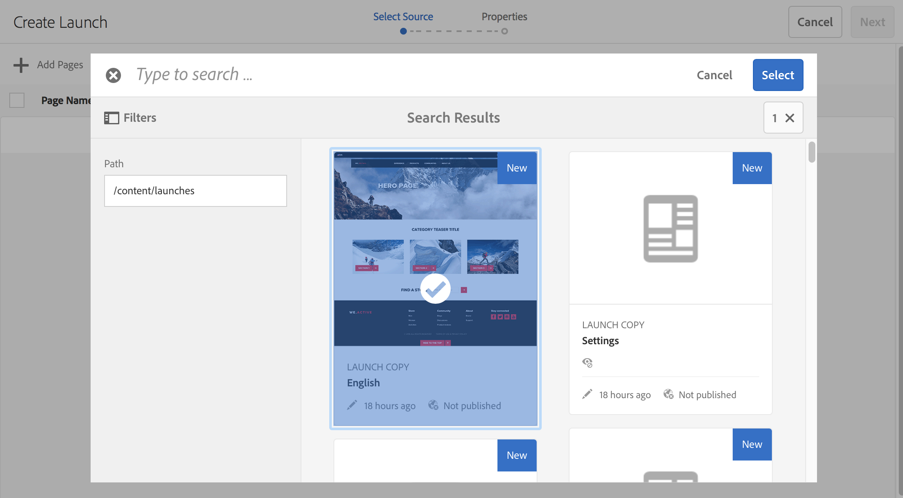
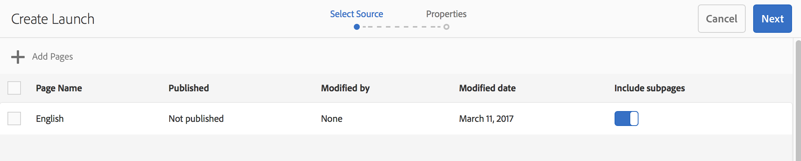

# Create Launches{#creating-launches}

Create a launch to enable the updating of a new version of existing web pages for future activation. When you create a Launch, you specify a title and the source page:

* The title appears in the [References](/help/sites-authoring/author-environment-tools.md#references) rail, from where authors can access them to work on them.
* The child pages of the source page are included in the launch by default. You can use only the source page if desired.
* By default, [Live Copy](/help/sites-administering/msm.md) automatically updates the launch pages as the source pages change. You can specify that a static copy is created to prevent automatic changes.

Optionally, you can specify the **Launch Date** (and time) to define when the launch pages are to be promoted and activated. However the **Launch Date** only operates in combination with the **Production Ready** flag (see [Editing a Launch Configuration](/help/sites-authoring/launches-editing.md#editing-a-launch-configuration)); for the actions to actually occur automatically, both must be set.

## Creating a Launch {#creating-a-launch}

You can create a launch from either the Sites or Launches console:

1. Open the **Sites** or **Launches** console.

   >[!NOTE]
   >
   >When using the **Sites** console it is usual to navigate to the location of the source page, but this is not compulsory as you can navigate when selecting the **Launch Source** in the wizard.

1. Depending on the console you are using:

    * **Launches**:

        1. Select **Create Launch** from the toolbar to open the wizard.

    * **Sites**:

        1. Select **Create** from the toolbar to open the selection box.
        1. From this select **Create Launch** to open the wizard.

   >[!NOTE]
   >
   >In the **Sites** console you can also use [selection mode](/help/sites-authoring/basic-handling.md#viewing-and-selecting-resources) to select a page before selecting **Create**.
   >
   >This will use the selected page as the initial source page.

1. In the **Select Source** step you need to **Add Pages**. You can select multiple pages, specifying the path for each:

    * Navigate to the required location.
    * Select the source page(s) and confirm (checkmark).

   Repeat as required.

   

   >[!NOTE]
   >
   >To add pages and/or branches to a launch they must be within a site; i.e. below a common top-level root.
   >
   >If a site contains language roots below the top level, the pages and branches for a launch must be below a common language root.
   >
   >If you try to create a launch with a parent or child page in the source path, it will fail and return the error “Destination already exists at :path to the page.”.

1. For each entry you can specify whether to:

    * **Include subpages**:

        * Specify whether you want to create the launch with or without the child pages.  By default, this subpages are included.

   Proceed with **Next**.

   

1. In the **Properties** step of the wizard you can specify:

    * **Launch Title**: The name of the Launch. The name should be meaningful for authors.
    * **with existing content**: the original content will be used to create the launch.
    * **use a new template to replace the page**: See [Create Launch with New Template](#create-launch-with-new-template) for more details.
    * **Inherit source page live data**: Select this option to automatically update the content of launch pages when the source pages change. This option achieves this by making the launch a [live copy](/help/sites-administering/msm.md).

      By default, this option is selected.

    * **Launch Date**: The date and time when the launch copy is to be activated (dependent on the **Production Ready** flag; see [Launches - the Order of Events](/help/sites-authoring/launches.md#launches-the-order-of-events)).

   

1. Use **Create** to complete the process and create your new launch. The confirmation dialog will ask whether you want to open the launch immediately.

   If you return the console (with **Done**) you can see (and access) your launch from either:

    * the [**Launches** console](/help/sites-authoring/launches.md#the-launches-console)
    * the [**References** in the **Sites** console](/help/sites-authoring/launches.md#launches-in-references-sites-console)

### Create Launch with New Template {#create-launch-with-new-template}

When [creating a launch](/help/sites-authoring/launches-creating.md#create-launch-with-new-template) you can select whether to use a new template:

**using a new template to replace the page**

>[!CAUTION]
>
>This option is only available when creating a launch from the **Sites** console. It is not available when creating a launch from the **Launches** console.

Selecting this will:

* update the other options available,
* include a new step where you can select the required template.

>[!CAUTION]
>
>As a different template is used the new page will be empty. Due to the different page structure no content will be copied over.
>
>This mechanism can be used to change the template of an [existing page](/help/sites-authoring/managing-pages.md#creating-a-new-page) - though the loss of content must be considered.

### Creating a Nested Launch {#creating-a-nested-launch}

Creating a nested launch (launch within a launch) gives you the ability to create a launch from an existing launch so that authors can take advantage of changes already made, rather than having to make the same changes multiple times for each launch.

>[!NOTE]
>
>See also [Promoting a Nested Launch](/help/sites-authoring/launches-promoting.md#promoting-a-nested-launch).

#### Creating a Nested Launch - Launches Console {#creating-a-nested-launch-launches-console}

Creating a nested launch from the **Launches** console is basically the same as creating any other form of launch, with the exception that you need to navigate to the launches branch `/content/launches`:

1. In the **Launches** console select **Create**.
1. Select **Add Pages**, then navigate to the launches branch by specifying `/content/launches` in the filter. Select the required launch and confirm with **Select**:

   

1. Proceed with **Next** and complete the **Properties** as with any other launch.

   

#### Creating a Nested Launch - Sites Console {#creating-a-nested-launch-sites-console}

To create a nested launch from the **Sites** console - based on an existing launch:

1. Access the [Launch from References (Sites console)](/help/sites-authoring/launches.md#launches-in-references-sites-console) to show the available actions.
1. Select **Create launch** to open the wizard (as the source has already been selected it will skip the **Select Source** step).

1. Enter the **Launch Title** and any other required details (as with a normal launch).

1. Use **Create** to complete the process and create your new launch. The confirmation dialog will ask whether you want to open the launch immediately.

   If you select **Done**, you are returned to the **References** rail of the **Sites** console, if you select the appropriate page your new launch is shown.

### Deleting a Launch {#deleting-a-launch}

You can delete a launch from the [launches console](/help/sites-authoring/launches.md#the-launches-console):

* Select the launch, by tapping/clicking on the thumbnail.
* The toolbar will appear - select Delete.
* Confirm the action.

>[!CAUTION]
>
>Deleting a launch will remove the launch itself and all descendant nested launches.
