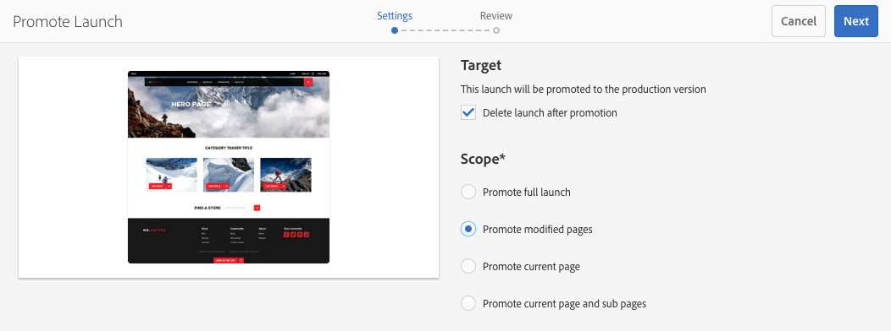
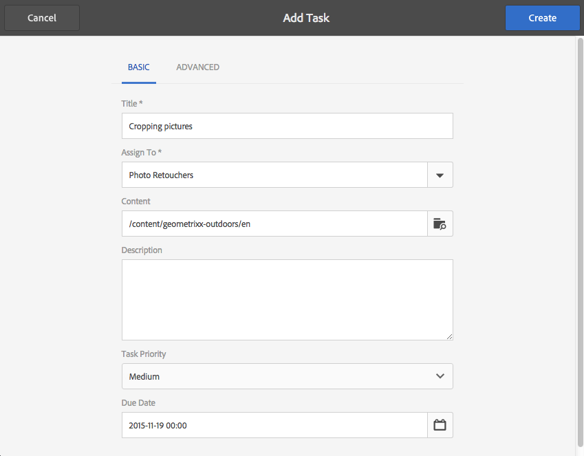
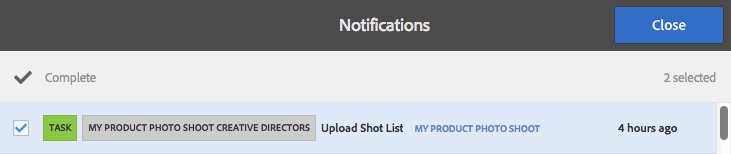
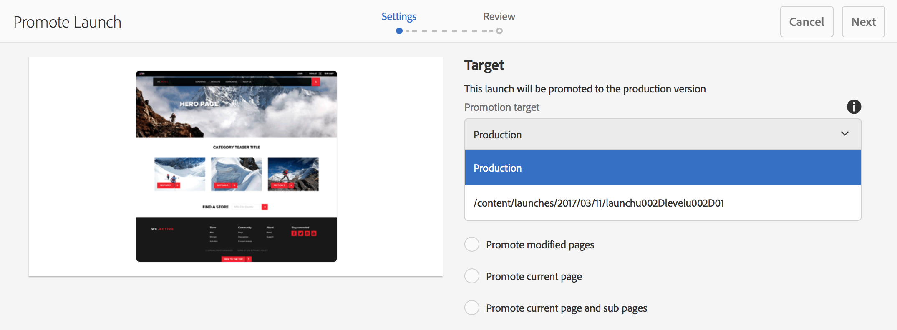

# Promoting Launches{#promoting-launches}

You need to promote launch pages to move the content back into the source (production) before publishing. When a launch page is promoted, the corresponding page of the source pages is replaced with the content of the promoted page. The following options are available when promoting a launch page:

* Whether to promote only the current page or the entire launch.
* Whether to promote the child pages of the current page.
* Whether to promote the full launch or only pages that have changed.
* Whether to delete the launch after being promoted.

>[!NOTE]
>
>After you promote the launch pages to the target (**Production**), you can activate the **Production** pages as an entity (to make the process quicker). Add the pages to a workflow package and use it as the payload for a workflow that activates a package of pages. You need to create the workflow package before promoting the launch. See [Processing Promoted Pages Using AEM Workflow](#processing-promoted-pages-using-aem-workflow).

>[!CAUTION]
>
>A single launch cannot be promoted concurrently. This means that two promote actions on the same launch at the same time can result in an error - `Launch could not be promoted` (together with conflict errors in the log).

>[!CAUTION]
>
>When promoting launches for *modified* pages, modifications in both the source and launch branches are considered.

## Promoting Launch Pages {#promoting-launch-pages}

>[!NOTE]
>
>This covers the manual action of promoting launch pages when there is only one launch level. See:
>
>* [Promoting a Nested Launch](#promoting-a-nested-launch) when there is more than one launch in the structure.
>* [Launches - the Order of Events](/help/sites-authoring/launches.md#launches-the-order-of-events) for further details about automatic promotion and publication.
>

You can promote launches from either the **Sites** console or the **Launches** console:

1. Open:

    * the **Sites** console:

        1. Open the [references rail](/help/sites-authoring/author-environment-tools.md#showingpagereferences) and select the required source page using [selection mode](/help/sites-authoring/basic-handling.md) (or select and open the references rail, the order is not important). All references will be shown.
        
        1. Select **Launches** (e.g. Launches (1)) to show a list of the specific launches.
        1. Select the specific launch to show the actions available.
        1. Select **Promote launch** to open the wizard.

    * the **Launches** console:

        1. Select your launch (tap/click on the thumbnail).
        1. Select **Promote**.

1. In the first step you can specify:

    * **Target**

        * **Delete launch after promotion**

    * **Scope**

        * **Promote full launch**
        * **Promote modified pages**
        * **Promote current page**
        * **Promote current page and sub pages**

   For example, when selecting to only promote modified pages:

   

   >[!NOTE]
   >
   >This covers a single launch, if you have nested launches see [Promoting a Nested Launch](#promoting-a-nested-launch).

1. Select **Next** to proceed.
1. You can review the pages to be promoted, these will depend on the range of pages you have chosen:

   

1. Select **Promote**.

## Promoting Launch Pages when Editing {#promoting-launch-pages-when-editing}

When you are editing a launch page, the **Promote Launch** action is also available from **Page Information**. This will open the wizard to collect the information needed.

>[!NOTE]
>
>This is available for single and [nested launches](#promoting-a-nested-launch).

## Promoting a Nested Launch {#promoting-a-nested-launch}

After creating a nested launch you can promote it back to any of the sources, including the root source (production).

1. As with [Creating a Nested Launch](#creatinganestedlaunchlaunchwithinalaunch), navigate to and select the required launch in either the **Launches** console or the **References** rail.
1. Select **Promote launch** to open the wizard.  

1. Enter the required details:

    * **Target**

        * **Promotion target** 
          You can promote to any of the sources.
        
        * **Delete launch after promotion** 
          After promotion the selected launch, and any launches nested within it, will be deleted.

    * **Scope** 
      Here you can select whether to promote the entire launch, or only pages that have actually been edited. If the latter, you can then select to include/exclude sub-pages. The default configuration is to only promote page changes for the current page:

        * **Promote full launch**
        * **Promote modified pages**
        * **Promote current page**
        * **Promote current page and sub pages**

   

1. Select **Next**.
1. Review the promotion details before selecting **Promote**:

   

   >[!NOTE]
   >
   >The pages listed will depend on the **Scope** defined and possibly the pages that have actually been edited.

1. Your changes will be promoted and reflected in the **Launches** console:

   

## Processing Promoted Pages Using AEM Workflow {#processing-promoted-pages-using-aem-workflow}

Use workflow models to perform bulk processing of promoted Launches pages:

1. Create a workflow package. 
1. When authors promote Launch pages, they store them in the workflow package.
1. Start a workflow model using the package as the payload.

To start a workflow automatically when pages are promoted, [configure a workflow launcher](/help/sites-administering/workflows-starting.md#workflows-launchers) for the package node.

For example, you can automatically generate page activation requests when authors promote Launches pages. Configure a workflow launcher to start the Request Activation workflow when the package node is modified. 

