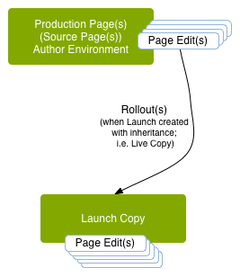
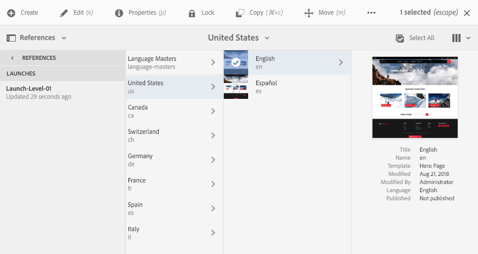

# Launches{#launches}

Launches enable you to efficiently develop content for a future release.

A *Launch* is created to allow you to make changes in preparation for future publication, at the same time as maintaining your current pages. This means that you are effectively editing two versions at the same time: pages that are currently published, and a version of those pages, to be published at a time in the future. Once that time arrives you can replace the original pages and publish the new version.  

You create a *Launch*, then after editing and updating your *Launch* pages you *Promote* them back to the *Source*. You can then activate these *Source* pages (top-level). Promoting duplicates the launch content back to the source pages and can be done either manually or automatically (dependent on fields set when creating and editing the launch).

For example, the seasonal product pages of your online store are updated quarterly so that the featured products align with the current season. To prepare for the next quarterly update, you can create a launch of the appropriate web pages. Throughout the quarter, the following changes are accumulated in the launch copy:

* Changes to the source pages that occur as a result of normal maintenance tasks. These changes are automatically duplicated in the launch pages.
* Edits that are performed directly on the launch pages in preparation for the next quarter.

When the next quarter arrives, you promote the launch pages so that you can publish the source pages (holding the updated content). You can promote either all pages, or only those that you have modified.

Launches can also be:

* Created for multiple root branches. While you could create the launch for the entire site (and do the changes there) this can be impractical as the whole site needs to be copied. When hundreds or even thousands of pages are involved, the system requirements and performance are impacted by both the copy action and later the comparisons required for the promotion tasks.
* Nested (a launch within a launch) to give you the ability to create a launch from an existing launch so that authors can take advantage of changes already made, rather than having to make the same changes multiple times for each launch.

This section descibes how to create, edit and promote (and if necessary [delete](/help/sites-authoring/launches-creating.md#deleting-a-launch)) launch pages from within the Sites console or [the Launches console](#the-launches-console):

* [Creating Launches](/help/sites-authoring/launches-creating.md)
* [Editing Launches](/help/sites-authoring/launches-editing.md)
* [Promoting Launches](/help/sites-authoring/launches-promoting.md)

## Launches - the Order of Events {#launches-the-order-of-events}

Launches enable you to efficiently develop content for a future release of one or more activated web pages.

Launches let you:

* Create a copy of your source pages:

    * The copy is your launch.
    * The top-level source pages are known as **Production**.

        * The source pages can be taken from multiple (separate) branches.

  

* Edit the launch configuration:

    * Add or remove pages and/or branches to/from the launch.
    * Edit launch properties; such as **Title**, **Launch Date**, **Production Ready** flag.

* You can promote and publish the content either manually or automatically:

    * Manually:

        * Promote your launch content back to the **Target** (source pages) when it is ready to be published.
        * Publish the content from the source (after promoting back) pages.
        * Promote either all pages, or only modified pages.

    * Automatically - this involves the following:

        * The **Launch**(**Live**) **date** field: this can be set when creating or editing a launch.  
        
        * The **Production Ready** flag: this can only be set when editing a launch.
        * If the **Production Ready** flag is set, the launch will be automatically promoted to the production pages on the specified **Launch**(**Live**) **date**. After the promotion, the production pages are automatically published.  
          If no date has been set, the flag will have no effect.

* Update your source and launch pages in parallel:

    * Changes to the source pages are automatically implemented in the launch copy (if set up as with inheritance; that is, as a live copy).  
    * Changes to your launch copy can be made without disrupting these automatic updates or the source pages.

  

* [Create a nested launch](/help/sites-authoring/launches-creating.md#creating-a-nested-launch) - a launch within a launch:

    * The source is an existing launch.
    * You can [promote a nested launch](/help/sites-authoring/launches-promoting.md#promoting-a-nested-launch) to any target; this can be a parent launch or the top-level source pages (Production).

  

  >[!CAUTION]
  >
  >Deleting a launch will remove the launch itself and all descendant nested launches.

>[!NOTE]
>
>Creating and editing launches requires access rights to `/content/launches` - as with the default group `content-authors`. 
>
>Contact your system administrator if you experience any problems.

>[!CAUTION]
>
>Re-ordering components on a Launch page is not supported. 
>
>When the page is promoted any content changes will be reflected, but the component positions will not change.

## The Launches Console {#the-launches-console}

The Launches console provides an overview of your launches and lets you take actions on those listed. The console can be accessed by:

* The **Tools** Console: **Tools**, **Sites**, **Launches**.

* Or directly with [https://localhost:4502/libs/launches/content/launches.html](https://localhost:4502/libs/launches/content/launches.html)

## Launches in References (Sites Console) {#launches-in-references-sites-console}

1. In the **Sites** console, navigate to the source of the launch(es).
1. Open the **References** rail and select the source page.
1. Select **Launches**, the existing launch(es) will be listed:

   

1. Click the appropriate launch, the list of possible actions will be displayed:

   
