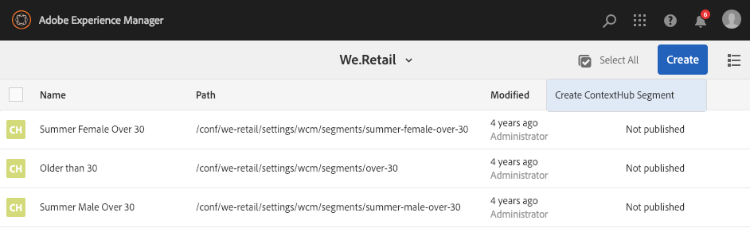
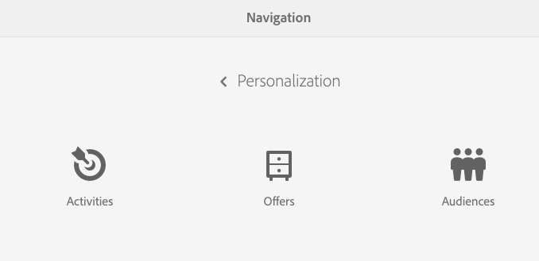
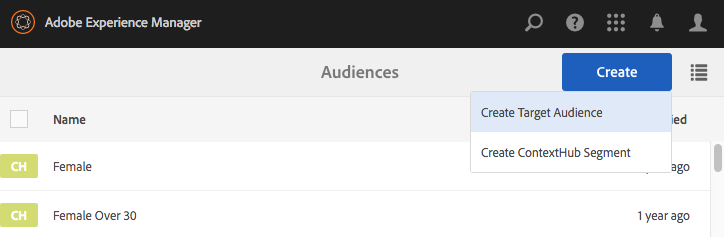

# Managing Audiences{#managing-audiences}

The Audiences console enables you to create, organize, and manage audiences for your Adobe Target account or manage segments for ContextHub or Client Context:

* Add Audiences - either Adobe Target audiences or ContextHub segments.
* Manage audiences.

An Audience, called *segment* in ContextHub and Client Context, is a class of visitors defined by specific criteria, which then determines who sees a targeted activity. When you target an activity, you can either select audiences directly in the Targeting process or create more in the Audiences console.

In the Audiences console, audiences are organized by brand.

Audiences are available in Targeting mode for [authoring targeted content](/help/sites-authoring/content-targeting-touch.md), where you can also create audiences (but you must create Adobe Target audiences in the Audiences console). Audiences that you create in Targeting mode appear in the Audiences console.

Audiences are displayed with a label describing what kind of audience is defined:

* CH - ContextHub segment
* CC - Client Context segment
* AT - Adobe Target audience

## Creating a ContextHub Segment in the Audiences Console {#creating-a-contexthub-segment-in-the-audiences-console}

You can create a ContextHub segment either in the Audiences console or during the targeting process.

To create a ContextHub segment in the Audiences console:

1. In the Navigation console, click or tap **Personalization**. Click or tap **Audiences**.
1. Tap or click **Create ContextHub Segment**.

   

1. In the **New ContextHub Segment** dialog box, enter a title and adjust the boost and click **Create**. Your new ContextHub segment appears in the audience list.

   >[!NOTE]
   >
   >You can sort the modified list by tapping or clicking **Modified** to sort by descending order to see any newly created audiences.

For further detail about creating segments using ContextHub, see the [Configuring Segmentation with ContextHub](/help/sites-administering/segmentation.md) documentation.

## Creating an Adobe Target Audience Using the Audience Console {#creating-an-adobe-target-audience-using-the-audience-console}

You can create Adobe Target audiences directly in AEM using the Audiences console.

Audiences are defined by rules that determine who is included in a target activity. An audience definition can include multiple rules and each rule can include multiple parameters.

When you use more than one rule, these rules are combined by the Boolean operator AND, which means that any potential audience member must meet all the defined conditions to be included in the activity. For example, if you define an OS rule AND a browser rule, only visitors using both the defined OS AND the defined browser are included in the activity.

>[!NOTE]
>
>If you do not see **Create Target Audience **in the **Create** menu, you do not have the necessary permissions to create an audience. You need write permissions under **/etc/segmentation** to be able to create audiences. The group content-authors has write permissions by default.

To create an Adobe Target audience:

1. In the Navigation console, click or tap **Personalization**. Click or tap **Audiences**.

   

1. In the Audiences console, tap or click **Create** and then** Create Target Audience**.

   

1. In the **Adobe Target Configuration** dialog box, select the target configuration and tap or click **OK**.
1. In the Rule#1 area, tap or click the attribute type and enter any attribute information in the fields that are available. When finished, select the check mark to the right of the attribute to save it. See [Attributes and their options](#attributes-and-their-options) for information on all the attributes.
1. Click **Add Rule** to add another rule. Enter as many rules as needed. Rules are combined with the boolean operator AND, which means that the audience must meet all the requirements of each rule to be eligible for an activity.
1. Tap or click **Next**.
1. Enter a name for the audience and tap or click **Save**.
1. Tap or click **Save**. Your audience is listed in the Audience list.

### Attributes and their Options {#attributes-and-their-options}

You can create targeting rules for each of the following attributes:

| **Attribute** |**Description** |**For more information** |
|---|---|---|
| **Mobile** |Target mobile devices based on parameters such as mobile device, type of device, device vendor, screen dimensions (by pixels), and more. |See [Mobile documentation](https://experienceleague.adobe.com/docs/target/using/audiences/create-audiences/categories-audiences/mobile.html) at Adobe Target. |
| **Custom** |Custom parameters are mbox parameters. If you pass any mbox parameters to mboxes, or use the targetPageParams function, those parameters appear here for use in audiences. |See [Custom Parameters documentation](https://experienceleague.adobe.com/docs/target/using/audiences/create-audiences/categories-audiences/custom-parameters.html) at Adobe Target. |
| **OS** |You can target visitors who use a certain operating system. |Target users who are using Linux&reg;, Macintosh, or Windows. |
| **Site Pages** |Target visitors who are on a specific page or have a specific mbox parameter. |See [Site Pages documentation](https://experienceleague.adobe.com/docs/target/using/audiences/create-audiences/categories-audiences/site-pages.html) at Adobe Target. |
| **Browser** |You can target users who use a specific browser or specific browser options when they visit your page. |See [Browser options documentation](https://experienceleague.adobe.com/docs/target/using/audiences/create-audiences/categories-audiences/browser.html?lang=en) at Adobe Target. |
| **Visitor Profile** |Target visitors who meet specific profile parameters. |See [Visitor Profile documentation](https://experienceleague.adobe.com/docs/target/using/audiences/visitor-profiles/visitor-profile.html) at Adobe Target. |
| **Traffic Sources** |Target visitors based on the search engine or landing page that refers them to your site. |See [Traffic Sources documentation](https://experienceleague.adobe.com/docs/target/using/audiences/create-audiences/categories-audiences/traffic-sources.html) at Adobe Target. |

## Modifying an Audience in the Audiences Console {#modifying-an-audience-in-the-audiences-console}

>[!NOTE]
>
>You can only edit Adobe Target audiences that were created in the same AEM instance where you are editing. Target audiences created in different AEM environments cannot be edited.

You can edit any ContextHub or Client Context audience from the Audiences console. You can also edit Adobe Target audiences, but only those audiences that were created in AEM:

1. In the Navigation console, click or tap **Personalization**. Click or tap **Audiences**.
1. Tap or click the icon next to the ContextHub or Client Context segment you want to edit, and tap or click **Edit**.
1. Make any edits in the segment editor. See [Client Context](/help/sites-administering/campaign-segmentation.md) or [ContextHub](/help/sites-developing/ch-configuring.md) documentation.
