# Creative Project and PIM Integration {#creative-project-and-pim-integration}

If you are a marketer or creative professional, you can use Creative Project tools in Adobe Experience Manager (AEM) to manage eCommerce-related product photography and associated creative processes within your organization.

You can use Creative Project to streamline the following tasks in your photo shoot workflow:

* Generating a photo shoot request
* Uploading a photo shoot
* Collaborating on a photo shoot
* Packaging approved assets

>[!NOTE]
>
>See [Project User Roles for information](/help/sites-authoring/projects.md#user-roles-in-a-project) on assigning user roles and workflows to certain types of users.

## Product Photo Shoot Workflows  {#exploring-product-photo-shoot-workflows}

Creative Project provides various project templates to meet diverse project requirements. The **Product Photo Shoot Project** template is available out of the box. This template includes photo shoot workflows that let you initiate and manage product photo shoot requests. It also includes a series of tasks that enable you to obtain digital images for products through appropriate review and approval processes.

## Create a Product Photo Shoot Project {#create-a-product-photo-shoot-project}

1. In the **Projects** console, click **Create** and then choose **Create Project** from the list.

   

1. In the **Create Project** page, select the **Product Photo Shoot Project** template and click **Next**.

   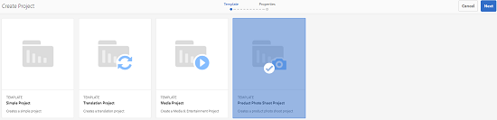

1. Enter project details, including title, description, and due date. Add users and assign various roles to them. You can also add a thumbnail for the project.

   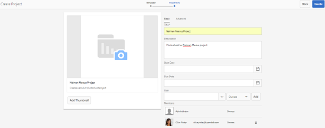

1. Click **Create**. A confirmation message notifies that the project is created.
1. Click **Done** to return to the **Projects** console. Alternatively, click **Open** to view the assets within the project.

## Starting Work in a Product Photo Shoot Project {#starting-work-in-a-product-photo-shoot-project}

To initiate a photo shoot request, click a project and then click **Add Work** within the project details page to start a workflow.

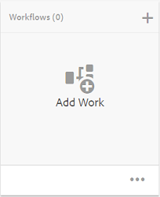

A **Product Photo Shoot Project** includes the following out-of-the-box workflows:

* **Product Photo Shoot (Commerce Integration) Workflow**: This workflow uses commerce integration with the product information management (PIM) system to automatically generate a shot list for the selected products (hierarchy). You can view the product data as part of the asset metadata after the workflow is complete.
* **Product Photo Shoot Workflow**: This workflow lets you provide a shot list instead of depending on commerce integration. It maps the uploaded images to a CSV file in the project assets folder.

Use the **Product Photo Shoot (Commerce Integration)** workflow to map image assets with the products in AEM. This workflow uses commerce integration to link the approved images to the existing product data at the location `/etc/commerce`.

The **Product Photo Shoot (Commerce Integration)** workflow includes the following tasks:

* Create Shot list
* Upload Photo Shoot
* Retouch Photo Shoot
* Review and Approve
* Move to Production Task

If product information isn’t available in AEM, use the **Product Photo Shoot** workflow to map image assets with the products based on the details you upload in a CSV file. The CSV file must contain basic product information, such as product ID, category, and description. The workflow fetches approved assets for the products.

This workflow includes the following tasks:

* Upload Shot List
* Upload Photo Shoot
* Retouch Photo Shoot
* Review and Approve
* Move to Production Task

You can customize this workflow using the workflow configurations option.

Both workflows include steps to link products with their approved assets. Each workflow includes the following steps:

* Workflow Configuration: Describes the options to customize the workflow
* Starting a project workflow: Explains how to start a product photo shoot
* Workflow Tasks Details: Provides details of tasks available in the workflow

## Tracking Project Progress {#tracking-project-progress}

You can track the progress of a project by monitoring the active/completed tasks within a project.

Use the following to monitor the progress of a project:

* Task card
* Task list

The task card depicts the overall progress of the project. It appears on the project details page only if the project has any related tasks. The task card displays the current completion status of the project based on the number of tasks completed. It does not include future tasks.

The task card provides the following details:

* Percentage of active tasks
* Percentage of completed tasks


The task list provides detailed information around the currently active workflow task for the project. To display the list, click the task card. The task list also displays metadata such as start date, due date, assignee, priority, and status of the task.

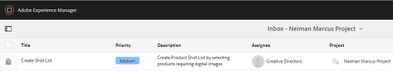

## Workflow Configuration {#workflow-configuration}

This task involves assigning workflow steps to users based on their roles.

To configure the **Product Photo Shoot** workflow:

1. Navigate to **Tools** &gt; **Workflows**, and then select the **Models** tile to open the **Workflow Models** page.
1. Select the **Product Photo Shoot** workflow, and the select the **Edit** icon from the toolbar to open it in edit mode.

   

1. In the **Product Photo Shoot Workflow** page, open a project task. For example, open the **Upload Shot List** task.

   

1. Click the **Task** tab to configure the following:

    * Name of the task
    * Default user (role) that receives the task
    * Default priority of the task, which is displayed in the task list of the user
    * Task description to be displayed when the assignee opens the task
    * Due date for a task, which is calculated based on the time the task started

1. Click **OK** to save the configuration settings.

You can configure the additional tasks for the **Product Photo Shoot** workflow in a similar way.

Perform the same steps to configure the tasks in the **Product Photo Shoot (Commerce Integration) Workflow**.

## Starting a Project Workflow {#starting-a-project-workflow}

This section describes how to integrate product information management with your creative project.

1. Navigate to a product photo shoot project, and click the **Add Work** icon on the **Workflows** card.
1. Select the **Product Photo Shoot (Commerce Integration)** workflow card to start the **Product Photo Shoot (Commerce Integration)** workflow. If the product information is not available under `/etc/commerce`, select the **Product Photo Shoot** workflow and start the **Product Photo Shoot** workflow.

   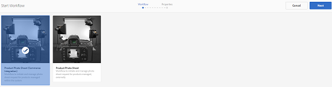

1. Click **Next** to initiate the workflow in the project.
1. Enter workflow details on the next page.

   

1. Click **Submit** to start the photo shoot workflow. The project details page for the photo shoot project is displayed.

   

### Workflow Tasks Details {#workflow-tasks-details}

The photo shoot workflow includes several tasks. Each task is assigned to a user group based on the configuration defined for the task.

#### Create Shot List Task {#create-shot-list-task}

The **Create Shot List** task enables the project owner to select products for which images are required. Based on the option selected by the user, a CSV file is generated that contains basic product information.

1. In the project folder, click the ellipses button at the bottom-right of the [Tasks Card](#tracking-project-progress) to view the task item in the workflow.

   

1. Select the **Create Shot List** task, and then click the **Open** icon from the toolbar.

   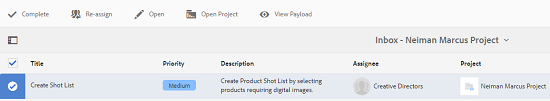

1. Review the task details and then click the **Create Shot List** button.

   

1. Select products for which product data exists without associated images.

   

1. Click the **Add To Shot List** button to create a CSV file that contains a list of all such products. A message confirms that the shot list is created for the selected products. Click **Close** to complete the workflow.

1. After you create a shot list, the **View Shot List** link appears. To add more products to the shot list, click **Add to Shot List**. In this case, the data gets appended to the initially created shot list.

   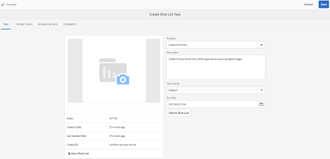

1. Click **View Shot List** to view the new shot list.

   

   To edit the existing data or add new data, click **Edit** from the toolbar. Only the **Product **and **Description** fields are editable.

   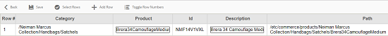

   After you update the file, click **Save** on toolbar to save the file.

1. After adding the products, click the **Complete** icon on the **Create Shot List** task details page to mark the task as completed. You can add an optional comment.

The completion of the task introduces the following changes within the project:

* Assets corresponding to the product hierarchy are created in a folder with the same name as the workflow title.
* The metadata for the assets becomes editable using the Assets console, even before the photographer provides the images.
* A photo shoot folder is created that stores the images the photographer provides. The photo shoot folder contains subfolders for each product entry in the shot list.

### Upload Shot List Task {#upload-shot-list-task}

This task is part of the Product Photo Shoot workflow. You perform this task if product information isn’t available in AEM. In this case, you upload a list of products in a CSV file for which image assets are required. Based on the details in the CSV file, you map image assets with the products. The file must be a CSV file named `shotlist.csv`.

Use the **View Shot List** link under the project card in the previous procedure to download a sample CSV file. Review the sample file to know the usual contents of a CSV file.

The product list or the CSV file can contain fields, such as **Category, Product, Id, Description**, and **Path**. The **Id** field is mandatory and contains the product ID. The other fields are optional.

A product can belong to a particular category. The product category can be listed in the CSV below the **Category** column. The **Product** field contains the name of the product. In the **Description** field, enter the product description or instructions for the photographer.

1. In the project folder, click the ellipses button at the bottom-right of the [Tasks Card](#tracking-project-progress) to view the list of tasks in the workflow.
1. Select the **Upload Shot List** task, and then click the **Open** icon from the toolbar.

   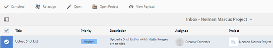

1. Review the task details and then click the **Upload Shot List** button.

   

1. Click the **Upload Shot List** button to upload the CSV file. The workflow recognizes this file as a source to be used to extract product data for the next task.
1. Upload a CSV file containing product information in the appropriate format. The **View Uploaded Assets** link appears under the card after the CSV file is uploaded.

   

   Click the **Complete** icon to complete the task.

1. Click the **Complete** icon to complete the task.

### Upload Photo Shoot Task {#upload-photo-shoot-task}

If you are an Editor, you can upload shots for the products listed in the **shotlist.csv** file that is created or uploaded in the previous task.

The name of images to be uploaded must start with `<ProductId_>` where `ProductId` is referenced from the **Id** field in the `shotlist.csv` file. For example, for a product in the shot list with **Id** `397122`, you would upload files with names `397122_highcontrast.jpg`, `397122_lowlight.png`, and so on.

You can either upload the images directly or upload a ZIP file that contains the images. Based on their names, the images are placed inside respective product folders within the photo shoot folder.

1. Under the project folder, click the ellipses button at the bottom-right of the [Task Card](#tracking-project-progress) to view the task item in the workflow.
1. Select the **Upload Photo Shoot** task, and then click the **Open** icon from the toolbar.

   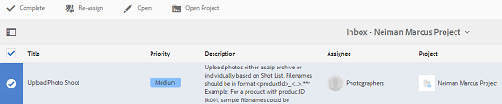

1. Click **Upload Photo Shoot** and upload the photo shoot images.
1. Click the **Complete** icon from the toolbar to complete the task.

### Retouch Photo Shoot Task {#retouch-photo-shoot-task}

If you have editing rights, perform the **Retouch Photo Shoot** task to edit the images uploaded to the photo shoot folder.

1. Under the project folder, click the ellipses button at the bottom-right the [Task Card](#tracking-project-progress) to view the task item in the workflow.
1. Select the **Retouch Photo Shoot** task, and then click the **Open** icon from the toolbar.

   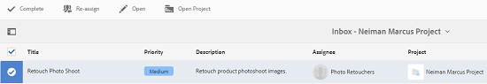

1. Click the **View Uploaded Assets** link in the **Retouch Photo Shoot** page to browse the uploaded images.

   

   If necessary, edit the images using an Adobe Creative Cloud application.

   

1. Click the **Complete** icon from the toolbar to complete the task.

### Review and Approve Task {#review-and-approve-task}

In this task, you review the photo shoot images uploaded by a photographer and mark images as approved for use.

1. Under the project folder, click the ellipses button at the bottom-right of the [Task Card](#tracking-project-progress) to view the task item in the workflow.
1. Select the **Review &amp; Approve** task, and then click the **Open** icon from the toolbar.

   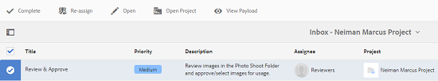

1. In the **Review &amp; Approve** page, assign the review task to a role and then click **Review** to start reviewing the uploaded product images.

   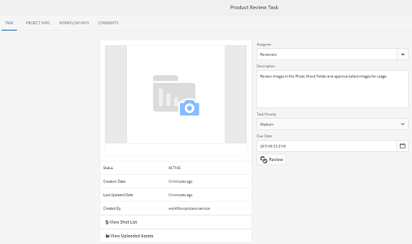

1. Select a product image, and click the **Approve** icon from the toolbar to mark it as approved. Once you approve an image, an approved banner displays over it.

   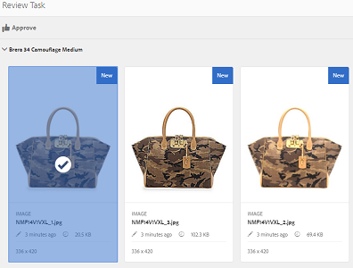

1. Click **Complete**. The approved images are linked with the empty assets that were created.

You may leave out some products without any image. Later, you can revisit the task and mark it complete once done.

You can navigate to project assets using the Assets UI and verify the approved images.

Click the next level to view products as per your product data hierarchy.

Creative Project associates approved assets with the referenced product. The asset metadata is updated with the product reference and basic information in the **Product Data** tab under asset properties they appear in the AEM Asset Metadata section.

>[!NOTE]
>
>In the **Product Photo Shoot workflow** (without commerce integration), the approved images have no association with products.

### Move to Production Task {#move-to-production-task}

This task moves the approved assets to the production-ready folder to make them available for use.

1. Under the project folder, click the ellipses button at the bottom-right of the [Task Card](#tracking-project-progress) to view the task item in the workflow.
1. Select the **Move to Production** task, and then click the **Open** icon from the toolbar.

   

1. To view the approved assets for the photo shoot prior to moving them to production ready folder, click the **View Approved Assets** link below the project thumbnail on the **Move to Production** task page.

   

1. Enter the path of the production-ready folder in the **Move To** field.

   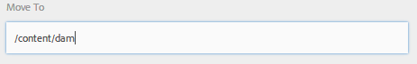

1. Click **Move to Production**. Close the confirmation message. The assets are moved to the mentioned path and a spin set is automatically created for the approved assets for each product based on the folder hierarchy.

1. Click the **Complete** icon from the toolbar. The workflow completes as the last step is marked complete.

## Viewing DAM Asset Metadata {#viewing-dam-asset-metadata}

After you approve, the assets are linked to the corresponding products. The [Properties Page](/help/assets/manage-assets.md#editing-properties) of the approved assets now has an additional **Product Data** (linked product information) tab. This tab displays the product details, SKU number, and other product-related details linking the asset. Click the **Edit** icon to update an asset property. The product-related information remains read-only.

Click the link that appears to navigate to the respective product detail page in the product console with which asset is associated.

## Customizing the Project Photo Shoot Workflows {#customizing-the-project-photo-shoot-workflows}

You can customize the **Project Photo Shoot** workflows based on your requirements. This is an optional, role-based task that you perform to set the value of a variable within the project. Later, you can then use the configured value to arrive at a decision.

1. Click the AEM logo, and then navigate to **Tools** &gt; **Workflow** &gt; **Models** to open the **Workflow Models** page.
1. Select the **Product Photo Shoot (Commerce Integration)** workflow or the **Product Photo Shoot** workflow and the click **Edit** from the toolbar to open the workflow in edit mode.
1. Open the side panel and locate the **Create Role Based Project Task** step and drag it to the workflow.

   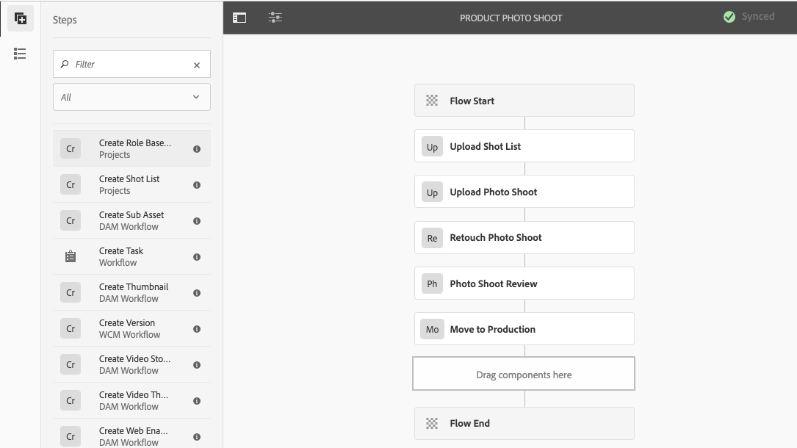

1. Open the **Role Based Task** step.
1. On the **Task** tab, provide a name for the task that will display in the task list. You may also assign the task to a role, set the default priority, provide a description, and specify a time when the task is due.

   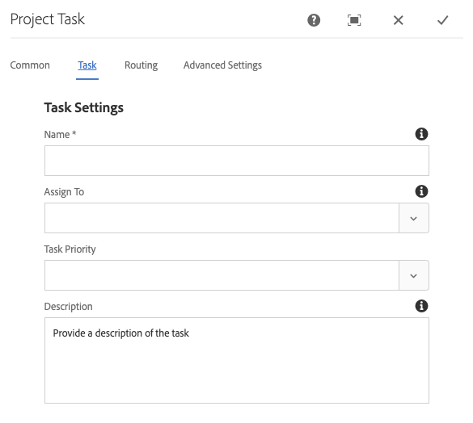

1. On the **Routing** tab, specify the actions for the task. To add multiple actions, click the **Add Item** link.

   

1. After adding the options click **OK** to add the changes to the step.

1. Back in the **Workflow Model** window click **Sync** to save the changes of the entire workflow. Tapping or clicking **OK** for the step does not save the changes in the workflow. To save changes in the workflow, click **Sync**.

1. Open the side panel and locate the **Goto Step** workflow and drag it to the workflow.

1. Open the **Goto** task and click the **Process** tab.

1. Select the **Target Step** to go to and specify that the **Routing Expression** is ECMA script. Then provide the following code in the **Script** field:

   ```javascript
   function check() {

   if (workflowData.getMetaDataMap().get("lastTaskAction","") == "Reject All") {

   return true

   }

   // set copywriter user in metadata

   var previousId = workflowData.getMetaDataMap().get("lastTaskCompletedBy", "");

   workflowData.getMetaDataMap().put("copywriter", previousId);

   return false;

   }
   ```

   >[!TIP]
   >
   >For details about scripting in workflow steps, see [Defining a Rule for an OR Split](/help/sites-developing/workflows-models.md).

   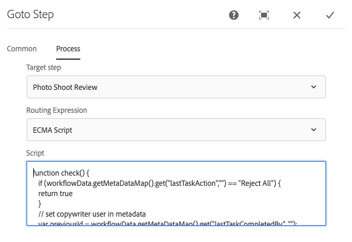

1. Click **OK**.

1. Click **Sync** to save the workflow.

A new task now comes up after the [Move to Production task](#move-to-production-task) is completed and is assigned to the owner.

The user in the **Owner** role can complete the task and select an action (from the list of actions added in the workflow step configurations) from the list in the comments popup.

>[!NOTE]
>
>When you start a server, the Project task list servlet caches the mappings between task types and URLs defined under `/libs/cq/core/content/projects/tasktypes`. You can then perform the usual overlay and add custom task types by placing them under `/apps/cq/core/content/projects/tasktypes`.
