# Working with Targeted Content in Multisites{#working-with-targeted-content-in-multisites}

If you need to manage targeted content, such as activities, experiences, and offers between your sites, you can take advantage of AEM's built-in multisite support for targeted content.

>[!NOTE]
>
>Working with Multisite support for targeted content is an advanced feature. To use this feature, you should be familiar with [Multi Site Manager](/help/sites-administering/msm.md) and the [Adobe Target integration](/help/sites-administering/target.md) with AEM.

This document describes the following:

* Provides a brief overview of AEM's multisite support for targeted content.
* Describes some possible usage scenarios on how you can link sites (in one brand).
* Provides an example walkthrough of how marketers would use this feature.
* Detailed instructions on how to implement multisite support for targeted content.

To set up how your sites share personalized content, you need to perform the following steps:

1. [Create an area](#creating-new-areas) or [create an area as live copy](#creating-new-areas). An area includes all the activities tha are available for an *area* of the page; that is , the location on the page where the component is targeted. Creating a area creates an empty area, whereas creating an area as a live copy lets you inherit content across site structures.

1. [Link your site or page](#linking-sites-to-an-area) to an area.

At any time you can suspend or restore inheritance. In addition, if you do not want to suspend inheritance, you can also create local experiences. By default, all pages use the Master Area unless you specify otherwise.

## Introduction to multisite support for targeted content {#introduction-to-multisite-support-for-targeted-content}

Multisite support for targeted content is available out of the box and lets you push targeted content from the master page that you manage through MSM to a local live copy or lets you manage global and local modifications of such content.

You manage this in an **Area**. Areas separate targeted content (activities, experiences and offers) used in different sites and provide an MSM-based mechanism to create and manage the inheritance of targeted content together with site inheritance. This prevents your having to re-create targeted content in inherited sites as was required in AEM prior to 6.2.

In an area, only activities linked to that area are pushed to live copies. By default, the Master Area is selected. After you create additional areas, you can link those to your sites or pages to indicate which targeted content is pushed.

A site or live copy links to an area containing the activities that need to be available on that site or live copy. By default the site or live copy links to the master area, but you can link other areas besides the master areaas well.

>[!NOTE]
>
>You should be aware of the following when using multisite support for targeted content:
>
>* When you are using rollouts or live copies, an MSM license is required.
>* When you are using synchronization to Adobe Target, an Adobe Target license is required.
>

## Use cases {#use-cases}

You can set up multisite support for targeted content in several ways, depending on your use case. This section describes how this would work theoretically with one brand. In addition, in [Example: Targeting Content Based on Geogrpahy](#example-targeting-content-based-on-geography), you can see a real-world application of targeting content in multiple sites.

Targeted content is wrapped in a so-called areas, which define the scope for sites or pages. These areas are defined at the brand level. One brand can contain multiple areas. Areas can be distinct between brands. While one brand may just contain the master area and therefore is shared across all brands, another brand may contain multiple brands (for example, by region). Brands, therefore, do not need to mirror the set of areas between them.

With multisite support for targeted content, you can, for example, have two (or more) sites with **one** brand that have one of the following:

* A completely *distinct* set of targeted content - Editing targeted content in one does not affect the other. Sites linking to distinct areas read and write to their own configured area. For example:

    * Site A links to Area X
    * Site B links to Area Y

* A *shared* set of targeted content - Editing in one does have a direct impact on both sites; you can set this up by having two sites refer to the same area. Sites linking to the same area share the targeted content within this area. For example:

    * Site A links to Area X
    * Site B links to Area X

* A distinct set of targeted content *inherited* from another site via MSM - Content can be unidirectionally rolled out from master to live copy. For example:

    * Site A links to Area X
    * Site B links to Area Y (which is a live copy of Area X)

You could also have **multiple** brands that are used in one site, which could be more complex than this example.

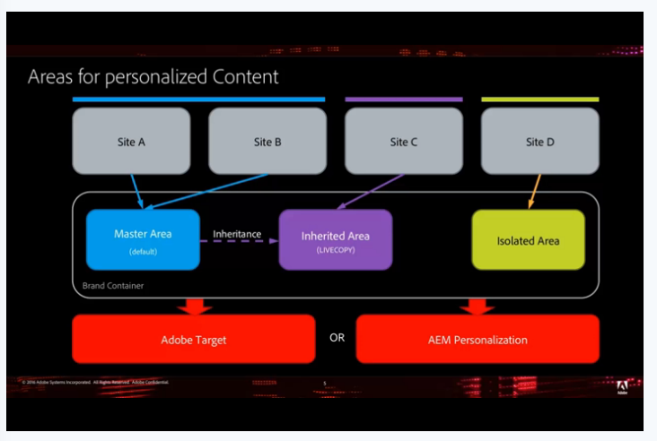

>[!NOTE]
>
>For a more technical look at this feature, see [How Multisite Management for Targeted Content is Structured](/help/sites-authoring/technical-multisite-targeted.md).

## Example: Targeting content based on geography {#example-targeting-content-based-on-geography}

Using multisite for targeted content lets you share, roll out, or isolate personalization content. To better illustrate how this feature is used, consider a scenario where you want to control how targeted content is rolled out based on geography as in the following scenario:

There are four versions of the same site based on geography:

* The **United States** site is in the upper left corner and is the master site. In this example, it is open in Targeting mode.
* The three other versions of this site are **Canada**, **Great Britain**, and **Australia**, which are all live copies. These sites are open in Preview mode.

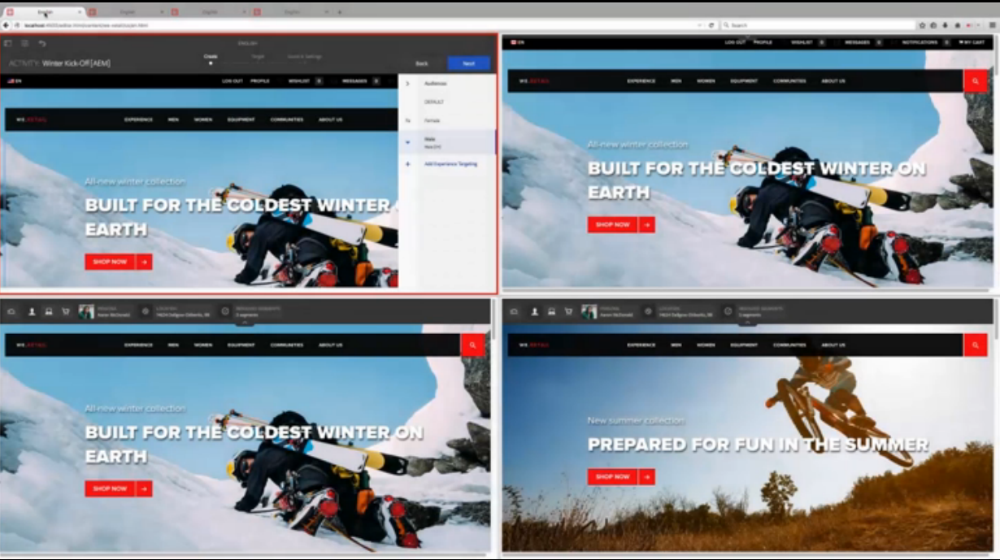

Each site shares personalized content in geographic regions:

* Canada shares the master area with the United States.
* Great Britian is linked to the European area and inherits from the master area.
* Australia, because it is in the southern hemisphere and seasonal products would not apply, has its own personalized content.

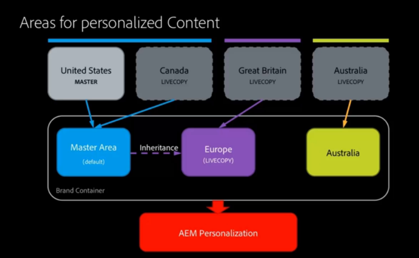

For the northern hemisphere, we have a winter activity created but in the male audience the marketer in North America would like a different image for winter, so he or she changes it in the United States site.

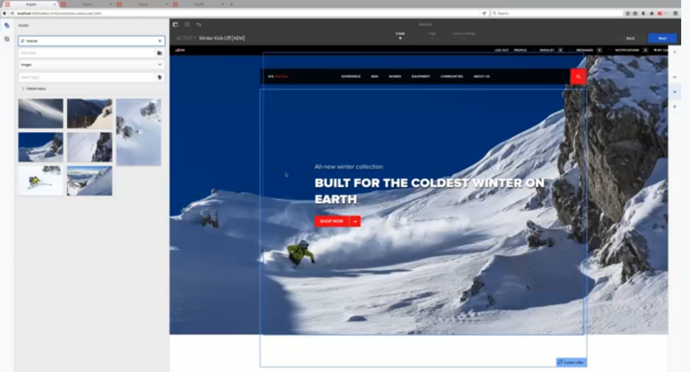

After refreshing the tab, the Canadian site changes to the new image without any action on our part. It does so because it shares the master area with the United States. In the Great Britan and Australia sites, the image does not change.

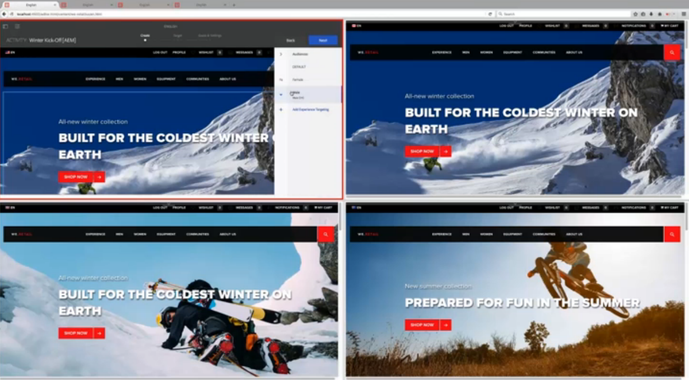

The marketer would like to roll out these changes to the European region and [rolls out the live copy](/help/sites-administering/msm-livecopy.md) by tapping or clicking **Rollout Page**. After refreshing the tab, the Great Britain site has the new image as the Europe area inherits from the master area (after rollout).

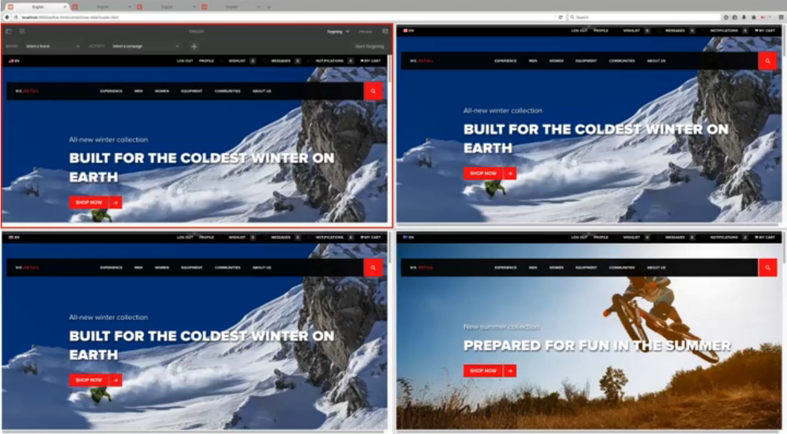

The image in the Australia site remains unchanged, which is the desired behavior, as it is summer in Australia and the marketer does not want to change that content. Australia's site does not change because it does not share an area with any other region nor is it a live copy of another region. The marketer never has to worry that the Australian site's targeted content will get overwritten.

In addition, for Great Britain, whose area is a live copy of the master area, you can see the inheritance status by the green indicator next to the activity name. If an activity is inherited, you cannot modify it unless you suspend or detach the live copy.

At any time, you can suspend the inheritance or detach the inheritance completely. You can also always add local experiences that are only available to that experience without suspending the inheritance.

>[!NOTE]
>
>For a more technical look at this feature, see [How Multisite Management for Targeted Content is Structured](/help/sites-authoring/technical-multisite-targeted.md).

### Creating an area versus creating an area as livecopy {#creating-a-new-area-versus-creating-a-new-area-as-livecopy}

In AEM, you have the option of creating an area or creating an area as livecopy. Creating an area groups activities and anything that belongs to those activities, such as offers, experiences, and so on. You create an area when you want to create either a completely distinct set of targeted content or you want share a set of targeted content.

If, however, you have inheritance set up via the MSM between the two sites, then you may want to inherit the activities. In this case, you create an area as a live copy, where Y is a live copy of X and therefore inherits all the activities as well.

>[!NOTE]
>
>The default rollout triggers subsequent rollouts of the targeted content whenever a page is a Live copy linking to an area that itself is a Live copy of the area linked to the Pages blueprint.

For example, in the following diagram, there are four sites where two share the master area (and all the activities that are part of that area), one site that has an area that is a live copy of an area, so that it shares the activities upon rollout, and one side that is completely separate (and therefore requires an area for its activities).

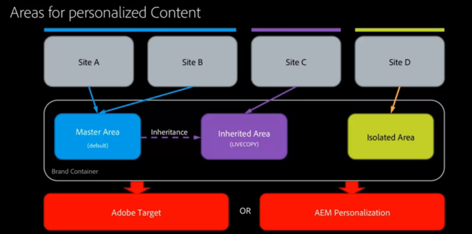

To achieve this in AEM, you would do the following:

* Site A links to the Master Area - no area creation needed. Master Area is selected by default in AEM. Site A and B share activities, and so on.
* Site B links to the Master Area - no area creation needed. Master Area is selected by default in AEM. Site A and B share activities, and so on.
* Site C links to Inherited Area, which is a live copy of the Master Area - Create Area as Live Copy where you create a live copy based on the Master Area. The Inherited Area inherits activities from the Master Area upon rollout.
* Site D links to its own Isolated Area - Create Area where you create an entirely new area with no activities yet defined. The isolated area will not share activities with any other site.

## Creating new areas {#creating-new-areas}

Areas can span activities and offers. After you have created an area in either one of them (for example, activities), you also have the area available in the other one (for example, offers).

>[!NOTE]
>
>The default area called Master Area is collapsed by default when you click on the name of a brand **until** you create another area. Then, when you select a brand in either the **Activity** or **Offers** console, you see the **Area** console.

To create an area:

1. Navigate to **Personalization** &gt; **Activities** or **Offers** or and then to your brand.
1. Click **Create Area**.

   

1. Click the **Area** icon and click **Next**.
1. In the **Title** field, enter a name for the new area. Optionally select tags.
1. Click **Create**.

   AEM redirects to the brand window, where it lists any areas created. If there is another area besides the Master Area, then you can create areas directly in the Brand console.

   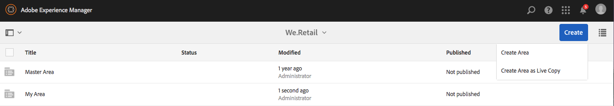

## Creating areas as live copies {#creating-areas-as-live-copies}

You create an area as a live copy to inherit the targeted content across site structures.

To create an area as a livecopy:

1. Navigate to **Personalization** &gt; **Activities** or **Offers** and then to your brand.
1. Click **Create Area as Live Copy**.

   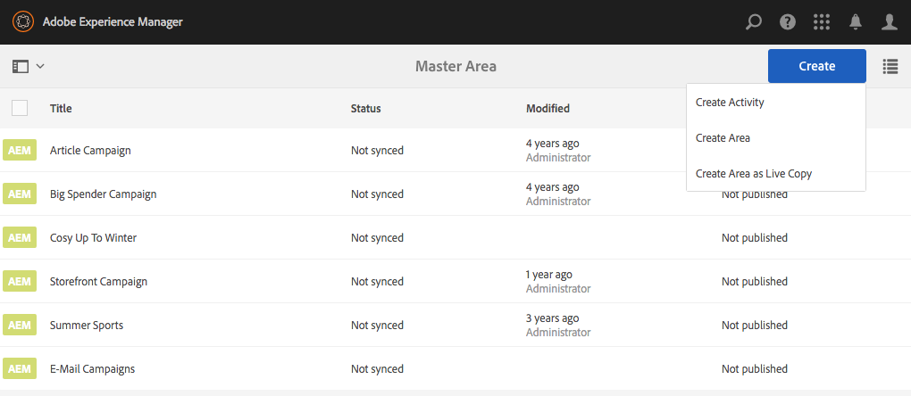

1. Select the area that you want to make a live copy of and click **Next**.

   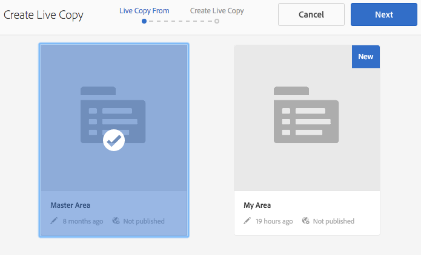

1. In the **Name** field, enter a name for the live copy. By default, sub pages are included; exclude them by selecting the **Exclude sub pages** check box.

   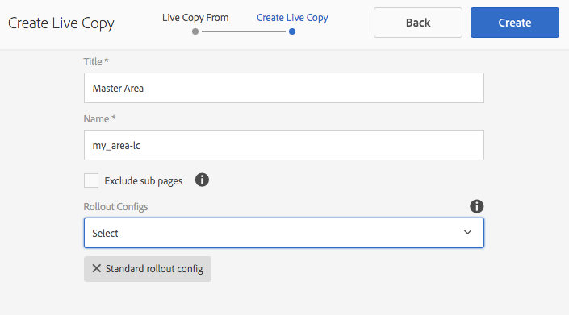

1. In the **Rollout Configs** drop-down menu, select the appropriate configuration.

   See [Installed Rollout Configurations](/help/sites-administering/msm-sync.md#installed-rollout-configurations) for descriptions of each option.

   See [Creating and Synchronizing Live Copies](/help/sites-administering/msm-livecopy.md) for more information on live copies.

   >[!NOTE]
   >
   >When a page is rolled out to a Live Copy and the area configured for the Blueprint page is also the Blueprint for the area configured for the Pages Live Copy, the LiveAction **personalizationContentRollout** triggers a synchronous subRollout, which is part of the **Standard rollout config**.

1. Click **Create**.

   AEM redirects to the brand window, where it lists any areas created. If there is another area besides the Master Area, then you can create areas directly from the brand window.

   

## Linking sites to an area {#linking-sites-to-an-area}

You can link areas to either pages or to a site. Areas are inherited by all subpages unless those pages are over layed by a mapping on a subpage. In general, however, you link at the site level.

When you link, only those activities, experiences, and offers from the selected area are available. This prevents accidental mixup of independently managed content. If no other area is configured, the master area of each brand is used.

>[!NOTE]
>
>Pages or sites that reference the same area are using the *same* shared set of activities, experiences, and offers. Editing an activity, experience, or offer that is shared by multiple sites affects all sites.

To link a site to an area:

1. Navigate to the site (or page) that you want to link to an area.
1. Select the site or page and click **View Properties**.
1. Click the **Personalization** tab.
1. In the **Brand** menu, select the brand you want to link your area to. After you select the brand, available areas are available in the **Area Reference** menu.

   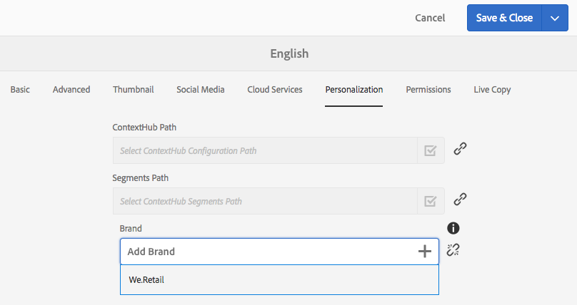

1. Select the area from the **Area Reference** drop-down menu and click **Save**.

   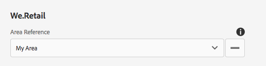

## Detaching live copy or suspending inheritance of targeted content {#detaching-live-copy-or-suspending-inheritance-of-targeted-content}

You may want to either suspend or detach inheritance of targeted content. Suspending or detaching the live copy is done per activity. For example, you may want to modify experiences in your activity, but if that activity is still linked to inherited copy, you cannot modify the experience or any of the activity's properties.

Suspending the live copy temporarily breaks inheritance, but in the future you can restore inheritance. Detaching the live copy permanently breaks inheritance.

You suspend or detach the inheritance of targeted content by restoring it in an activity. If a page or site links to an area that is a Live Copy, you can view an activity's inheritance status.

An activity that is inheriting from another site is marked green next to the activity name. A suspended inheritance is marked red, and a locally created activity has no icon.

>[!NOTE]
>
>* You can only suspend or detach live copies in an activity.
>* You do not need to suspend or detach live copies to extend an inherited activity. You can always create **new** local experiences and offers for that activity. If you want to modify an existing activity, then you need to suspend inheritance.
>

### Suspending inheritance {#suspending-inheritance}

To suspend or detach inheritance of targeted content in an activity:

1. Navigate to the page where you want to detach or suspend inheritance and click **Targeting** in the mode drop-down menu.
1. If your page is linked to an area that is a live copy, you see the inheritance status. Click **Start Targeting**.
1. To suspend on an activity, do one of the following:

    1. Select an element of the activity, such as the audience. AEM automatically displays a Suspend Live Copy confirmation box. (You can suspend live copy by tapping or clicking on any element throughout the Targeting process.)
    1. Select **Suspend Live Copy** from the drop-down menu in the toolbar.

   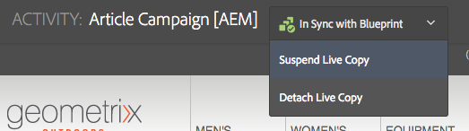

1. Click **Suspend** to suspend the activity. Suspended activities are marked in red.

   

### Breaking Inheritance {#breaking-inheritance}

To break inheritance of targeted content in an activity:

1. Navigate to the page where you want to detach the live copy from the master and click **Targeting** in the mode drop-down menu.
1. If your page is linked to an area that is a live copy, you see the inheritance status. Click **Start Targeting**.
1. Select **Detach Live Copy** from the drop-down menu in the toolbar. AEM confirms that you want to detach the live copy.
1. Click **Detach** to detach the live copy from the activity. After it is detached, the drop-down menu regarding inheritance no longer displays. The activity is now a local activity.

   

## Restoring inheritance of targeted content {#restoring-inheritance-of-targeted-content}

If you have suspended inheritance of targeted content in an activity, you can restore it at any time. However, if you have detached the live copy, you cannot restore the inheritance.

To restore inheritance of targeted content in an activity:

1. Navigate to the page where you want to restore inheritance and click **Targeting** in the mode drop-down menu.
1. Click **Start Targeting**.
1. Select **Resume Live Copy** from the drop-down menu in the toolbar.

   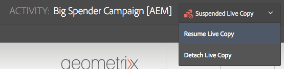

1. Click **Resume** to confirm that you want to resume live copy inheritance. Any modifications made to the current activity are lost if you resume inheritance.

## Deleting areas {#deleting-areas}

When you delete an area, you delete all the activities in that area. AEM warns you before you can delete an area. If you do delete an area that a site is linked to, the mapping for this brand will automatically remap to the master area.

To delete an area:

1. Navigate to **Personalization** &gt; **Activities** or **Offers** and then your brand.
1. Click the icon next to the area you want to delete.
1. Click **Delete** and confirm that you want to delete the area.
