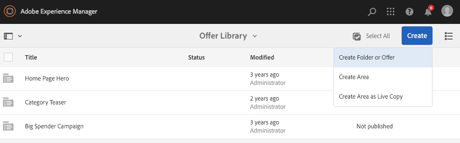
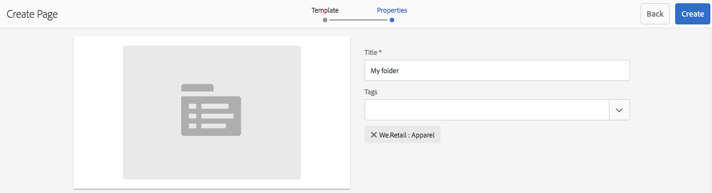
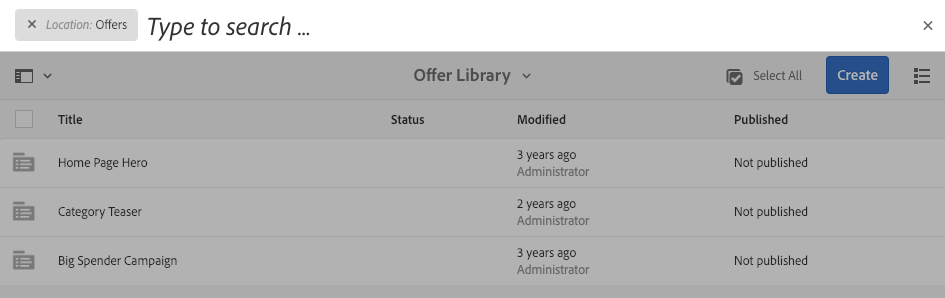

# Creating and Managing Offers{#creating-and-managing-offers}

Use the Offers console to create offers that you can [use in activity experiences](/help/sites-authoring/content-targeting-touch.md). Creating offers in the Offers console saves time when several experiences require the same offer:

* Create the offer once in the library and use it in multiple experieces of your brand activities.
* Change the offer in the library and the change affects all the experiences that use it.

The Offers console organizes offers by brand. Each brand contains a library of offers that can be used in a brand's experiences. Use folders to define a heirarchical structure for organizing offers in each library. A logical folder structure enables authors to easily find offers by browsing. Tagging and search tools also enable authors to find offers.

## Add a Brand Using the Offers Console {#add-a-brand-using-the-offers-console}

Create a brand with which your offers are associated. Open a brand in the Offers console to access its offer library where you can create folders and offers.

When you create a brand using the Offers console, it also appears in the [Activities console](/help/sites-authoring/activitylib.md) where you can add and administer activities for the brand.

1. In the Navigation console, click **Personalization** &gt; **Offers**.

   

1. Click **Create** and then **Create** **Brand**.
1. Select the brand template and click **Next**.
1. Type a title for the brand as you want it to appear in the Offers and Activities consoles. Optionally, type or select one or more tags to associate with the brand.
1. Click **Create**.

## Add a Folder to an Offer Library {#add-a-folder-to-an-offer-library}

Add a folder to the offer library of a brand to organize and store offers. You can create a folder below the brand or below other folders.

1. In the Offers console, open the location where you want to create the folder. For example, open the brand to create a top-level folder, or open another folder in the library.
1. Click **Create** &gt; **Create Folder or Offer**.

   

1. Select **Folder** and click **Next**.
1. Type a title for the folder as you want it to appear in the offer library and type or select tags.

   

1. Click **Create**.

## Add an Offer to an Offer Library {#add-an-offer-to-an-offer-library}

Add an offer to a brand's offer library so that it can be added to the brand's experiences. When you add an offer you provide a title. You can also associate the offer with one or more tags for enhancing searchability.

After you create the offer you can open it to author the content.

1. In the Offers console, open the location where you want to create the offer. For example, open the brand to create a top-level offer, or open a folder in the library.
1. Click **Create** &gt; **Create Folder or Offer**.

   

1. Select the **Offer Page** template and then click **Next**.
1. Type a title for the offer and optionally select or type one or more tags to associate with the offer, then click **Create**.
1. In the confirmation dialog box, to open the offer for editing click **Open Page**.

## Editing an Offer {#editing-an-offer}

Open an offer and edit the content as you want it to appear in the experiences that use it. When you edit an offer that is used in any experiences, your changes appear in the experiences.

You can open an offer from a folder in an offer library or from search results. You can also open an offer from an experience that uses the offer.

1. In the Offers console, click the icon next to the offer and click **Edit**.
1. Add components to the offer and edit the component content as usual.

## Deleting an Offer {#deleting-an-offer}

Delete an offer when it is no longer needed. When you attempt to delete an offer that is used in an experience, you are prompted to confirm the deletion. Confirming deletes the offer and removes it from the experiences.

You can delete an offer while viewing either folder contents in an offer library or search results.

1. In the Offers console, click the icon next to the offer and click **Delete**.

   Select the offer and click **Delete**.

1. In the dialog box that appears, click **Delete** to confirm the deletion.
1. If the offer is used in one or more experiences, a dialog box appears to indicate that the offer is referenced:

    * To delete the offer and remove it from the experiences, click **Force Delete**.
    * To keep the offer, click **Cancel**.

## Searching for Offers {#searching-for-offers}

Search for offers of any brand using keywords for matching the title.

The current search criteria appear next to the search results. You can also sort the results by column in ascending or descending order. You can perform a search from any folder of any offer library. The search results are the same regardless of the current folder.

To search offers:

1. At the top of the Offers console, click the magnifying glass icon. By default the search is limited to offers.
1. Enter your keyword to search for offers. Select from the results.
