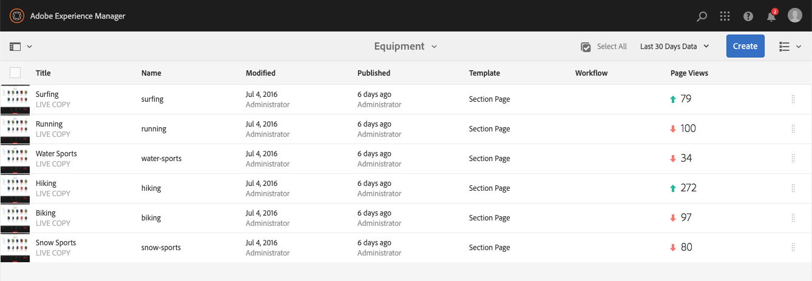
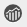

# Seeing Page Analytics Data{#seeing-page-analytics-data}

Use page analytics data to gauge the effectiveness of the page content.

## Analytics visible from the Console {#analytics-visible-from-the-console}

Page analytics data is displayed in [List View](/help/sites-authoring/basic-handling.md#list-view) of the Sites console. When the pages are displayed in list format, the following columns are available by default:

* Page Views
* Unique Visitors
* Time on Page

Each column shows a value for the current reporting period, and also indicates whether the value has increased or decreased since the previous reporting period. The data that you see is updated every 12 hours.

>[!NOTE]
>
>To change the update period, [configure the import interval](/help/sites-administering/adobeanalytics-connect.md#configuring-the-import-interval).

1. Open the **Sites** console; for example [https://localhost:4502/sites.html/content](https://localhost:4502/sites.html/content)
1. In the far right of the toolbar, (upper right corner), click or tap the icon to select **List View** (the icon shown will depend on the [current view](/help/sites-authoring/basic-handling.md#viewing-and-selecting-resources)).

1. Again, in the far right of the toolbar, (upper right corner), click or tap the icon then select **View Settings**. The **Configure Columns** dialog will open. Make any changes required and confirm with **Update**.

   

### Selecting the Reporting Period {#selecting-the-reporting-period}

Select the reporting period for which Analytics data appears on the Sites console:

* Last 30 Days Data
* Last 90 Days Data
* This Year's Data

The current reporting period appears on the toolbar of the Sites console (right of the top toolbar). Use the drop down to select the required reporting period.

### Configuring Available Data Columns {#configuring-available-data-columns}

Members of the analytics-administrators user group can configure the Sites console to enable authors to see extra Analytics columns.

>[!NOTE]
>
>When a tree of pages contains children that are associated with different Adobe Analytics cloud configurations, you cannot configure available data columns for the pages.

1. In List View, use the view selectors (right of toolbar), select **View Settings** and then **Add Custom Analytics Data**.

   

1. Select the metrics that you want to expose to authors in the Sites console, and then click **Add**.

   The columns that appear are retrieved from Adobe Analytics.

   

### Opening Content Insights from Sites {#opening-content-insights-from-sites}

Open [Content Insight](/help/sites-authoring/content-insights.md) from the Sites console to further investigate page effectiveness.

1. In the Sites console, select the page for which you want to see Content Insights.
1. On the tool bar, click the Analytics and Recommendations icon.

   

## Analytics visible from the Page Editor (Activity Map) {#analytics-visible-from-the-page-editor-activity-map}

>[!CAUTION]
>
>Due to security changes within the Adobe Analytics API, it is no longer possible to use the version of Activity Map that is included within AEM.
>
>The [ActivityMap plugin provided by Adobe Analytics](https://experienceleague.adobe.com/docs/analytics/analyze/activity-map/getting-started/get-started-users/activitymap-install.html) should now be used.
