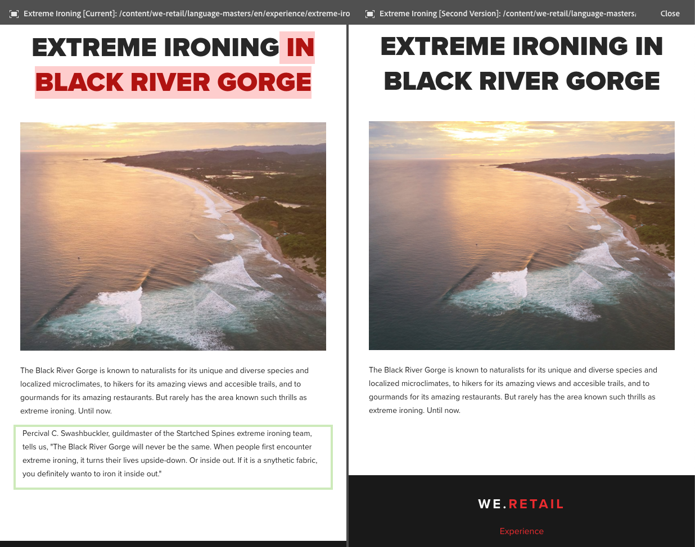

# Page Diff{#page-diff}

## Introduction {#introduction}

Content creation is an iterative process. Authoring with efficiency requires being able to see what has changed from one iteration to another. Viewing one page version and then the other is inefficient and prone to error. An author wants to be able to easily compare the current page side-by-side with another version.

The page diff feature allows for the convenient side-by-side comparison of two pages with their differences highlighted.

>[!TIP]
>
>See [Developing and Page Diff](/help/sites-developing/pagediff.md#operation-details) for more technical details on this feature.

## Use {#use}

The side-by-side diff can compare:

* [Versions](/help/sites-authoring/working-with-page-versions.md#comparing-a-version-with-current-page) - Earlier version of a page with its current state
* [Live Copies](/help/sites-administering/msm-livecopy.md#comparing-a-live-copy-page-with-a-blueprint-page) - Live Copy with its Blueprint
* [Launches](/help/sites-authoring/launches-editing.md#comparing-a-launch-page-to-its-source-page) - Launch with its Source
* [Language Copies](/help/sites-administering/tc-manage.md#comparing-language-copies) - A page before and after (re-)translation

See the respective topics on how to start the diff within those contexts.

### Presentation of Differences {#presentation-of-differences}

Regardless of the content being compared, the presentation of the diff remains the same.

* The content selected when you started the diff is displayed on the left (the diff entry point).
* The compare-to content is displayed on the right (what the selected content is compared against).

For example, if comparing versions, the current version is displayed on the left and the previous version is displayed on the right.

The source of both pages is clearly displayed in the header bar at the top of the browser window.

The diff detects changes at the component and HTML level. Items that have been changed are highlighted with different colors.

**Component Changes**

* Light Green - Component Added
* Pink - Component Removed

**HTML Changes**

* Dark Green - HTML Added
* Red - HTML Removed

>[!NOTE]
>
>When comparing language copies, highlighting is deactivated since in a translation everything changes and highlighting would be of no benefit.

### Fullscreen and Exiting {#fullscreen-and-exiting}

To focus on particular content, you can click the full screen icon for either "side" of the side-by-side diff to enlarge it to the full browser window.

The selected side will fill the entire window, but the bar will remain at the top allowing you to switch between the two pages.

You can also choose to close the full screen view by clicking the exit full screen icon.

You can exit the side-by-side diff at any time by clicking the Close button in the header.

## Limitations {#limitations}

There are some situations in which the page diff may not detect a difference as expected.

* When diffing versions and launches, the diff does not account for dynamic components such as breadcrumbs, menus, product lists or logos (components that rely on the site structure to render their content).
* For versions, the diff does not recreate the access control policy and live copy relationships.
* If a page is moved, you can no longer perform a diff with any versions made before the move.

    * If you experience problems with a diff, check the [Timeline](/help/sites-authoring/basic-handling.md#timeline) for the page to see whether the page has been moved.

>[!NOTE]
>
>Versions cannot be compared to each other. Only the current version can be compared with other versions of the page. The current version is always the version that is highlighted with changes.

>[!NOTE]
>
>For more details about the operation of the page diff mechanism and limitations which can affect page diff, see the [developer documentation](/help/sites-developing/pagediff.md) of this feature.
