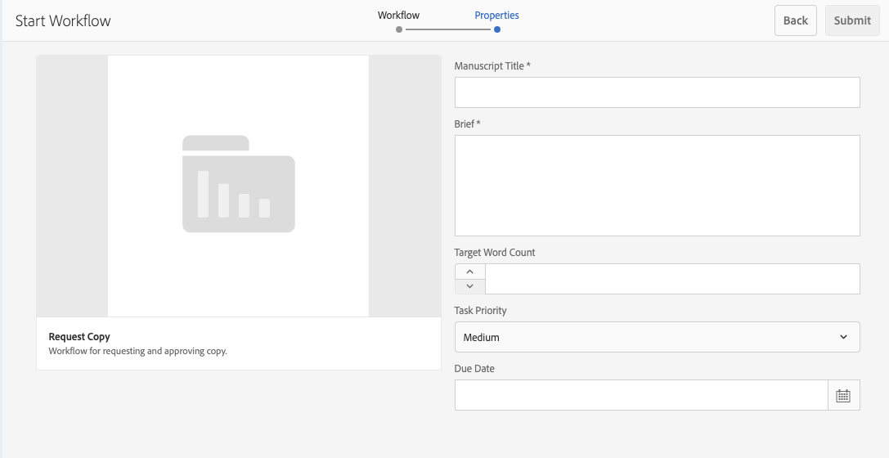
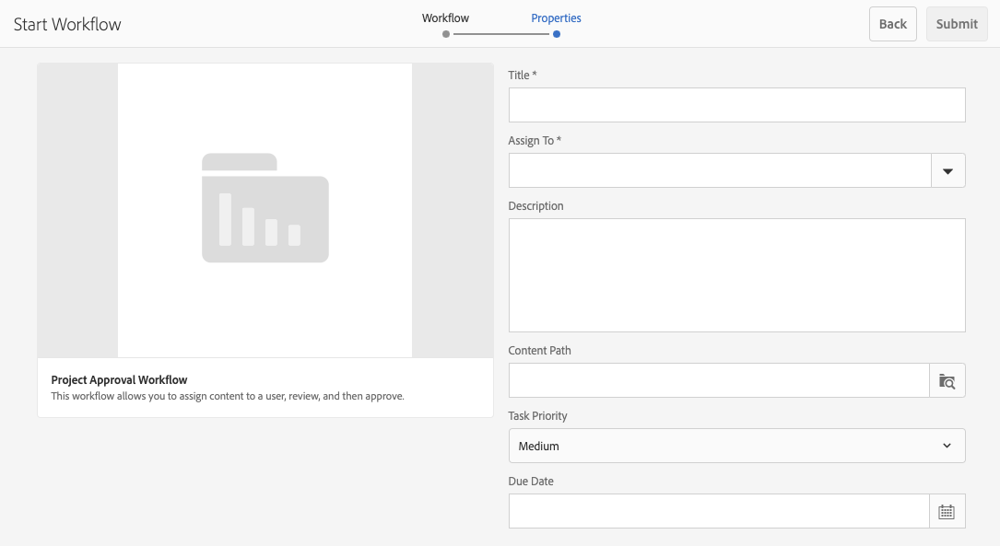
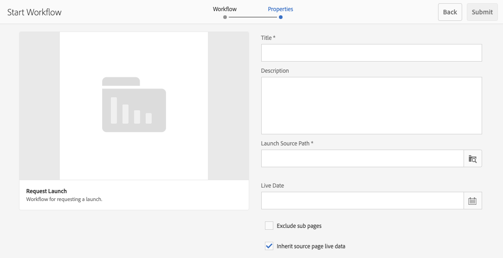
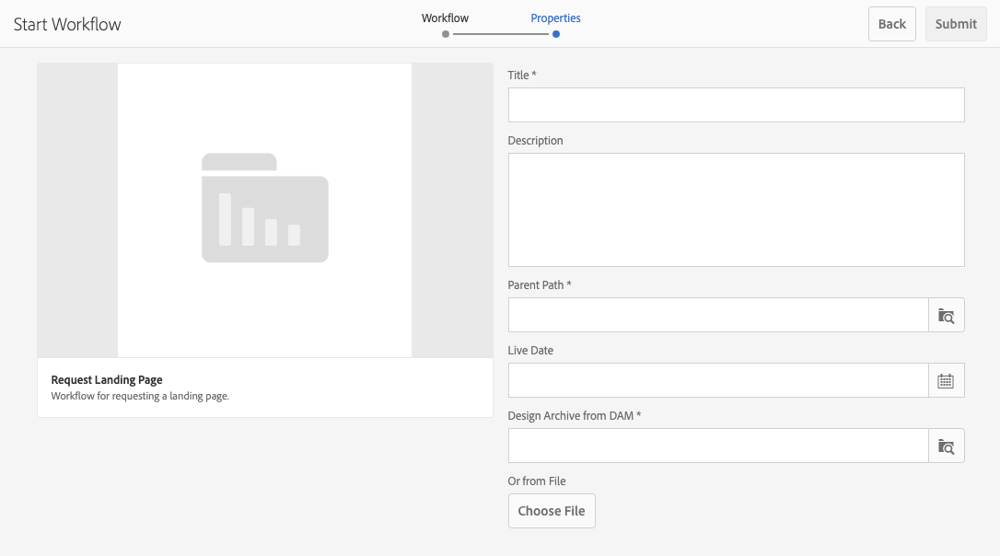
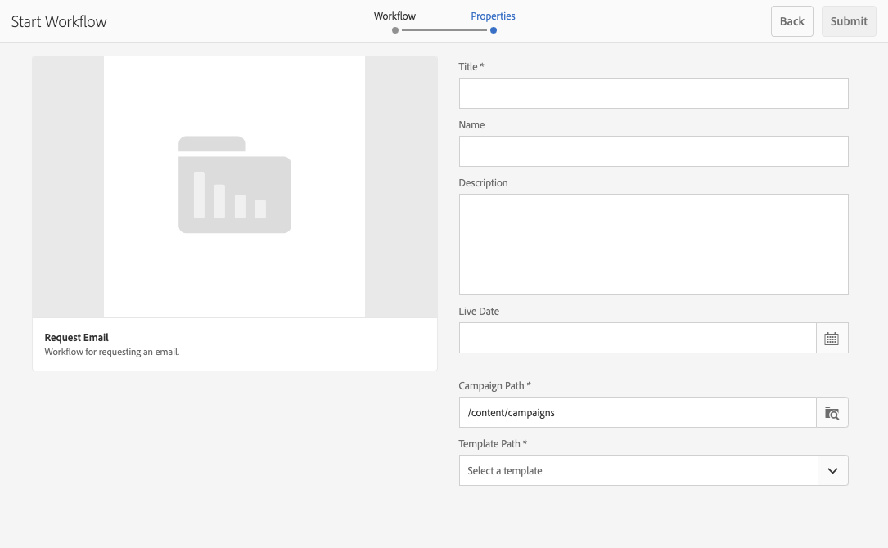

# Working with Project Workflows {#working-with-project-workflows}

The project workflows available out of the box include the following:

* **Project Approval Workflow** - This workflow lets you assign content to a user, review, then approve.
* **Request Launch** - A workflow the requests a launch.
* **Request Landing Page** - This workflow requests a landing page.
* **Request Email** - Workflow for requesting an email.
* **Product Photo Shoot and Product Photo Shoot (Commerce)** - Maps assets with products
* **DAM Create and Translate Copy and DAM Create Language Copy** - Creates translated binaries, metadata, and tags for assets and folders.

Depending on which Project template you select, you have certain workflows available:

|   |**Simple Project** |**Media Project** |**Product Photo Shoot Project** |**Translation Project** |
|---|:-:|:-:|:-:|:-:|
| Request Copy |  |x |  |  |
| Product Photo Shoot |  |x |x |  |
| Product Photo Shoot (Commerce) |  |  |x |  |
| Project Approval |x |  |  |  |
| Request Launch |x |  |  |  |
| Request Landing Page |x |  |  |  |
| Request Email |x |  |  |  |
| DAM Create Language Copy&ast; |  |  |  |x |
| DAM Create and Translate Language Copy&ast; |  |  |  |x |

>[!NOTE]
>
>&ast; These workflows are not started from the **Workflow** tile in Projects. See [Creating Language Copies for Assets.](/help/sites-administering/tc-manage.md)

The steps for starting and completing workflows are the same no matter which workflow you choose. Only the steps change.

You start a workflow directly in Projects (except for DAM Create Language Copy or DAM Create and Translate Language Copy). Information on any outstanding tasks in a project are listed in the **Tasks** tile. Notifications for tasks that need to be completed appear next to the user icon.

For more information on working with workflows in AEM, see the following documents:

* [Participating in workflows](/help/sites-authoring/workflows-participating.md)
* [Applying workflows to pages](/help/sites-authoring/workflows-applying.md)
* [Configuring workflows](/help/sites-administering/workflows.md)

This section describes the workflows available for Projects.

## Request Copy Workflow {#request-copy-workflow}

This workflow lets you request a manuscript from a user and then approve it. To start the request copy workflow:

1. In a media project, click the downward chevron at the top-right of the **Workflows** tile and select **Start Workflow**.
1. In the workflow wizard select **Request Copy** and click **Next**.
1. Enter a manuscript title and a brief summary of what you are requesting. If applicable, enter a target word count, task priority and a due date.

   

1. Click **Submit**.

The workflow starts. The task appears on the **Tasks** card.

## Product Photo Shoot workflow {#product-photo-shoot-workflow}

The **Product Photo Shoot** workflows (both commerce and without commerce) are covered in detail in the document [Creative Projects](/help/sites-authoring/managing-product-information.md)

## Project Approval Workflow {#project-approval-workflow}

In the **Project Approval** workflow, you assign content to a user, review, and then approve the content.

1. In a simple project, click the downward chevron at the top-right of the **Workflows** tile and select **Start Workflow**.
1. In the workflow wizard select **Project Approval Workflow** and click **Next**.
1. Enter a title and select who to assign it to. If applicable, enter a description, content path, task priority and a due date.

   

1. Click **Submit**.

The workflow starts. The task appears on the **Tasks** card.

## Request Launch Workflow {#request-launch-workflow}

This workflow lets you request a launch.

1. In a simple project, click the downward chevron at the top-right of the **Workflows** tile and select **Start Workflow**.
1. In the workflow wizard select **Request Launch Workflow** and click **Next**.
1. Enter a title for the launch and provide the launch source path. You can also add a description and live date, if you applicable. Select Inherit source page live data or exclude sub pages depending on how you want the launch to behave.

   

1. Click **Submit**.

The workflow starts. The workflow appears in the **Workflows** list.

## Request Landing Page Workflow {#request-landing-page-workflow}

This workflow lets you request a landing page.

1. In a simple project, click the downward chevron at the top-right of the **Workflows** tile and select **Start Workflow**.
1. In the workflow wizard select **Request Landing Page** and click **Next**.
1. Enter a title for your landing page and the parent path. If applicable, enter a live date or choose a file for your landing page.

   

1. Click **Submit**.

The workflow starts. The task appears on the **Tasks** card.

## Request Email workflow {#request-email-workflow}

This workflow lets you request an email. It is the same workflow that appears in the **Emails** tile.

1. In a simple project, click the downward chevron at the top-right of the **Workflows** tile and select **Start Workflow**.
1. In the workflow wizard select **Request Email** and click **Next**.
1. Enter an email title, and the campaign and template paths. In addition you can provide a name, description, and live date.

   

1. Click **Submit**.

The workflow starts. The task appears on the **Tasks** card.

## Create (and Translate) Language Copy Workflow for Assets {#create-and-translate-language-copy-workflow-for-assets}

The **Create Language Copy** and the **Create and Translate Language Copy** workflows are covered in detail in the document [Creating Language Copies for Assets.](/help/assets/translation-projects.md)
