# Projects{#projects}

Projects let you group resources into one entity. A common, shared environment makes it easy to manage your projects. The types of resources you can associate with a project are referred to in AEM as Tiles. Tiles may include project and team information, assets, workflows, and other types of information, as described in detail in [Project Tiles.](#project-tiles)

>[!CAUTION]
>
>For users in projects to see other users/groups while using Projects functionality like creating projects, creating tasks/workflows, seeing and managing the team, those users need to have read access on **/home/users** and **/home/groups**. The easiest way to implement this is to give the **projects-users** group read access to **/home/users** and**/home/groups**.

As a user, you can do the following:

* Create projects
* Associate content and asset folders to a project
* Delete projects
* Remove content links from project

See the following additional topics:

* [Managing Projects](/help/sites-authoring/touch-ui-managing-projects.md)
* [Working with Tasks](/help/sites-authoring/task-content.md)
* [Working with Project Workflows](/help/sites-authoring/projects-with-workflows.md)
* [Creative Project and PIM Integration](/help/sites-authoring/managing-product-information.md)

## Projects Console {#projects-console}

The projects console is where you access and manage your projects within AEM.

* Select **Timeline** and then a project to view its timeline.
* Click/tap **Select** to enter selection mode.
* Click **Create** to add projects.
* **Toggle Active Projects** lets you switch between all projects and only those that are active.
* **Show Statistics View** lets you see project statistics concerning task completions.

## Project Tiles {#project-tiles}

With Projects, you associate different types of information with your projects. These are called **Tiles**. Each of the tiles and what kind of information they contain is described in this section.

You can have the following tiles associated with your project. Each is described in the sections that follow:

* Assets and asset collections
* Experiences
* Links
* Project Information
* Team
* Landing Pages
* Emails
* Workflows
* Launches
* Tasks

### Assets {#assets}

In the **Assets** tile, you can gather all assets that you use for a particular project.

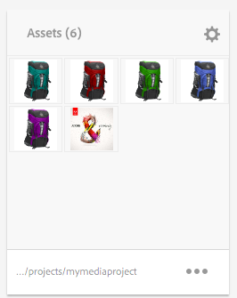

You upload assets directly in the tile. In addition you can create Image Sets, Spin Sets, or Mixed Media Sets if you have the Dynamic Media add-on.

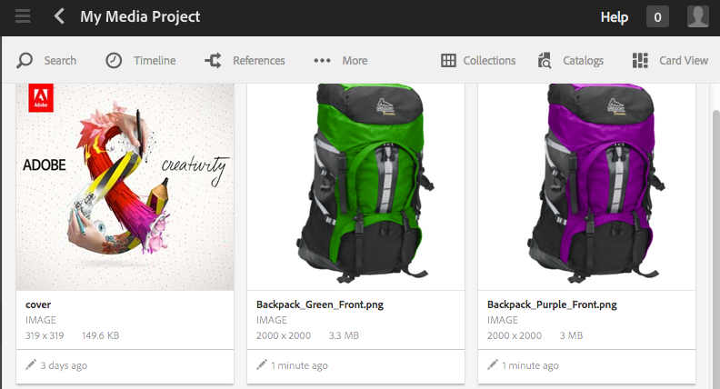

### Asset Collections {#asset-collections}

Similar to assets, you can add [asset collections](/help/assets/manage-collections.md) directly to your project. You define collections in Assets.

Add a collection by clicking **Add Collection** and selecting the appropriate collection from the list.

### Experiences {#experiences}

The **Experiences** tile lets you add a Mobile app, web site, or publication to the project.

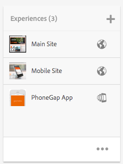

The icons indicate which kind of experience is represented: web site, mobile application or a publication. Add experiences by clicking the + sign or clicking **Add Experience** and selecting the type of experience.

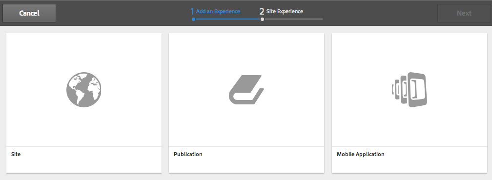

Select the path for the thumbnails and if applicable, change the thumbnail for the experience. Experiences are grouped together in the **Experiences** tile.

### Links {#links}

The Links tile lets you associate external links with your project.

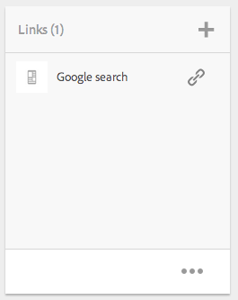

You can name the link with an easy-to-recognize name as well as change the thumbnail.

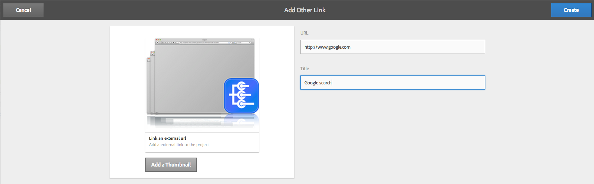

### Project Info {#project-info}

The Project Information tile provides general information on the project including a description, project status (inactive or active), a due date, and members. In addition, you can add a project thumbnail, which is displayed on the main Projects page.

Team members can be assigned and deleted from this tile (or have their roles changed) as well as the Team tile.

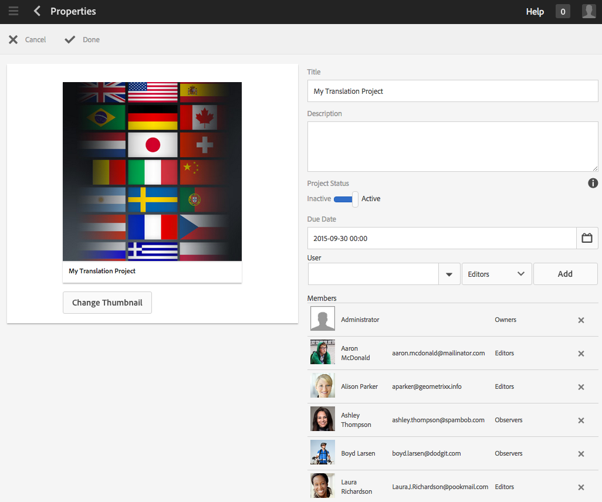

### Translation Job {#translation-job}

The Translation Job tile is where you start a translation and also where you see the status of your translations. To set up your translation, see [Creating Translation Projects](/help/assets/translation-projects.md).

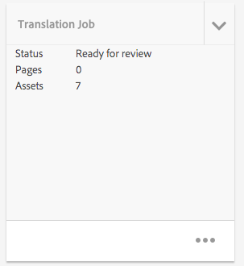

Click the ellipsis at the bottom of the **Translation Job** card to view the assets in the translation workflow. The translation job list also displays entries for asset metadata and tags. These entries indicate that the metadata and tags for the assets are also translated.

### Team {#team}

In this tile, you can specify the members of the project team. When editing, you can enter the name of the team member and assign the user role.

You can add and delete team members from the team. In addition, you can edit the [user role](#userroles) assigned to the team member.

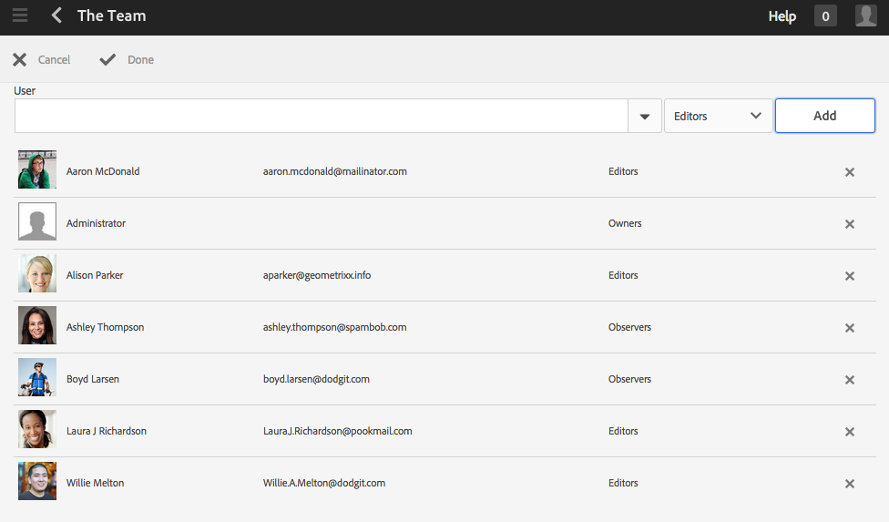

### Landing Pages {#landing-pages}

The **Landing** Pages tile lets you request a new landing page.

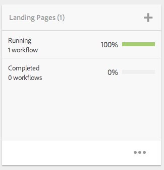

This workflow is described in [Create a Landing Page workflow](/help/sites-authoring/projects-with-workflows.md#request-landing-page-workflow).

### Emails {#emails}

The **Emails** tile helps you manage requests for email. It starts the Request for Email workflow.

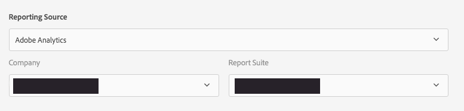

More information is described in the [Request Email workflow.](/help/sites-authoring/projects-with-workflows.md#request-email-workflow)

### Workflows {#workflows}

You can assign your project to follow certain workflows. If any workflows are running, their status displays in the **Workflows** tile in Projects.

You can assign your project to follow certain workflows. Depending on which project you choose you have different workflows available.

These are described in [Working with Project Workflows.](/help/sites-authoring/projects-with-workflows.md)

### Launches {#launches}

The Launches tile shows any launches that have been requested with a [Request Launch workflow.](/help/sites-authoring/projects-with-workflows.md)

### Tasks {#tasks}

Tasks let you monitor the status of any project-related tasks, including workflows. Tasks are covered in detail at [Working with Tasks](/help/sites-authoring/task-content.md).

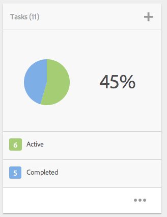

## Project Templates {#project-templates}

AEM ships with three different templates out of the box:

* A simple project - A reference sample for any projects that do not fit into other categories (a catch-all). It includes three basic roles (Owners, Editors, and Observers) and four workflows (Project Approval, Request Launch, Request Landing Page and Request Email).
* A media project - A reference sample project for media-related activities. It includes several media related project roles (Photographers, Editors, Copywriters, Designers, Owners and Observers). It also includes two workflows related to media content - Request Copy (for requesting and reviewing text) and Product Photo Shoot (for managing product related photography)
* [Product Photo Shoot Project](/help/sites-authoring/managing-product-information.md) - A reference sample for managing eCommerce related product photography. It includes roles for Photographers, Editors, Photo Retouchers, Owners, Creative Directors, Social Media Marketers, Marketing Managers, Reviewers and Observers.
* [A translation project](/help/sites-administering/translation.md) - A reference sample for managing translation related activities. It includes three basic roles (Owners, Editors, and Observers). It includes two workflows that are accessed in the Workflows user interface.

Based on the template you select, you have different options available to you particularly around user roles and workflows.

## User Roles in a Project {#user-roles-in-a-project}

The different user roles are set in a Project template and are used for two primary reasons:

1. Permissions. The user roles fall into one of the three categories listed: Observer, Editor, Owner. For example, a Photographer or Copywriter will have the same privileges as an Editor. The permissions determine what a user can do to content in a project.
1. Workflows. The workflows determine who is assigned tasks in a project. The tasks can be associated with a project role. For example, a task can be assigned to Photographers so all team members that have the Photographer role will get the task.

All projects support the following default roles to let you administer security and control permissions:

<table>
 <tbody>
  <tr>
   <td>
<strong>Role</strong>
 </td>
   <td>
<strong>Description</strong>
 </td>
   <td>
<strong>Permissions</strong>
 </td>
   <td>
<strong>Group Membership</strong>
 </td>
  </tr>
  <tr>
   <td>
Observer
 </td>
   <td>
A user in this role can view project details, including the project status.
 </td>
   <td>
Read-only permissions on a project
 </td>
   <td>
workflow-users group
 </td>
  </tr>
  <tr>
   <td>
Editor
 </td>
   <td>
A user in this role can upload and edit the contents of a project.
 
 
 </td>
   <td>
    <ul>
     <li>Read and Write access on a project, associated metadata, and related assets.</li>
     <li>Privileges to upload a shot list, photo shoot, and review and approve assets</li>
     <li>Write permission on /etc/commerce</li>
     <li>Have modify permision on a specific project</li>
    </ul> </td>
   <td>
workflow-users group
 </td>
  </tr>
  <tr>
   <td>
Owner
 </td>
   <td>
A user in this role can initiate a project. An owner can create a project, intiate work in a project and also move approved assets to the Production folder. Although all other tasks in the project can also be viewed and performed by the owner.
 </td>
   <td>
    <ul>
     <li>Write permission on /etc/commerce</li>
    </ul> </td>
   <td>
    <ul>
     <li>DAM-users group (to be able to create a project)</li>
     <li>project-administrators group (to be able to create a project and move assets)</li>
    </ul> </td>
  </tr>
 </tbody>
</table>

For creative projects, additional roles - for example, photographers - are also provided. You can use these roles to derive custom roles for a specific project.

>[!NOTE]
>
>When you create the project and add users to the various roles, groups associated with the project are automatically created to manage associated permissions. For example, a project called Myproject would have three groups **Myproject Owners**, **Myproject Editors**, **Myproject Observers**. However, if the project is deleted, those groups are not automatically deleted. An administrator needs to manually delete the groups in **Tools** &gt; **Security** &gt; **Groups**.
