# Projects {#projects}

Projects let you group resources into one entity. A common, shared environment makes it easy to manage your projects. The types of resources you can associate with a project are referred to in AEM as Tiles. Tiles may include project and team information, assets, workflows, and other types of information, as described in detail in [Project Tiles.](#project-tiles)

As a user, you can:

* Create and delete projects
* Associate content and asset folders to a project
* Remove content links from project

## Access Requirements {#access-requirements}

Projects a standard AEM feature and do not require any additional setup.

However for users in projects to see other users/groups while using Projects such as when creating projects, creating tasks/workflows, or viewing and managing the team, those users need to have read access on `/home/users` and `/home/groups`.

The easiest way to do this is to give the **projects-users** group read access to `/home/users` and `/home/groups`.

## Projects Console {#projects-console}

The projects console is where you access and manage your projects within AEM.

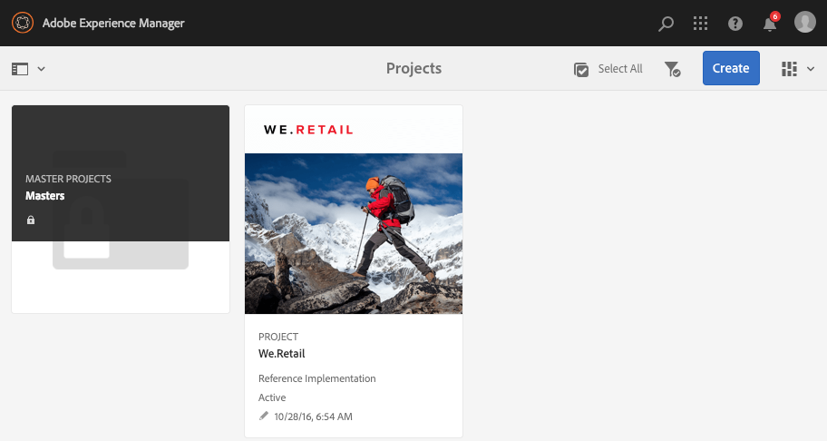

The Projects console is similar to other consoles in AEM, allow several actions on individual projects and adjusting your view of the projects.

### Toggle Your Mode {#modes}

You can use the rail selector to change between console modes.

#### Content Only {#content-only}

Content Only is the default mode when opening the console. It will show all of your projects.

#### Timeline {#timeline}

The timeline view let you select an individual project and view activity on it. Use the rail selector or the hotkey `alt+1` to change to this view.

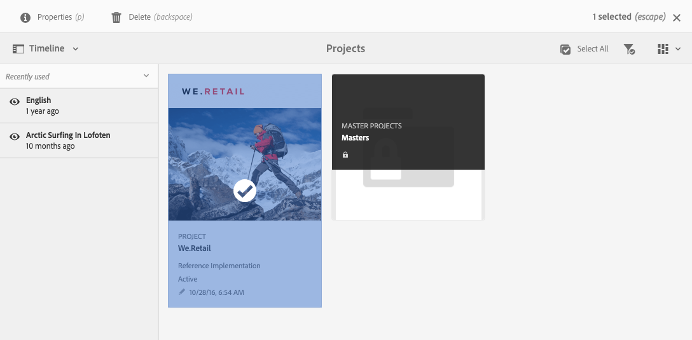

### Toggle Your View {#views}

You can use the view selector to change between viewing projects as large tiles (the default), to viewing them as a list, or on a calendar.

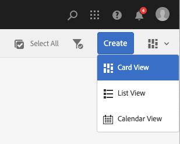

### Filter Your View {#filter}

You can use the filter to toggle between all projects and only those that are active.

### Selecting and viewing Projects {#selecting}

Select a project by hovering the mouse over the project tile and clicking the checkmark.

View the detail of a project by clicking on it to drill down into its detail.

### Creating New Projects {#creating}

Click **Create** to add a new project.

## Project Tiles {#project-tiles}

Projects are made up of different types of information that you wish to manage together. This information is represented by different **Tiles**.

You can have the following tiles associated with your project.

* [Assets](#assets)
* [Asset Collections](#asset-collections)
* [Experiences](#experiences)
* [Links](#links)
* [Project Information](#project-info)
* [Team](#team)
* [Landing Pages](#landing-pages)
* [Emails](#emails)
* [Workflows](#workflows)
* [Launches](#launches)
* [Tasks](#tasks)

Click on the drop-down menu in the top-right of any tile to add more data to the tile.

Click on the ellipses button at the bottom-right of any tile to open the tile's data in its associated console.

### Assets {#assets}

In the **Assets** tile, you can gather all assets that you use for a particular project.

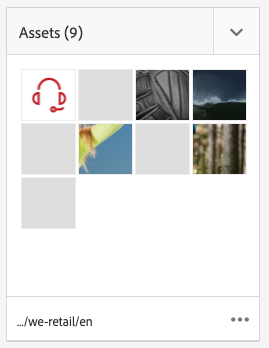

You upload assets directly in the tile.

### Asset Collections {#asset-collections}

Similar to assets, you can add [asset collections](/help/assets/manage-collections.md) directly to your project. You define collections in Assets.

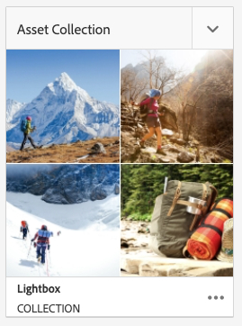

Add a collection by clicking **Add Collection** and selecting the appropriate collection from the list.

### Experiences {#experiences}

The **Experiences** tile lets you add a mobile app, web site, or publication to the project.

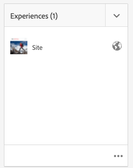

The icons indicate which kind of experience is represented.

* Web site
* Mobile application

### Links {#links}

The **Links** tile lets you associate external links with your project.

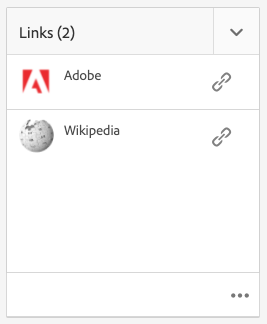

You can name the link with an easy-to-recognize name and change the thumbnail.

### Project Info {#project-info}

The **Project Information** tile provides general information on the project including a description, project status (inactive or active), a due date, and members. In addition, you can add a project thumbnail, which is displayed on the main Projects page.

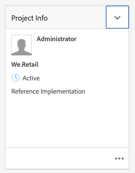

### Translation Job {#translation-job}

The **Translation Job** tile is where you start a translation and also where you see the status of your translations.

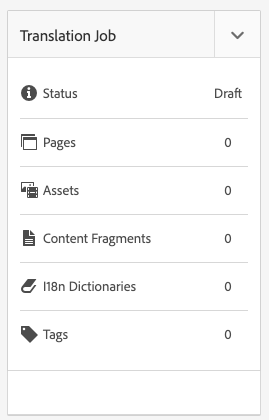

To set up your translation, see the document [Creating Translation Projects.](/help/assets/translation-projects.md)

### Team {#team}

In this tile, you can specify the members of the project team. When editing, you can enter the name of the team member and assign the user role.

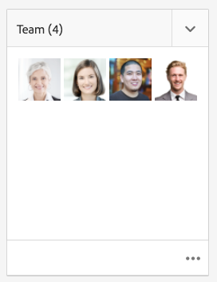

You can add and delete team members from the team. In addition, you can edit the [user role](#userroles) assigned to the team member.

### Landing Pages {#landing-pages}

The **Landing Pages** tile lets you request a new landing page.

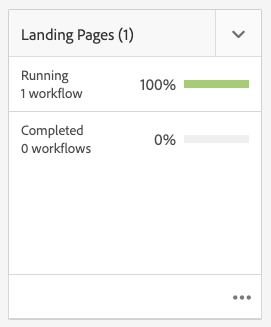

This workflow is described in the document[Create a Landing Page workflow.](/help/sites-authoring/projects-with-workflows.md#request-landing-page-workflow)

### Emails {#emails}

The **Emails** tile helps you manage requests for email. It starts the **Request for Email** workflow.

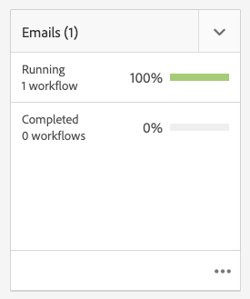

More information is described in the [Request Email workflow.](/help/sites-authoring/projects-with-workflows.md#request-email-workflow)

### Workflows {#workflows}

You can start workflows for your project. If any workflows are running, their status displays in the **Workflows** tile.

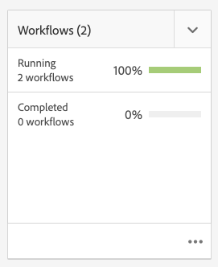

Depending on which project you create there are different workflows available.

These are described in [Working with Project Workflows.](/help/sites-authoring/projects-with-workflows.md)

### Launches {#launches}

The **Launches** tile shows any launches that have been requested with a [Request Launch workflow.](/help/sites-authoring/projects-with-workflows.md)

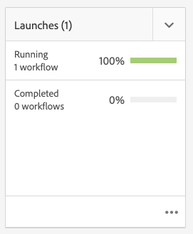

### Tasks {#tasks}

Tasks let you monitor the status of any project-related tasks, including workflows. Tasks are covered in detail at [Working with Tasks](/help/sites-authoring/task-content.md).

## Project Templates {#project-templates}

Templates serve as a basis to start your project. AEM provides these standard project templates.

* **Media Project** - This is a reference sample project for media-related activities. It includes several media related project roles and also includes workflows related to media content.
* **[Product Photo Shoot Project](/help/sites-authoring/managing-product-information.md)** - This is a reference sample for managing eCommerce related product photography.
* **[Translation project](/help/sites-administering/translation.md)** - This is a reference sample for managing translation related activities. It includes basic roles and includes workflows for managing translation.
* **Simple Project** - This is a reference sample for any projects that do not fit into other categories. It includes three basic roles and four general AEM workflows.

Based on the template you select, you have different options available to you within the project such as the user roles and workflows provided.

## User Roles in a Project {#user-roles-in-a-project}

The different user roles are defined in the project template and are used for two primary reasons:

1. Permissions: The user roles fall into one of the three categories listed: observer, editor, owner. For example, a photographer or copywriter will have the same privileges as an editor. The permissions determine what a user can do to content in a project.
1. Workflows: The workflows determine who is assigned tasks in a project. The tasks can be associated with a project role. For example, a task can be assigned to photographers so all team members that have the photographer role will get the task.

All projects support the following default roles to let you administer security and control permissions.

|Role|Description|Permissions|Group Membership|
|---|---|---|---|
|Observer|A user in this role can view project details, including the project status.|Read-only permissions on a project|`workflow-users` group|
|Editor|A user in this role can upload and edit the contents of a project.|Read and write access on a project, associated metadata, and related assets Privileges to upload a shot list, photo shoot, and review and approve assets Write permission on `/etc/commerce` Modify permission on a specific project|`workflow-users` group|
|Owner|A user in this role can create a project, initiate work in a project, and  move approved assets to the production folder. All other tasks in the project can also be viewed and performed by the owner.|Write permission on `/etc/commerce`|`dam-users` group to be able to create a project `projects-administrators` group to be able to create a project and move assets|

For creative projects, additional roles such as photographers are also provided. You can use these roles to derive custom roles for a specific project.

### Automatic Group Creation {#auto-group-creation}

When you create the project and add users to the various roles, groups associated with the project are automatically created to manage associated permissions.

For example, a project called Myproject would have three groups **Myproject Owners**, **Myproject Editors**, **Myproject Observers**.

If the project is deleted, those groups are only deleted if you select the appropriate option [when deleting the project.](/help/sites-authoring/touch-ui-managing-projects.md#deleting-a-project) An administrator can also manually delete the groups in **Tools** &gt; **Security** &gt; **Groups**.

## Additional Resources {#additional-resources}

For more details about using projects, see the following additional documents:

* [Managing Projects](/help/sites-authoring/touch-ui-managing-projects.md)
* [Working with Tasks](/help/sites-authoring/task-content.md)
* [Working with Project Workflows](/help/sites-authoring/projects-with-workflows.md)
* [Creative Project and PIM Integration](/help/sites-authoring/managing-product-information.md)
