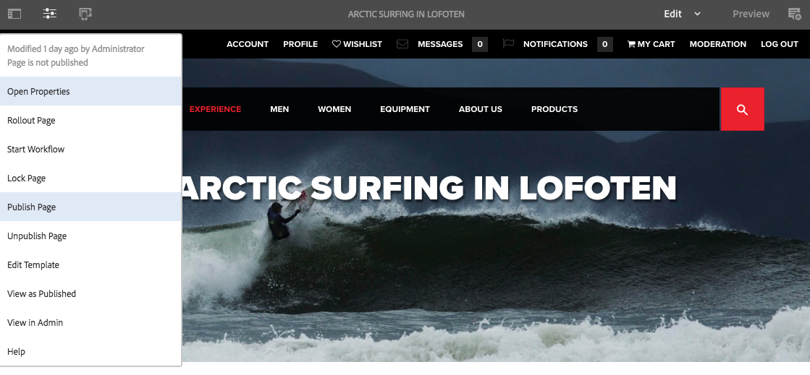
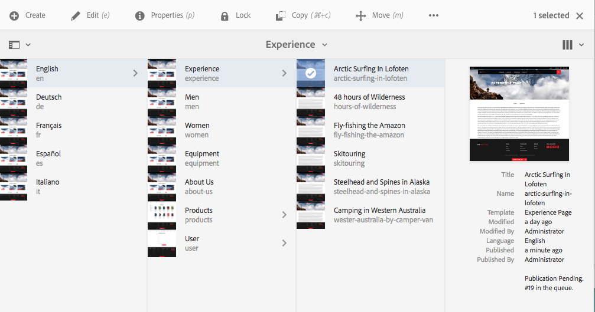
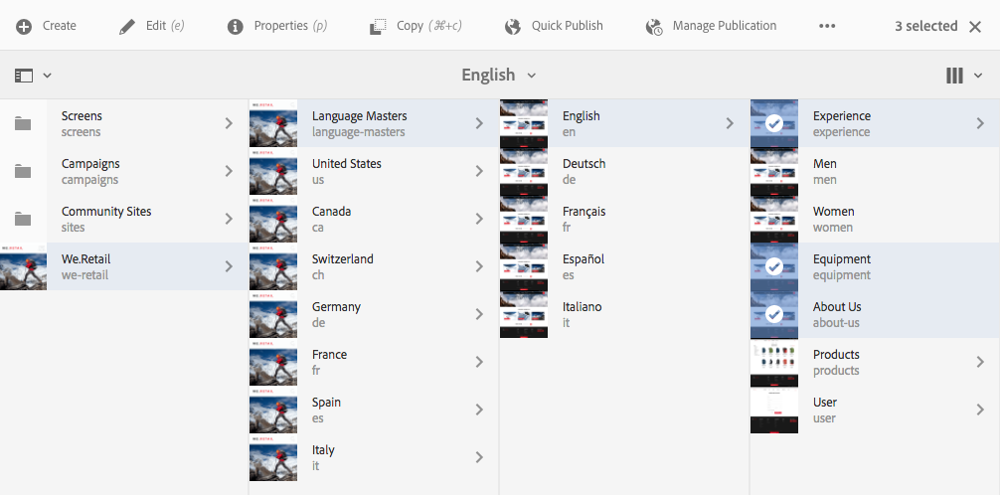
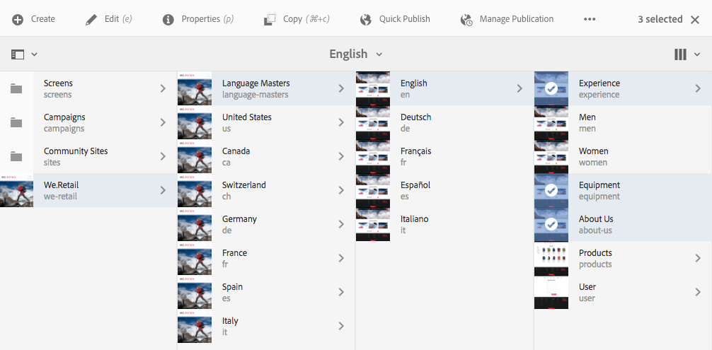
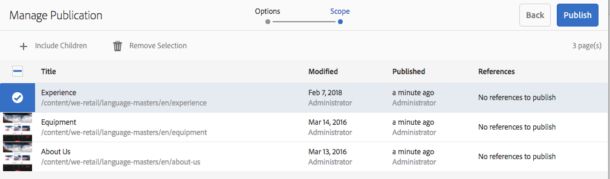
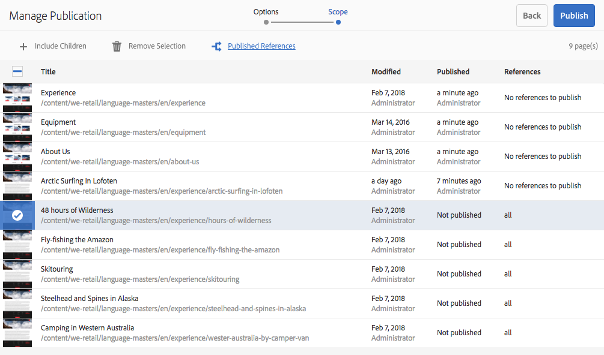
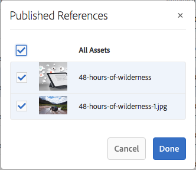
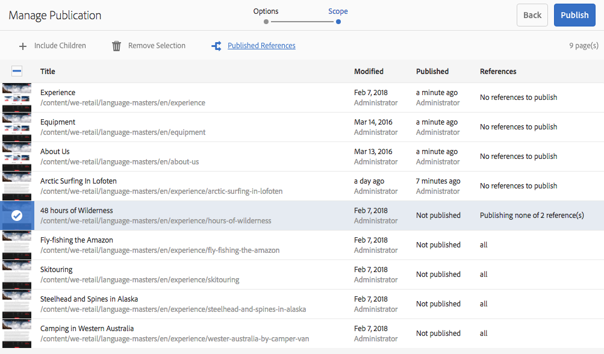
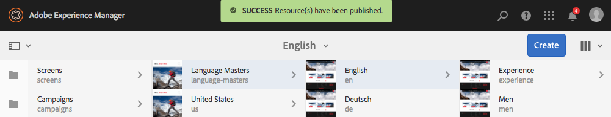
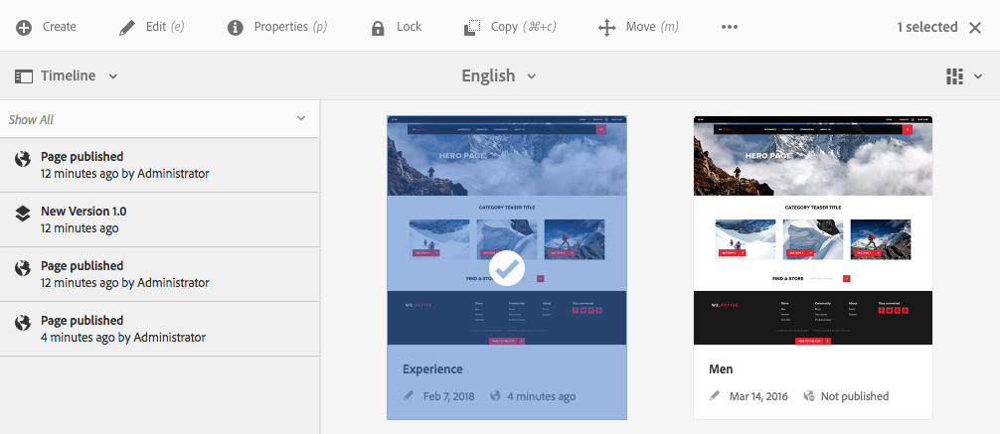

# Publishing Pages{#publishing-pages}

Once you have created and reviewed your content on the author environment, the goal is to [make it available on your public website](/help/sites-authoring/author.md#concept-of-authoring-and-publishing) (your publish environment).

This is referred to as publishing a page. When you want to remove a page from the publish environment is referred to as unpublishing. When publishing and unpublishing the page remains available on the author environment for further changes until you delete it.

You can also publish/unpublish a page immediately or at a predefined date/time in the future.

>[!NOTE]
>
>Certain terms related to publishing can be confused:
>
>* **Publish / Unpublish** 
>  These are the primary terms for the actions that make your content publicly available on your publish environment (or not).  
>
>* **Activate / Deactivate** 
>  These terms are synonymous with publish/unpublish.  
>
>* **Replicate / Replication** 
>  These are the technical terms describing the movement of data (e.g. page content, files, code, user comments) from one environment to another such as when publishing or reverse-replicating user comments.
>

>[!NOTE]
>
>If you do not have the required privileges for publishing a specific page:
>
>* A workflow will be triggered to notify the appropriate person of your request to publish.
>* This [workflow may have been customized](/help/sites-developing/workflows-models.md) by your development team.
>* A message will be displayed briefly to notify you that the workflow was triggered.
>

## Publishing Pages {#publishing-pages-2}

Depending on your location, you can publish:

* [From the page editor](/help/sites-authoring/publishing-pages.md#publishing-from-the-editor)
* [From the sites console](/help/sites-authoring/publishing-pages.md#publishing-from-the-console)

### Publishing from the Editor {#publishing-from-the-editor}

If you are editing a page, it can be published directly from the editor.

1. Select the **Page Information** icon to open the menu and then the **Publish Page** option.

   

1. Depending on whether the page has references that need publishing:

    * The page will be published directly if there are no references to be published. 
    * If the page has references that need publishing, these will be listed in the **Publish** wizard, where you can either:

        * Specify which of the assets/tags/etc. you want to publish together with the page, then use **Publish** to complete the process. 
        * Use **Cancel** to abort the action.

   

1. Selecting **Publish** will replicate the page to the publish environment. In the page editor an information banner will be shown confirming the publish action.

   

   When viewing the same page in the console, the updated publication status is visible.

   

>[!NOTE]
>
>Publishing from the editor is a shallow publish, i.e. only the selected page/pages is/are published and any child pages are not.

### Publishing from the Console {#publishing-from-the-console}

In the sites console there are two options for publishing:

* [Quick Publish](/help/sites-authoring/publishing-pages.md#quick-publish)
* [Manage Publication](/help/sites-authoring/publishing-pages.md#manage-publication)

#### Quick Publish {#quick-publish}

**Quick Publish** is for simple cases and publishes the selected page(s) immediately without any further interaction. Because of this, any non-published references will also be published automatically.

To publish a page with Quick Publish:

1. Select the page or pages in the sites console and click on the **Quick Publish** button.

   

1. In the Quick Publish dialogue, confirm the publication by clicking on **Publish** or cancel by clicking on **Cancel**. Remember that any unpublished references will automatically be published as well.

   

1. When the page is published an alert is shown confirming the publication.

>[!NOTE]
>
>Quick Publish is a shallow publish, i.e. only the selected page/pages is/are published and any child pages are not.

#### Manage Publication {#manage-publication}

**Manage Publication** offers more options than Quick Publish, allowing for the inclusion of child pages, customization of the references, and starting any applicable workflows as well as offering the option to publish at a later date.

To publish or unpublish a page using Manage Publication:

1. Select the page or pages in the sites console and click on the **Manage Publication** button.

   

1. The **Manage Publication** wizard starts. The first step, **Options**, allows you to:

    * Choose to publish or unpublish the selected pages.
    * Choose to take that action now or at a later date.

   Publishing later starts a workflow to publish the selected page or pages at the specified time. Conversely, unpublishing later starts a workflow to unpublish the selected page or pages at a specific time.

   If you want to cancel a publish/unpublish later, go to the [Workflow Console](/help/sites-administering/workflows.md) to terminate the corresponding workflow.

   

   Click **Next** to continue.

1. In the next step of the Manage Publication wizard, **Scope**, you can define the scope of the publication/unpublication such as including to include child pages and/or including references.

   

   You can use the **Add Content** button to add additional pages to the list of pages to be published in case you neglected to select one before starting the Manage Publication wizard.

   Clicking the Add Content button starts the [path browser](/help/sites-authoring/author-environment-tools.md#path-browser) to allow content selection.

   Select the required pages and then click **Select** to add the content to the wizard or **Cancel **to cancel the selection and return to the wizard.

   Back in the wizard, you can select an item in the list to configure its further options such as:

    * Include its children.
    * Remove it from the selection.
    * Manage its published references.

   

   Clicking **Include Children** opens a dialogue allowing you to:

    * Include only immediate children.
    * Include only modified pages.
    * Include only already published pages.

   Click **Add** to add the children pages to the list of pages to be published or unpublished based on the selection options. Click **Cancel** to cancel the selection and return to the wizard.

   

   Returning to the wizard you see the pages added based on your choice of options in the Include Children dialogue.

   You can view and modify the references to be published or unpublished for a page by selecting it and then clicking the **Published References** button.

   

   The **Published References** dialogue displayes the references for the selected content. By default they are all selected and will be published/unpublished, but you can uncheck to deslect them so that they are not included in the action.

   Click **Done** to save your changes or **Cancel** to cancel the selction and return to the wizard.

   

   Back in the wizard, the **References** column will be updated to reflect your selection of references to be published or unpublished.

   

1. Click **Publish** to complete.

   Back in the sites console a notification message will confirm the publication.

   

1. If the published pages are associated with workflows, they may be shown in a final **Workflows** step of the publication wizard.

   >[!NOTE]
   >
   >The **Workflows** step will be shown based on what rights your user may or may not have. See the [previous note on this page](/help/sites-authoring/publishing-pages.md) regarding publishing privileges as well as [Managing Access to Workflows](/help/sites-administering/workflows-managing.md) and [Applying Workflows to Pages](/help/sites-authoring/workflows-applying.md) for details.

   The resources are grouped by the workflows triggered and each given options to:

    * Define the title of the workflow.
    * Keep the workflow package, provided that the workflow has [multi-resourse support](/help/sites-developing/workflows-models.md#configuring-a-workflow-for-multi-resource-support).
    * Define a title of the workflow package if the option to keep the workflow package was chosen.

   Click **Publish** or **Publish Later **to complete the publication.

   

## Unpublishing Pages {#unpublishing-pages}

Unpublishing a page will remove it from your publish environment so that it is no longer available to your readers.

In a [manner similar to publishing](/help/sites-authoring/publishing-pages.md#publishing-pages), one or more pages can be unpublished:

* [From the page editor](/help/sites-authoring/publishing-pages.md#unpublishing-from-the-editor)
* [From the sites console](/help/sites-authoring/publishing-pages.md#unpublishing-from-the-console)

### Unpublishing from the Editor {#unpublishing-from-the-editor}

When editing a page, if you wish to unpublish that page, select **Unpublish Page** in the **Page Information** menu, much as you would [publish the page](/help/sites-authoring/publishing-pages.md#publishing-from-the-editor).

### Unpublishing from the Console {#unpublishing-from-the-console}

Just as you [use the Manage Publication option to publish](/help/sites-authoring/publishing-pages.md#manage-publication), you can also use it to unpublish.

1. Select the page or pages in the sites console and click on the **Manage Publication** button.
1. The **Manage Publication** wizard starts. In the first step, **Options**, select to **Unpublish** instead of the default option of **Publish**.

   

   Just as publishing later starts a workflow to publish this version of the page at the specified time, deactivating later starts a workflow to unpublish the selected page or pages at a specific time.

   If you want to cancel a publish/unpublish later, go to the [Workflow Console](/help/sites-administering/workflows.md) to terminate the corresponding workflow.

1. To complete the unpublication, continue through the wizard as you would to [publish the page](/help/sites-authoring/publishing-pages.md#manage-publication).

## Publishing and Unpublishing a Tree {#publishing-and-unpublishing-a-tree}

When you have entered or updated a considerable number of content pages - all of which are resident under the same root page - it can be easier to publish the entire tree in one action.

You can use the [Manage Publication](/help/sites-authoring/publishing-pages.md#manage-publication) option on the sites console to do this.

1. In the sites console, select the root page of the tree you wish to publish or unpublish and select **Manage Publication**.
1. The **Manage Publication** wizard starts. Choose to publish or unpublish and when it should occur and select **Next** to continue.
1. In the **Scope** step, select the root page and select **Include Children**.

   

1. In the **Include Children** dialogue, uncheck the options:

    * Include only immediate children
    * Include only already published pages

   These options are selected by default, so you must remember to unselect them. Click **Add** to confirm and add the content to the publication/unpublication.

   

1. The **Manage Publication** wizard lists the content of the tree for review. You can further customize the selection by adding additional pages or removing those selected.

   

   Remember that you can also review the references to be published via the **Published References** option.

1. [Continue the Manage Publication wizard as normal](#manage-publication) to complete the publication or unpublication of the tree.

## Determining Publication Status {#determining-publication-status}

You can detemine the publication status of a page:

* In the [resource overview information on the sites console](/help/sites-authoring/basic-handling.md#viewing-and-selecting-resources)

  

  The publication status is shown in [card](/help/sites-authoring/basic-handling.md#card-view), [column](/help/sites-authoring/basic-handling.md#column-view), and [list](/help/sites-authoring/basic-handling.md#list-view) views in the sites console.

* In the [timeline](/help/sites-authoring/basic-handling.md#timeline)

  

* In the [Page Information menu](/help/sites-authoring/author-environment-tools.md#page-information) when editing a page

  

