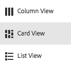
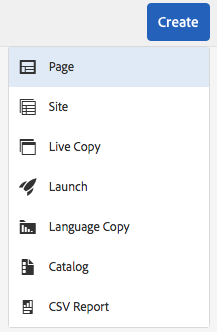
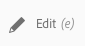
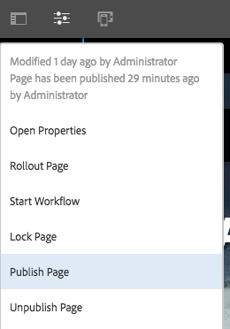
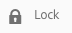
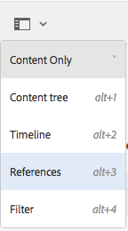
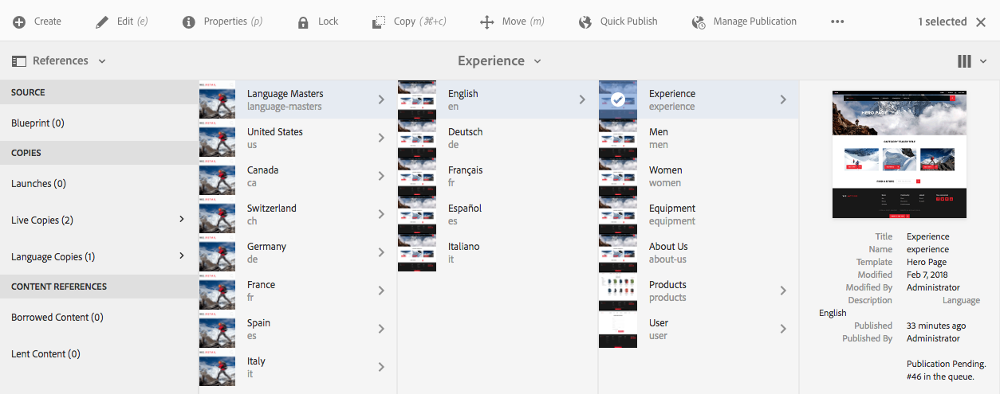
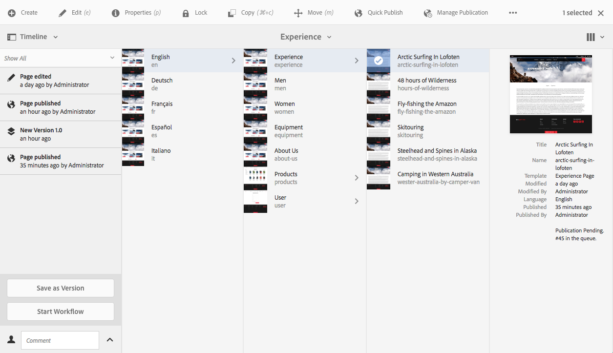

# Quick Guide to Authoring Pages{#quick-guide-to-authoring-pages}

These procedures are intended as a quick guide (high-level) to the key actions of authoring page content in AEM.

They:

* Are not intended as comprehensive coverage.
* Provide links to the detailed documentation.

For full details about authoring with AEM see:

* [First Steps for Authors](/help/sites-authoring/first-steps.md)  
* [Working with the Author Environment](/help/sites-authoring/author-environment-tools.md)

## A Few Quick Hints {#a-few-quick-hints}

Before giving the overview of specifics, here is a small collection of general tips and hints that are worth bearing in mind, especially if you are used to the [classic UI authoring environment](/help/sites-classic-ui-authoring/classicui.md).

### Sites Console {#sites-console}

* **Create**

    * This button is available in many consoles - the options presented are context sensitive so can vary according to the scenario.

* Re-ordering pages in a folder

    * This can be done in [List View](/help/sites-authoring/basic-handling.md#list-view). The changes will be applied and be visible in other views.

* Changing your UI

    * This can be done from various locations. See [Selecting your UI](/help/sites-authoring/select-ui.md).

### Page Authoring {#page-authoring}

* Navigating Links

    * ***Links are not available for navigation*** when you are in **Edit** mode. To navigate with links you need to [preview the page](/help/sites-authoring/editing-content.md#previewing-pages) using either:

        * [Preview Mode](/help/sites-authoring/editing-content.md#preview-mode)
        * [View as Published](/help/sites-authoring/editing-content.md#view-as-published)

* Workflows and Versions are no longer started/created from the page editor; this is now done from [Timeline](/help/sites-authoring/basic-handling.md#timeline) (accessible from the console).

>[!NOTE]
>
>There are a number of keyboard shortcuts that can make the authoring experience easier.
>
>* [Keyboard Shortcuts When Editing Pages](/help/sites-authoring/page-authoring-keyboard-shortcuts.md)
>* [Keyboard Shortcuts for Consoles](/help/sites-authoring/keyboard-shortcuts.md)  
>

## Finding Your Page {#finding-your-page}

1. Open the **Sites** console (using the **Sites** option in the [Global Navigation](/help/sites-authoring/basic-handling.md#global-navigation) - this is triggered (drop down) when you select the Adobe Experience Manager link (top left).  

1. Navigate down the tree by tapping/clicking on the appropriate page. How the page resources are represented depends on the view you are using - [Card, List, or Column](/help/sites-authoring/basic-handling.md#viewing-and-selecting-resources):

   

1. Navigate up the tree using [the breadcrumb in the header](/help/sites-authoring/basic-handling.md#the-header), which allows you to return to the selected location:

   

### Creating a New Page {#creating-a-new-page}

1. [Navigate to the location](#finding-your-page) where you want to create the new page.
1. Use the **Create** icon and then select **Page** from the list:

   

1. This opens the wizard that will guide you through collecting the information needed when [creating your new page](/help/sites-authoring/managing-pages.md#creating-a-new-page). Follow the on screen instructions.

## Selecting Your Page for Further Action {#selecting-your-page-for-further-action}

You can select a page so that you can take action on it. Selecting a page will automatically update the toolbar so that the actions relevant to that resource are shown.

How to select a page depends on which view you are using in the console:

1. Card View:

    * Enter selection mode by [selecting the required resource](/help/sites-authoring/basic-handling.md#viewing-and-selecting-resources) with:

        * Mobile device: tap-and-hold
        * Desktop: the [quick action](/help/sites-authoring/basic-handling.md#quick-actions) - tick icon:

   

    * The card will be overlaid with a tick to show that the page has been selected.

   >[!NOTE]
   >
   >Once in selection mode the **Select** icon (a tick) will change to the **Deselect** icon (a cross).

1. List View:

    * Tap/click on the thumbnail for the required resource - the thumbnail will be overlaid with a tick to show that it has been selected.

1. Column View:

    * Tap/click on the thumbnail for the required resource - the thumbnail will be overlaid with a tick to show that it has been selected.

## Quick Actions (Card View/Desktop Only) {#quick-actions-card-view-desktop-only}

1. [Navigate to the page](#finding-your-page) you want to take action on.
1. Hover your mouse pointer over the card that represents your required resource; the quick actions will be shown:

   

## Editing Your Page Content {#editing-your-page-content}

1. [Navigate to the page](#finding-your-page) you want to edit.
1. [Open your page for editing](/help/sites-authoring/managing-pages.md#opening-a-page-for-editing) using the Edit (pencil) icon:

   

   This can be accessed from either:

    * [Quick Actions (Card View/Desktop Only)](#quick-actions-card-view-desktop-only) for the approprate resource.
    * The toolbar when your [page has been selected](#selecting-your-page-for-further-action).

1. When the editor opens you can:

    * [Add a new compenent to your page](/help/sites-authoring/editing-content.md#inserting-a-component) by:

        * opening the side panel
        * selecting the components tab (the [components browser](/help/sites-authoring/author-environment-tools.md#components-browser))
        * dragging the required component onto your page.

      The side panel can be opened (and closed) with:

   

    * [Edit the content of an existing component](/help/sites-authoring/editing-content.md#edit-configure-copy-cut-delete-paste) on the page:

        * Open the component toolbar with either tap or click. Use the **Edit** (pencil) icon to open the dialog.
        * Open the in place editor for the component with either tap-and-hold or a double-slow-click. The available actions will be shown (for some components, this will be a limited selection).
        * To see all actions available enter full-screen mode using:

   

    * [Configure the properties of an existing component](/help/sites-authoring/editing-content.md#component-edit-dialog)

        * Open the component toolbar with either tap or click. Use the **Configure** (wrench) icon to open the dialog.

    * [Move a component](/help/sites-authoring/editing-content.md#moving-a-component) either:

        * Drag the required component to its new location.
        * Open the component toolbar with either tap or click. Use the **Cut** then **Paste** icons where required.

    * [Copy (and Paste)](/help/sites-authoring/editing-content.md#edit-configure-copy-cut-delete-paste) a component:

        * Open the component toolbar with either tap or click. Use the **Copy** then **Paste** icons as required.

   >[!NOTE]
   >
   >You can **Paste** components to either the same page, or a different page. If pasting to a different page that was already open before the cut/copy operation, then that page will need a page refresh.

    * [Delete](/help/sites-authoring/editing-content.md#edit-configure-copy-cut-delete-paste) a component:

        * Open the component toolbar with either tap or click, then use the **Delete** icon.

    * [Add annotations](/help/sites-authoring/annotations.md#annotations) to the page:

        * Select the **Annotate** mode (speech bubble icon). Add annotations using the **Add annotation** (plus) icon. Exit annotation mode using the X at top right.

   

    * [Preview a page](/help/sites-authoring/editing-content.md#preview-mode) (to see how it will appear in the publish environment)

        * Select **Preview** from the toolbar.

    * Return to edit mode (or select another mode) using the **Edit** drop down selector.

   >[!NOTE]
   >
   >To navigate using links in the content you must use [Preview mode](/help/sites-authoring/editing-content.md#preview-mode).

## Editing the Page Properties {#editing-the-page-properties}

There are two (main) methods of [editing page properties](/help/sites-authoring/editing-page-properties.md):

* From the **Sites** console:

    1. [Navigate to the page](#finding-your-page) you want to publish.
    1. Select the **Properties** icon from either:

        * [Quick Actions (Card View/Desktop Only)](#quick-actions-card-view-desktop-only) for the approprate resource.
        * The toolbar when your [page has been selected](#selecting-your-page-for-further-action).

  

* The page properties will be shown. You can make updates as required, then use Save to persist these

    * When [editing your page](#editing-your-page-content):

        1. Open the **Page Information** menu.
        1. Select **Open Properties** to open the dialog for editing the properties.

            

## Publishing Your Page (or Unpublishing) {#publishing-your-page-or-unpublishing}

There are two main methods of [publishing your page](/help/sites-authoring/publishing-pages.md) (and also of unpublishing):

* From the **Sites** console:

    1. [Navigate to the page](#finding-your-page) you want to publish.
    1. Select the **Quick Publish** icon from either:

        * [Quick Actions (Card View/Desktop Only)](#quick-actions-card-view-desktop-only) for the approprate resource.
        * The toolbar when your [page has been selected](#selecting-your-page-for-further-action) (also gives access to [Publish Later](/help/sites-authoring/publishing-pages.md#manage-publication)).

  

* When [editing your page](#editing-your-page-content):

    1. Open the **Page Information** menu.
    1. Select **Publish Page**.

  

* Unpublishing a page from the console can only be done via the **Manage Publication** option, which is only available on the toolbar (not via the quick actions).

  The **Unpublish Page** option is still available via the **Page Information** menu in the editor.

  

  See [Publishing Pages](/help/sites-authoring/publishing-pages.md#unpublishing-pages) for more information.

## Move, Copy and Paste, or Delete Your Page {#move-copy-and-paste-or-delete-your-page}

1. [Navigate to the page](#finding-your-page) you want to move, copy and paste, or delete.
1. Select the copy (and then paste), move or delete icon as required using either:

    * [Quick Actions (Card View/Desktop Only)](#quick-actions-card-view-desktop-only) for the required resource.
    * The toolbar when your [page has been selected](#selecting-your-page-for-further-action).

    * Copy:

        * You will then need to navigate to the new location and paste.

    * Move:

        * The wizard will open to collect the information needed to move the page. Follow the on-screen instructions.

    * Delete:

        * You will be asked to confirm the action.

   >[!NOTE]
   >
   >Delete is not available as a Quick Action.

## Locking Your Page (then Unlocking) {#locking-your-page-then-unlocking}

[Locking a page](/help/sites-authoring/editing-content.md#locking-a-page) prevents other authors from working on it while you are. The Lock (and Unlock) icon/button can be found:

* The toolbar when your [page has been selected](#selecting-your-page-for-further-action).
* The [Page Information drop down menu](#editing-the-page-properties) when editing a page.
* The page toolbar when editing a page (when the page is locked)

For example, the lock icon looks like this:

 

## Accessing Page References {#accessing-page-references}

[Quick access to references](/help/sites-authoring/author-environment-tools.md#references) to/from a page are available in the References Rail.

1. Select **References** using the toolbar icon (either before or after [selecting your page](#selecting-your-page-for-further-action)):

   

   A list of reference types is shown:

   

1. Tap/click on the required type of reference to show more details and (when appropriate) take further actions.

## Creating a Version of Your Page {#creating-a-version-of-your-page}

1. To open the Timeline rail, select **[Timeline](/help/sites-authoring/basic-handling.md#timeline)** using the toolbar icon (either before or after [selecting your page](#selecting-your-page-for-further-action)):

   

1. Tap/click on the up-arrow at the bottom right of the Timeline column to reveal extra buttons, including **Save as Version**.

   

1. Select **Save as Version**, then **Create**.

## Restoring/Comparing a Version of Your Page {#restoring-comparing-a-version-of-your-page}

The same basic mechanism is used when restoring and/or comparing versions of your page:

1. Select **[Timeline](/help/sites-authoring/basic-handling.md#timeline)** using the toolbar icon (either before or after [selecting your page](#selecting-your-page-for-further-action)):

   

   If a version of your page has already been saved, this will be listed in the Timeline. 

1. Tap/click on the version you want to restore - this will reveal additional action buttons:

    * **Revert to this Version**

        * The version will be restored.

    * **Show Differences**

        * The page will be opened with differences (between the two versions) highlighted.

