# Responsive Layout{#responsive-layout}

AEM allows you to have a responsive layout for your pages by using the **Layout Container** component.

This provides a paragraph system that allows you to position components within a responsive grid. This grid can rearrange the layout according to the device/window size and format. The component is used in conjunction with the [**Layout** mode](/help/sites-authoring/responsive-layout.md#defining-layouts-layout-mode), which allows you to create and edit your responsive layout dependent on device.

The layout container:

* Provides horizontal snap to grid, together with the ability to place components into the grid side-by-side and define when they should collapse/reflow.
* Uses pre-defined breakpoints (e.g. for phone, tablet, etc.) to allow you to define the required behavior of content for related devices/orientation.

    * For example, you can customize the component size or whether the component can be seen on specific devices.

* Can be nested to allow column control.

The user can then see how the content will be rendered for specific devices using the emulator.

>[!CAUTION]
>
>Although the Layout Container component is available in the classic UI, its full functionality is only available and supported in the touch-enabled UI.

AEM realizes responsive layout for your pages using a combination of mechanisms:

* [**Layout Container**](#adding-a-layout-container-and-its-content-edit-mode) component

  This component is available in the [component browser](/help/sites-authoring/author-environment-tools.md#components-browser) and provides a grid-paragraph system to allow you to add and position components within a responsive grid. It can also be set as the default paragraph system on your page.

* [**Layout Mode**](/help/sites-authoring/responsive-layout.md#defining-layouts-layout-mode)

  Once the layout container is positioned on your page you can use the **Layout** mode to position content within the responsive grid.

* [**Emulator**](#selecting-a-device-to-emulate)
  This allows you to create and edit responsive websites that rearrange the layout according to device/window size by resizing components interactively. The user can then see how the content will be rendered using the emulator.

With these responsive grid mechanisms you can:

* Use breakpoints to define differing content layouts based on device width (related to device type and orientation).
* Use these same breakpoints and content layouts to ensure that your content is responsive to the size of the browser window on the desktop.
* Use horizontal snap to grid allowing you to place components in the grid, resize as required, and define when they should collapse/reflow to be side-by-side or above/below.
* Hide components for specific device layouts.
* Realize column control.

Depending on your project, the Layout Container might be used as the default paragraph system for your pages or as a component available to be added to your page via the component browser (or both).

>[!NOTE]
>
>Adobe provides [GitHub documentation](https://adobe-marketing-cloud.github.io/aem-responsivegrid/) of the responsive layout as a reference that can be given to front-end developers allowing them to use the AEM grid outside of AEM, for example when creating static HTML mock-ups for a future AEM site.

>[!NOTE]
>
>Use of the above mechanisms is enabled by configuration on the template. See [Configuring Responsive Layout](/help/sites-administering/configuring-responsive-layout.md) for further information.

## Layout Definitions, Device Emulation, and Breakpoints {#layout-definitions-device-emulation-and-breakpoints}

When you are creating your website content you want to ensure that your content is displayed appropriate to the device being used to view it.

AEM allows you to define layouts dependent on the width of the device:

* The emulator enables you to emulate these layouts on a range of devices. In addition to the device type, the orientation, selected by the **Rotate device** option, can impact the breakpoint selected as the width changes.
* Breakpoints are the points which separate the layout definitions.

    * They effectively define the maximum width (in pixels) of any device using a specific layout.
    * The breakpoints are usually valid for a selection of devices, dependent on the width of their displays.
    * The range of a breakpoint extends left until the next breakpoint.
    * You cannot select the breakpoint specifically, selecting a device and orientation will automatically select the appropriate breakpoint.

The device **Desktop**, which does not have a specific width, relates to the default breakpoint (i.e. everything above the last configured breakpoint).

>[!NOTE]
>
>It would be possible to define breakpoints for every individual device, but this would drastically increase the effort required for layout definition and maintenance.

When using the emulator, you select a specific device for emulation and layout definition and the related breakpoint will be highlighted too. Any layout changes that you make will be applicable for other devices to which the breakpoint applies, i.e. any devices positioned to the left of the active breakpoint marker, but before the next breakpoint marker.

For example, when you select the device **iPhone 6 Plus** (defined with a width of 540 pixels) for emulation and layout, the breakpoint **Phone** (defined as 768 pixels) will be activated too. Any layout changes you make for the **iPhone 6** will be applicable to other devices under the **Phones** breakpoint, such as **iPhone 5** (defined as 320 pixels).

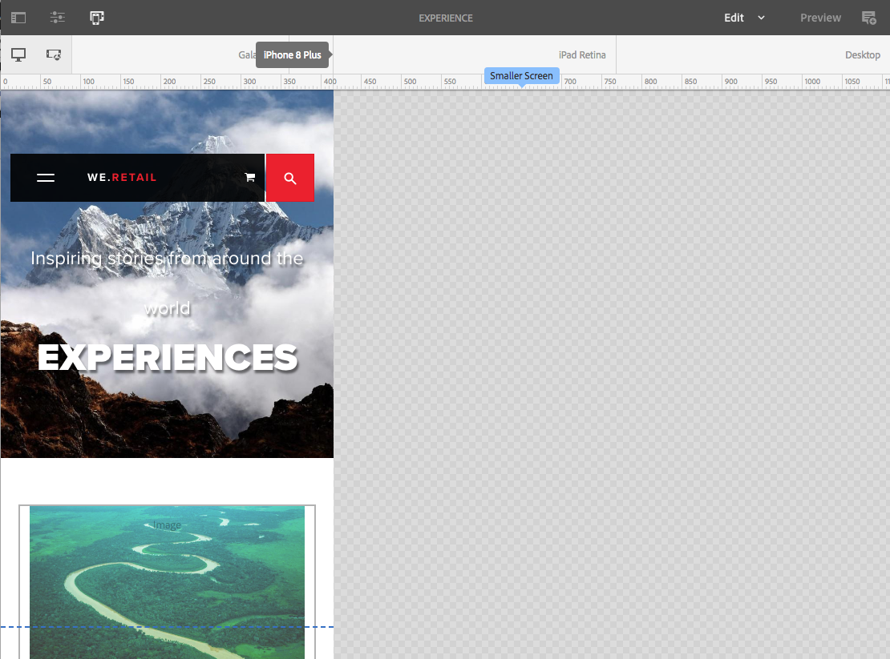

## Selecting a Device to Emulate {#selecting-a-device-to-emulate}

1. Open the required page for editing. For example:

   `http://localhost:4502/editor.html/content/we-retail/us/en/experience.html`

1. Select the **Emulator** icon from the top toolbar:

   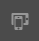

1. The emulator toolbar will open.

   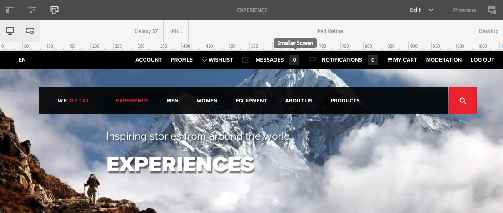

   The emulator toolbar displays additional layout options:

    * **Rotate device** - Allows you to rotate a deivce from vertical (portrait) orientation to horizontal (landscape) orientation and vice-versa.

   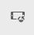 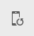

    * **Select Device** - Define a specific device to emulate from a list (see next step for details)

   

1. To select a specific device to emulate you can either:

    * Use the Select Device icon and select from a drop-down selector.
    * Tap/click on the device indicator in the emulator toolbar.

   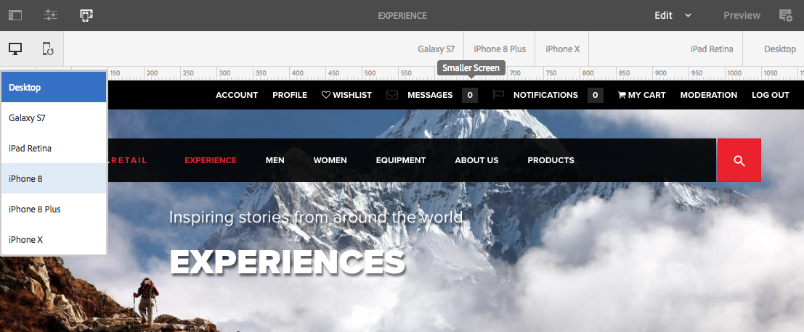

1. Once a specific device has been selected you can:

    * See the active marker for the selected device, such as **iPad.**
    * See the active marker for the appropriate [breakpoint](/help/sites-authoring/responsive-layout.md#layout-definitions-device-emulation-and-breakpoints) such as **Tablet.**

   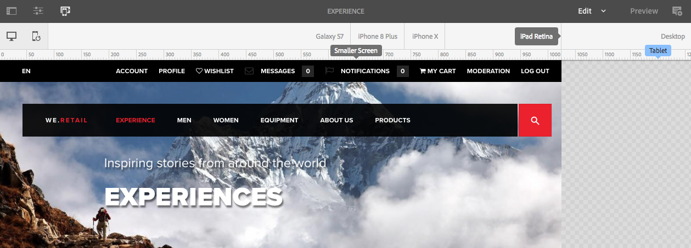

    * The blue dotted line represents the *fold* for the selected device (here an **iPhone 6**).

   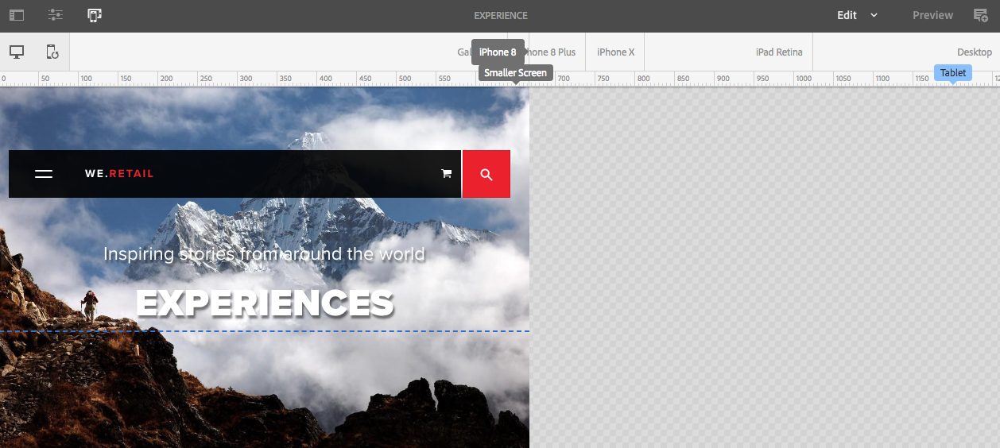

    * The fold can also be considered the page line break (not to be confused with the [breakpoints](/help/sites-authoring/responsive-layout.md#layout-definitions-device-emulation-and-breakpoints)) for the content. This is displayed for convenience to show what part of the content the user will see on the device before scrolling.
    * The line for the fold will not be shown if the height of the device being emulated is higher than the screen size.
    * The fold is shown for the author's convenience and is not shown on the published page.

## Adding a Layout Container and its Content (Edit mode) {#adding-a-layout-container-and-its-content-edit-mode}

A **Layout Container** is a paragraph system that:

* Contains other components.
* Defines the layout.
* Responds to changes.

>[!NOTE]
>
>If not already available, the **Layout Container** must be explicitly [activated for a paragraph system/page](/help/sites-administering/configuring-responsive-layout.md) (for example, by using [**Design** mode](/help/sites-authoring/default-components-designmode.md)).

1. The **Layout Container** is available as a standard component in the [Components Browser](/help/sites-authoring/author-environment-tools.md#components-browser). From here you can drag it to the required location on the page after which you will see the **Drag Components here** placeholder.
1. You can then add components to the layout container. These components will hold the actual content:

   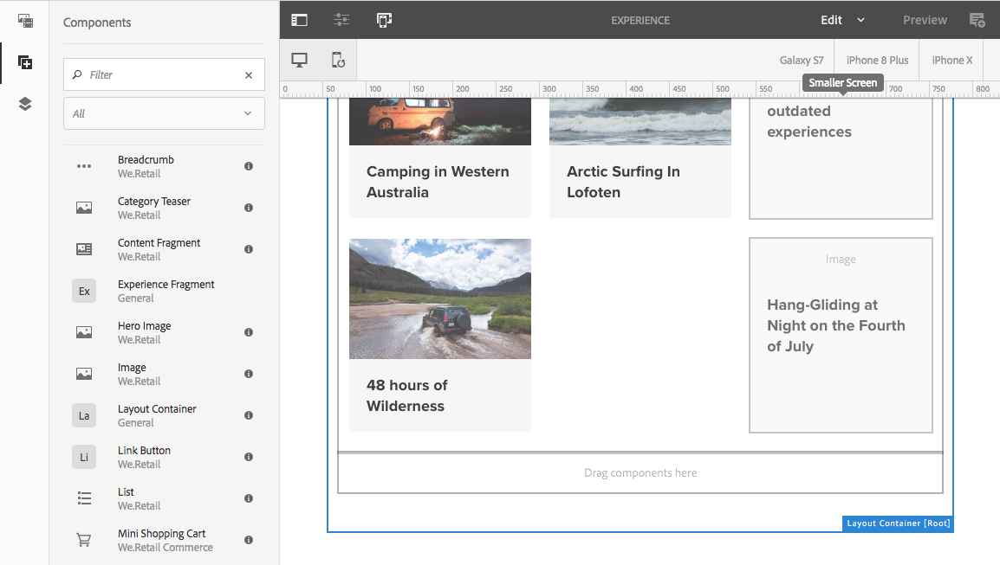

## Selecting and Taking Action on a Layout Container (Edit mode) {#selecting-and-taking-action-on-a-layout-container-edit-mode}

As with other components, you can select and then take action on (cut, copy, delete) a Layout Container (when in **Edit** mode):

>[!CAUTION]
>
>As a layout container is a paragraph system, deleting the component will delete both the layout grid and all the components (and their content) held within the container.

1. If you mouseover or tap the grid placeholder, the action menu is displayed.

   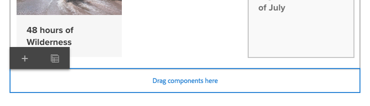

   You need to select the **Parent** option.

   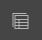

1. If the layout component is nested, selecting the **Parent** option presents a drop-down selection, allowing you to select the nested layout container or its parent(s).

   When you mouse over the container names in the drop-down, their outlines will be displayed on the page.

    * The lowest nested layout container will be outlined in black.
    * The next-lowest nested layout container will be in a dark grey.
    * Every successive container will be lin a lighter shade of grey.

   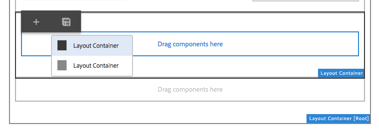

1. This will highlight the entire grid with its content. The action toolbar will be shown, from where you can select an action such as **Delete.**

   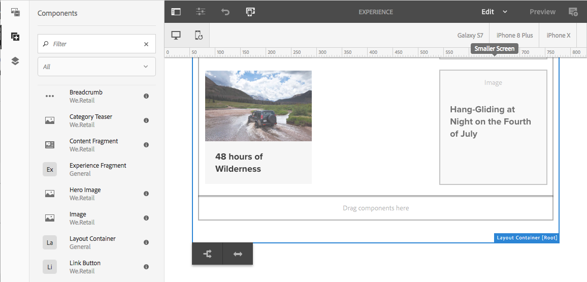

## Defining Layouts (Layout mode) {#defining-layouts-layout-mode}

>[!NOTE]
>
>You can define a separate layout for each [breakpoint](#layout-definitions-device-emulation-and-breakpoints) (as determined by emulated device type and orientation).

To configure the layout of a responsive grid implemented with the Layout Container you need to use the **Layout** mode.

**Layout** mode can be started in two ways.

* By using the [mode menu in the toolbar](/help/sites-authoring/author-environment-tools.md#page-modes) and choosing **Layout** mode

    * Select the **Layout** mode just as you would switch to **Edit** mode or **Targeting** mode.
    * **Layout** mode remains persistent and you do not leave **Layout** mode until you select another mode via the mode selector.

* When [editing an individual component.](/help/sites-authoring/editing-content.md#edit-component-layout)

    * By using the **Layout** option in the component's quick action menu, you can switch to **Layout** mode.
    * **Layout** mode persists while editing the component and reverts to **Edit** mode once focus changes to another component.

When in layout mode you can perform various actions on a grid:

* Resize the content components using the blue dots. Resizing will always snap-to-grid. When resizing the background grid will be shown to aid alignment:

  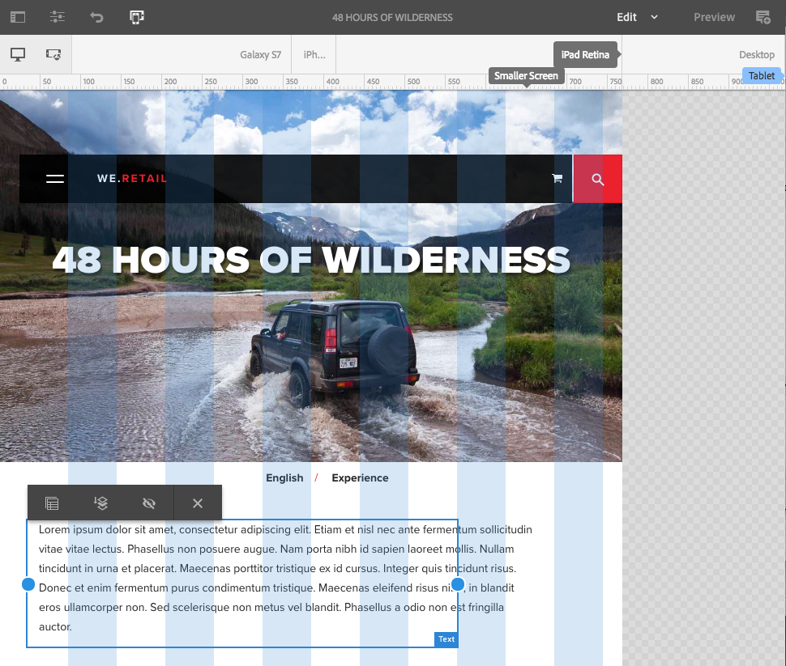

  >[!NOTE]
  >
  >Proportions and ratios will be maintained when components such as **Images** are resized.

* Click/tap on a content component, the toolbar allows you to:

    * **Parent**

      Allows you to select the entire layout container component for taking action on the whole.

    * **Float to new line**

      The component will be moved to a new line, dependent on the space available within the grid.

    * **Hide component**

      The component will be made invisible (it can be restored from the toolbar of the layout container).

  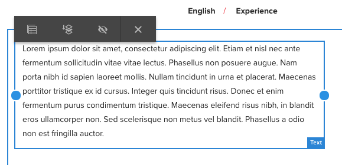

* In **Layout** mode you can tap/click on the **Drag components here** to select the entire component. This will show the toolbar for this mode.

  The toolbar will have different options depending on the state of the layout component and the components belonging to it. For example:

    * **Parent** - Select the parent component.

  

    * **Show hidden components** - Reveal all or individual components. The number indicates how many hidden components there currently are.thecounter shows how many components are hidden.

  

    * **Revert breakpoint layout** - Revert to the default layout. This means that no customized layout will be imposed.

  

    * **Float to new line** - Move the component up a position if spacing allows.

  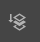

    * **Hide component** - Hide the current component.

  

  >[!NOTE]
  >
  >In the above example the float and hide actions are available because this Layout Container is nested within a parent Layout Container.

    * **Unhide components**
      Select the parent components to show the action toolbar with the **Show hidden components** option. In this example, two components are hidden.

  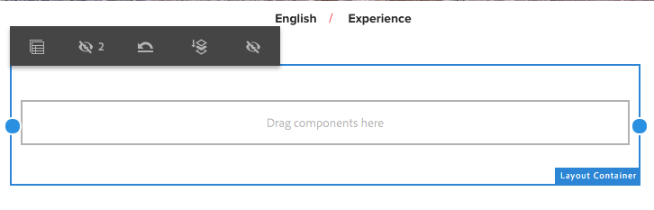

  Selecting the **Show hidden components** option will display in blue the components that are currently hidden in their original positions.

  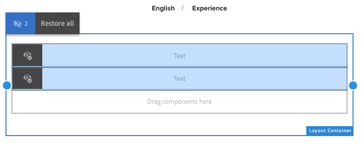

  Selecting **Restore all** will unhide all hidden components.
