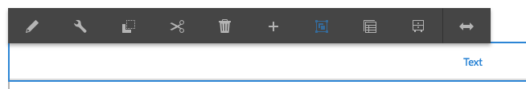

# Using the Rich Text Editor to Author Content {#use-rich-text-editor-to-author-content}

The Rich Text Editor (RTE) is a basic building block for inserting textual content into AEM. It forms the basis of various components, including:

* [Text](https://experienceleague.adobe.com/en/docs/experience-manager-core-components/using/wcm-components/text)
* [Table](https://experienceleague.adobe.com/en/docs/experience-manager-core-components/using/wcm-components/text#table)

## In-Place Editing {#in-place-editing}

Selecting a text-based component with a single click will reveal the [component toolbar](/help/sites-authoring/editing-content.md#edit-configure-copy-cut-delete-paste) as with any component.

Tapping/clicking agin or initially selecting the component with a slow double-click opens in-place editing, which has its own toolbar. Here you can edit the content and make basic formatting changes.

This toolbar provides the following options:

* **Format**: This lets you set Bold, Italic and Underline.
* **Lists**: With this you can create bulleted or numbered lists, or set the indentation.
* **Hyperlink**
* **Unlink**
* **Fullscreen**
* **Close**
* **Save**

## Full-Screen Editing {#full-screen-editing}

For text-based components, tapping the full-screen mode from the toolbar  opens the rich text editor and hides the rest of the page content.

Fullscreen mode displays all the configured options that you can use for authoring. The availability is options [depends on the configuration](/help/sites-administering/rich-text-editor.md).

Additional rich text editor options include:

* **Anchor**: Create an anchor in the text that you can later link to/reference.
* **Align Text Left**
* **Center Text**
* **Align Text Right**

Close fullscreen mode by clicking the minimize icon.

>[!NOTE]
>
>Copying nested lists from Microsoft Word into the RTE can give inconsistent results and may require manual adjustement after pasting the text in the RTE.
