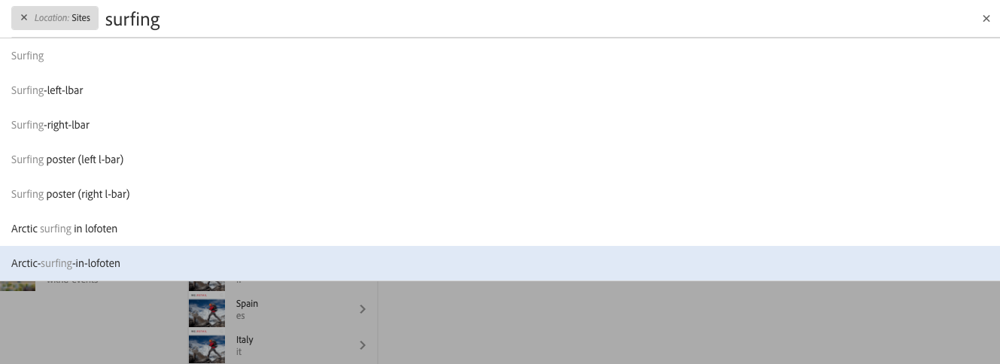
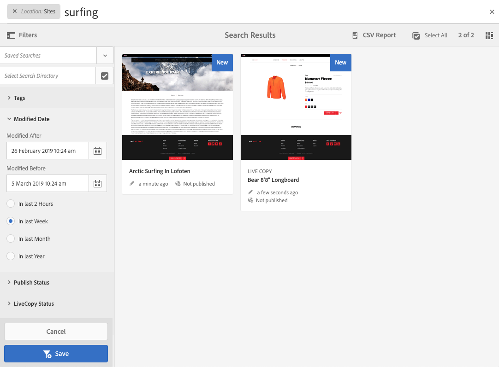
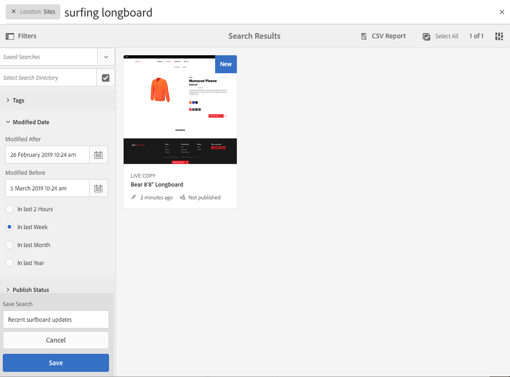
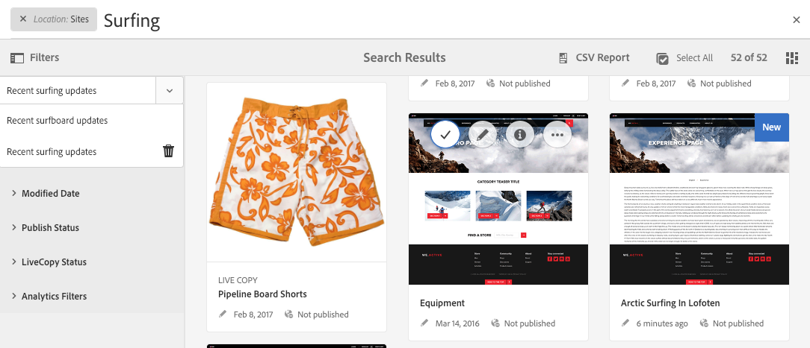
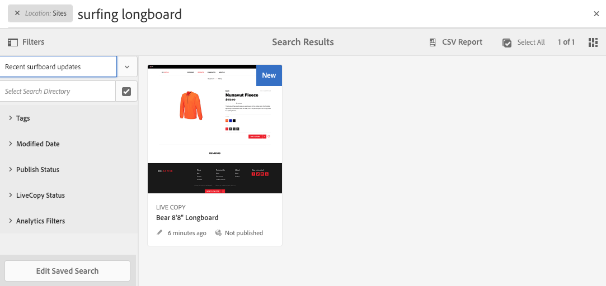

# Search{#searching}

The author environment of AEM provides various mechanisms for searching for content, dependent on the resource type.

>[!NOTE]
>
>Outside the author environment other mechanisms are also available for searching, such as the [Query Builder](/help/sites-developing/querybuilder-api.md) and [CRXDE Lite](/help/sites-developing/developing-with-crxde-lite.md).

## Search Basics {#search-basics}

Search is available from the top toolbar:

With the search rail you can:

* Search for a specific keyword, path or tag.
* Filter according to resource specific criteria, such as modified dates, page status, file size, etc.
* Define and use a [saved search](#saved-searches) - based on the above criteria.

>[!NOTE]
>
>Search can also be invoked by using the hotkey `/` (forward slash) whenever the search rail is visible.

## Search and Filter {#search-and-filter}

To search and filter your resources:

1. Open **Search** (with the magnifying glass in the toolbar) and enter your search term. Suggestions will be made and can be selected:

   

   By default the search results will be limited to your current location (i.e. console and related resource type):

   

1. If required, you can remove the location filter (select **X** on the filter you want removed) to search across all consoles/resource types.
1. The results will be shown, grouped according to console and related resource type.

   You can either select a specific resource (for further action), or drill down by selecting the required resource type; for example **View All Sites**:

   

1. If you want to drill down further, select the Rail symbol (top left) to open the side panel **Filters & Options**.

   

   According to the resource type Search will show a predefined selection of search/filter critera.

   The side panel allows you to select:

    * Saved Searches
    * Search Directory
    * Tags
    * Search Criteria; for example, Modified Dates, Publish Status, LiveCopy Status.

   >[!NOTE]
   >
   >The search criteria can vary:
   >
   >
   >
   >    * Depending on the resource type you have selected; for example, the Assets and Communities criteria are understandably specialized.
   >    * Your instance as the [Search Forms](/help/sites-administering/search-forms.md) can be customized (appropriate to the location within AEM).
   >
   >

   

1. You can also add additional search terms:

   

1. Close **Search** with the **X** (top right).

>[!NOTE]
>
>Search criteria are persisted when selecting an item in the search results.
>
>When you select an item on the search results page, when returning to the search page after using the browser back button, the search criteria remain.

## Saved Searches {#saved-searches}

As well as searching by a wide range of facets you can also save a particular search configuration for retrieval and use at a later stage:

1. Define your search criteria and select **Save**.

   

1. Assign a name, then use **Save** to confirm:

   

1. Your saved search will be available from the selector the next time you access the search panel:

   

1. Once saved you can:

    * Use **x** (against the name of the saved search) to start a new query (the saved search itself will not be deleted).
    * **Edit Saved Search**, change the search conditions, then **Save** again.

Saved searches can be modified by selecting the saved search and clicking **Edit Saved Search** at the bottom of the search panel.

