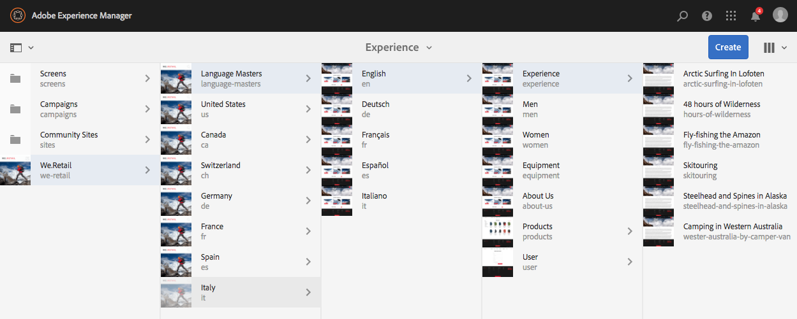
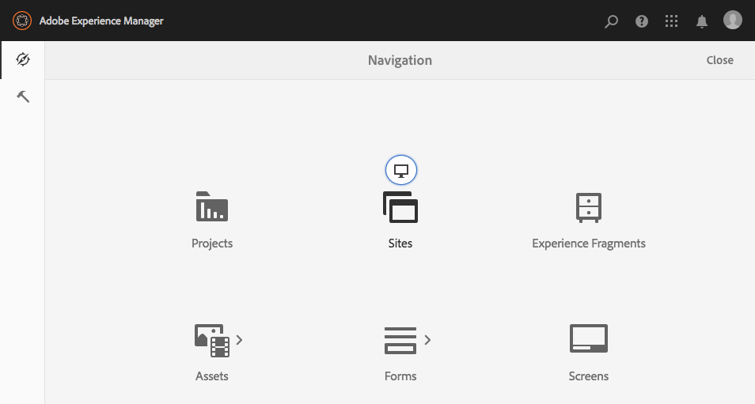

# Selecting your UI{#selecting-your-ui}

## Understanding the UIs

The author environment allows for:

* [Authoring](/help/sites-authoring/author.md) (including [page authoring](/help/sites-authoring/author-environment-tools.md), [managing assets](/help/assets/home.md), [communities](/help/communities/author-communities.md))  

* [Administering](/help/sites-administering/home.md) tasks you need when generating and maintaining the content on your website

Two graphical user interfaces are provided to achieve this. These are accessible through any modern browser.

1. Touch-Enabled UI

    * This is the modern, default AEM UI.
    * It is predominantly grey, with a clean, flat interface.
    * Designed for use on both touch and desktop devices, the look and feel is the same on all devices, though [viewing and selecting your resources](/help/sites-authoring/basic-handling.md#viewing-and-selecting-resources) differs slightly (taps versus clicks).

        * Desktop:

   

    * Tablet devices (or desktop less than 1024 pixels wide):

   

1. Classic UI

    * This is the legacy UI and has been available in AEM for many years.
    * It is predominantly green.
    * It was designed for use on desktop devices.
    * The following documentation focuses on the modern UI. For information about authoring in the classic UI, see the [Authoring documentation for the Classic UI](/help/sites-classic-ui-authoring/classicui.md).

   

## Switching UIs

Although the touch-enabled UI is now the standard UI and [feature parity](../release-notes/touch-ui-features-status.md) has been nearly reached with the administration and editing of sites, there may be times when the user wishes to switch to the [classic UI](/help/sites-classic-ui-authoring/classicui.md). There are several options for doing this.

>[!NOTE]
>
>For details on the status of feature parity with the classic UI, see the [Touch UI Feature Parity](../release-notes/touch-ui-features-status.md) document.

There are various locations where you can define which UI is to be used:

* [Configuring the default UI for your instance](#configuring-the-default-ui-for-your-instance) - This will set the default UI to be shown at user login, although the user may be able to override this and select a different UI for their account or current session.  

* [Setting Classic UI Authoring for your account](/help/sites-authoring/select-ui.md#setting-classic-ui-authoring-for-your-account) - This will set the UI to be used as default when editing pages, although the user can override this and select a different UI for their account or current session.  

* [Switching to classic UI for the current session](#switching-to-classic-ui-for-the-current-session) - This switches to the classic UI for the current session.

* For the case of [page authoring the system makes certain overrides in the relation to the UI](#ui-overrides-for-the-editor).

>[!CAUTION]
>
>Various options for switching to the classic UI are not immediately available out-of-the-box, they must be specifically configured for your instance.
>
>See [Enabling Access to Classic UI](/help/sites-administering/enable-classic-ui.md) for more information.

>[!NOTE]
>
>Instances upgraded from a previous version will retain the classic UI for page authoring.
>
>After upgrade, page authoring will not be automatically switched to the touch-enabled UI, but you can configure this using the the [OSGi configuration](/help/sites-deploying/configuring-osgi.md) of the **WCM Authoring UI Mode Service** ( `AuthoringUIMode` service). See [UI Overrides for the Editor](#ui-overrides-for-the-editor).

## Configuring the Default UI for Your Instance {#configuring-the-default-ui-for-your-instance}

A system administrator can configure the UI that is seen at startup and login by using [Root Mapping](/help/sites-deploying/osgi-configuration-settings.md).

This can be overridden by user defaults or session settings.

## Setting Classic UI Authoring for Your Account {#setting-classic-ui-authoring-for-your-account}

Each user can access his/her [user preferences](/help/sites-authoring/user-properties.md) to define if he/she wishes to use the classic UI for page authoring (instead of the default UI).

This can be overridden by session settings.

## Switching to Classic UI for the Current Session {#switching-to-classic-ui-for-the-current-session}

When using the touch-enabled UI desktop users might want to revert to the classic (desktop only) UI. There are several methods to switch to the classic UI for the current session:

* **Navigation Links**

  >[!CAUTION]
  >
  >This option for switching to the classic UI is not immediately available out-of-the-box, it must be specifically configured for your instance.
  >
  >
  >See [Enabling Access to Classic UI](/help/sites-administering/enable-classic-ui.md) for more information.

  If this is enabled, whenever you mouseover an applicable console, an icon appears (symbol of a monitor), tapping/clicking this will open the appropriate location in the classic UI.

  For examples, the links from **Sites** to **siteadmin**:

  

* **URL**

  The classic UI can be accessed using the URL for the welcome screen at `welcome.html`. For example:

  `http://localhost:4502/welcome.html`

  >[!NOTE]
  >
  >The touch-enabled UI can be accessed via `sites.html`. For example:
  >
  >
  >`http://localhost:4502/sites.html`

### Switching to Classic UI when Editing a Page {#switching-to-classic-ui-when-editing-a-page}

>[!CAUTION]
>
>This option for switching to the classic UI is not immediately available out-of-the-box, it must be specifically configured for your instance.
>
>See [Enabling Access to Classic UI](/help/sites-administering/enable-classic-ui.md) for more information.

If enabled, **Open the Classic UI** is available from the **Page Information** dialog:

### UI Overrides for the Editor {#ui-overrides-for-the-editor}

The settings defined by a user or system administrator can be overriden by the system in the case of page authoring.

* When authoring pages:

    * Use of the classic editor is forced when accessing the page using `cf#` in the URL. For example: 

      `http://localhost:4502/cf#/content/geometrixx/en/products/triangle.html`

    * Use of the touch-enabled editor is forced when using `/editor.html` in the URL or when using a touch device. For example: 

      `http://localhost:4502/editor.html/content/geometrixx/en/products/triangle.html`

* Any forcing is temporary and only valid for the browser session

    * A cookie set will be set dependent on whether touch-enabled ( `editor.html`) or classic ( `cf#`) is used.

* When opening pages through `siteadmin`, checks will be made for the existence of:

    * The cookie
    * A user preference 
    * If neither exist, it will default to the definitions set in the [OSGi configuration](/help/sites-deploying/configuring-osgi.md) of the **WCM Authoring UI Mode Service** ( `AuthoringUIMode` service).

>[!NOTE]
>
>If [a user has already defined a preference for page authoring](#setting-classic-ui-authoring-for-your-account), that will not be overridden by changing the OSGi property.

>[!CAUTION]
>
>Due to the use of cookies, as already described, it is not recommended to either:
>
>* Manually edit the URL - A non-standard URL could result in an unknown situation and lack of functionality.
>* Have both editors open at the same time - For example, in separate windows.  
>

