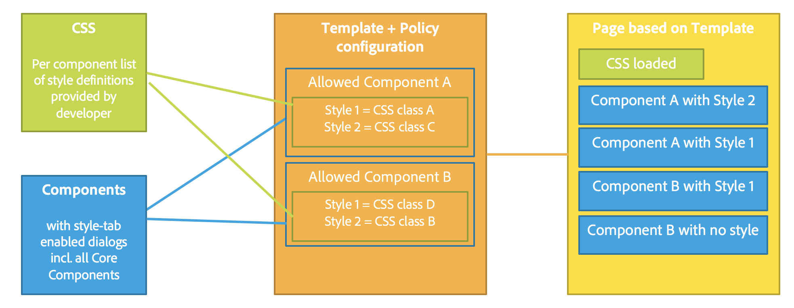
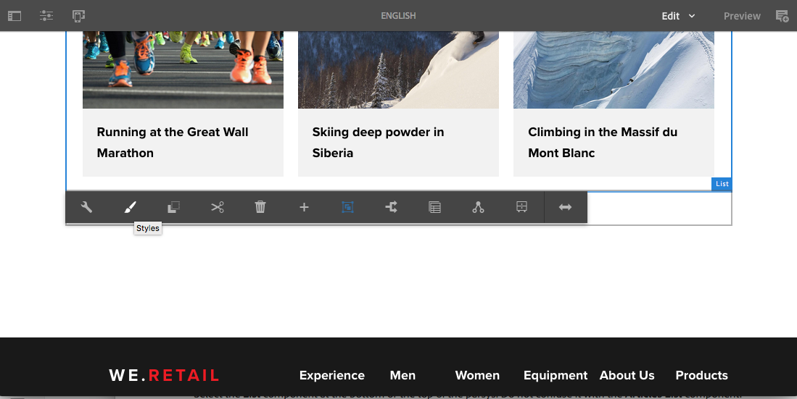
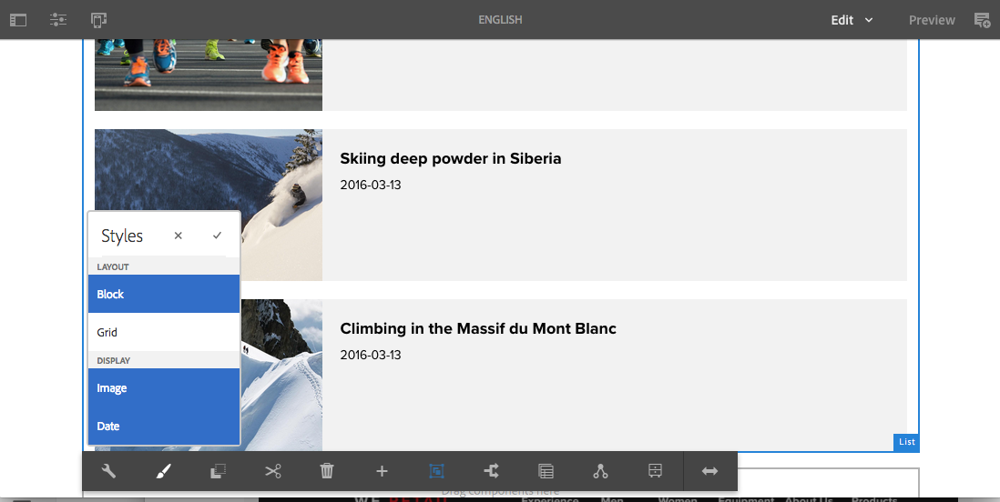
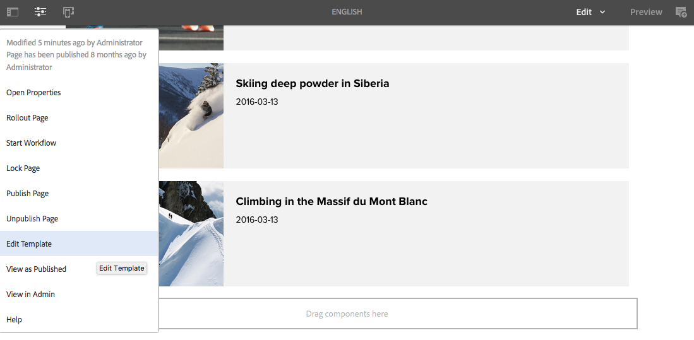
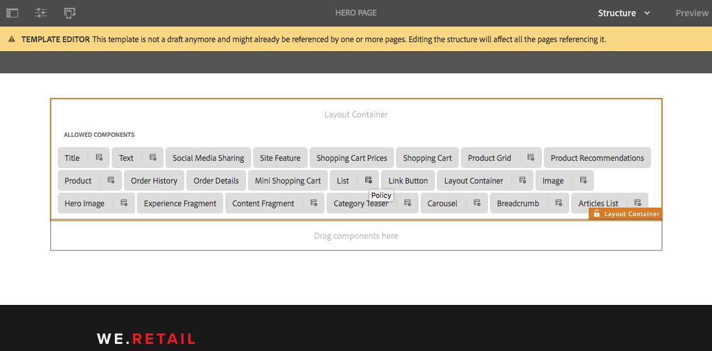
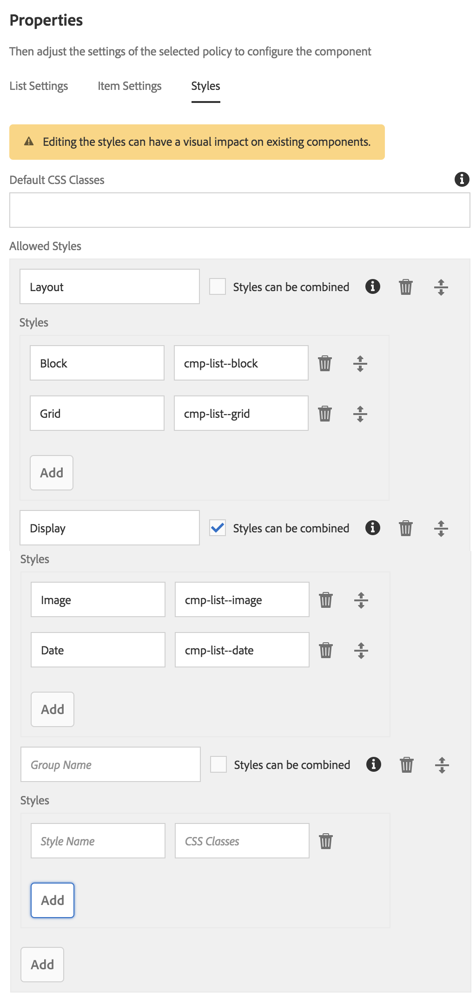

# Style System{#style-system}

The Style System allows a template author to define style classes in the content policy of a component so that a content author is able to select them when editing the component on a page. These styles can be alternative visual variations of a component, making it more flexible.

This eliminates the need to develop a custom component for each style or to customize the component dialog to enable such style functionality. It leads to more reusable components that can be quickly and easily adapted to the needs of content authors without any AEM back-end development.

## Use Case {#use-case}

Template authors not only need the ability to configure how components function for the content authors, but also to configure a number of alternative visual variations of a component.

Likewise, content authors not only need the ability to structure and arrange their content, but also to select how it is presented visually.

The style system provides a unified solution to both the template author's and content author's requirements:

* Template authors can define style classes in the content policy of components.
* Content authors can then select these classes from a drop-down when editing the component on a page in order to apply the corresponding styles.

The style class is then inserted on the decoration wrapper element of the component so that the component developer doesn't need to be concerned with handling the styles beyond providing their CSS rules.

## Overview {#overview}

Using the style system generally takes the following form.

1. The web designer creates different visual variations of a component.

1. The HTML developer is provided with the HTML output of the components and the desired visual variations to implement.  

1. The HTML developer defines the CSS classes that correspond to each visual variation and are to be inserted on the element wrapping the components.  

1. The HTML developer implements the corresponding CSS code (and optionally JS code) for each of the visual variations so that they look as defined.

1. The AEM developer places the provided CSS (and optional JS) in a [Client Library](/help/sites-developing/clientlibs.md) and deploys it.  

1. The AEM developer or template author configures the page templates and edits the policy of each styled component, adding the defined CSS classes, giving user-friendly names to each style, and indicating which styles can be combined.

1. The AEM page author can then choose the designed styles in the page editor via the style menu of the component's toolbar.

Note that only the last three steps are actually carried out in AEM. This means all development of the necessary CSS and Javascript can be done without AEM.

Actually implementing the styles only requires deployment on AEM and selection within the components of the desired templates.

The following diagram illustrates the architecture of the style system.

 

## Use {#use}

To demonstrate the feature, styles need to be created for a component. Using [We.Retail](/help/sites-developing/we-retail.md)'s implementation of the core component's [list component](https://helpx.adobe.com/experience-manager/core-components/using/list.html) as a basis, you can install the attached package containing styles in order to explore the feature's functionality.

Download the [style system demo package](assets/package_-_style_systemdemo.zip)

>[!NOTE]
>
>The demo package is intended to show how the style system can be used by authors, rather than as a reference of how to best implement it. 
>
>This package will be needed only until We.Retail provides a built-in example and best practice implementation.

The following sections [As a Content Author](/help/sites-authoring/style-system.md#as-a-content-author) and [As a Template Author](/help/sites-authoring/style-system.md#as-a-template-author) describe how to test the functionality of the style system using the style system demo package on top of We.Retail.

If you wish to use the style system for your own components do the following:

1. Install the CSS as client libraries as discussed in the section [Overview](/help/sites-authoring/style-system.md#overview).
1. Configure the CSS classes that you wish to make available to your content authors as described in the section [As a Template Author](/help/sites-authoring/style-system.md#as-a-template-author).
1. Content authors can then use the styles as described in the section [As a Content Author](/help/sites-authoring/style-system.md#as-a-content-author).

### As a Content Author {#as-a-content-author}

1. After installing the style system demo package, navigate to We.Retail's English language master home page at `http://localhost:4502/sites.html/content/we-retail/language-masters/en` and edit the page.
1. Select the **List** component at the bottom or the top of the parsys. Do not confuse it with the **Articles List** component.

   

1. Tap or click the **Styles** button on the toolbar of the **List** component to open the style menu and change the appearance of the component.

   

   >[!NOTE]
   >
   >In this example, the **Layout** styles (**Block** and **Grid**) are mutually exclusive, while the **Display** options (**Image** or **Date**) can be combined. This can be [configured in the template as the template author](/help/sites-authoring/style-system.md#as-a-template-author).

### As a Template Author {#as-a-template-author}

1. While editing We.Retail's English language master home page at `http://localhost:4502/sites.html/content/we-retail/language-masters/en`, edit the template of the page via **Page Information -&gt; Edit Template**.

   

1. Edit the policy of the **List** component by tapping or clicking the **Policy** button of the component. Do not confuse this with the **Article List** component.

   

1. On the Styles tab of the properties, you can see how the styles have been configured.

   

    * **Group Name:** Styles can be grouped together within the style menu that the content author will see when configuring the style of the component.
    * **Styles can be combined:** Allows for multiple styles within that group to be selected at one time.
    * **Style Name:** The description of the style that will display to the content author when configuring the style of the component.
    * **CSS Classes:** The actual name of the CSS class associated with the style.

   Use the drag handles to arrange the order of the groups and the styles within the groups. Use the add or delete icons to add or remove groups or styles within the groups.

>[!CAUTION]
>
>The CSS classes (as well as any necessary Javascript) configured as style properties of a component's policy must be deployed as [Client Libraries](/help/sites-developing/clientlibs.md) in order to work.

## Setup {#setup}

>[!NOTE]
>
>Version 2 of the core components are fully enabled to take advantage of the style system and requires no additional configuration.
>
>Follow the next steps to enable the style system for your own custom components or to extend the version 1 core components to utilize the feature.

In order for a component to work with AEM's style system and show the style tab in its design dialog, the component developer must include that tab from the product with the following settings on the component:

* `path = "/mnt/overlay/cq/gui/components/authoring/dialog/style/tab_design/styletab"`
* `sling:resourceType = "granite/ui/components/coral/foundation/include"`

With the component configured, the styles configured by the page authors will be automatically inserted by AEM on the decoration element that AEM automatically wraps around every editable component. The component itself need not do anything else to make this happen.

### Styles with Element Names {#styles-with-element-names}

A developer can also configure a list of allowed element names for styles on the component with the `cq:styleElements` string array property. Then in the Styles tab of the policy within the design dialog, the template author can also choose an element name to be set for each style. This will set the element name of the wrapper element.

This property is set on the `cq:Component` node. For example:

* `/apps/weretail/components/content/list@cq:styleElements=[div,section,span]`

>[!CAUTION]
>
>Avoid defining element names for styles that can be combined. When multiple element names are defined, the order of priority is:
>
>1. HTL takes precedence over everything: `data-sly-resource="${'path/to/resource' @ decorationTagName='span'}`
>1. Then among multiple active styles, the first style in the list of styles configured in the component's policy is taken.
>1. Finally, the component's `cq:htmlTag`/ `cq:tagName` will be considered as a fallback value.
>

This ability to define style names is useful for very generic components, like the Layout Container, or the Content Fragment component, in order to provide them with additional meaning.

For instance it allows a Layout Container to be given semantics like `<main>`, `<aside>`, `<nav>`, etc.
