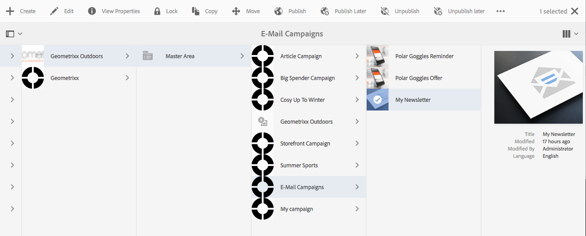
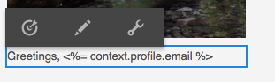
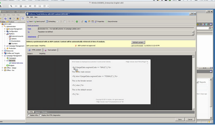

# Targeting your Adobe Campaign{#targeting-your-adobe-campaign}

To target your Adobe Campaign newsletter, you need to first set up segmentation, which is only available in the Classic UI (for client context). After that you can create targeted experiences for Adobe Campaign. Both are described in this section.

## Setting up segmentation in AEM {#setting-up-segmentation-in-aem}

To set up segmentation, you need to use the classic UI to set up the segments. The remaining steps can be performed in the standard UI.

Setting up segmentation includes creating segments, a brand, campaign, and experiences.

>[!NOTE]
>
>Segment ID needs to be mapped to the one on the Adobe Campaign side.

### Creating Segments {#creating-segments}

To create segments:

1. Open the [segmentation console](http://localhost:4502/miscadmin#/etc/segmentation) at **&lt;host&gt;:&lt;port&gt;/miscadmin#/etc/segmentation**.
1. Create a new page and enter a title - for example, **AC Segments**- and select the **Segment (Adobe Campaign)** template.
1. Select the created page in the tree view on the left-hand side.
1. Create a segment, for example targeting male users, by creating a new page under the segment you created called Male and select the **Segment (Adobe Campaign)** template.
1. Open the created segment page and drag and drop a **Segment ID** from the sidekick onto the page.
1. Double-click the trait, enter the ID representing in this case, the male segment defined in Adobe Campaign - for example, **MALE** - and click **OK**. The following message should appear: *`targetData.segmentCode == "MALE"`*
1. Repeat the steps for another segment, for example, a segment targeting female users.

### Creating a Brand {#creating-a-brand}

To create a brand:

1. In **Sites**, navigate to the **Campaigns** folder (for example in We.Retail).
1. Click **Create Page** and enter a title for the page, for example We.Retail Brand and select the **Brand** template.

### Creating a Campaign {#creating-a-campaign}

To create a campaign:

1. Open the **Brand** page you just created.
1. Click **Create Page** and enter a title for your page, for example, We.Retail Campaign, and select the **Campaign** template and click **Create**.

### Creating Experiences {#creating-experiences}

To create experiences for segments:

1. Open the **Campaign** page you just created.
1. Create experiences for your segments by clicking **Create Page** and entering a title for your page, for example, Male as you are creating an experience for the Male segment, and select the **Experience** template.
1. Open the created Experience page.
1. Click **Edit**, then below Segments click **Add Item**.
1. Enter the path to the male segment, for example **/etc/segmentation/ac-segments/male** and click **OK**. The following message should appear: *Experience is targeted at: Male*
1. Repeat the previous steps to create an experience for all segments, for example the female target.

## Creating a newsletter with targeted content {#creating-a-newsletter-with-targeted-content}

After you have created segments, a brand, a campaign, and an experience, you can create a newsletter with targeted content. After creating the experience, you link experiences to your segments.

>[!NOTE]
>
>[Email samples are only available in Geometrixx](/help/sites-developing/we-retail.md). Please download sample Geometrixx content from Package Share.

To create a newsletter with targeted content:

1. Create a newsletter with targeted content: Below Email Campaigns in Geometrixx Outdoors, click or tap **Create** &gt; **Page**, and select one of the Adobe Campaign Mail templates.

   

1. In the newsletter, add a Text and Personalization component.
1. Add text into the Text and Personalization component, such as "This is the default."
1. Click the arrow next to **Edit** and select **Targeting**.
1. Select your brand from the Brand drop-down menu and select your Campaign. (This is the brand and campaign you created earlier).
1. Click **Start Targeting**. You see your segments appear in the Audiences area. The default experience is used if none of the defined segments match.

   >[!NOTE]
   >
   >By default, the email samples included with AEM use Adobe Campaign as the targeting engine. For custom newsletters, you may need to select Adobe Campaign as the targeting engine. When targeting, tap or click + in the toolbar, enter a title for the new activity, and select **Adobe Campaign** as the targeting engine.

1. Click **Default** and then the Text and Personalization component you added and you see the Bullseye with an arrow in it. Click the icon to target this component.

   

1. Navigate to another segment (Male), and click **Add offer** and click the plus icon +. Then edit the offer.
1. Navigate to another segment (Female) and click **Add offer** and the plus icon +. Then edit this offer.
1. Click **Next** to see Mapping, then click **Next** to see Settings, which does not apply to Adobe Campaign, and click **Save**.

   AEM automatically generates the correct targeting code for Adobe Campaign when the content is used in a delivery inside Adobe Campaign

1. In Adobe Campaign, create your delivery - select **Email delivery with AEM content** and select the local AEM account, as appropriate and confirm your changes.

   In the HTML view, the different experiences of targeted components are enclosed in Adobe Campaign targeting code.

   

   >[!NOTE]
   >
   >If you also set the segments up in Adobe Campaign, clicking **Preview** will show you the experiences for each segment.
